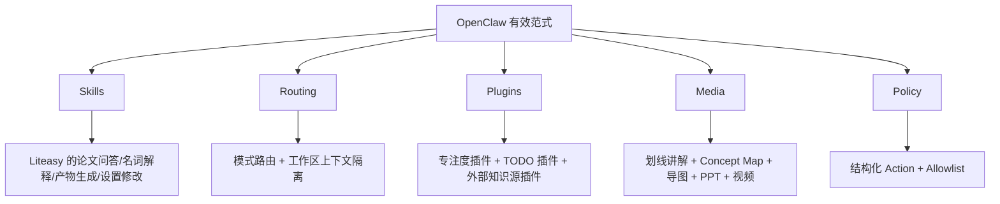
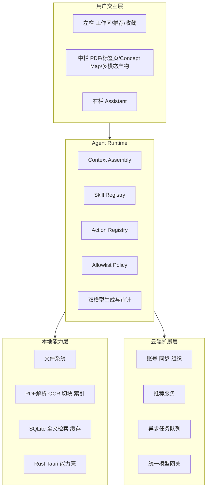

# Liteasy x OpenClaw 路演技术讲解与答辩故事线

这份文档服务两个对象：

1. 上台宣讲的同学：需要一条顺口、像讲故事一样的技术主线。
2. 团队答辩成员：需要一套不说错、能和 OpenClaw 特性对齐的统一口径。

## 一句话定位
Liteasy 不是“把论文丢给 AI 问一问”的工具，而是一个把文献导入、精读、问答、可视化讲解和个性化学习串成闭环的桌面科研工作台；它在底层借鉴 OpenClaw 的运行时范式，让 AI 能稳定、可控地调动软件能力。

## 先统一口径：哪些是现在已有，哪些是明确设计方向

### 当前仓库已能证明的技术栈
- 桌面客户端：`Tauri 2`
- 前端：`React 18 + TypeScript + Vite`
- 测试：`Vitest`
- 桌面壳语言：`Rust`
- 当前完成度：三栏工作台原型、基础状态管理、导入/选择/助手三类最小状态切片

### 当前明确设计、适合路演讲述的目标分层
- 本地能力层：`Rust + SQLite + PDF 解析/OCR/索引/缓存`
- 运行时层：`Skill Registry + Action Registry + Allowlist/Policy + Direct Dispatch`
- 云端扩展层：`NestJS + PostgreSQL + Redis/BullMQ + S3 兼容存储 + 模型网关`
- 智能能力层：双模型生成与审计、多模态产物生成、联网推荐、用户画像

答辩时要坚持这句：

> 我们当前已经完成桌面工作台原型，底层扩展路线则按 OpenClaw 启发的 runtime 范式继续推进。

不要把未来蓝图讲成“已经全部实现”。

## 我们到底向 OpenClaw 学什么

不是照搬它的“多聊天渠道”，而是对齐它已经证明有效的“能力组织方式”。

| OpenClaw feature | Liteasy 对应讲法 | 为什么适合路演 |
|---|---|---|
| Skills | 把“名词解释、论文问答、产物生成、设置修改”收敛成可注册工作流 | 说明 AI 不是乱答，而是按任务类型走不同流程 |
| Tools / Plugin | 把系统能力做成结构化 action，把专注度/TODO 做成插件扩展 | 说明软件能扩展，而且是可控扩展 |
| Routing | 不同模式、不同工作区、不同任务走不同链路 | 说明不是“一句话进来全靠大模型猜” |
| Media | 文本、导图、PPT、视频、播客、Concept Map | 说明我们跟上了多模态效果范式 |
| Session isolation | 以工作区和已锁定文献集作为上下文边界 | 说明回答不会乱串上下文 |
| Control UI / App | 我们落在桌面三栏工作台，而不是做成纯聊天壳 | 说明产品形态更适合论文精读 |

最重要的一句是：

> 我们借鉴 OpenClaw 的，不是它长什么样，而是它如何把 AI 能力组织成稳定、可控、可扩展的运行时。

## 推荐主讲故事线 A：从用户问题出发

这是最适合文科生主讲、也最利于评委短时间理解的版本。

### 讲法
1. 先讲痛点：论文难，不是因为没有答案，而是因为答案散、原文难跳、概念断层、多模态讲解不连续。
2. 再讲产品动作：用户把论文导入工作区，勾选并锁定当前要分析的文献。
3. 再讲核心差异：Liteasy 不是只给一个聊天框，而是把“阅读区”和“AI 区”打通。
4. 再讲关键亮点：AI 不只是回答，还能在 PDF 中连续划线、建立 Concept Map、回跳原文、生成导图/PPT。
5. 最后讲技术保证：底层借鉴 OpenClaw 的 runtime，把不同任务做成 skills，把软件操作做成 actions，再用权限策略保证安全与稳定。

### 对应 mermaid

### 适合上台时的 90 秒版本
“我们发现，读论文最痛苦的并不是搜不到答案，而是答案和原文、概念、图示、后续产物之间是断开的。所以 Liteasy 做的不是单纯聊天，而是一个桌面科研工作台。用户先把论文导入左侧工作区，勾选并锁定当前要分析的文献；中间是阅读主舞台，右边是 AI 助手。真正的亮点在于，AI 的回答不只停留在聊天框里，它可以直接回到 PDF 原文做连续划线讲解，生成 Concept Map、思维导图、PPT 等产物。底层上，我们借鉴了 OpenClaw 的运行时思想，把解释、问答、产物生成、设置修改做成不同 skills，把软件能力做成结构化 actions，再加上权限策略与双模型复核，让效果更稳、更容易扩展。”

## 备选故事线 B：从 OpenClaw 对齐出发

这个版本适合评委本身懂一点 AI agent，或者答辩时被问“你们和 OpenClaw 是什么关系”。

### 讲法
1. OpenClaw 证明了一件事：复杂 AI 应用要靠 skills、routing、plugins、media、policy 来组织，而不是堆一个万能聊天框。
2. Liteasy 把这个范式迁移到科研学习场景。
3. 我们不照搬多渠道消息入口，而是保留桌面工作台，因为论文学习必须强依赖阅读区和可视化区。
4. 因此我们得到一套更适合学术场景的结构：中栏主工作流 + 右栏分支助手 + 本地知识引擎 + 多模态产物系统。

### 对应 mermaid

### 这一版最关键的表述
“我们不是复制 OpenClaw 的产品外形，而是继承它已经被验证过的能力编排方式，然后把这种方式落到论文学习这一更强调原文定位、连续讲解和多模态理解的场景里。”

## 备选故事线 C：从架构层次出发

这个版本适合技术答辩成员，用来回答“系统是怎么分层的”。

### 这一版的核心解释
- 用户交互层负责“看见什么、点什么、问什么”。
- Runtime 决定“该走哪条任务链、能调用什么能力、如何保证安全和稳定”。
- 本地能力层负责“把论文真正变成可检索、可跳转、可引用的知识对象”。
- 云端扩展层负责“同步、推荐、重任务、多组织协作”。

## 为什么 T_IM 补丁非常适合成为路演亮点

因为它把“AI 回答”升级成了“AI 精读体验”。

### 可以这样讲
1. 普通 AI 工具回答完就结束了。
2. Liteasy 会把回答重新绑定回 PDF 原文。
3. 它不仅能定位，还能连续划线、逐段解释。
4. 它还能从这些划线自动长出 Concept Map 和分层讲解路径。
5. 这让用户不是被动接收答案，而是在原文里被带着走一遍理解过程。

这部分很适合成为整场演示的视觉高潮。

## 推荐上台呈现顺序

### 顺序 1：最推荐
1. 痛点
2. 三栏界面
3. T_IM 精读亮点
4. 多模态产物
5. OpenClaw runtime 对齐
6. 扩展能力与插件

优点：最像讲故事，评委最容易跟上。

### 顺序 2：偏技术型
1. 我们为什么参考 OpenClaw
2. 不照搬哪些，继承哪些
3. 三栏产品化落地
4. 本地引擎与运行时
5. T_IM 与多模态效果

优点：适合被问“你们技术路线是否自洽”时使用。

### 顺序 3：偏产品型
1. 用户旅程
2. 关键交互点
3. 亮点效果
4. 技术如何托住这些效果

优点：适合初赛、展示赛、时间非常短的场合。

## 答辩高频问题统一口径

### 1. 你们为什么要参考 OpenClaw
因为它在复杂 AI 能力的组织方式上很成熟，尤其是 skill、routing、plugin、policy 这些 runtime 思想。我们借鉴这些能力编排方式，但产品形态仍然保持 Liteasy 自己的桌面科研工作台路线。

### 2. 你们和普通论文问答工具有什么不同
我们的重点不是“回答一句话”，而是“把问答、原文定位、连续划线、Concept Map、多模态产物和后续学习动作接成一条线”。

### 3. 为什么是桌面端，不是网页
因为论文学习强依赖本地文件、工作区、并排阅读、多标签页和系统级权限控制，桌面端更适合承载重交互阅读场景。

### 4. 你们的 AI 为什么更可信
第一，回答尽量绑定原文定位；第二，关键分析结果走双模型生成与审计；第三，软件操作不靠模型随意执行，而是走结构化 action 和策略校验。

### 5. 插件在这里的作用是什么
插件不是给页面塞更多按钮，而是把专注度管理、TODO、外部知识源等扩展能力接入同一个运行时，让产品后续能持续长大。

## 最后给主讲人的一句总收束

“如果说 OpenClaw 证明了 AI 应用应该怎样组织能力，那么 Liteasy 做的，就是把这套能力组织方式，真正变成一个适合论文精读、适合教学式讲解、也适合长期科研成长的桌面产品。”
