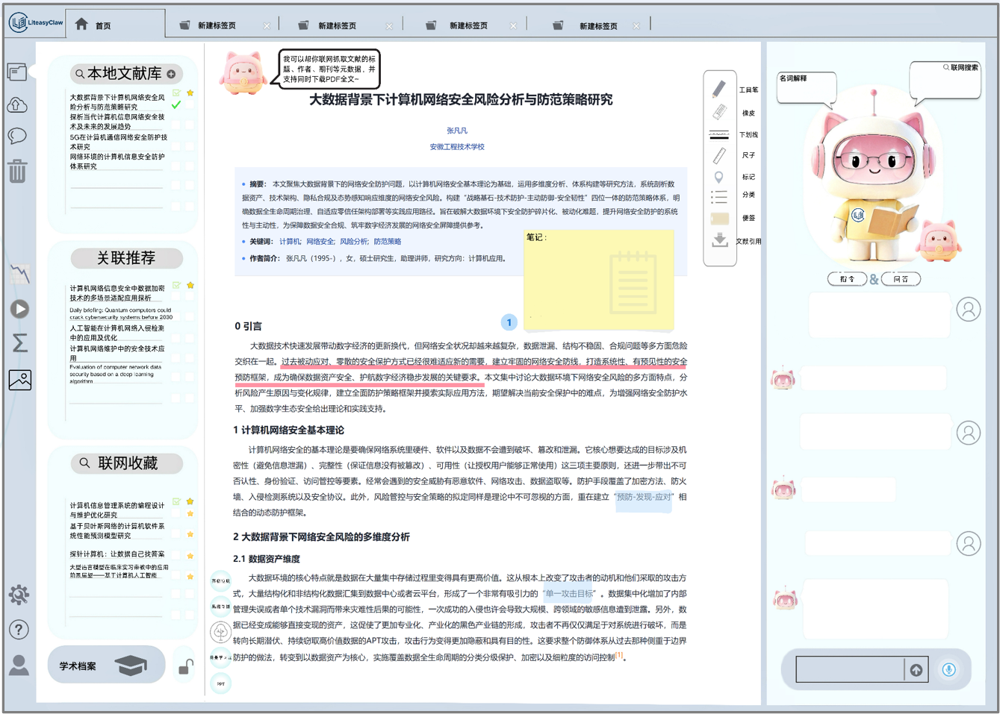
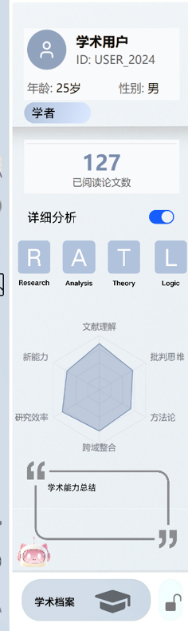
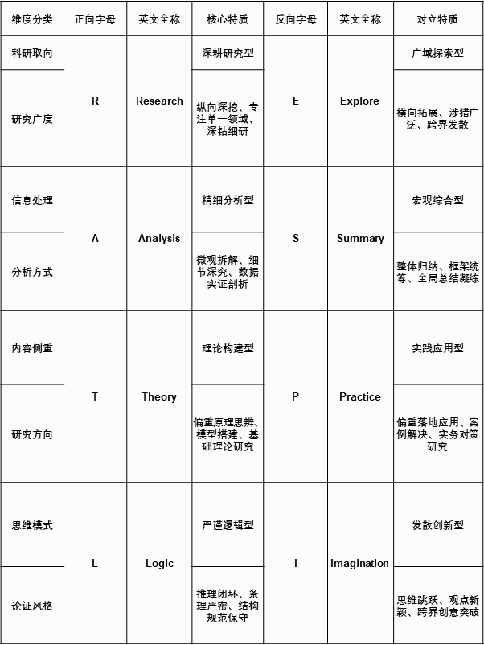

# LiteasyClaw 功能与UI设计文档

## 总述：
   “LiteasyClaw”是一款agent驱动的以文献阅读工具为主要角色的SaaS平台，专注学术文献深度解析与定制化学习。
   在架构创新上，我们以openclaw为基本框架，集成了个人文献库管理、联网文献推荐、多模态解析、用户画像等功能，用户通过工作区与自然语言协作，一站式地完成论文学习与研读相关工作。
   在性能优化上，我们基于deepseek-V4以及支持多模态的大模型的api，通过紧贴学术阅读场景的思维链提高输出质量；利用skills技术，更丝滑地兼容、扩展、调用各个领域的专属思维链和各个任务的控制流，融合多模态；通过用户画像的构建，实现个性化服务。
    “Liteclaw”致力于成为你的下一代科研伴侣。

    项目分为用户端、运维团队端两部分。核心功能在云上部署，客户通过安装用户端软件接受服务；运维团队可以通过web访问服务器进行AI方面的设置以及调配资源、设置资源分配策略、管理用户等功能（可能需要你根据业内类似产品的真实形态进一步设计）。

## 用户端功能与UI设计

### 主页面：
主页面采用类似于VScode的“左-中-右”三栏的布局，【中间栏】采用多标签页的形式，作为主要的阅读窗口；【左栏】为文献管理窗口，【左边栏】为用户中心和；【右栏】为智能助手交互窗口。软件本质上分为“用户交互层”和“agent 工作流层”，三栏 UI 是用户入口与结果承载设施，核心学习、解析、生成与审计在 agent workflow 中完成。
可参考：

#### 【右栏】智能助手功能设计：
1. 整体类似于网页版deepseek的布局，底部是输入框，输入框可选语音输入（先留下接口，可以靠后开发），可以新建会话。需在本栏设计一个按钮调出历史会话。
2. 开始对话前，【右栏】的中上部是我们的虚拟形象，有3个按钮环绕在虚拟形象周围，用于切换模式：开始对话后，虚拟形象和3个按钮消失，由用户与ai的对话占据【右栏】内容，并在背景中标注所处的模式名称。虚拟形象和3个按钮在新会话初始态唤出。这里的三种模式主要是用户心智与交互入口，不应在工程上实现成三套彼此割裂的系统，而应共享统一会话入口和统一任务路由。
    1. 按钮1：名词解释。
    在这个模式下，软件会调用名词解释的专属工作流，会针对用户提问的名词概念，结合对用户的记忆画像，使根据用户的知识水平和语言习惯使用用户能听懂的语言解释。用户可以通过自然语言或低风险显式设置控制是否联网；如果联网会结合在线信息源；如果不联网则优先根据当前已导入的选中文献集，然后是其他本地信息源以及模型自身所有的知识；文本解释以对话回复的形式反馈在【右栏】对话框，如果涉及到多模态的解释（比如图示、思维导图），则会在【中间栏】新建标签页展示。
    2，按钮2：命令（默认模式，如果用户没有点击按钮而直接对话会自动进入）
    在这个模式下，用户发出的控制功能自然语言会触发响应任务的skills，从而操控软件完成各种功能或进行配置。但自然语言本身不能直接改软件状态，只有已注册的安全 skill 才能调用已注册的软件 action。
    比如用户说“关闭联网功能”，系统会路由到设置调整 skill，再由安全 action 执行对应变更；如果用户说“用思维导图解读xxxx”，则会触发产物生成 skill，在【中间栏】新建标签页展示。
    用户第一次使用本软件时ai也会在本功能下引导用户完成基本配置（详见用户画像模块）。
    3. 按钮3：问答。
    这是核心功能，在本模式下，用户可以询问关于文献的专业问题，ai可以根据当前已导入的选中文献集进行长链的思考，以合适的模态给出完整的讲解链路。简短的文本反馈在【右栏】对话框中，多模态的反馈在【中间栏】的新标签页中。每条涉及到原文的解答链都要从论文原文的定位出发。

#### 【左边栏】
左边栏自上而下有：文献库、组织、个人中心、设置。
后两者的图标可参考下图：

#### 1. 个人中心
点击个人中心的图标后，个人中心将弹出并铺满左边栏。窗口内布局可参考下图。  个人中心的图标可参考

1. 包含了用户的昵称、id、所在的团队等基本信息。
2. 用户可以配置性别、年龄、学段等信息。
3. 有一个按钮，用户可通过点击按钮（也可通过ai助手的【命令】模式设置）开启或关闭用户画像功能。开启后会采样软件内的用户身份数据、文献、交互记录，用户也可以进一步给软件授权，抓取用户电脑上的微信、飞书等数据。
4. 开启用户画像功能后，会统计并显示用户已阅读论文数、以及根据用户数据进行用户学术人格分析，分析流的末端分类依据为：
5. 开启用户画像功能后其他的模块会使用收集的数据给予个性化优化。
6. 本窗口下部有学术档案的图标。点击后会弹出新页面，可以查看与用户画像有关的全部配置文件。
7. 本窗口内应有一个清空用户画像（不包括昵称、id、头像）的按钮，清空时需要鉴权。

#### 2. 组织
1. 属性说明：用户可以加入或创建组织。一个组织有共享的一定空间和时效的云端文献库。云端文献库的需要用户付费申请，对于付费高级用户（详见付费模式），也可以将我们提供的兼容的共享文献库部署在其服务器上并接入软件。
2. 点击后弹出窗口，为用户加入的组织列表，点击列表中的某个组织后可以查看详情，详情中有组织成员和通知（包括组织管理员的公告通知和有上传权限的成员的文献上传、文献库结构的变更通知）。
3. 组织的共享文献库可以由用户主动在文献阅读工作区打开，行为应类似 VSCode 打开一个新的文件夹：切换当前工作区，而不是与本地文献库取并集（详见【左栏】文献管理模块）。

#### 3. 设置
点击后弹出新窗口，必要的其他功能的设置在此页面内。

#### 【左栏】--- 文献库相关功能

文献库存在用户本地或云端，以多级目录来组织。使用软件时，呈现在左栏【我的文献库】的部分称为工作区。工作区以某一级目录为单位，即选定某一级目录（我们称之为母目录）后，其子目录也会在工作区打开，下述的【收藏】、【关联推荐】内容的缓存都与工作区对应的母目录锚定。

这里需要区分两个概念：
1. 工作区：指左栏文献库页面当前可见的那部分，是面向用户的目录视图概念。
2. 选中文献集：指用户在当前工作区中勾选并锁定、准备交给 AI 的文件集合，基本单位是单个文件而不是目录。

前端上看，【左栏】的结构类似于VScode的资源管理器，每一个区域都可折叠。自上而下为：【我的文献库】、【收藏】、【关联推荐】。

#### 1. 我的文献库
1. 类似VScode中打开的文件夹，各个文献依目录结构展开，用户对前端的文献结构的删改后端的数据库会同步。每一个条目后有一个复选框，用于选中 AI 直接分析的对象，即支持多文献联读。该区域顶部有一个锁定按钮，锁定后复选框的勾选情况不能变更。被勾选并锁定后的文件集合，构成一次分析流程所依赖的选中文献集。

2. “导入”在本产品中的含义，不是把文件加进列表，而是把选中文献集中的文件送入 AI 知识引擎，完成解析、切块、索引等预处理。导入后的流程状态应优先附着在具体文献条目后，而不是单独做一个割裂的导入状态模块。

3. 【我的文献库】可以打开本地的文献库中某一级目录下的全部文件，也可以打开云端文献库某一级目录下的全部文件（即某个文件夹）。

#### 2. 关联推荐
1. 该功能可以选择性地关闭和开启
2. 联网检索的方式有使用网站提供的爬虫api或者浏览器uitesting（模拟用户的真实检索点击）等等。对于非公开的网站，需要用户在软件本地配置token或cookie等鉴权标识。
3. 在用户向ai助手下达类似“查找/为我推荐相关文献”的命令时本功能会启动，将找到的文献缓存在本区域；在ai解析文献或者回答用户问题的过程中联网搜索时，搜索结果中涉及到的文献也会缓存在此处。相关的数据和代码的链接等等也会在此缓存。
4. 检索到的条目会有渐变色标记和当前选中文献集的关联度，会有文字标签指示和哪篇选定的文献相关联。
5. 推荐文献的排序可以按照检索到的时间排序、按照文献的时间排序或者按照和选定的文献的关联程度&用户的画像综合排序；排序方法可以根据用户向ai助手下达的排序命令自定义。
6. 关联推荐的缓存与当前工作区和选中文献集绑定；当工作区目录切换、文献集合变化或用户显式清理缓存时应失效。当前原型不再提供单独的“关闭工作区”入口。

#### 3. 收藏
1. 用户可拖动【关联推荐】中的文献或链接到【收藏】区，收藏区的文献不会被自动清空。（用户也可拖动【收藏】区和【关联推荐】区的文献到【我的文献库】）

#### 【中间栏】
1. 【中间栏】有多个标签页。如果技术不允许不同模态在同一个标签页，那么不同模态将在不同的标签页上。

2. 【中间栏】靠近【左栏】的一侧应保留一组固定的模态按钮，这是核心功能，也是主干入口。用户在工作区中勾选并锁定文献形成选中文献集后，应通过这些按钮先指定模态，再启动对应主工作流。点击按钮时，如果当前选中文献集尚未导入，则系统先执行导入；若已导入，则直接进入对应模态分析。

    1. “树形展开”：从整体到细节地分多层、多分枝结构化文献。每一层（或者说树中的每一个节点）都根据关联到的知识和用户的水平使逻辑链完整平滑，避免“只有系统学习了深层概念才能明白大致的思路”，用户可以根据自己的需要和好奇心自主选择一边文献中不同方面学习的深度，且无论多深都能开卷有益、读有所获。
    每一个节点占一个标签页，是“图+文+表”的模态。在一个节点的图文中用户可以选择一句或几句话（包括图表），从而进入子节点，软件会在这个方面进一步分析将合适的结果呈现在新标签页中，用户从而可以进行更深一层的学习。
    在分析过程中，基于skills范式，软件可以自主判断合适的模态来讲解，如果采用的多模态无法在一张标签页内呈现，会分到多个标签页上并且作为树的节点的主标签页会包含附属的标签页的链接。

    2. PPT: 将文献整合成ppt
    3. 视频讲解：
    用户可指定有权限的人物形象、声音等等，将有虚拟人物为用户讲解。
    4. 播客
    5. 思维导图
    6. 问题-答案式
    7. 数据可视化
    8. 流程图
    9. 过程动图
    10. 苏格拉底问答：
    将有一个标签页是ai对话框，先向用户分步介绍文献整体，然后再询问用户不懂的点、询问用户的理解，给予针对性的讲解，直到用户彻底理解。
    11. 费曼学习法：
    将有一个标签页是ai对话框。
    针对用户已经通过其他方式学完了选定的文献，需要深化理解查缺补漏的场景。ai会以学习者的身份向用户求教文献中的问题，用户需要向ai解答，不断与ai交互直到ai认为自己理解了这些文献（通过将用户的回答与文献比对，前者与后者相吻合时即为理解了的时候）。用户也可将自己的书面学习成果上传，共ai检查、发问、交互。

3. 双模型机制：文献解读和【右栏】的问答都由双模型完成，一个模型负责解读回答，另一个模型用于打分与纠正前者的分析结果，用户鼠标悬浮在ai的输出上可以看到可信度。
4. 主干与分支的关系：
   1. 主干：`工作区 -> 勾选文件 -> 形成选中文献集 -> 导入 -> 选择模态按钮 -> 启动分析`
   2. 分支：右栏自然语言触发的 skills 默认建立在“文件已导入”的前提上，主要用于用户遇到具体问题时发起局部解释、补充产物、问答、设置控制等动作。
### 插件：
设计合适的位置放置插件。

#### 1. 专注度管理系统：
检测用户与本软件、其他站点的交互和切换情况，根据交互情况检测用户犯困、久坐、注意力涣散，并当即或以某段时间为单位一并提醒用户。

#### 2. TODO List

## 技术构想
使用 openclaw 范式，使 AI 助手成为用户与 agent workflow 的统一入口，并在授权后可以访问用户电脑上的其他文件。工程上应区分“用户交互层”和“agent 工作流层”，并额外设置受控的软件 action 边界：只有已注册的安全 skill 可以调用已注册的软件 action，从而避免自然语言直接把软件状态搞乱。

需要搭建用户端的软件、云端服务器上部署的程序、管理员端的网页或软件。
