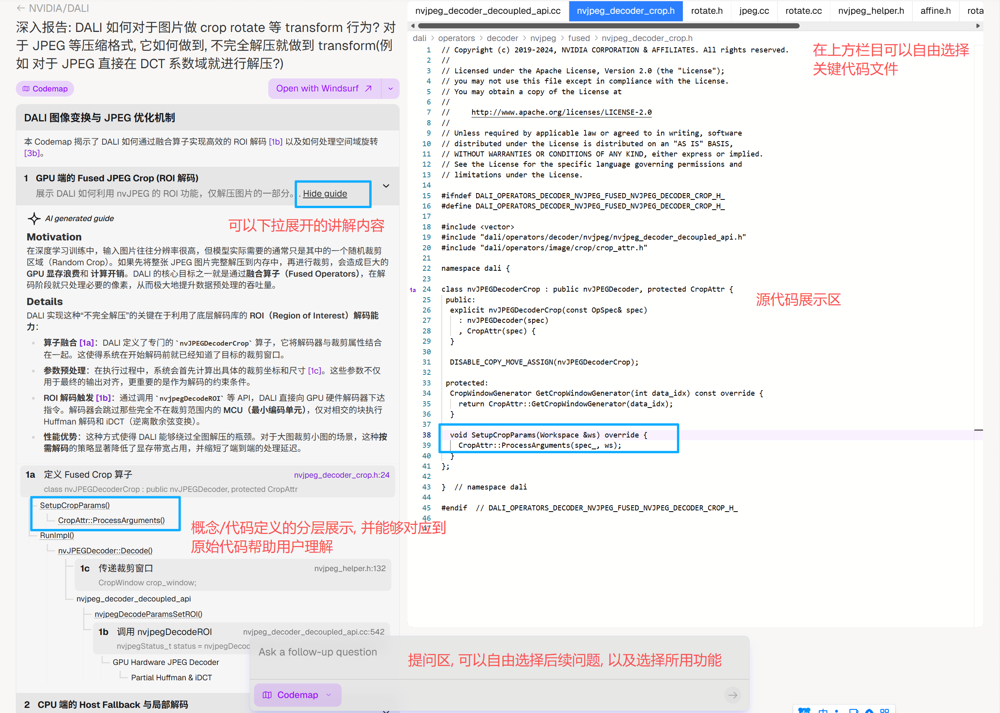

# Liteasy 功能与 UI 设计文档

## 总述
`LiteasyClaw` 是一款面向学术文献深度解析与定制化学习的桌面优先智能辅助平台。

它的产品目标不是只做一个“能聊天的论文助手”，而是做一个把文献管理、精读、问答、多模态讲解、个性化学习和后续组织协作串成闭环的科研工作台。用户通过自然语言和可视化工作区协同操作，可以在一个界面内完成“导入文献 -> 选择分析对象 -> 提问/下命令 -> 获得带依据的讲解与产物”这一整条学习链路。

在技术理念上，Liteasy 借鉴 OpenClaw 的 runtime 范式，但不照搬它的产品形态：

1. 在产品层，Liteasy 仍然是一个面向科研学习的桌面工作台。
2. 在运行时层，系统采用 `skills/workflows + actions + allowlist/policy + direct dispatch` 的思路，让 AI 能稳定、可控地调用软件能力。
3. 在能力层，系统通过多模态模型、文献解析链路、用户画像和后续插件机制，持续扩展讲解深度与个性化能力。

Liteasy 的目标，是成为用户可信、顺手、能长期陪伴科研学习的下一代研究伴侣。

## 用户端功能与 UI 设计

### 主页面
主页面采用类似 VS Code 的“左 - 中 - 右”三栏布局。

- 【左栏】是文献库与推荐区，负责组织用户当前工作区。
- 【中间栏】是阅读与多模态产物区，承担主学习链路。
- 【右栏】是智能助手区，承担问答、解释、命令控制与分支交互。
- 【最左侧窄边栏】用于组织、个人中心、设置等全局入口。

其中，【中间栏】采用多标签页机制，是主要阅读窗口；【右栏】不是主工作流入口，而是围绕主工作流提供解释、控制、补充产物和答疑。

可参考：

#### 【右栏】智能助手功能设计
1. 整体布局类似网页版 DeepSeek：底部为输入框，支持后续扩展语音输入；支持新建会话；需要提供一个按钮调出历史会话。
2. 在新会话初始态，【右栏】中上部展示虚拟形象 ，周围环绕 3 个模式按钮。开始对话后，虚拟形象与按钮淡出，由对话内容占据右栏主体，并在背景或顶部轻量标记当前模式名称。新会话开始时恢复初始态。
3. 右栏所有涉及论文内容的回答，都应能回链到【中间栏】的原文定位、划线讲解或多模态产物，而不是停留在“只在聊天框里说完”。

##### 1. 按钮 1：名词解释
在这个模式下，软件调用“名词解释”专属工作流，针对用户提问的术语、概念或方法，结合用户画像，用用户能听懂的语言解释。

- 用户可在本栏通过按钮设置是否联网。
- 若联网，则结合在线信息源与当前工作区文献。
- 若不联网，则优先使用工作区已选中文献，其次是其他本地信息源与模型知识。
- 简短解释以对话回复形式显示在【右栏】。
- 若涉及图示、概念分层图、思维导图等更适合可视化呈现的结果，则在【中间栏】新建标签页展示。

##### 2. 按钮 2：命令
这是默认模式；若用户未手动切换模式而直接输入，自然进入本模式。

在这个模式下，用户的自然语言控制会被映射为系统内部的结构化命令，再由相应的 `skill/workflow` 触发软件功能或配置变更。

例如：

- “关闭联网功能”
- “帮我为这篇论文生成思维导图”
- “打开用户画像功能”
- “把刚才那段讲解固定到中间栏”

用户第一次使用本软件时，AI 也会在本模式下引导其完成基本配置。

##### 3. 按钮 3：问答
这是核心学习功能。

在本模式下，用户围绕当前工作区已选定文献提出专业问题，AI 根据文献内容、上下文历史和用户理解水平，进行带依据的深度回答。

- 简短文本反馈显示在【右栏】。
- 图示、导图、结构化讲义、定位讲解等内容显示在【中间栏】。
- 每条涉及原文的回答都必须能回到论文原文定位。
- 对关键回答，系统可以同步在 PDF 中生成连续划线与旁注，形成“像教授精讲论文一样”的精读轨迹。

#### 【最左侧边栏】
自上而下包含：组织、个人中心、设置。

后两者的图标可参考下图：

#### 1. 个人中心
点击个人中心图标后，个人中心弹出并铺满左侧边栏。窗口内布局可参考下图：

1. 展示用户昵称、ID、所在团队等基本信息。
2. 用户可配置性别、年龄、学段、研究方向等信息。
3. 提供用户画像功能开关。开启后，可在用户授权范围内采样软件内的身份数据、文献与交互记录；若未来接入微信、飞书等外部数据，必须单独授权。
4. 开启用户画像后，系统统计已阅读论文数，并给出用户学术人格分析，末端分类可参考：
5. 开启画像后，其他模块可使用相关数据进行个性化优化。
6. 本窗口下部提供“学术档案”入口，用于查看与画像有关的配置与分析记录。
7. 提供“清空用户画像”按钮，但不包括昵称、ID、头像；清空时必须鉴权确认。

#### 2. 组织
1. 用户可以加入或创建组织。组织拥有共享的、可配置时效与容量的云端文献库。
2. 云端共享文献库可由平台提供，也可为高级用户提供兼容部署方案，部署在其自有服务器上并接入本软件。
3. 点击后弹出组织列表；进入某个组织后可查看成员、公告通知，以及有权限成员的文献上传与文献库结构变更通知。
4. 组织共享文献库可在文献阅读工作区中打开。

#### 3. 设置
点击后弹出新窗口，承载软件其他必要配置项与权限设置。

#### 【左栏】文献库相关功能
文献库可存在于本地或云端，以多级目录组织。用户当前在左栏中打开并操作的部分称为“工作区”。

工作区以某一级目录为锚点，即选定某一级目录作为“母目录”后，其子目录共同出现在工作区中；下述【收藏】和【关联推荐】的缓存也都与当前工作区锚定。

从前端看，【左栏】结构类似 VS Code 资源管理器，各区域可折叠。自上而下为：【我的文献库】、【收藏】、【关联推荐】。

#### 1. 我的文献库
1. 类似 VS Code 中打开的文件夹，各文献依目录结构展开；用户在前端对文献结构的调整，后端数据库应同步。
2. 每个条目后带复选框，用于选中 AI 直接分析的对象，即支持多文献联读。
3. 区域顶部有“锁定选择”按钮。锁定后，复选框勾选情况不可变更，以保证当前分析上下文稳定。
4. 【我的文献库】既可以打开本地某一级目录下的全部文件，也可以打开云端文献库某一级目录下的全部文件。

#### 2. 收藏
1. 用户可拖动【关联推荐】中的文献、链接或数据资源到【收藏】区。
2. 收藏区内容不会随工作区关闭而自动清空。
3. 用户也可将【收藏】区和【关联推荐】区内容拖回【我的文献库】。

#### 3. 关联推荐
1. 该功能支持开启或关闭。
2. 联网检索可以通过公开检索 API、兼容爬虫 API，或在必要时通过浏览器自动化完成；对非公开站点，需要用户本地配置 token、cookie 等鉴权信息。
3. 当用户向 AI 下达“查找/为我推荐相关文献”命令时，本功能启动，并将结果缓存在本区域；AI 在解析文献或回答问题时触发的联网补充结果，也会回写到这里。
4. 相关论文、代码链接、数据集、项目主页等信息都可作为推荐条目缓存。
5. 检索结果用渐变色、标签或说明文字标记其与当前已选文献的关联强度，并标注主要关联对象。
6. 推荐排序支持按检索时间、文献时间、与选中文献的关联度、与用户画像的综合匹配度等方式排序；用户也可通过命令模式调整排序规则。
7. 关联推荐缓存默认在关闭当前工作区时清空。

#### 【中间栏】
【中间栏】是 Liteasy 的主学习舞台。它不仅显示 PDF，还负责承载精读、跳转、结构化讲解与多模态学习产物。

##### 1. 标签页与阅读区
1. 【中间栏】支持多个标签页。
2. 如果不同模态无法在同一标签页自然呈现，则拆分到不同标签页，但这些标签页之间需要有明确的互链关系。
3. 支持同一篇论文的多个竖向阅读栏并排打开，方便用户同时查看摘要、方法、实验等不同位置。

##### 2. PDF 精读视图
这是 `T_IM` 补丁并入后的核心增强部分。

1. 在 PDF 中增加 AI 划线/高亮功能。AI 可以对关键段落进行连续划线，并给每条划线附上解释、提示、疑难点说明或上下文引导。
2. 这些 AI 划线不是孤立批注，而要能形成连续讲解链，让用户像听资深教授精讲论文一样逐段理解。
3. 用户点击划线后，可以展开对应讲解；也可以从右栏回答一键跳转到相应划线位置。
4. 高亮、批注、定位信息不依赖 PDF 原生超链接，而由软件自身的数据结构维护，以支持后续跳转、引用、同步与扩展。
5. 后续可以扩展到跨文献链接，但首期优先支持同一篇 PDF 内部的稳定跳转与定位。

##### 3. Concept Map 与概念分层讲解
1. 系统支持生成 Concept Map，用于把论文中的概念、方法、实验和结论做成层级化关系图。
2. 视觉效果可参考：
3. Concept Map 中的节点应能反向跳转到原文定位、划线讲解或对应多模态产物。
4. 对不涉及代码的用户，跳转目标主要是 PDF 内定位与概念节点；若未来支持代码论文联动，再扩展到代码定位。

##### 4. 中栏模态入口
【中间栏】靠近【左栏】的一侧有悬浮按钮区。用户点击某个模态按钮后，系统将以该模态解析当前“已选定并锁定”的文献集。

支持的模态包括：

1. 树形展开
从整体到细节地分多层、多分枝结构化文献。每个节点都应根据关联知识和用户水平补全逻辑链，让用户可以按兴趣自主下钻，且每深入一层都“开卷有益、读有所获”。

每个节点占一个标签页，采用“图 + 文 + 表”的复合模态。用户在节点中选中一句或几句话后，可以继续进入子节点，在新标签页中做更深分析。若该节点下还有导图、图示、问答等附属结果，主节点标签页应给出链接。

2. PPT
将文献整合为适合讲授或汇报的 PPT。

3. 视频讲解
用户可指定有权限的人物形象、声音等参数，由虚拟人物讲解文献。

4. 播客

5. 思维导图

6. 问题 - 答案式

7. 数据可视化

8. 流程图

9. 过程动图

10. 苏格拉底问答
生成一个 AI 对话标签页，先向用户分步介绍文献整体，再不断追问用户不懂的点与当前理解，并给予针对性讲解，直到用户真正理解。

11. 费曼学习法
生成一个 AI 对话标签页。适用于用户已经通过其他方式学完选定文献、希望查缺补漏的场景。AI 以学习者身份向用户请教，持续比对用户回答与论文内容，直到判断用户已较好掌握。

##### 5. 双模型机制
文献解读和【右栏】问答都可由双模型完成：

1. 一个模型负责主生成、讲解与产物大纲。
2. 另一个模型负责打分、发现问题、纠偏与可信度提示。
3. 用户鼠标悬浮在 AI 输出、划线讲解或结构化结论上时，可看到可信度与是否经过复核。
4. 短命令类操作不必强制走双模型；深度分析、精读、PPT/导图大纲等关键结果应优先走双模型。

### 插件
插件应有独立入口，但不应打断三栏主工作台的核心链路。插件更适合作为“能力扩展层”，由运行时统一调用，而不是直接把逻辑写死在页面上。

#### 1. 专注度管理系统
检测用户与本软件、其他站点的交互与切换情况，根据交互情况检测犯困、久坐、注意力涣散，并即时或按时间段提醒用户。

可参考项目：
<https://github.com/super-productivity/super-productivity>

其项目中的任务设置、project 规划、休息检测、久坐提醒等能力都可作为插件设计参考。

#### 2. TODO List
作为轻量任务管理插件，负责承接学习过程中的待办、复习计划、追问点和后续行动项。

## 技术构想

### 1. 技术原则
1. Liteasy 借鉴 OpenClaw 的核心不是“把聊天入口做得更复杂”，而是把其 `skills + actions + policy + plugin-friendly runtime` 的运行时思想嵌入科研产品。
2. AI 助手不应直接改动软件状态，而应通过注册过的结构化 action 执行。
3. 中栏模态按钮是主工作流入口，右栏 Assistant 是围绕主工作流的解释、问答和控制分支。

### 2. 当前项目已落地的技术栈
1. 桌面端：`Tauri 2`
2. 前端：`React 18 + TypeScript + Vite`
3. 测试：`Vitest`
4. 桌面壳语言：`Rust`

当前仓库已经落地的是桌面原型骨架、三栏工作台、基础状态管理与测试；Rust 端目前还是较薄的桌面壳。

### 3. 目标技术分层
1. 用户端软件：
   - 三栏桌面工作台
   - 标签页阅读与多模态产物视图
   - AI 助手交互区
2. 本地能力层：
   - 文件系统访问
   - PDF 解析、OCR、切块、索引
   - SQLite / 全文检索 / 本地缓存
   - 权限控制、日志、通知
3. Agent Runtime：
   - Skill Registry
   - Action Registry
   - Allowlist / Policy
   - Direct Dispatch
   - 双模型生成与审计
4. 云端服务层：
   - 账号、同步、组织、推荐、订阅
   - 异步任务执行
   - 模型网关
5. 管理员端网页或软件：
   - 组织与资源治理
   - 用户与订阅管理
   - 后台任务与风险审计

### 4. 与 OpenClaw 范式的结合点
1. OpenClaw 的 `skills` 对应 Liteasy 的任务工作流，如 `paper.qa`、`concept.explain`、`artifact.generate`、`settings.adjust`。
2. OpenClaw 的 `tools/plugins` 对应 Liteasy 的结构化 action 与插件扩展能力。
3. OpenClaw 的 `routing` 思路可用于 Liteasy 的模式路由、工作区隔离与任务分发。
4. OpenClaw 的多模态能力，对应 Liteasy 的导图、PPT、视频、播客、数据可视化等学习产物。
5. Liteasy 不照搬 OpenClaw 的多渠道消息入口，而是优先保留桌面科研工作台这一产品形态。
