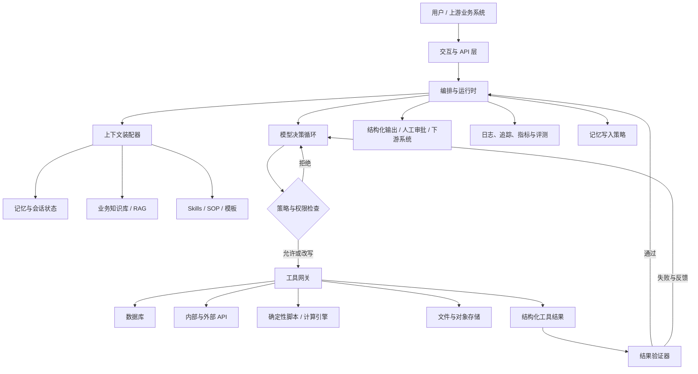

# 自定义业务 Agent 技术设计指南

> 从 Harness 工程思想出发，构建可控、可验证、可维护、可演进的业务智能体系统

## 文档定位

本文不是某个 Agent 框架的 API 手册，也不是 Claude Code 功能的简单复述。它将《Claude Code 实战：Harness 工程之道》读书笔记中的记忆、Skills、子智能体、Hooks、MCP、Headless 与 Agent SDK 等概念，抽象为一套适用于自定义业务 Agent 的技术设计方法。

本文重点回答以下问题：

1. 一个业务 Agent 系统应当由哪些层组成，各层分别解决什么问题？
2. Prompt、记忆、技能、工具、Hook、子智能体之间如何分工，而不是相互重叠？
3. 如何让模型拥有足够的自主性，同时又不越权、不失控、可追溯？
4. 面对大量文档、复杂任务和长链路执行时，如何管理上下文、并行任务和中间状态？
5. 如何测试 Agent 的触发、执行、安全、质量、成本和稳定性？
6. 如何从一个能演示的原型，逐步演进为可投入真实业务的 Agent 产品？

---

## 1. 核心判断：业务 Agent 的能力主要来自 Harness，而不只来自模型

直觉上，人们容易把 Agent 理解为“一个更强的模型，加上一段更长的 Prompt”。但在真实业务中，模型只负责概率性的理解、判断与生成；系统是否可靠，更多取决于模型周围的工程环境，也就是 Harness。

一个完整的业务 Agent 可以抽象为：

```text
业务 Agent = 基础模型
           + 上下文装配
           + 业务知识
           + 工作流编排
           + 工具与数据接口
           + 权限与安全策略
           + 结果验证
           + 状态与记忆
           + 观测、评测和成本控制
```

模型决定“可能做得多聪明”，Harness 决定“最终是否能稳定地把事情做成”。同一个模型，在不同的工具设计、上下文组织、权限边界、反馈机制和验证流程下，可能表现得像一个偶尔有用的聊天机器人，也可能表现得像一个可嵌入生产流程的业务执行单元。

因此，开发业务 Agent 的首要任务不是堆叠 Prompt，而是设计模型循环的边界条件：

- 它能够感知什么；
- 它能够记住什么；
- 它能够调用什么；
- 哪些动作必须经过批准；
- 每一步如何知道自己成功或失败；
- 什么时候继续重试，什么时候停止；
- 最终结果如何被系统和人共同验证。

---

## 2. 设计目标与非目标

### 2.1 设计目标

业务 Agent 应优先追求以下性质：

1. **业务正确性**：结果符合业务规则，而不只是语言上合理。
2. **可控性**：模型的工具、数据、预算、轮数和副作用受到明确约束。
3. **可验证性**：关键结论和动作能够由规则、脚本、测试或人工复核。
4. **可追溯性**：知道模型看过什么、调用过什么、为什么产生当前结果。
5. **可恢复性**：长任务中断后可以从检查点恢复，而不是全部重做。
6. **可维护性**：业务知识、工作流、工具和安全规则能够分别演进。
7. **可评测性**：能够用固定数据集和线上指标持续比较不同版本。
8. **成本可控**：模型选择、上下文长度、输出长度和并发量有预算约束。

### 2.2 非目标

以下目标通常不应作为早期系统的追求：

- 让 Agent 在任何任务上都完全自主；
- 用一个超长系统 Prompt 描述所有业务；
- 一开始就建立复杂的多智能体社会；
- 用模型替代所有确定性代码、数据库查询和规则引擎；
- 为展示“智能”而允许模型自由访问全部系统；
- 把每次成功演示误认为稳定的生产能力。

业务 Agent 的成熟，不等于自主性无限增加，而是系统能够在明确边界内稳定完成更复杂的任务。

---

## 3. 总体架构

建议将业务 Agent 划分为六个平面：交互平面、编排平面、上下文与知识平面、工具执行平面、治理平面、观测评测平面。



### 3.1 交互平面

负责接收任务和交付结果，包括：

- Web、桌面端、IM、命令行等用户入口；
- REST、RPC、消息队列、Webhook 等系统入口；
- 流式输出、任务状态、确认界面和人工审批；
- 身份认证、租户识别和用户角色。

交互层不应直接调用模型。它应先把自然语言请求转化为包含身份、业务对象、权限范围和期望产物的标准任务请求。

### 3.2 编排平面

编排层是 Agent 的“操作系统内核”，负责：

- 创建和管理任务；
- 装配上下文；
- 选择模型和执行策略；
- 调度工具与子任务；
- 管理状态机、轮数、超时、预算和重试；
- 处理人工审批；
- 汇总结果并决定任务结束条件。

编排层的核心原则是：**模型可以提出动作，但运行时决定动作是否实际发生。**

### 3.3 上下文与知识平面

负责回答“当前这一步，模型究竟应该看到什么”。它包括：

- 稳定的系统规则；
- 当前用户和业务对象；
- 当前任务状态与历史步骤；
- 按需加载的业务知识和 Skills；
- 从数据库、搜索或文件系统检索到的证据；
- 子任务产出的结构化中间结果。

该平面的目标不是把所有信息塞入上下文，而是在正确时间投放正确知识。

### 3.4 工具执行平面

工具层将模型的意图转化为确定性操作，例如：

- 查询业务数据库；
- 调用内部服务；
- 读写文档和对象存储；
- 执行计算脚本；
- 创建工单、发送通知、更新状态；
- 触发 CI/CD 或其他自动化流程。

模型不应直接接触底层凭据、数据库连接和 Shell 环境，而应通过受控的工具网关访问。

### 3.5 治理平面

治理层负责回答“这件事能不能做、以什么方式做”。它包括：

- 工具白名单与最小权限；
- 基于用户、租户、业务对象和环境的授权；
- 敏感操作审批；
- 输入与输出过滤；
- Hook、策略引擎和审计；
- 沙箱、密钥隔离和数据脱敏。

### 3.6 观测与评测平面

负责把“模型似乎工作了”变成可测量事实，包括：

- 每次模型调用和工具调用的 Trace；
- Token、延迟、费用、重试和失败原因；
- Skill 触发、检索命中和工具选择；
- 用户修正次数与人工接管率；
- 任务成功率、业务指标和安全告警；
- 离线回放和版本对比。

---

## 4. 标准执行数据流

业务 Agent 的一次完整执行建议遵循以下流程：

```text
1. 接收请求
2. 身份与权限解析
3. 任务分类和风险分级
4. 构建最小必要上下文
5. 选择 Skill / 工作流 / 模型
6. 模型提出计划或下一动作
7. 策略引擎检查动作
8. 工具执行并返回结构化结果
9. 验证器检查结果
10. 模型根据反馈继续、修正或结束
11. 生成结构化产物
12. 写入必要状态、记忆与审计日志
```

### 4.1 将概率性决策和确定性执行分开

这是整套设计最重要的边界。

模型适合做：

- 理解自然语言意图；
- 在不完整信息下推断；
- 拆解任务；
- 从证据中总结、解释和生成；
- 在多个可行方案之间作启发式选择。

确定性程序适合做：

- 精确计算；
- 数据库查询与更新；
- 格式和 Schema 校验；
- 权限判断；
- 唯一性、范围和完整性检查；
- 重试、幂等、超时和事务；
- 执行不可逆操作。

不要让模型“心算”本可由程序计算的数据，也不要让模型用自然语言承诺代替实际执行结果。

---

## 5. 上下文与记忆设计

### 5.1 五类上下文

建议将上下文拆分为五类，而不是统称为 Memory：

| 类型 | 内容 | 生命周期 | 典型载体 |
|---|---|---|---|
| 宪法与规则 | 角色、边界、安全要求、稳定业务约定 | 长期、版本化 | System Prompt、policy 文件 |
| 业务知识 | 产品定义、SOP、指标口径、领域规则 | 中长期、按需加载 | Skills、知识库、文档 |
| 任务状态 | 当前目标、步骤、工具结果、待办项 | 单任务 | 状态机、任务数据库 |
| 会话工作记忆 | 当前对话中需要继续引用的信息 | 单会话 | Session store、摘要 |
| 长期个体记忆 | 用户偏好、已确认事实、历史决策 | 跨会话 | 结构化 profile、memory store |

混合这些信息会造成两个问题：稳定规则被短期噪声稀释，短期状态又被错误地长期保存。

### 5.2 稳定规则的“删除测试”

写入全局规则前，可以进行一个简单判断：

> 如果删除这条规则，Agent 仍能在绝大多数情况下正确行动，那么它不应占据永久上下文。

全局规则只保留：

- 模型无法可靠自行推断的团队约定；
- 违反后会造成明显错误或高成本的边界；
- 频繁出现且长期稳定的业务规则；
- 无法仅靠工具 Schema 和校验器表达的要求。

### 5.3 记忆写入不应由模型自由决定

建议将长期记忆写入设计为一个受控流程：

```text
候选事实生成
→ 类型识别
→ 敏感性检查
→ 去重与冲突检测
→ 置信度与来源记录
→ 用户确认或策略批准
→ 版本化写入
```

记忆记录至少包含：

```json
{
  "subject": "user:123",
  "predicate": "preferred_report_format",
  "value": "markdown_with_executive_summary",
  "source": "conversation:abc:turn:19",
  "confidence": 0.98,
  "created_at": "...",
  "valid_from": "...",
  "valid_until": null,
  "status": "active"
}
```

### 5.4 动态记忆与缓存命中的权衡

稳定前缀更容易被模型服务缓存；频繁改动的长系统上下文会降低缓存复用。因此应把上下文分层：

1. 最稳定的系统规则放在固定前缀；
2. 低频变化的项目规范放在版本化知识块；
3. 高频变化的用户和任务状态放在靠后的动态区域；
4. 大型参考资料按需检索，不直接常驻。

这既能提高缓存命中，也能避免新记忆必须重写整个系统提示。

### 5.5 上下文预算

为每次调用设置明确预算，例如：

```text
系统规则：10%
任务请求与状态：15%
检索证据：45%
工具结果：20%
模型输出空间：10%
```

具体比例需要通过评测调整，但必须有预算意识。检索结果不应“有多少放多少”，而应经过去重、排序、压缩和证据覆盖检查。

---

## 6. Skill：按需投放的业务知识与 SOP

### 6.1 Skill 的定位

Skill 不是一段更长的 Prompt，而是一个可复用、可测试、可授权的业务能力包。它解决的是：

- 什么时候需要某类知识；
- 应按照什么流程处理；
- 可以调用哪些工具；
- 输入和输出应满足什么规范；
- 哪些情况不适用。

可以把 Skill 类比为“部门 SOP 首页”：首页只描述入口、适用范围和流程路由，详细知识、模板与程序分别存放。

### 6.2 推荐目录结构

```text
skills/
└── customer-refund/
    ├── SKILL.md                 # 路由、适用范围、核心流程
    ├── references/              # 业务规则和知识
    │   ├── refund-policy.md
    │   ├── risk-rules.md
    │   └── exception-cases.md
    ├── templates/               # 输出和中间产物模板
    │   ├── decision.json
    │   └── customer-reply.md
    ├── scripts/                 # 确定性处理
    │   ├── calculate_refund.py
    │   └── validate_order.py
    └── tests/
        ├── trigger_cases.yaml
        ├── golden_cases.yaml
        └── adversarial_cases.yaml
```

### 6.3 Skill 应像路由器，而不是百科全书

`SKILL.md` 中应只保留：

- 正向适用条件；
- 明确的负向约束；
- 输入要求；
- 高层步骤；
- 工具权限；
- 引用哪些 reference、template 和 script；
- 完成条件和异常处理。

大量领域知识应放在独立文件中，由当前任务按需加载。

### 6.4 触发设计

Skill 描述应同时包含正向和负向边界：

```yaml
name: customer-refund
use_for:
  - 已支付订单的退款资格判断
  - 根据退款政策计算退款金额
not_for:
  - 未支付订单取消
  - 仅查询物流进度
  - 法律争议或拒付申诉
```

描述过宽会导致误触发；描述过窄会导致漏触发。建议建立至少三类测试：

- 应触发样本；
- 不应触发样本；
- 边界与歧义样本。

早期可把“相关任务触发率高于 90%、无关任务误触发率低于 5%”作为工程起点，但最终阈值应根据业务风险决定。

### 6.5 有副作用的 Skill 必须显式触发

只读分析可以允许模型自动路由；会造成副作用的操作，例如：

- 提交代码；
- 更新数据库；
- 发出通知；
- 下单、退款、删除；
- 修改权限；

应设置为用户显式触发，或在执行前进入批准节点。知识可以自动加载，行动不能仅因为“模型认为合适”就自动发生。

---

## 7. 工具与 MCP：把业务能力封装为可靠接口

### 7.1 工具不是“给模型用的函数”，而是受治理的业务 API

一个高质量工具应具有：

- 单一职责；
- 明确的输入 Schema；
- 明确的业务语义；
- 最小权限；
- 结构化返回；
- 可区分的错误码；
- 超时与重试策略；
- 幂等性或幂等键；
- 审计信息；
- 可选的 dry-run 模式。

工具越模糊，模型越需要猜测；工具越接近裸 Shell 或通用 SQL，系统风险越高。

### 7.2 工具描述契约

工具 description 至少应回答：

1. 这个工具完成什么业务动作；
2. 哪些情况下应调用；
3. 哪些情况下不应调用；
4. 每个参数的语义、单位和约束；
5. 返回值代表什么；
6. 可能出现哪些错误；
7. 是否有副作用，是否支持重试；
8. 调用前需要满足哪些前置条件。

### 7.3 参数回显与机器可读反馈

对 Agent 工具而言，“静默失败”非常危险。确定性脚本应明确回显模型真正传入的参数，并用结构化结果表达执行状态。

推荐返回格式：

```json
{
  "ok": true,
  "operation": "calculate_refund",
  "received": {
    "order_id": "O-20260726-001",
    "currency": "CNY",
    "requested_reason": "duplicate_charge"
  },
  "result": {
    "eligible": true,
    "refund_amount": 128.0
  },
  "warnings": [],
  "error": null,
  "trace_id": "toolrun_..."
}
```

失败时不要只输出一段自然语言，而应返回：

```json
{
  "ok": false,
  "error": {
    "code": "ORDER_NOT_FOUND",
    "message": "No order matched the supplied order_id",
    "retryable": false,
    "suggested_action": "Ask the user to verify the order number"
  }
}
```

这相当于为模型提供一个稳定的“终端协议”，避免模型从杂乱日志中猜测执行状态。

### 7.4 MCP 的适用边界

MCP 适合用于：

- 多种 Agent 客户端需要复用同一业务工具；
- 需要标准化暴露资源、工具和 Prompt；
- 工具服务与 Agent 运行时需要独立部署；
- 企业内部已有多个数据和服务系统需要统一接入。

进程内工具更适合：

- 单应用原型；
- 低延迟调用；
- 与本地状态紧密耦合；
- 暂无跨客户端复用需求。

不要因为 MCP 是标准协议就把所有函数都远程化。是否使用 MCP，应由部署边界、复用需求、权限隔离和运维成本决定。

---

## 8. Hooks 与策略：在动作边界建立强制守卫

### 8.1 Hook 的本质

Hook 类似 Web 中间件、数据库触发器、编译器语法制导动作或系统调用拦截器：在关键事件发生前后插入确定性逻辑。

推荐事件：

- `BeforeModelCall`：注入动态规则、脱敏上下文；
- `BeforeToolCall`：允许、拒绝或改写工具输入；
- `AfterToolCall`：校验结果、记录审计、触发补偿；
- `BeforeMemoryWrite`：过滤敏感信息、检查冲突；
- `BeforeTaskFinish`：运行测试和完成条件检查；
- `OnSubtaskStart/End`：注入子任务规范，收集中间产物。

### 8.2 三种动作

一个成熟的 `BeforeToolCall` Hook 应支持：

- **Allow**：允许执行；
- **Deny**：拒绝并向模型返回原因；
- **Rewrite**：安全地修改参数后执行。

例如，模型提出一个无时间范围的数据查询，Hook 可以自动补充最大时间跨度和结果上限，而不是直接执行全表扫描。

### 8.3 Hook 必须作用于最小范围

不要把所有命令都交给一个全局大 Hook。策略应尽可能贴近风险源：

```text
数据库写入策略 → 仅作用于数据库写工具
隐私脱敏策略   → 仅作用于含个人数据的返回
代码提交检查   → 仅作用于 commit / merge 工具
外部通知审批   → 仅作用于 email / IM / webhook 工具
```

这与并发程序中的细粒度锁类似：全局锁实现简单，但会产生大量无关阻塞，也难以理解策略为何触发。

### 8.4 Fail-open 与 Fail-closed

- 安全、权限、支付、删除、敏感数据相关 Hook 失败时应 `fail-closed`，即默认拒绝；
- 非关键日志、性能统计等 Hook 失败时可以 `fail-open`，即不阻塞主流程；
- 质量验证失败时应进入修复或人工接管，而不是假装完成。

### 8.5 完成条件不能只由模型声明

模型说“任务已完成”只是一个候选状态。运行时应检查：

- 必需步骤是否执行；
- 输出是否符合 Schema；
- 测试是否通过；
- 引用证据是否存在；
- 业务状态是否已实际更新；
- 是否还有未处理错误或待审批项。

---

## 9. 子智能体与大任务编排

### 9.1 什么时候值得引入子智能体

优先使用单 Agent。只有在以下情况出现时，才考虑子智能体：

1. 输入数据远大于最终输出，需要压缩上下文；
2. 子任务彼此独立，可以并行；
3. 不同子任务需要不同角色、模型、工具或权限；
4. 某个子任务包含大量噪声，不应污染主上下文；
5. 任务需要清晰的阶段边界和中间验收。

### 9.2 三种主要编排模式

#### 9.2.1 Map–Reduce

适合大量论文、合同、法条、日志和记录。

```text
Map：按文档、章节、时间段或语义分区并行处理
Reduce：按统一 Schema 汇总、去重、冲突检测和综合结论
```

关键不是“多开几个 Agent”，而是：

- 合理切分输入；
- 为每个 Map 任务定义完全相同的输出契约；
- 保存证据定位；
- Reducer 能识别遗漏、重复和冲突；
- 必要时再次查询原始材料。

#### 9.2.2 Pipeline

适合存在明确依赖的任务：

```text
需求解析 → 数据检索 → 规则判断 → 报告生成 → 合规检查
```

每个阶段只接收上阶段的结构化输出，而不是共享全部对话历史。

#### 9.2.3 多视角评审

适合从技术、安全、业务、法律等独立视角分析同一对象。主 Agent 最终负责归并观点，不能简单拼接结论。

### 9.3 报文传递优于共享上下文

默认推荐子智能体之间使用报文传递，而不是共享完整上下文：

- 边界清晰；
- 容易审计；
- 可单独重试；
- 降低上下文污染；
- 更容易更换模型和权限；
- 能保存为稳定的中间产物。

共享上下文或 Agent Swarm 会降低信息转发成本，但也会引入：

- 状态竞争；
- 结论互相污染；
- 难以复现谁影响了谁；
- Token 快速膨胀；
- 权限边界模糊；
- 死循环和群体偏差。

因此，除非任务确实需要高频协商，否则应优先采用“主控调度 + 独立工作节点 + 结构化消息”。

### 9.4 子任务输出契约

```json
{
  "subtask_id": "paper_017",
  "status": "completed",
  "summary": "...",
  "claims": [
    {
      "claim": "...",
      "evidence": [{"source": "paper_017", "location": "p.8"}],
      "confidence": 0.86
    }
  ],
  "open_questions": [],
  "warnings": [],
  "artifacts": ["artifact://paper_017/analysis.json"]
}
```

子智能体不应只返回一段散文。结构化契约是可并行、可恢复和可归并的前提。

### 9.5 中间状态必须持久化

长任务的中间成果不能只存在子智能体内存中。每个阶段结束后应写入任务存储或对象存储，包括：

- 输入分片；
- 使用的 Prompt、Skill 和模型版本；
- 结构化输出；
- 证据引用；
- 错误、重试次数和耗时；
- 校验结果。

这样网络中断、进程退出或人工暂停后，可以从最近检查点继续。

---

## 10. 运行时与状态机

### 10.1 将 Agent 任务建模为状态机

不要只写一个无限循环：

```python
while not done:
    call_model()
```

更可靠的设计是显式状态机：

```text
RECEIVED
→ CONTEXT_READY
→ PLANNING
→ WAITING_FOR_APPROVAL
→ EXECUTING_TOOL
→ VERIFYING
→ SYNTHESIZING
→ COMPLETED

任意阶段 → RETRYING / BLOCKED / FAILED / CANCELLED
```

每次状态转移记录原因、输入、输出和版本信息。

### 10.2 终止条件

至少设置：

- 最大模型轮数；
- 最大工具调用次数；
- 总超时；
- 单工具超时；
- Token 或费用预算；
- 连续重复动作检测；
- 连续无进展检测；
- 业务完成条件；
- 人工取消。

### 10.3 重试策略

区分三类失败：

1. **临时基础设施失败**：网络超时、限流，可指数退避重试；
2. **参数或前置条件失败**：让模型修正输入，不应原样重试；
3. **业务拒绝**：权限不足、状态不允许，不应通过反复尝试绕过。

### 10.4 幂等与补偿

有副作用的工具应接受 `idempotency_key`，防止 Agent 因重试重复创建记录、重复扣款或重复发信。

对跨系统长事务，应使用 Saga 思路：每个步骤定义成功动作和补偿动作，而不是假设所有外部系统共享一个数据库事务。

---

## 11. 安全体系

### 11.1 四层防线

```text
第一层：身份与业务授权
第二层：工具白名单和参数约束
第三层：运行时 Hook / Policy Engine
第四层：底层服务自身的权限和数据约束
```

任何一层都不能替代其他层。尤其不能因为模型“被提示不要做危险操作”，就省略系统级权限检查。

### 11.2 最小权限

为每个 Agent、Skill 和子任务分别配置权限。例如：

- 检索 Agent：只读文件和搜索；
- 分析 Agent：只读数据和运行安全脚本；
- 执行 Agent：仅能调用少数业务写工具；
- 审计 Agent：只读日志，不得修改业务数据。

### 11.3 防止 Prompt Injection

从网页、邮件、文件和数据库读取的内容都属于不可信数据，不能与系统指令处于同一信任级别。建议：

- 明确标记数据边界；
- 禁止检索内容改变工具权限；
- 工具调用始终经过策略层；
- 对外部内容中的“忽略此前指令”等文本进行风险检测；
- 只把完成当前任务所需的最小内容传给模型；
- 对高风险动作要求独立确认。

### 11.4 密钥和凭据

模型上下文中不得出现长期密钥。工具服务通过自身身份访问下游系统；Agent 只拿到逻辑工具名和受限参数。

### 11.5 审计

审计日志至少记录：

- 用户和租户；
- Agent、模型、Skill、工具版本；
- 原始请求及风险级别；
- 每次工具调用的参数摘要和结果；
- 策略判断；
- 人工批准；
- 最终业务变更；
- Trace ID。

敏感参数应脱敏记录，而不是完全不记录或明文记录。

---

## 12. 结构化输出与结果验证

Agent 面向程序交付结果时，应强制使用 JSON Schema、Pydantic、Zod 等定义输出结构。

示例：

```json
{
  "decision": "approve | reject | needs_review",
  "reason_codes": ["POLICY_01"],
  "explanation": "...",
  "evidence": [
    {"source_id": "...", "location": "...", "quote": "..."}
  ],
  "recommended_actions": [],
  "confidence": 0.0
}
```

验证分三层：

1. **语法验证**：JSON 和 Schema 是否合法；
2. **业务验证**：字段组合、范围、状态转换是否合法；
3. **证据验证**：结论是否能回到来源，引用是否真的支持主张。

模型自动重试只适合修复格式错误；业务逻辑错误需要向模型返回具体校验反馈，或进入人工复核。

---

## 13. 测试与评测体系

### 13.1 测试金字塔

#### 13.1.1 确定性单元测试

测试脚本、权限函数、Schema、状态机、参数转换和数据库逻辑。此层不调用模型，应快速且稳定。

#### 13.1.2 工具契约测试

验证：

- 输入是否合法；
- 参数回显正确；
- 错误码稳定；
- 幂等性有效；
- 超时和重试符合预期；
- 权限无法绕过。

#### 13.1.3 Skill 触发测试

分别测试应触发、不应触发和边界样本，统计：

- Precision；
- Recall；
- 误触发率；
- 漏触发率；
- 触发后任务成功率。

#### 13.1.4 工作流集成测试

在受控环境中运行完整任务，验证状态转换、工具编排、失败恢复和产物交付。

#### 13.1.5 离线 Golden Set

从真实业务中构建固定评测集，包含：

- 常见案例；
- 长尾案例；
- 高风险案例；
- 对抗和注入案例；
- 信息不足案例；
- 多文档冲突案例。

每次修改 Prompt、模型、检索、Skill 或工具后回放比较。

#### 13.1.6 线上评测

观察：

- 端到端任务成功率；
- 首次成功率；
- 人工修正次数；
- 人工接管率；
- 用户撤销率；
- 错误业务动作数；
- P50/P95 延迟；
- 单任务成本；
- 用户满意度与业务收益。

### 13.2 不要只用“回答看起来不错”评分

Agent 的质量需要分解：

```text
路由是否正确
→ 检索是否充分
→ 工具是否选对
→ 参数是否正确
→ 业务动作是否成功
→ 结论是否有证据
→ 输出是否可用
```

否则无法定位改进应发生在模型、上下文、Skill、工具还是工作流。

### 13.3 A/B 对比

对同一批任务分别运行：

- 有 Skill / 无 Skill；
- 单 Agent / 多 Agent；
- 不同模型；
- 不同检索和上下文预算；
- 自由输出 / 结构化输出；

比较成功率、人工修正、Token、延迟和费用，而不是只比较主观文风。

---

## 14. 成本与性能设计

### 14.1 模型路由

不要所有任务都使用最强模型：

| 任务 | 推荐模型能力 |
|---|---|
| 意图分类、字段抽取、简单验证 | 小模型 |
| 常规业务问答和流程执行 | 中等模型 |
| 复杂推理、多文档综合、关键决策草案 | 强模型 |
| 确定性计算和规则判断 | 不使用模型 |

可先用小模型分类任务和风险，再决定后续模型。

### 14.2 控制输出长度

模型输出往往比输入更昂贵，也增加延迟。内部子任务应优先返回短小的结构化信息，而不是完整散文。只有最终面向用户的阶段才生成可读文本。

### 14.3 缓存友好的 Prompt 布局

把稳定内容放前面，动态内容放后面：

```text
固定系统规则
→ 稳定工具定义
→ 版本化 Skill 核心
→ 当前用户与任务状态
→ 检索证据
→ 最新工具结果
```

### 14.4 并行不等于更快

并行子智能体会增加：

- 总 Token；
- 模型排队和限流风险；
- Reducer 成本；
- 重复读取和重复推理；
- 失败组合数量。

只有子任务真正独立、数据量足够大、并行收益高于汇总开销时才并行。

### 14.5 预算应是运行时约束

每个任务配置：

```yaml
budget:
  max_model_calls: 12
  max_tool_calls: 20
  max_input_tokens: 120000
  max_output_tokens: 12000
  max_cost: 1.50
  timeout_seconds: 600
```

达到预算后，系统应返回当前成果、未完成项和可恢复状态，而不是继续无限执行。

---

## 15. 推荐项目结构

```text
business-agent/
├── apps/
│   ├── api/                       # 对外 API
│   └── worker/                    # 异步任务执行器
├── agent/
│   ├── runtime/                   # 状态机、循环、预算和会话
│   ├── orchestrators/             # 单 Agent、Pipeline、MapReduce
│   ├── context/                   # 上下文装配与压缩
│   ├── prompts/                   # 稳定系统提示与模板
│   ├── skills/                    # 业务 Skills
│   ├── agents/                    # 子智能体定义
│   ├── policies/                  # 权限和 Hook
│   ├── validators/                # Schema、业务和证据校验
│   └── model_router/              # 模型选择与降级
├── tools/
│   ├── registry.py                # 工具注册与元数据
│   ├── database/
│   ├── internal_api/
│   ├── files/
│   └── notifications/
├── memory/
│   ├── session_store/
│   ├── task_store/
│   ├── profile_store/
│   └── retrieval/
├── schemas/                       # 任务、工具、中间产物、输出 Schema
├── evals/
│   ├── datasets/
│   ├── graders/
│   ├── regression/
│   └── reports/
├── observability/
│   ├── tracing/
│   ├── metrics/
│   └── audit/
├── tests/
├── docs/
│   ├── architecture.md
│   ├── threat-model.md
│   ├── tool-contracts.md
│   └── adr/
└── deployment/
```

---

## 16. 一个业务 Agent 的参考实现蓝图

假设要构建一个“内部业务分析与执行 Agent”，用户可以提出：

> 分析某客户最近三个月的订单和投诉，判断是否符合补偿政策，生成处理建议；经我批准后创建补偿工单并通知客户经理。

### 16.1 任务分解

```text
1. 解析客户身份和时间范围
2. 检查当前用户是否有权访问该客户
3. 查询订单、投诉和历史补偿记录
4. 加载补偿政策 Skill
5. 使用确定性脚本计算金额和次数限制
6. 模型综合非结构化投诉内容
7. 业务验证器检查建议是否合法
8. 生成分析报告和拟执行动作
9. 等待人工批准
10. 创建工单并发送通知
11. 写入任务记录和审计日志
```

### 16.2 组件映射

| 需求 | 组件 |
|---|---|
| 补偿政策和处理 SOP | Skill + references |
| 查询订单和投诉 | 只读工具 |
| 精确计算补偿金额 | 确定性脚本 |
| 防止越权访问 | 身份授权 + BeforeToolCall Hook |
| 创建补偿工单 | 有副作用工具 + 人工批准 |
| 保证报告格式 | JSON Schema + template |
| 追踪证据 | source_id + location |
| 中断后恢复 | 任务状态机 + checkpoint |
| 限制成本 | max turns + model router + budget |

### 16.3 为什么不需要一开始使用多个 Agent

这一任务主要是串行依赖：必须先获得数据，再判断政策，再批准执行。单 Agent 配合明确工作流已经足够。

只有当投诉记录数量巨大，或者需要法律、财务、客户关系三个独立视角时，才值得将分析阶段拆成多个只读子智能体，再由主 Agent 汇总。

---

## 17. 分阶段实施路线

### 17.1 阶段 0：定义业务边界

先写清楚：

- 用户是谁；
- 输入是什么；
- 最终产物是什么；
- 哪些动作有副作用；
- 哪些错误不可接受；
- 哪些环节必须人工决定；
- 成功如何衡量。

产物：任务定义、风险分级、最小 Golden Set。

### 17.2 阶段 1：单 Agent、只读、可观测

实现：

- 单一工作流；
- 只读工具；
- 结构化输出；
- 完整 Trace；
- 基础离线评测。

目标：证明上下文、检索、工具和输出链路有效，不执行真实写操作。

### 17.3 阶段 2：引入 Skills 与确定性脚本

实现：

- 业务知识按需加载；
- 计算和规则下沉到程序；
- Skill 触发测试；
- 上下文预算和模型路由。

目标：降低 Prompt 膨胀，提高任务稳定性。

### 17.4 阶段 3：引入受控写操作

实现：

- 细粒度权限；
- 人工审批；
- 幂等键；
- 审计和补偿；
- Stop Hook 和完成条件。

目标：安全进入真实业务闭环。

### 17.5 阶段 4：复杂编排和多 Agent

仅在数据和任务复杂度证明有必要后，引入：

- Map–Reduce；
- 专业子智能体；
- 检查点恢复；
- 异步任务；
- 多模型并行与降级。

目标：扩展吞吐和复杂任务能力，而不是追求架构炫技。

### 17.6 阶段 5：平台化和分发

当多个业务线开始复用能力时，再抽象：

- Tool Registry；
- Skill Registry；
- 统一 Agent SDK；
- MCP 服务；
- 权限和评测平台；
- 插件式打包与版本管理。

---

## 18. 常见反模式

### 18.1 “万能系统 Prompt”

把所有规则、知识和流程塞入一段 Prompt，会导致上下文膨胀、冲突和不可测试。应拆成稳定规则、Skill、工具 Schema 和验证器。

### 18.2 “工具就是裸 Shell / 裸 SQL”

这会把参数校验、权限和业务约束交给模型。应封装为窄接口业务工具。

### 18.3 “模型说成功就算成功”

必须依据工具返回、数据库状态、测试和验证器判断。

### 18.4 “所有内容都写入长期记忆”

会造成隐私风险、冲突、错误累积和检索污染。记忆必须分类、审批、去重和失效。

### 18.5 “一有复杂任务就多 Agent”

多 Agent 增加通信、汇总、成本和调试难度。先证明单 Agent 无法满足，再拆分。

### 18.6 “共享一切上下文”

会失去隔离、权限边界和可复现性。优先使用结构化消息与中间产物。

### 18.7 “只评最终文本”

应分别评估路由、检索、工具、参数、执行、验证和输出。

### 18.8 “用 Prompt 约束高风险行为”

Prompt 是软约束；权限、Hook、审批和底层服务校验才是硬约束。

---

## 19. 设计评审清单

### 19.1 任务与边界

- [ ] 是否定义了明确用户、输入、输出和成功条件？
- [ ] 是否区分分析动作和有副作用动作？
- [ ] 是否明确人工必须负责的判断？

### 19.2 上下文与知识

- [ ] 是否只加载当前任务必需信息？
- [ ] 稳定规则、业务知识、任务状态和长期记忆是否分离？
- [ ] 检索结果是否去重、压缩并保留证据位置？

### 19.3 Skill

- [ ] Skill 是否有正向与负向适用范围？
- [ ] 是否仅包含路由和 SOP，而非全部知识？
- [ ] 是否有触发、功能和边界测试？

### 19.4 工具

- [ ] 是否具有窄接口和结构化 Schema？
- [ ] 是否明确副作用、错误码、重试和幂等？
- [ ] 是否回显实际参数并提供 Trace ID？
- [ ] 模型是否无法直接取得底层凭据？

### 19.5 权限与安全

- [ ] 是否执行最小权限？
- [ ] 高风险动作是否需要批准？
- [ ] 是否有 BeforeToolCall 策略检查？
- [ ] 外部内容是否按不可信数据处理？
- [ ] 审计日志是否完整且脱敏？

### 19.6 运行时

- [ ] 是否有显式状态机？
- [ ] 是否有轮数、时间、Token 和费用上限？
- [ ] 是否区分可重试与不可重试错误？
- [ ] 长任务是否支持检查点恢复？

### 19.7 输出与验证

- [ ] 程序消费的结果是否强制结构化？
- [ ] 是否有语法、业务和证据三层验证？
- [ ] 完成条件是否由系统验证，而非模型自行宣布？

### 19.8 评测与运维

- [ ] 是否有 Golden Set 和回归测试？
- [ ] 是否记录模型、Prompt、Skill、工具版本？
- [ ] 是否能定位失败发生在哪一个环节？
- [ ] 是否监控成功率、接管率、延迟和成本？

---

## 20. 最终设计原则

1. **把模型视为受约束的决策器，而不是拥有系统权限的应用本身。**
2. **把 Harness 视为业务 Agent 的主体工程。**
3. **稳定规则常驻，领域知识按需加载，短期状态独立管理。**
4. **让模型负责不确定性，让程序负责确定性。**
5. **知识必须约束行动，行动必须经过权限和策略。**
6. **子智能体默认隔离，通过结构化报文通信。**
7. **所有长任务都要有状态、检查点和恢复机制。**
8. **模型的“完成”必须经过系统的完成条件验证。**
9. **先做单 Agent、只读、可观测的闭环，再增加自主性和复杂度。**
10. **真正的工程创新，往往不是发明全新的概念，而是把操作系统、数据库、分布式系统、编译器和软件工程中的成熟思想准确迁移到 Agent 系统。**

---

## 附录 A：最小任务请求 Schema

```json
{
  "task_id": "...",
  "tenant_id": "...",
  "user": {
    "id": "...",
    "roles": ["..."]
  },
  "intent": "...",
  "input": {},
  "expected_output": "report | decision | action",
  "risk_level": "low | medium | high",
  "constraints": {
    "read_only": true,
    "requires_approval": false,
    "deadline": null
  },
  "budget": {
    "max_model_calls": 8,
    "max_tool_calls": 12,
    "max_cost": 1.0,
    "timeout_seconds": 300
  }
}
```

## 附录 B：最小工具定义模板

```yaml
name: get_customer_orders
purpose: 查询指定客户在给定时间范围内的订单摘要
use_when:
  - 需要核实客户订单、支付和退款记录
not_for:
  - 修改订单
  - 查询无权访问的其他租户数据
side_effect: none
permissions:
  - customer.orders.read
input_schema:
  customer_id: string
  start_date: YYYY-MM-DD
  end_date: YYYY-MM-DD
  limit: integer <= 200
output_schema:
  ok: boolean
  received: object
  result: object
  warnings: array
  error: object | null
idempotent: true
retry_policy: transient_errors_only
```

## 附录 C：架构决策记录模板

```markdown
# ADR-XXX：决策标题

## 背景
当前问题、约束和业务风险。

## 备选方案
1. 方案 A
2. 方案 B
3. 方案 C

## 决策
选择的方案及适用范围。

## 理由
质量、安全、成本、复杂度和可维护性权衡。

## 后果
获得的收益、引入的限制和后续工作。

## 验证方式
通过哪些指标、测试和线上数据判断决策是否正确。
```

---

> 来源说明：本文依据《Claude Code 实战：Harness 工程之道》的读书划线与个人评论整理，并将产品特有概念抽象为通用业务 Agent 工程方法。本文不是对特定 SDK 当前 API 的权威说明；落地时应以所选模型与框架的官方文档为准。
