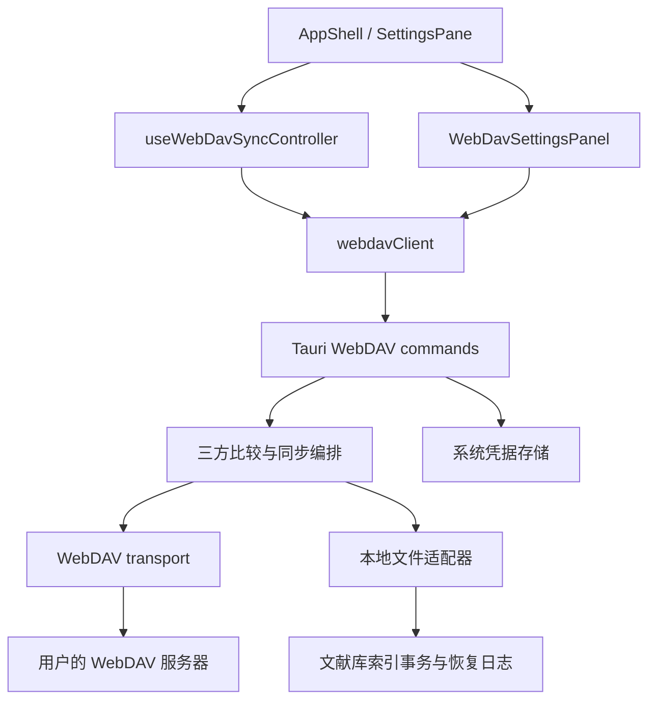

# Liteasy WebDAV 文献库同步

## 范围与入口

桌面版「设置 → WebDAV 同步」可保存连接配置、验证服务器、立即同步、启用自动同步和处理冲突。配置绑定当前本地文献库；其他设备使用同一服务器地址与同步库名称连接。无需 Liteasy 云端账号，也不经过正式业务 API。

本次实现同步当前文献库的 PDF、仅元数据条目、文献信息和阅读产物（批注、白板、全文、引用解析、锚点等）。同步对象来自权威本地文件，不打包 SQLite、派生索引或整个应用数据目录。外接 Notes 文件夹、Notes 对象库、聊天历史、模型配置、OAuth 会话、缓存、回收站和组织库不在此范围。空文件夹不单独同步。

首次配置默认关闭自动同步。开启后，应用启动 15 秒后、每 5 分钟以及网络恢复时尝试同步；关闭设置面板不影响调度。失败保留错误，下一次调度或手动同步重试。有未解决冲突时暂停自动同步。手动与自动任务共用进程内互斥锁。

打开中的文献可以上传，但其远端文件与阅读产物变更暂缓落盘，界面提示关闭文献后再次同步。此约束避免阅读器仍持有旧快照时覆盖下载的新批注。暂缓项目不推进本地基线。

## Zotero 参考

参考仓库内的以下实现与测试，独立实现 Liteasy 协议，未复制 Zotero 源码：

- `tmp/zotero/chrome/content/zotero/xpcom/storage/webdav.js`：服务器验证、附件传输、同步文件属性与冲突判定。
- `tmp/zotero/chrome/content/zotero/xpcom/storage/storageEngine.js`：传输编排与状态处理。
- `tmp/zotero/chrome/content/zotero/xpcom/storage/storageLocal.js`：本地文件变化与同步状态。
- `tmp/zotero/test/tests/webdavTest.js`：错误服务器响应和文件同步场景。

Zotero 将条目数据同步和附件文件同步分开；WebDAV 用于个人库附件，见 [Zotero 同步说明](https://www.zotero.org/support/sync)。Liteasy 目前没有一个覆盖全部本地文献身份与阅读产物的独立元数据同步服务，因此把这些权威 JSON 文件与 PDF 一同纳入自己的清单，保持跨设备关联。

协议遵循 [RFC 4918](https://www.rfc-editor.org/rfc/rfc4918) 的 WebDAV 目录与资源操作，使用 HTTP 条件请求保护发布。服务器须支持 HTTPS、Basic/App Password、MKCOL、PROPFIND、GET、PUT、DELETE、强 ETag、If-Match 和 If-None-Match。使用服务器给出的最终 URL；不跟随重定向，不关闭证书验证。当前不支持 HTTP 明文地址、Digest/OAuth WebDAV 或自签证书绕过。

Liteasy 不读取或修改 Zotero 的 `zotero/` 目录，不兼容其 `.zip/.prop` 存储格式，也不把 WebDAV 上传描述为 Zotero 或 Liteasy 业务元数据服务已同步。

## 模块与依赖



- `src-tauri/src/webdav/model.rs`：版本、清单、路径与身份验证、三方比较。
- `src-tauri/src/webdav/transport.rs`：受限 HTTP 客户端、验证、内容对象、清单条件发布。
- `src-tauri/src/webdav/local.rs`：权威文件收集、链接与路径校验、受限读取、本地状态文件。
- `src-tauri/src/webdav/engine.rs`：按文献身份和文件版本处理冲突、条件发布、下载与基线推进。
- `src-tauri/src/webdav/mod.rs`：配置、系统凭据、任务互斥、进度与 Tauri 命令。
- `src-tauri/src/local_library.rs`：远端文件应用与原有索引事务共用锁，恢复文献身份，正确更新仅元数据条目。
- `src/app/features/webdav/`：前端客户端、共享操作状态、Fluent 设置与冲突界面。
- `src/app/controllers/useWebDavSyncController.ts`：应用级定时任务和已打开文献登记。

生产服务没有新增对 `development/` 或用户 WebDAV 凭据的依赖。Intuecho、Liteasy 正式服务和 identity-service 的数据库边界保持独立。

## 远端协议 v1

```text
<用户提供的 WebDAV 基目录>/
  liteasy/
    <同步库名称>/
      manifest.v1.json
      objects/
        <sha256>
      probe-<pid>-<nonce>       # 验证期间创建，结束删除
```

同步库名称限制为 1–64 位 ASCII 字母、数字、`-`、`_`。上传 URL 只拼接固定协议路径和已验证哈希；文献文件名只存在于清单，不直接拼接远端 URL。

```json
{
  "schemaVersion": 1,
  "files": {
    "Papers/example.pdf": {
      "hash": "<64 位小写 SHA-256>",
      "size": 12345,
      "documentId": "local-123456-0"
    },
    ".liteasy/paper-artifacts/<文献产物目录>/annotations.v1.json": {
      "hash": "<64 位小写 SHA-256>",
      "size": 456,
      "documentId": null
    },
    "Papers/deleted.pdf": null
  }
}
```

`null` 是永久删除记录。不得通过从清单移除键来表达删除。已同步客户端发现历史键消失或整个清单丢失会停止同步，避免把服务器故障解释成批量删除。新设备遇到远端删除记录与本地文件并存时要求解决冲突，不能静默复活旧文件。

PDF 版本携带稳定的 `documentId`；它与内容哈希不同。两个相同 PDF 副本允许具有不同 ID，单个清单内不允许重复活动文献 ID。下载采用远端 ID，重命名采用先删除旧路径、后发布新路径的顺序；批注等产物目录据此继续关联。

单文件上限 256 MiB，阅读产物下载验证上限 32 MiB，清单上限 16 MiB / 100,000 个键。路径必须可跨平台使用，拒绝路径穿越、绝对路径、Windows 保留名、大小写碰撞、符号链接及目录联接。JSON 元数据需验证文献 ID 与文件名一致；阅读产物拒绝无效 JSON 和 null。

## 同步与发布顺序

1. 验证远端目录、独立探针的 PUT/GET/DELETE，以及正确和错误条件请求的实际行为。每次同步重新验证，防止服务器或代理配置变化使条件请求失效。
2. 扫描本地权威文件，读取文献索引提供的 ID，计算 SHA-256。扫描不会将本机索引上传。
3. 读取本机基线和远端清单及强 ETag，校验路径、版本、身份与大小。
4. 对每个路径比较「上次共同版本 / 本地版本 / 远端版本」。
5. 先上传所需内容对象。对象以哈希命名，使用 `If-None-Match: *`；已存在时读取并验证内容，不能仅相信对象名。
6. 所有上传完成后，用读到的 ETag 条件发布清单；首次发布用 `If-None-Match: *`。HTTP 412 表示其他设备抢先发布，终止本轮并等待重试，尚不替换本地文件。
7. 下载并校验远端对象，逐个在本地索引事务下应用。每个完成项目写入基线；暂缓或冲突项目保留旧基线。
8. 更新共享操作状态与进度。失败不能显示成功；已传输对象及已完成基线可供下次任务继续使用。

| 本地与基线 | 远端与基线 | 处理 |
| --- | --- | --- |
| 两端版本相同 | 任意 | 收敛基线，无传输 |
| 本地未变 | 远端改变 | 下载或本地删除 |
| 本地改变 | 远端未变 | 上传或发布删除记录 |
| 两端都改变且不同 | 两端都改变且不同 | 保留两端，显示冲突 |

版本比较包含哈希、大小与文献 ID，不依赖设备时钟。冲突 UI 支持保留本地版本或使用远端版本，包含编辑/删除冲突。并发重命名、重命名/编辑和重命名/删除按稳定文献 ID 作为一个冲突处理，选择时同时处理旧路径和新路径。选择请求携带用户看到的两端版本与远端路径；任何一端再次变化，旧选择失效，重新显示冲突。

当前采用整文件传输和串行队列；增量粒度是文件/内容对象。没有字节范围断点续传、按需下载、附件压缩、文本逐字段合并或无限自动重试。网络超时后可重新同步，完成项目不需重复传输。

## 本地状态、凭据与恢复

```text
<文献库>/.liteasy/webdav/
  settings.json                 # 不含密码
  baseline-<连接身份哈希>.json
  incoming                      # 当前下载的暂存内容
  apply.json                    # 当前本地发布意图
  recovery/
    <路径哈希>-<旧内容哈希>       # 被替换或删除的原始内容
```

密码存入系统凭据存储，以本地文献库 ID 和连接身份共同命名，不返回前端，不写入 localStorage、同步清单或错误详情。连接身份包含服务器、用户名和同步库名称，切换连接不会复用另一连接的基线。保存新的连接成功后清理旧密码；断开连接清理当前密码与设置，但保留基线、恢复副本和远端文件。

本地写入顺序：校验当前文件仍等于扫描版本 → 暂存下载 → 写入 apply.json → 备份旧内容 → 发布目标文件 → 更新文献 ID/索引与元数据列表 → 移除日志。任何索引读取前恢复未完成日志。因此文件已落盘但索引未更新时，重新启动不会给远端 PDF 分配新 ID。

应用自己的阅读产物保存和同步发布共用索引事务锁。文献库移动、旧库切换和备份与 WebDAV 任务互斥；下载成功会发送原有的文献库变更事件以刷新资源树。打开文献的远端变更延后处理；扫描后发生的本地变化也会中止覆盖。恢复期间发现用户另行修改文件时保留当前文件并停止恢复。直接从外部编辑器写入文献库不受进程内锁控制，仍应避免在外部程序持续写入时执行双向同步。

恢复副本以原始字节保存，文件名是哈希，不作为文献索引的一部分。需要手工恢复时，先断开同步并保留整个文献库副本，根据清单路径与旧内容哈希找到对应恢复文件，再复制回所需路径。

## 保留与后续扩展边界

v1 不自动删除远端历史内容对象或删除记录，也不自动清理本地恢复副本。这样离线设备和未完成任务仍可引用旧对象；代价是服务器与本地磁盘占用持续增长。服务器配额不足会明确报错。

安全的远端回收需要设备确认水位、最后存活时间、离线设备过期规则、保留窗口和清单压缩协议。不能仅根据当前清单立即清除未引用对象：另一设备可能已经读取旧清单但尚未下载。后续引入垃圾回收必须提升协议版本或协商能力，并提供回收预览。

将来可在现有 model / transport / local 分层下增加受限并发、哈希缓存、按需附件下载、取消、协议级设备注册、端到端加密及 Notes 对象适配器。业务元数据服务或组织同步应独立设计授权与生命周期，不能通过共享 WebDAV 凭据代替组织权限。

## 验证

- Rust：三方比较、路径与清单验证、真实 loopback HTTP 请求、服务器忽略条件请求、ETag 冲突、响应大小限制、内容篡改、探针清理。
- 双设备文献库：PDF/批注/ID 关联、重命名、增量空跑、编辑/删除冲突、过期冲突选择、清单丢失、CAS 失败与本地中断重试。
- 本地恢复：文件发布后崩溃仍恢复 ID、删除不复活元数据、旧内容保留、本地并发编辑保护。
- 前端：配置保存边界、密码清空、冲突选择、网络错误与重试、浏览器不可用提示、定时器清理和 AppShell 集成。

loopback 服务为测试夹具，不是运行时服务，不提供演示业务结果。浏览器截图检查未完成：当前环境的 Chromium 缺少 `libnspr4.so`。未使用真实用户 WebDAV 账号；特定 NAS、Nextcloud 或托管服务的兼容性、系统凭据存储跨平台行为与长时间大库同步仍需部署环境验收。
