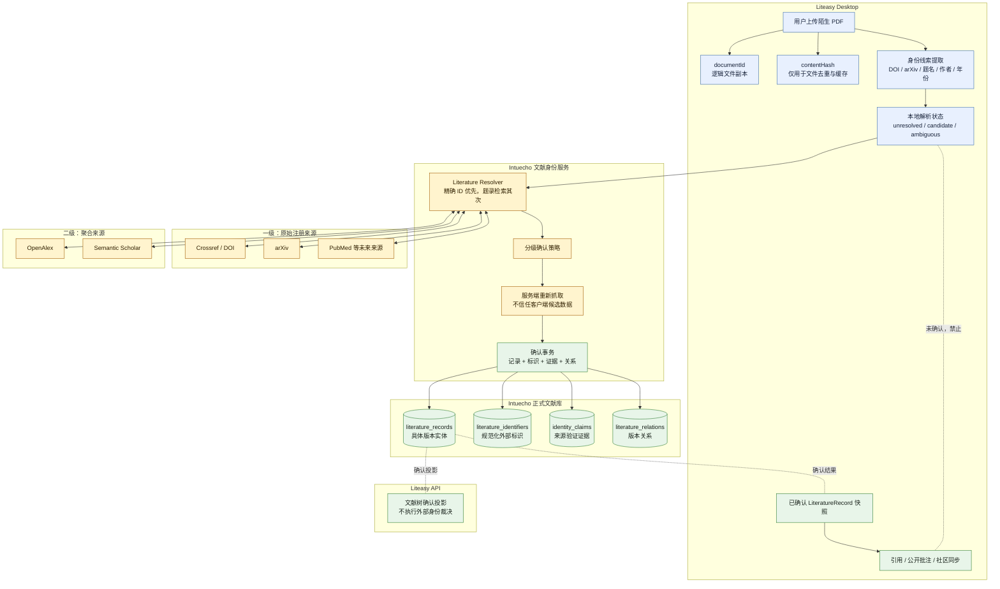
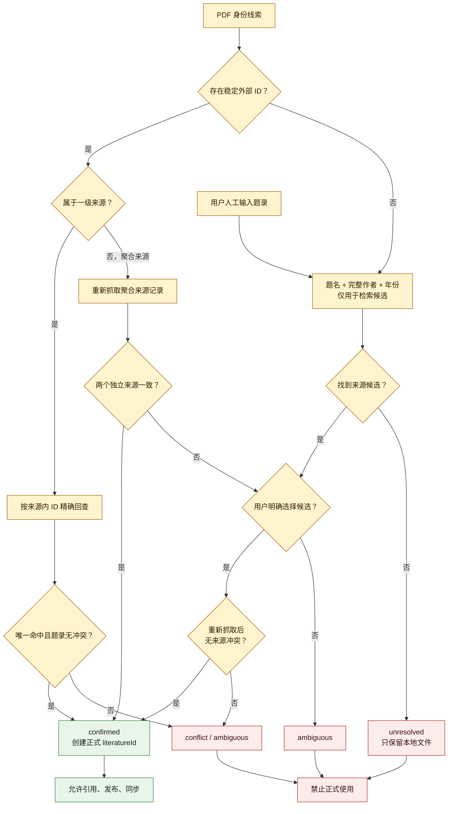
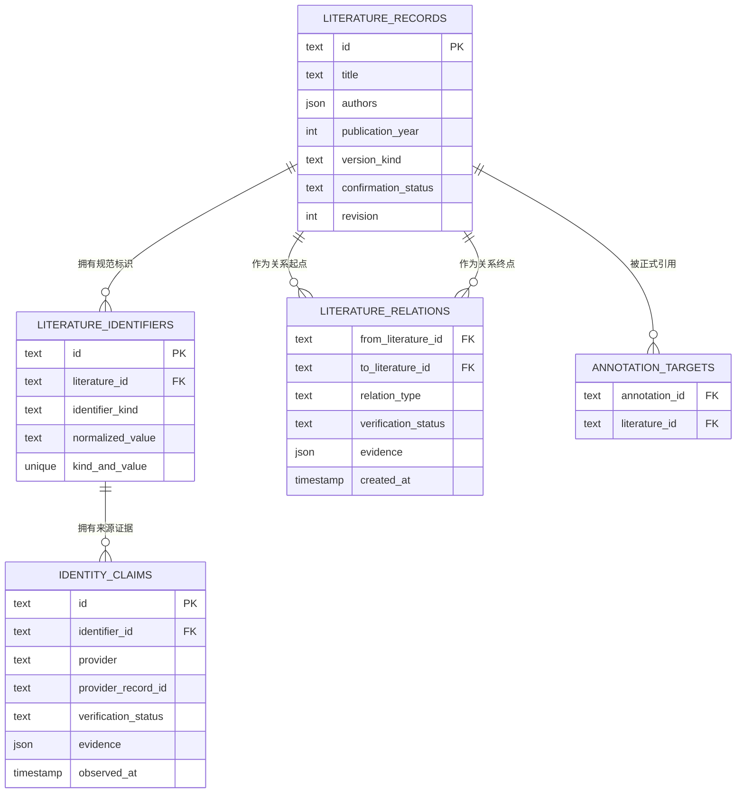
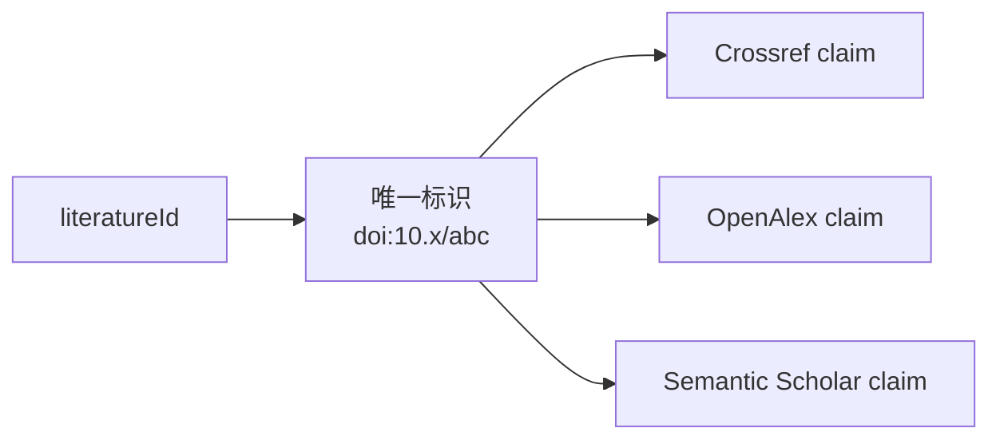
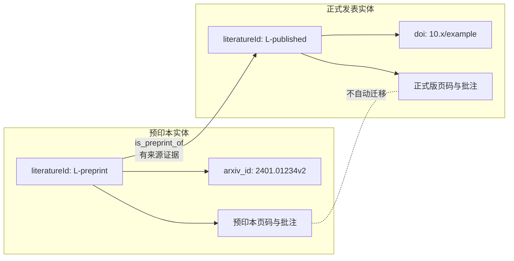
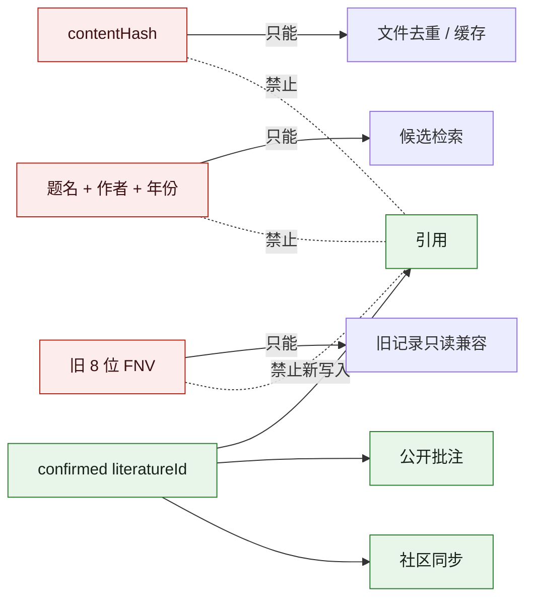

下面是目标架构。它不是现状，而是按我们刚确认的要求完成后应达到的结构。

**总体架构**



虚线的“未确认 → 使用”必须被硬性拒绝，而不是只在 UI 提示。

**分级确认决策**



这里最关键的规则是：人工输入只能重新发起检索，不能直接创建正式论文。

**目标数据模型**



这里对文字版设计做了一个重要收敛：标识和来源证据分开保存。

例如 DOI `10.x/abc` 只能属于一个 `literatureId`，但 Crossref、OpenAlex、Semantic Scholar 都可以分别为它提供验证证据：



这样不会因为 provider 不同，让相同 DOI 被错误挂到多个论文实体。

**预印本与正式版**



两者可以在搜索结果中组成一个版本组，但：

- 不共享 `literatureId`；
- 不自动共享页码和批注；
- 不混合引用指标；
- 不共享全文授权；
- 可以提示“已有正式版”；
- 引用导出可以优先正式版。

**最终硬门槛**



最终只保留一条正式主链：

```text
PDF 线索
→ provider 检索
→ 分级裁决
→ 服务端重新抓取
→ confirmed literatureId
→ 引用/发布
```

旧人工正式确认、旧 FNV 写入、仅判断“不是 local ID 就允许同步”等并行路径都会在兼容验证后删除。
