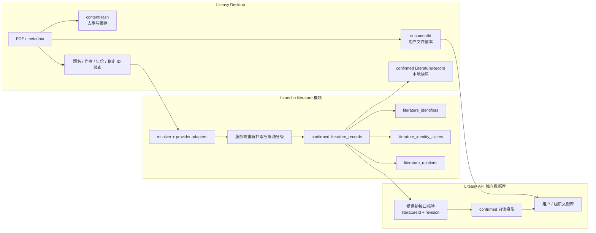

# 文献身份架构

本页描述当前主线实现。权威规则见
`docs/superpowers/specs/2026-08-10-source-confirmed-literature-identity-design.md`；若历史计划或旧截图与其冲突，以该规格为准。

## 当前主链

Liteasy 与 Intuecho 不共享数据库、连接池或凭据。Intuecho 只裁决平台文献身份；Liteasy 独立拥有 `documentId`、文件、目录、权限和私人阅读数据。用户主动发布社区内容之前，Intuecho 不得获知谁收藏、阅读或上传了某篇文献。

## 身份层次

| 层次 | 作用 | 不得用于 |
| --- | --- | --- |
| `documentId` | 一个用户或组织拥有的具体文件/元数据条目 | 跨用户文献身份 |
| `contentHash` | 文件去重、缓存和完整性检查 | 推断同一学术版本 |
| `literatureId` | 来源确认后的具体文献版本 | 表达文件所有权或全文权限 |
| `literature_identifiers` | DOI、arXiv、OpenAlex、Semantic Scholar 等稳定标识所有权 | 保存 provider 观察过程 |
| `literature_identity_claims` | provider 记录、确认依据、证据和观察时间 | 取代标识全局唯一约束 |
| `literature_relations` | 连接预印本、正式版、修订版或译本 | 合并两个版本的批注、页码和授权 |

每个完成来源确认的具体版本获得稳定、不透明的 `literatureId`。同一版本被不同用户上传时共用该 ID，但保有不同的 `documentId` 和私人数据。预印本与正式发表版使用不同 `literatureId`，只有获得明确证据后才写入 `is_preprint_of` 等关系。

## 状态和来源规则

`unresolved`、`candidate`、`ambiguous`、`conflict` 是解析或本地待办状态，不创建公共记录。正式新记录只能是 `confirmed`。旧 `manual` 和 `legacy_metadata` 记录只读兼容为 `legacy_unverified`，不得因题名、作者、年份或旧迁移标记自动升级。

- Crossref DOI、arXiv 等一级原始注册来源，可在来源内稳定 ID 精确回查且题录无冲突时确认。
- OpenAlex、Semantic Scholar 等二级聚合来源，当前要求用户明确选择后由服务端重新抓取；第二个独立聚合来源完整确认同一版本时复用已有 `literatureId`。
- 题名、作者、年份、文件名、PMLR 提示和 SHA-256 题录指纹只用于候选、排序或兼容别名，不能单独创建正式记录。

标识和证据分开后，同一个 `(identifier_kind, normalized_value)` 只能属于一个 `literatureId`，而多个 provider 可以分别留下 claim。OpenAlex 与 Semantic Scholar 对同一题录的确认不会因为 provider ID 不同而复制版本；预印本/正式发表类型冲突则保持两个身份。

## 投影与兼容

Desktop 不能把确认快照直接当作云端真相。Liteasy API 在创建或更新云文献投影时，只接受 `literatureId + revision`，通过受保护的 Intuecho 服务端接口核验后保存只读快照。`createMetadataEntry` 不接受嵌套的客户端 `metadata.literature`；已有投影可离线读取。

已删除的旧写入路径包括 manual 正式文献创建、八位 FNV 主身份生成，以及仅排除 `local_paper_id` 就允许公开同步的门槛。旧八位值、旧 `literature_identities` 和旧记录仍可只读识别。`development/dev-cloud works` 继续服务标签、索引和推荐开发链路，但不是正式引用身份真源。

## 当前边界

关系表、SQLite/PostgreSQL repository 方法和查询路由已存在，并拒绝空证据；provider adapters 尚未提供可信版本关系发现，生产写入编排也未接通。因此当前实现不会猜测预印本关系，不能表述为版本关系已端到端自动建立。

PostgreSQL 通过不可变迁移 `016_source_confirmed_literature_identity.sql` 建立模型，并由 `017_constrain_legacy_aggregate_confirmation.sql` 将只有迁移标记的旧单聚合来源记录降为 `legacy_unverified`。SQLite 初始化采用同一确认规则。Liteasy 的投影模型由 `024_literature_projections.sql` 建立。
