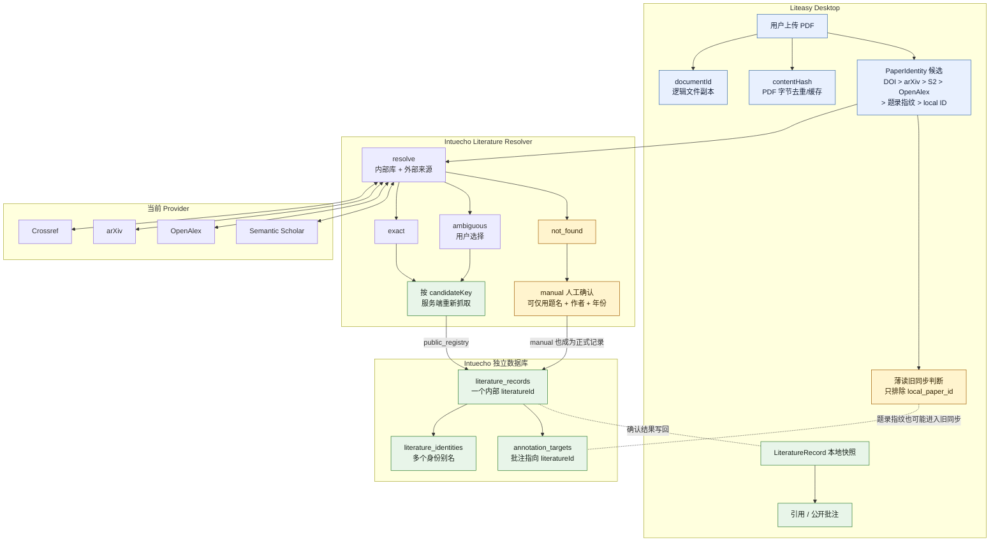
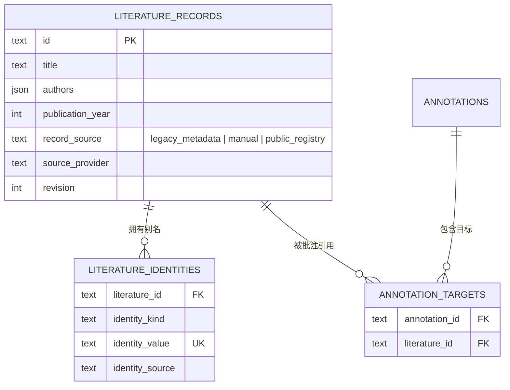
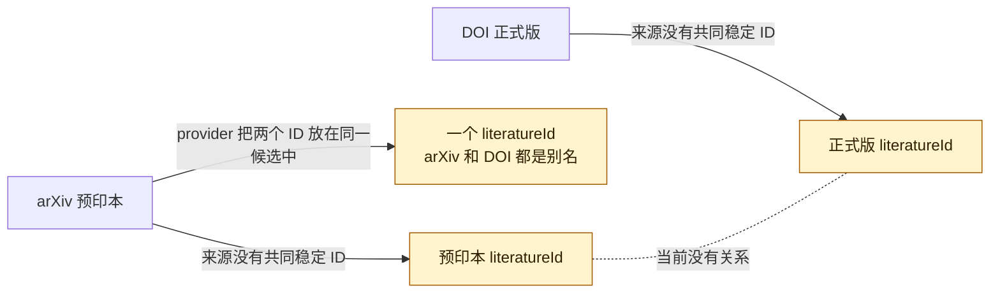
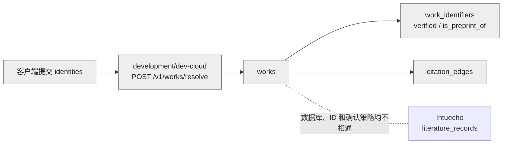

下面是当前工作区已经实现的论文身份架构。绿色是当前正式主链，黄色是兼容或风险路径，灰色是独立的开发云模型。

当前正式数据模型是：

这里没有版本关系表。因此当前预印本和正式版只有两种结果：

此外还有一套独立的开发云模型：

与已确认新设计的核心差距集中在五处：

1. `manual` 目前也能创建正式可引用记录。
2. 四个 provider 目前没有权威源/聚合源等级，单个聚合源也能确认。
3. 正式模型没有 `confirmed/ambiguous/conflict` 持久状态。
4. 没有预印本与正式版关系表，结果可能被合并，也可能完全失联。
5. 旧题录指纹和薄读同步仍存在绕过正式 `LiteratureRecord` 的路径。

新设计的目标，就是把黄色路径收敛掉，并在正式 Intuecho 模型中增加分级确认和版本关系，而不是继续扩展 `dev-cloud works`。