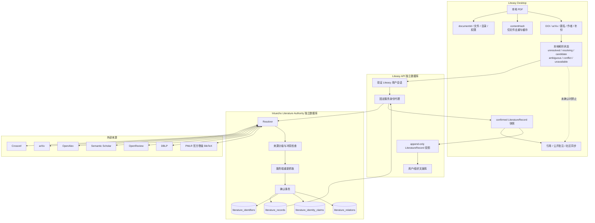
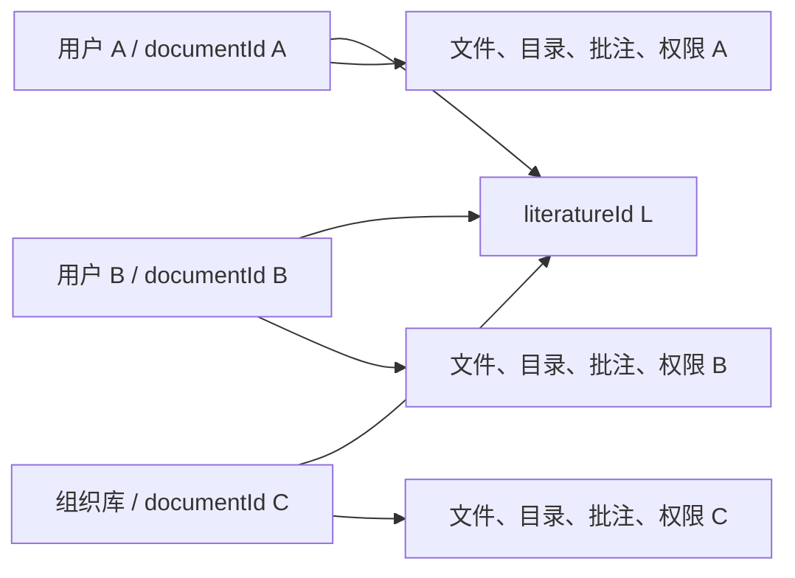
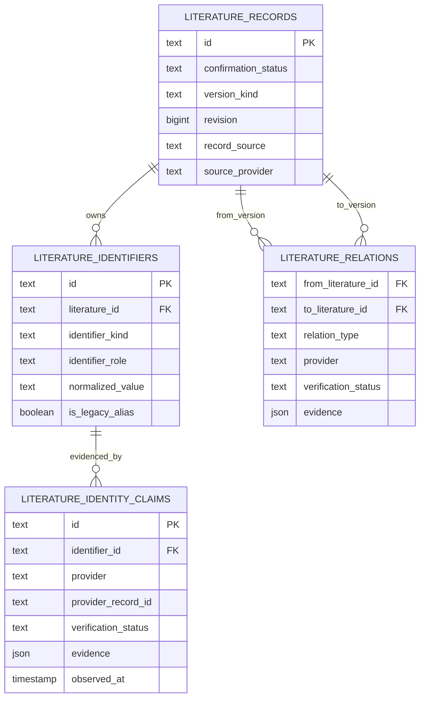
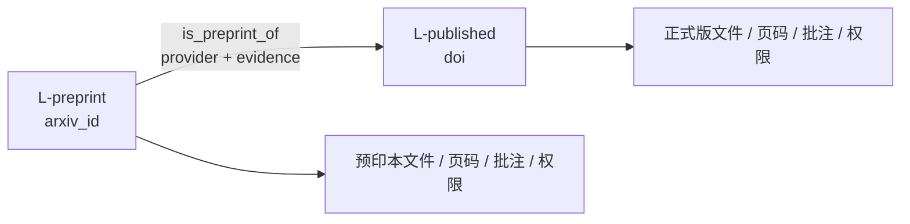
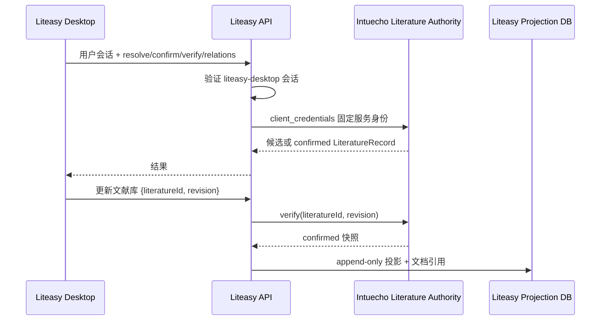
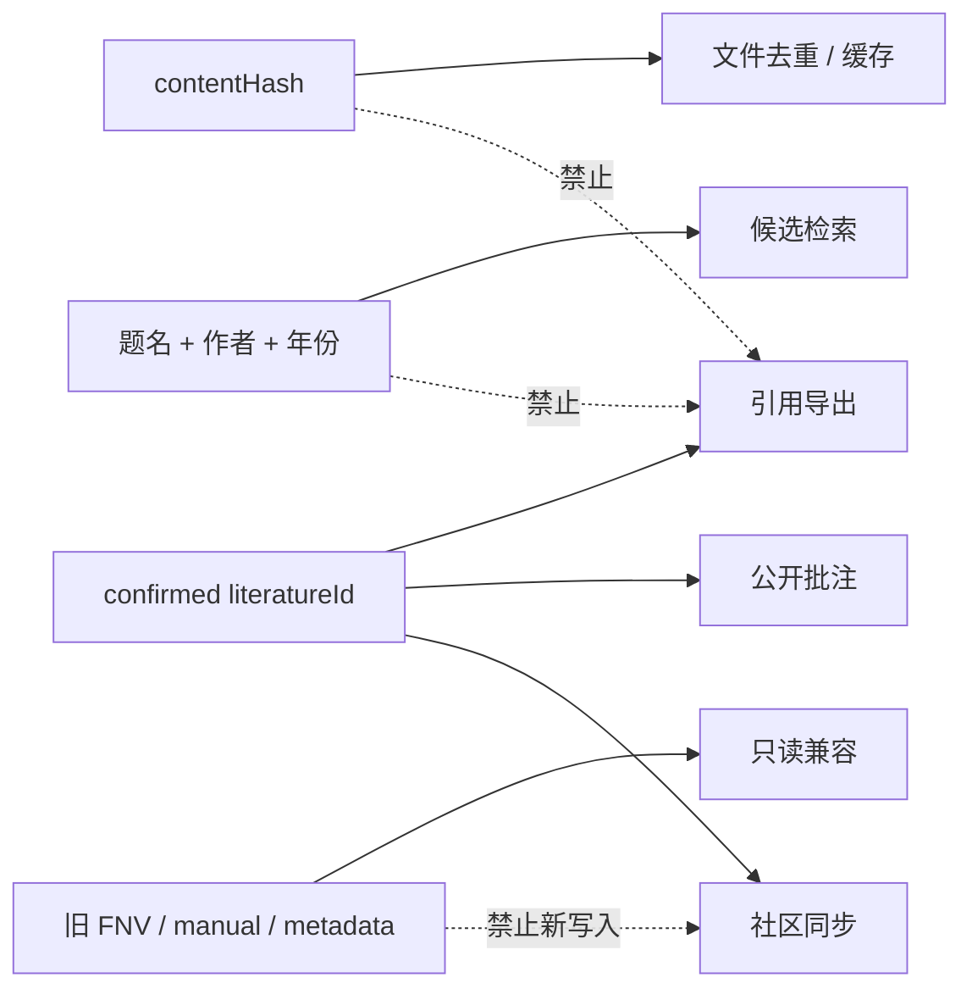

# 文献身份标识实现报告

> 报告日期：2026-08-11  
> 对应分支：`main`  
> 基线提交：`4fcc6aa`  
> 检查对象：包含未提交修改的当前工作区  
> 目标设计：`docs/design/文献身份.md`

## 1. 结论

当前工作区已经形成单一的来源确认文献身份主链：

```text
PDF 或人工题录线索
-> Liteasy Desktop 提交解析请求
-> Liteasy API 隐私代理
-> Intuecho Literature Resolver
-> 分级来源裁决与服务端重新抓取
-> Intuecho 确认事务
-> confirmed LiteratureRecord(literatureId, revision)
-> Liteasy API 核验并保存只读投影
-> 本地引用、公开批注、社区同步和版本消费
```

核心身份模型已经达到 `docs/design/文献身份.md` 的目标：

- 每个完成来源确认的具体文献版本使用全局稳定、不透明的 `literatureId`；
- 同一版本被不同用户上传时复用 `literatureId`，但 `documentId`、文件、目录、权限和私人数据仍按 Liteasy 用户或组织范围隔离；
- 规范外部标识、provider 来源 claim 和版本关系分别存储；
- `title_authors_year_hash` 只作为候选或兼容别名，不能单独产生 `exact` 或 `confirmed`；
- Crossref、arXiv、OpenReview、PMLR 与 OpenAlex、Semantic Scholar、DBLP 使用不同确认等级；
- 预印本和正式发表版不合并身份，通过有证据的关系连接；
- 只有 `confirmed` 记录能进入正式引用、公开批注和社区同步链路；
- 旧 manual、legacy metadata 和八位题录指纹只读兼容，不会被无证据升级。

当前实现比目标设计图额外完成了 Liteasy 隐私代理和可重试失败状态。PubMed、真实外部 provider、真实 PostgreSQL/OIDC/S3 的联合生产验证仍未完成，不能据此宣称生产验收。

## 2. 当前实际架构



这里存在两个明确的服务边界：

1. Intuecho 的独立 literature 模块是平台文献身份权威，负责来源解析、裁决和正式记录写入。
2. Liteasy API 不执行外部身份裁决，只验证 Desktop 用户、使用固定服务身份调用 Intuecho，并保存已核验的只读投影。

Liteasy 与 Intuecho 不共享数据库、连接池或凭据。两者只共享 `literatureId` 和 API 契约。

## 3. 身份对象及其边界

### 3.1 `literatureId`

新确认记录使用 `literature_<UUID>` 形式的不透明 ID。`literatureId` 表示已经确认的一个具体文献版本，而不是：

- 某个用户上传的文件；
- PDF 字节内容；
- DOI、arXiv ID 等外部标识本身；
- 题名、作者和年份组成的指纹；
- 预印本与正式发表版组成的版本组。

同一个来源确认版本可以被多个 Liteasy 文档引用：



共享的是来源确认身份，不共享用户私人数据。

### 3.2 `documentId` 与 `contentHash`

`documentId` 是 Liteasy 文献库中的逻辑文件副本标识，受用户或组织 scope 控制。`contentHash` 只参与文件去重、对象完整性检查和缓存。

以下推导均被禁止：

```text
相同 contentHash != 相同跨用户文献身份
相同题名作者年份 != 已确认文献身份
不是 local_paper_id != 可以公开同步
```

### 3.3 `revision`

`LiteratureRecord` 带正整数 `revision`。记录题录或规范标识发生变化时，Intuecho 保存旧 revision 快照并增加 revision。

Liteasy 云端写入不接受 Desktop 上传的完整确认快照作为事实来源，只接受 `{ literatureId, revision }` 引用。Liteasy API 必须向 Intuecho 核验这一对值，获得 confirmed 快照后才能保存投影。

## 4. 标识角色与规范化

标识角色已经进入 Intuecho contracts、Desktop 类型和数据库约束。

| 角色 | 当前 kind | 用途 | 能否单独产生 `exact` |
|---|---|---|---|
| `confirmable` | `doi` | 来源内精确回查和全局身份约束 | 按来源等级裁决 |
| `confirmable` | `arxiv_id` | arXiv 版本精确回查 | 按来源等级裁决 |
| `confirmable` | `openalex_id` | 聚合来源记录定位 | 不能绕过聚合来源规则 |
| `confirmable` | `semantic_scholar_id` | 聚合来源记录定位 | 不能绕过聚合来源规则 |
| `confirmable` | `openreview_id` | OpenReview 已发表记录精确回查 | 按一级来源规则裁决 |
| `confirmable` | `dblp_key` | DBLP 会议/期刊记录定位 | 不能绕过聚合来源规则 |
| `confirmable` | `pmlr_id` | PMLR 正式论文在卷级官方数据中的稳定来源内 ID | 按一级来源规则裁决 |
| `candidate_alias` | `title_authors_year_hash` | 候选检索、去重辅助和旧数据兼容 | 否 |

“可确认标识”描述标识的数据库语义；“一级/聚合来源”描述证据强度。OpenAlex ID、Semantic Scholar ID 和 DBLP key 虽然属于 `confirmable`，仍必须执行聚合来源确认规则。

当前规范化规则包括：

- DOI：去掉 DOI URL 或 `doi:` 前缀、去掉尾部标点、转小写；
- arXiv：去掉 URL、`arxiv:` 和 `.pdf`，保留版本后缀并转小写；只有明确 `vN` 的值可以确认具体版本，无版本历史值降级为只读 legacy alias；
- Semantic Scholar：统一 `corpus:` 前缀格式并转小写；
- OpenAlex：去掉 URL，校验 `W<数字>`，统一为大写；
- OpenReview：接受结构化裸 ID、显式 `openreview:` 或官方 forum URL，保留大小写；普通 query 只有显式前缀或官方 URL 才进入精确 ID 路径，避免把题名单词误判为 ID；
- DBLP：接受 `conf/<venue>/<record>`、`journals/<venue>/<record>` 或官方 record URL，去掉 `.html/.xml/.json` 后缀并拒绝路径穿越；
- PMLR：接受 `v<volume>/<slug>`、`pmlr-v<volume>-<slug>` 或官方论文 URL，统一为小写 `v<volume>/<slug>`；卷号是 ID 的组成部分，同一 slug 出现在不同卷时不会合并；
- 题名作者年份指纹：规范题名和作者后计算 SHA-256，格式为 `sha256:<64 hex>`。

SHA-256 题录指纹由确认事务根据规范题录生成，只能参与候选搜索和兼容读取，允许多个实体共享。resolver 的 exact 路径只匹配 `confirmable` kind。

## 5. 数据库语义和不变量



已经落实的关键约束：

| 不变量 | PostgreSQL | SQLite 开发实现 |
|---|---|---|
| confirmable `(identifier_kind, normalized_value)` 全局唯一 | partial `UNIQUE INDEX` | partial `UNIQUE INDEX` |
| candidate alias 可由多个 literature 拥有 | 是 | 是 |
| 一个 literature 可有多个标识 | 是 | 是 |
| claim 绑定 identifier，不复制 literature 身份 | 外键 `identifier_id` | 外键 `identifier_id` |
| `(provider, provider_record_id)` 唯一 | `UNIQUE` | `UNIQUE` |
| confirmed claim 必须有证据与时间 | `verification_status/evidence/observed_at` | 对等字段与检查 |
| 标识 kind 与 role 必须匹配 | `CHECK` | `CHECK` |
| 关系两端不能相同 | `CHECK` | `CHECK` |
| 同一有向关系不重复 | `UNIQUE` | `UNIQUE` |
| 正式状态只允许 `confirmed` 或 `legacy_unverified` | `CHECK` | `CHECK` |

PostgreSQL 使用正式表名；SQLite 因历史开发数据库兼容使用 `_v2` 表名。命名不同，但当前身份行为和约束保持一致。

## 6. 来源分级确认

### 6.1 一级原始注册来源

当前一级来源为：

- Crossref：以规范 DOI 精确回查；
- arXiv：以规范 arXiv ID 精确回查；
- OpenReview：以 note ID 精确回查，并且只接纳有明确 venue、非 submitted/under-review/withdrawn/rejected 的已发表记录；
- PMLR：以 `pmlr_id = v<volume>/<slug>` 定位官方卷级 BibTeX，并在确认时重新抓取该卷数据。

确认条件是来源内 ID 精确唯一回查、返回记录包含可确认 public registry 标识、题录没有冲突，且服务端在确认时重新抓取候选。满足条件后，claim 的 `confirmationBasis` 为 `primary_registry_refetch`。

PMLR 还必须同时满足以下审计不变量：

1. 官方卷文件为 `https://proceedings.mlr.press/v<volume>/assets/bib/bibliography.bib`，请求声明接收 BibTeX 文本；
2. `@InProceedings` citation key 恰好唯一命中 `pmlr-v<volume>-<slug>`；
3. entry 的 `volume` 与 `pmlr_id` 卷号一致；
4. entry 的 canonical URL 精确映射回 `https://proceedings.mlr.press/v<volume>/<slug>.html`；
5. Citation.js 解析结果为 `paper-conference`，publisher 为 `PMLR`，且存在题名；
6. claim 保存卷文件 URL、`sha256:<64 hex>` 字节摘要、entry key、卷号、观测时间和 `primary_registry_refetch` 确认依据。

因此 `pmlr_id` 不是由题名推导的别名，而是 PMLR 官方数据出口内可精确重放查询的来源 ID。审计证据中的卷号、entry key、文件路径和正式论文 URL 必须与 `pmlr_id` 相互一致；contracts、resolver、SQLite/PostgreSQL repository 和 Desktop 本地 schema 都会拒绝缺失或串卷证据。

PubMed 尚未接入，仍是未来一级来源。

### 6.2 二级聚合来源

当前聚合来源为：

- OpenAlex；
- Semantic Scholar。
- DBLP。

确认有两条合法路径：

1. 两个独立 provider 返回相同具体版本、共享身份或题录一致且不存在版本冲突，记录 `independent_provider_bibliography`；
2. 用户明确选择候选后，服务端重新抓取所选 provider，并跨来源检查冲突，记录 `user_selected_refetch`。

聚合来源返回单个候选不会因为拥有 OpenAlex ID、Semantic Scholar ID 或 DBLP key 就自动绕过以上规则。

### 6.3 计算机与 AI 顶会顶刊覆盖

新增来源不以 venue 名称创建并行身份。venue 只决定发现覆盖，正式身份仍由来源 ID、重新抓取和跨来源冲突检查确定。

| 代表 venue | 当前直接来源 | 交叉核验来源 | 当前覆盖判断 |
|---|---|---|---|
| NeurIPS | OpenReview 已发表记录、DBLP | Crossref、OpenAlex、Semantic Scholar | 已覆盖 |
| ICLR | OpenReview 已发表记录、DBLP | OpenAlex、Semantic Scholar、Crossref（存在 DOI 时） | 已覆盖 |
| ICML | PMLR 官方卷级 BibTeX、DBLP | Crossref、OpenAlex、Semantic Scholar | 已覆盖；PMLR 为一级官方来源 |
| AAAI | DBLP | Crossref、OpenAlex、Semantic Scholar | 已覆盖 |
| CVPR / ICCV / ECCV | DBLP | Crossref、OpenAlex、Semantic Scholar | 已覆盖 |
| ACL / EMNLP / NAACL | DBLP | Crossref、OpenAlex、Semantic Scholar | 已覆盖 |
| KDD / SIGMOD / ICSE | DBLP | Crossref、OpenAlex、Semantic Scholar | 已覆盖 |
| JMLR / TPAMI / JAIR / AIJ | DBLP | Crossref、OpenAlex、Semantic Scholar | 已覆盖 |

OpenReview 和 DBLP 通过公开机器接口接入。PMLR 不抓取 proceedings HTML；它读取官方发布的卷级 `bibliography.bib`，使用稳定 citation key 精确回查，并对完整数据出口计算 SHA-256 审计摘要。

### 6.4 冲突和失败

解析结果契约包括：

```text
exact
ambiguous
conflict
not_found
unavailable(retryable = true)
```

Desktop 将其保存为本地过程状态：

```text
unresolved
-> resolving
-> candidate / ambiguous / conflict / unavailable
-> confirmed LiteratureRecord
```

`unresolved`、`candidate`、`ambiguous`、`conflict` 和 `unavailable` 不会创建新的公共正式文献记录。confirmed 结果保存在独立的 `bibliographic-identity` 快照中；新的 v2 resolution artifact 不再写入 confirmed 状态。旧 v1 confirmed artifact 仍可读取恢复。

## 7. 确认事务

Intuecho 的 SQLite 与 PostgreSQL repository 执行相同的确认步骤：

1. 校验 provider、candidate key、public registry 标识和候选结构；
2. 拒绝只包含候选别名的正式确认；
3. 拒绝正式发表记录同时携带正式 DOI 与 arXiv ID 的跨版本混合；
4. 检查来源之间的题名、完整作者、年份和版本类别一致性；
5. 按全局规范标识和既有 claim 查找唯一 literature；
6. PostgreSQL 对规范标识、provider record 和题录指纹取得事务 advisory lock，防止并发创建重复记录；
7. 新记录生成不透明 `literatureId`，既有记录保持原 ID 并按变更增加 revision；
8. 写入或复用规范标识；
9. 为每个独立 provider 写入 claim、证据、来源等级和观测时间；
10. 只在关系目标已确认时写入有证据的版本关系，并在后续确认目标时回填可证明关系。

正式记录不是按 provider 分裂的。同一个 DOI 只能属于一个 `literatureId`，Crossref、OpenAlex、Semantic Scholar、OpenReview、DBLP 和 PMLR 可以分别为该 DOI 提供 claim。`pmlr_id` 同样受 `(identifier_kind, normalized_value)` 全局唯一约束。

## 8. 版本身份和关系

预印本和正式发表版始终是两个具体版本实体：



当前支持的关系类型为：

- `is_preprint_of`；
- `version_of`；
- `translation_of`。

每条关系保存方向、provider、`verificationStatus: confirmed`、证据和创建时间。系统不会根据相似题名自行猜测关系，也不会自动迁移页码、批注、引用指标或全文权限。

PMLR 的卷次和版本边界如下：

```text
v235/abad-rocamora24a  !=  v236/abad-rocamora24a
pmlr_id formal paper   !=  arxiv_id preprint
同一 pmlr_id 的题录修订  -> 同一 literatureId 的新 revision
不同 PMLR 卷/slug       -> 不同 literatureId
```

PMLR 官方 BibTeX 没有提供可证明的 arXiv 关系时，系统不会仅按题名自动生成 `is_preprint_of`。只有其他来源给出明确标识关系并通过服务端确认时，正式版与预印本才会组成有证据的版本组。

Desktop 已完成以下消费闭环：

- 候选搜索界面只根据 provider 明确关系组成版本组；
- 显示预印本、正式发表版和关系方向；
- 显示关系 provider、已确认状态和证据字段；
- 优先打开本地已有版本，否则打开来源 HTTPS 页面；
- 可把关联版本作为新的独立 `documentId` 加入文献库；
- 版本关系加载失败时显示可见错误和重试按钮；
- 引用和 BibTeX 导出可选择版本；
- 当前版本是预印本且存在 `is_preprint_of` 目标时，默认优先正式发表版。

## 9. Liteasy 隐私代理与投影

当前实际调用链不是 Desktop 直接携带用户身份访问 Intuecho：



隐私结果：

- Intuecho 不会从普通解析、确认、核验或关系读取中获知 Liteasy 的用户主体；
- Intuecho 不保存谁在 Liteasy 收藏、阅读或上传了某文献；
- Liteasy 用户或组织库、文件、目录和权限仍只存在 Liteasy 边界；
- 用户主动发布社区内容时可以携带社区用户身份，这是明确的隐私例外。

Liteasy 投影表以 `(literature_id, revision)` 为主键，并通过触发器拒绝 UPDATE 和 DELETE。文献库条目使用外键引用已核验投影。相同 revision 若返回不同快照，写入会以 revision conflict 失败。

已有投影允许离线读取；新增或更新云端文献引用时必须在线核验，核验器未配置时失败关闭。

## 10. 正式使用门槛



Desktop 的公开批注控制器在生成社区 upsert 前必须获得 `LiteratureRecord`。兼容加载接口可以返回 `legacy_unverified`，但正式加载接口只返回 `status === "confirmed"`，因此旧记录不能进入新的发布操作。

## 11. 已删除或收敛的旧路径

当前正式主链已经移除或封闭：

- Desktop 八位 FNV 作为新主身份或正式写入依据；
- manual 正式文献创建的 UI、contract 和 repository 写入口；
- 只检查 `primary.kind != local_paper_id` 就允许同步的旧门槛；
- Desktop 直接信任 confirmed 快照并写入 Liteasy 云文献库的路径；
- 在 resolution artifact 与 bibliographic snapshot 中重复保存新 confirmed 状态的分支；
- 使用 `contentHash` 作为跨用户文献身份的路径。

仍保留的只读兼容：

- 旧 `literature_identities` 表，由数据库触发器拒绝 INSERT、UPDATE 和 DELETE；
- 旧 `manual`、`legacy_metadata` 记录，读取为 `legacy_unverified`；
- 旧八位题录指纹，标记为 legacy alias；
- Desktop 旧 v1 confirmed resolution artifact 的恢复读取；
- `local_paper_id` 作为纯本地文档候选身份，不作为正式引用身份；
- `development/dev-cloud works` 的标签、索引和推荐用途，不作为 Intuecho 正式 literature 真源。

## 12. 来源契约对齐

OpenAlex、OpenReview、DBLP 和 PMLR 已在以下边界统一进入正式类型和校验：

- Intuecho contracts：`openalex_id`、provider 枚举、候选、claim 与关系；
- Intuecho resolver/provider adapter：规范化、candidate key、来源分级和重新抓取；
- Liteasy API：confirmed 快照规范化、隐私代理和 revision 核验；
- Desktop：标识类型、候选展示、版本打开和引用导出；
- 社区同步：只发送 confirmed `literatureId`，不把任一 provider 候选快照当作正式身份。

OpenAlex 和 DBLP 属于聚合来源。契约支持 `openalex_id` 或 `dblp_key` 不等于允许其单源无条件自动确认。OpenReview 只有明确已发表 venue 状态的记录才进入候选，随后仍由服务端按 note ID 重新抓取。PMLR 属于一级官方来源，但只有官方卷数据唯一命中且审计证据完整时才能进入确认事务。

## 13. 主要实现位置

| 责任 | 位置 |
|---|---|
| 跨产品 contracts | `products/intuecho/packages/contracts/src/index.js`、`index.d.ts` |
| 标识规范化、角色、指纹和版本冲突 | `products/intuecho/services/api/src/literatureIdentity.mjs` |
| 来源分级、候选裁决和重新抓取 | `products/intuecho/services/api/src/literatureResolver.mjs` |
| 外部 provider adapters | `products/intuecho/services/api/src/literatureProviders.mjs` |
| SQLite authority repository | `products/intuecho/services/api/src/annotationCommunitySqlite.mjs` |
| PostgreSQL authority repository | `products/intuecho/services/api/src/postgresAnnotationCommunityRepository.mjs` |
| PostgreSQL 不可变迁移 | `products/intuecho/services/api/migrations/016-023_*.sql` |
| Intuecho 用户/服务端 routes | `products/intuecho/services/api/src/literatureRoutes.mjs` |
| Liteasy -> Intuecho 服务客户端 | `products/liteasy/services/api/src/intuechoLiteratureClient.mjs` |
| Liteasy confirmed 快照校验 | `products/liteasy/services/api/src/literatureMetadata.mjs` |
| Liteasy 投影写入 | `products/liteasy/services/api/src/libraryRepository.mjs` |
| Liteasy PostgreSQL 投影迁移 | `products/liteasy/services/api/migrations/024_literature_projections.sql`、`026_normalize_library_literature_references.sql` |
| Desktop 类型与 confirmed 快照 | `products/liteasy/apps/desktop/src/app/features/paper-identity/` |
| Desktop Liteasy API 客户端 | `products/liteasy/apps/desktop/src/app/features/paper-identity/literatureAuthorityClient.ts` |
| 候选版本组和引用选择 | `products/liteasy/apps/desktop/src/app/features/forum/literatureVersioning.ts` |
| 版本关系 UI | `products/liteasy/apps/desktop/src/app/features/forum/LiteratureVersionRelations.tsx` |
| 候选确认 UI | `products/liteasy/apps/desktop/src/app/features/forum/LiteratureResolutionDialog.tsx` |
| 公开批注门槛 | `products/liteasy/apps/desktop/src/app/controllers/usePdfAnnotationPublicationController.ts` |

## 14. 与目标设计的差异

| 项目 | `docs/design/文献身份.md` | 当前实现 |
|---|---|---|
| Desktop 到 authority 的链路 | 图中近似直接连接 resolver | 经过 Liteasy API 固定服务身份代理，隐私边界更严格 |
| 本地解析状态 | 列出 unresolved/candidate/ambiguous | 增加 resolving、conflict、unavailable 和可见重试 |
| claim 表名 | 图中简写 `identity_claims` | 实际为 `literature_identity_claims`，语义一致 |
| SQLite 表名 | 未规定 | 历史兼容使用 `_v2`，约束与 PostgreSQL 对齐 |
| PubMed | 未来一级来源 | 尚未实现 |
| 版本候选分组 | 可以组成版本组 | 仅在 provider 返回明确关系且目标候选存在时分组，不做题录猜测 |
| 生产验证 | 目标架构未宣称验收 | 当前只有自动测试和构建证据，真实基础设施联合验证未完成 |

没有需要把代码回退到文档较简化结构的差异。Liteasy 隐私代理和失败状态是必要的实现补充。

## 15. 当前工作区专项验证

以下命令于 2026-08-11 针对当前未提交工作区执行。

### 15.1 Intuecho 身份核心

```bash
cd products/intuecho
npm test
npm run build
```

结果：contracts TypeScript 检查通过；API 206 项测试通过；Web 3 个测试文件、39 项测试通过；生产构建和产物检查通过。构建存在 bundle size warning，无失败。

PMLR 专项覆盖：官方卷 BibTeX 原始字节哈希、20 MB 响应上限、单一 citation key 精确命中、重复 key 拒绝、entry 卷号冲突拒绝、canonical URL 反向映射、无审计证据拒绝、SQLite/PostgreSQL claim 保存、同 slug 跨卷不同 `literatureId`，以及同题录 PMLR 正式版与 arXiv 预印本不合并。

### 15.2 Liteasy API 投影

```bash
cd products/liteasy/services/api
npm test
```

结果：371 项测试中 368 项通过、3 项按环境跳过、0 失败。confirmed PMLR 投影的 provider 和 `pmlr_id` 规范化专项通过。

### 15.3 Desktop 身份和版本消费

```bash
cd products/liteasy/apps/desktop
npx vitest run \
  src/tests/literatureIdentityConformance.test.ts \
  src/tests/literatureResolutionRepository.test.ts \
  src/tests/literatureVersioning.test.ts \
  src/tests/LiteratureResolutionDialog.test.tsx
npm run build
```

结果：4 个专项文件、21 项测试通过；生产构建和产物检查通过。Desktop 会拒绝缺失或串卷的 PMLR 审计证据，显示官方卷、摘要短码和完整 URL/hash tooltip，并可打开 PMLR 正式论文页面。

### 15.4 Desktop 全测试残余

```bash
cd products/liteasy/apps/desktop
npm test
```

结果：257 个测试文件中 254 个通过、2 个按环境跳过、1 个失败；1811 项测试中 1806 项通过、4 项按环境跳过、1 项失败。

唯一失败为 `thinReadingAgent.test.ts` 的既有薄读提示词文本断言：测试要求“核心思想、论文全景、领域位置”，当前实现输出更具体的“核心思想、核心结论及其最短充分支持链、领域位置”。该失败与 PMLR 文献身份改动无关，本轮没有为通过门禁而回退用户的薄读实现。

### 15.5 静态检查

`git diff --check` 通过。最终 diff 审计确认本轮没有 reset、checkout 或覆盖用户未提交改动，也没有编辑 `docs/design/文献身份.md` 和 `docs/design/新模态-薄读.md`；这两份文件在进入本轮前已经处于修改状态。

测试输出仍包含既有 React `act(...)`、PDF 标准字体和 bundle size warning；它们不是 PMLR 专项失败。

## 16. 未完成验证和剩余边界

以下事项不能描述为已经生产验收：

- 真实 PostgreSQL 上的并发确认、迁移和 advisory lock 联合验证；本轮环境未配置 `INTUECHO_TEST_DATABASE_URL` 和 `INTUECHO_TEST_MIGRATION_DATABASE_URL`，未运行会重建隔离测试 schema 的集成脚本；
- 真实 OIDC/client credentials 的 Liteasy -> Intuecho 服务身份联调；
- 真实 S3 文档上传、投影绑定和下载授权联调；
- Crossref、arXiv、OpenAlex、Semantic Scholar、OpenReview、DBLP、PMLR 的真实网络故障、限流和数据漂移验证；本轮 PMLR 公网 smoke 因沙箱网络限制及提权审批服务故障未完成；
- PubMed provider；
- 跨区域部署、备份恢复、数据库升级和生产观测告警；
- 对全部历史 manual/legacy 数据执行生产迁移前的冲突清单审计。

当前剩余工作主要属于真实环境验证和未来 provider 扩展，不是身份模型的并行架构缺口。

## 17. 验收判断

| 检查项 | 状态 |
|---|---|
| 来源确认的具体版本身份 | 已实现 |
| 用户间共享 identity、隔离文档和私人数据 | 已实现 |
| identifier 与 claim 分离 | 已实现 |
| confirmable 外部标识全局唯一、候选别名可多归属 | 已实现 |
| 候选别名不能单独 exact | 已实现 |
| 一级/聚合来源分级 | 已实现 |
| NeurIPS、ICLR、ICML、AAAI provider 契约覆盖 | 已实现并由固定响应测试覆盖 |
| PMLR 官方卷级 BibTeX 与稳定 `pmlr_id` | 已实现；唯一命中、重复 key、串卷和跨卷隔离由专项测试覆盖 |
| 计算机/AI 主要顶刊 DBLP 发现覆盖 | 已实现；真实公网质量尚未验收 |
| 服务端重新抓取和冲突检查 | 已实现 |
| confirmed-only 正式使用门槛 | 已实现 |
| 预印本/正式版独立身份 | 已实现 |
| 有证据版本关系 | 已实现 |
| 版本组、打开、获取、证据、重试和引用选择 | 已实现 |
| Liteasy 隐私代理 | 已实现 |
| `literatureId + revision` 投影核验 | 已实现 |
| PostgreSQL/SQLite 语义对齐 | 已由代码和专项测试覆盖 |
| 历史只读兼容 | 已实现 |
| PubMed | 未实现，未来项 |
| 真实生产基础设施联合验收 | 未完成 |
