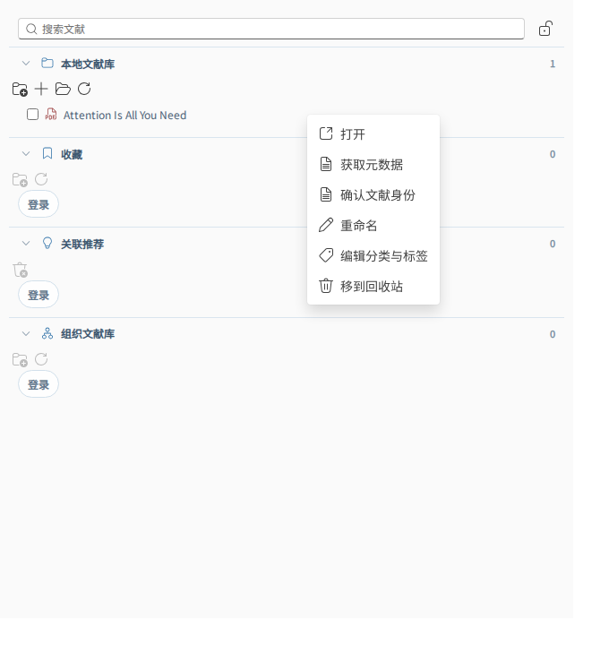

# PDF 元数据识别与自动命名

调研与实现日期：2026-09-14。适用范围：`products/liteasy/apps/desktop`。

## Zotero 的实现

Zotero 并不直接把 PDF 内嵌的 Title 当作可靠题名。其[官方说明](https://www.zotero.org/support/retrieve_pdf_metadata)描述了前几页文本 → 识别服务 → 书目查询 → 建立父条目的流程。内嵌元数据可能是排版软件、旧稿或模板留下的内容。

[客户端源码 recognizeDocument.js](https://github.com/zotero/zotero/blob/main/chrome/content/zotero/xpcom/recognizeDocument.js)通过 PDFWorker 获取识别数据，向 recognizer 服务查询，再尝试 arXiv、DOI、ISBN 的 translator；最后可以用服务返回的题录建立条目。没有可读取文本时会报错。源码中的服务调用不能说明服务内部各算法的实现，也不能把 Zotero 的私有识别端点当作第三方应用的公共 API。

[文件命名文档](https://www.zotero.org/support/file_renaming)规定题录与附件文件名分离，默认文件名由作者、年份、标题组成；链接文件默认不自动改名。客户端移动附件时要求不覆盖并生成唯一名称，并保留用于撤销的原始名称。

## Liteasy 的落地

- 现有导入流程完成全文抽取后，控制器启动独立的串行元数据识别队列；元数据服务出错不把成功的全文索引标记为失败。
- 本地 PDF.js 读取首页、Info/XMP 标题，以及按字号和坐标识别的连续标题行；排除竖排 arXiv 印记、版权页眉和作者机构。首页无可选文本或读取失败时，使用已有导入流程得到的首页文本（包括成功的 OCR）。内嵌标题和版面标题都必须在首页得到验证，才作为标题搜索线索。
- 提取 DOI/arXiv ID；默认沿用设置中的 Crossref，也支持现有 OpenAlex、Semantic Scholar 和云端元数据服务。直接服务模式的 arXiv ID 查询走[官方 Atom API](https://info.arxiv.org/help/api/user-manual.html)，串行且请求间隔至少三秒。Atom 返回 429、网络/格式错误或缺失条目时，读取同一版本的官方摘要页 citation 元数据，并用页面自身的标识和明确版本号核对；不转发其他服务密钥，不替换为已发表版本。arXiv 的 `10.48550/arXiv.*` DOI 也走此路径。
- 无 ID 时优先使用最多 350 个字符的独立标题检索，无法定位标题时才使用有界首页书目信息。自动接受要求候选题名完整出现在首页摘要之前；规范化处理小型大写分词、重音、连字符、JATS/HTML 标签及常见 LaTeX 公式表示。没有相符 ID 时还要求作者姓氏一致且只有一个匹配候选。明确的 arXiv ID/版本必须一致；冲突和歧义不自动接受。DOI 无结果或指向其他题名时再尝试标题搜索。
- 确认题录使用既有公开来源确认和持久化接口，存入 `bibliographic-identity` artifact。重开文献库恢复题名、作者和年份。PDF 的稳定 ID 不随改名改变。
- 文件名采用 `第一作者 [et al.] - 年份 - 标题.pdf`。去除 Windows 禁用字符、设备保留名、末尾空格和句点；按 UTF-8 字节限制长度并给重名后缀留空间。文献列表与搜索索引保留完整书目标题。
- 只移动本地库内的托管文件；浏览器 Blob、库外链接和组织共享条目不自动移动。库内已知重名加 `(2)` 等后缀。磁盘存在未列入快照的重名时，由现有 Rust 接口拒绝覆盖，保留原路径并提示。
- 复用 `move_local_library_resource`：更新磁盘及索引；索引写入失败时由原接口回滚。查找期间切换文献库、移除条目或手动修改名称会阻止陈旧识别结果覆盖操作。

主要实现：`features/metadata/pdfRecognition.ts`、`features/metadata/pdfTitleEvidence.ts`、`controllers/usePdfMetadataImportController.ts`、`features/paper-services/arxivMetadata.ts`。AppShell 仅组合控制器；未复制 Zotero 的 AGPL 源码，也未调用其 recognizer 服务。

## 边界与验证

这是独立实现的保守书目识别流程，并非 Zotero recognizer 的完整复刻。暂不实现 ISBN/书籍识别、全文服务端版面推断、可编辑命名模板、批量撤销和元数据修改后的持续改名。扫描件依赖现有 OCR 成功；全文抽取失败时不会进入自动元数据识别。少于 8 个归一化字符的标题、无法恢复的 OCR 错字或复杂数学排版仍会保留原名，可继续使用现有手动文献身份检索入口。网络请求仅发送 ID 或有界书目搜索片段，不发送 PDF 文件。摘要页回退依赖 arXiv 的 citation/页面标识结构；它与 Atom 都不可用时保留原文件。

测试覆盖实际 Attention PDF 首页读取、DOI/arXiv 题录解析、标题与作者核对、引用误匹配拒绝、版本冲突、UTF-8 文件名、Windows 路径、重名、磁盘失败、网络失败及并发用户修改。网络响应测试使用明确的测试替身，不代表线上服务或 Windows 原生运行已验收。

初次实现验证：相关单元与集成测试和桌面构建通过；Crossref 的 `10.1038/nphys1170` 返回 HTTP 200，arXiv Atom 请求返回 HTTP 429。

识别补齐验证（2026-09-14）：46 项定向测试通过，包含 8 份真实论文的完整标题提取与对应版本核验，另外覆盖 429 回退、回退版本不符拒绝、公式/重音标题、短标题、误用引用拒绝以及原文件和并发编辑保护。实际联网抽验使用 Attention v7、GLUE v3、ColBERT v2、Survey v1 四份仓库 PDF：Atom 均返回 429，同版本官方摘要页均返回 200，题录确认与文件名生成全部成功。此抽验通过 curl 适配本机 Node 网络环境，文件移动使用测试替身，未修改样本；不代表 Windows Tauri 原生网络和磁盘路径已验收。Crossref 纯 GLUE 标题查询也返回正确题录 `10.18653/v1/w18-5446`。

## 手动获取入口

本地文献库中右键论文 → **获取元数据**。有 PDF 正文的条目可以重新获取已有题录；执行期间显示进度，结束后显示结果或失败原因。未找到唯一匹配时可通过“确认文献身份”继续手动检索。仅元数据条目不可执行 PDF 识别。

截图来自独立 LibraryPane 预览，使用示例论文展示菜单，不表示执行了线上元数据查询。提交前在独立工作目录通过 71 项相关测试及完整桌面构建；共享 node_modules 的 PDF worker 需要临时测试配置允许访问依赖目录。
