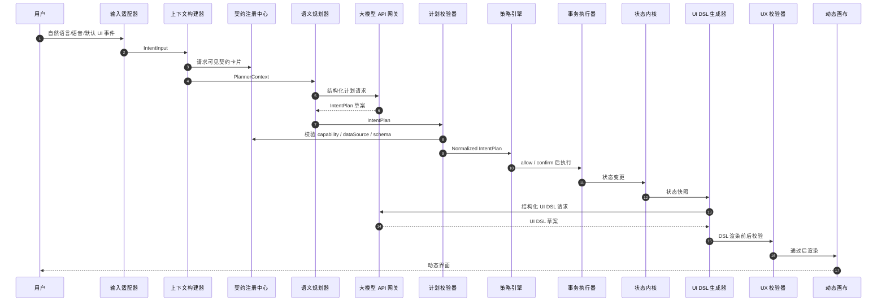
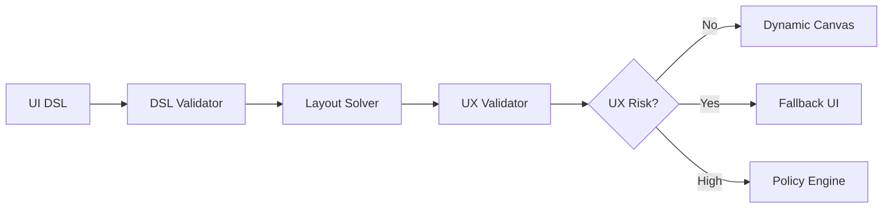

# 意图原生生成式 UI 模块级架构设计文档

版本：v1.0  
日期：2026-07-05  
适用范围：Web、桌面端、移动端、插件化业务应用、内部工具、AI Agent 应用  
核心范式：Controlled Declarative Generative UI + Agentic Intent Runtime  
中文名：受控声明式生成 UI + 意图智能体运行时

---

## 摘要

本文给出一种通用的软件架构范式：用户通过自然语言、语音、默认 UI、自动化事件表达目标，系统通过意图运行时、契约注册层、安全策略、受控执行、生成式 UI 运行时和审计反馈，把目标转化为可执行、可验证、可恢复的界面与动作。

这套架构不是“让大模型自由写 UI 代码”，也不是“让 Agent 直接操作 DOM 或数据库”。成熟路线是：

```text
用户意图
  -> 结构化意图计划 IntentPlan
  -> 契约注册层校验
  -> 策略引擎裁决
  -> 受控执行与状态更新
  -> UI DSL 生成
  -> DSL / UX 双重校验
  -> 动态画布渲染
  -> 动作事件再次进入策略闭环
```

大模型在本架构中是概率性推理与生成组件，不是主权层。主权层属于 schema、registry、policy、state kernel、journal 和 runtime validator。

---

## 1. 设计出处与参考依据

本文综合以下资料形成模块划分与工程边界。

### 1.1 工业界依据

1. **Vercel AI SDK**  
   AI SDK 提供结构化对象生成、工具调用和流式 UI 相关能力，说明生成式 UI 的工程化方向并非让模型直接写任意前端代码，而是让模型输出受控对象、工具调用或组件映射，再由应用运行时渲染。本文中的 `LLM Gateway`、`Structured Output`、`Streaming Patch`、`Tool / Action Invocation` 设计受此启发。

2. **Google Cloud: Generative UI**  
   Google Cloud 对 Generative UI 的定义强调：AI agent 根据用户目标实时编排组件、数据和布局。生产级系统应使用固定组件库和受控协议，而不是让模型生成任意视觉代码。本文中的 `Component Cards`、`UI DSL`、`Dynamic Canvas`、`DataSource Registry` 和 `Policy-aware Orchestration` 采用这一原则。

3. **CopilotKit Generative UI / Agentic UI Protocols**  
   CopilotKit 生态强调 agent 与应用前端之间需要协议、状态共享和事件桥接，而不是只靠 prompt。本文中的 `Agent-UI Protocol`、`Runtime Event Bus`、`Application State Bridge`、`Tool Invocation Boundary` 采用这一思路。

4. **OpenAI Structured Outputs / Function Calling**  
   OpenAI 官方文档强调结构化输出与函数调用可使模型输出符合开发者提供的 schema。本文将所有模型输出约束为 `IntentPlan`、`UIDslDocument`、`ClarificationRequest`、`AuditNarrative` 等结构化对象，并要求失败时 retry、降级或拒绝。

### 1.2 学术依据

5. **Reasoning for Mobile User Experience with Multimodal LLMs: Task, Benchmark, and Approach**  
   该论文提出 UXBench，用 2,000 个真实 UI 截图 VQA 样本评估多模态大模型的 UI-UX reasoning 能力。论文强调 UI 看起来正确并不等于 UX 合格，很多问题来自遮挡、弹窗、内容不一致、可点击区域不可达、信任破坏等。本文中的 `UX Validator`、`Multimodal UX Evaluator`、`UX Risk Decision`、`Fallback UI` 直接吸收了这一结论。

### 1.3 本地参考文件

- `docs/research/brainstorm/reference/reference.md`
- `docs/research/brainstorm/reference/reading-notes.md`
- `docs/research/brainstorm/reference/guide.md`
- `docs/research/brainstorm/reference/reasoning-for-mobile-user-experience-with-multimodal-llms-2606.13192.pdf`
- `docs/research/brainstorm/mature-intent-native-generative-ui-build-guide1.md`

---

## 2. 总体架构图

下图是本文的模块级总览。橙色虚线边框代表需要或可以调用大模型 API 的模块；普通节点代表确定性工程模块。



图中最重要的阅读方式：

1. 左上到中部是意图链路：输入、上下文、契约、规划、校验、策略。
2. 中部到右侧是执行链路：策略允许后，事务执行器和数据代理引擎改变状态。
3. 右侧到下方是界面链路：状态和计划被转成 UI DSL，经 DSL 校验和 UX 校验后渲染。
4. 底部是事件闭环：动态 UI 的用户操作不会直接调用业务 API，而是进入 Action Router，再次回到 Policy Engine。
5. 反馈和审计贯穿全程：日志是原始事实，AI 只可生成解释，不可篡改日志。

---

## 3. 核心设计原则

### 3.1 模型不拥有系统主权

模型可以提出计划、生成 UI DSL、生成澄清问题、生成审计解释，但不能：

- 直接写生产 UI 代码。
- 直接操作 DOM。
- 直接访问数据库。
- 直接调用文件、网络、支付、权限、系统 API。
- 自己裁决风险。
- 自己绕过确认。

### 3.2 一切可执行能力必须注册

用户“有权控制的一切”必须以 `CapabilityDefinition` 注册。未注册能力不存在，模型不能凭空发明。

```ts
export type CapabilityDefinition = {
  id: string;
  domain: "ui" | "data" | "file" | "task" | "integration" | "settings" | "automation";
  title: string;
  description: string;
  inputSchema: JsonSchema;
  outputSchema: JsonSchema;
  requiredPermissions: string[];
  risk: RiskProfile;
  reversible: boolean;
  execute: CapabilityExecutor;
};
```

### 3.3 UI 是声明式投影

UI 不是真实业务状态本身。真实状态在 `State Kernel`。动态 UI 只是基于状态、意图计划和用户上下文生成的一种视图投影。

### 3.4 风险不是 prompt 能解决的问题

安全策略、权限检查、确认流程、审计日志和回退机制必须由确定性系统实现。Prompt 只能帮助模型理解禁止事项，不能替代安全系统。

### 3.5 UX 是架构约束，不是美化阶段

UX Validator 是运行时质量门，不是设计评审文档。它应检查遮挡、弹窗、可达性、误导、内容一致性、认知负担和默认恢复入口。

---

## 4. 架构分层与模块总览

| 层 | 模块 | 本质职责 | 是否可调用大模型 |
| --- | --- | --- | --- |
| 输入标准化 | Intent Input Adapter | 统一自然语言、语音、默认 UI、自动化输入 | 否 |
| 输入标准化 | Context Builder | 构造规划上下文和策略上下文 | 否 |
| 契约注册 | Contract Registry Center | 管理能力、组件、数据源、设计令牌、事件协议 | 否 |
| 意图运行时 | LLM Gateway | 封装模型 provider、结构化输出、限流、重试 | 是 |
| 意图运行时 | Semantic Planner | 把目标变成 IntentPlan | 是 |
| 意图运行时 | IntentPlan | 结构化计划文档 | 否 |
| 意图运行时 | Plan Validator | 校验计划合法性和边界 | 否 |
| 策略闸门 | Policy Engine | 权限、风险、确认、拒绝、澄清裁决 | 否 |
| 策略闸门 | Human Confirmation UI | 人类确认高风险动作 | 否 |
| 策略闸门 | Clarification Generator | 生成澄清问题 | 可选 |
| 策略闸门 | Deny and Recovery | 拒绝原因与恢复建议 | 可选 |
| 执行状态 | Action Router | 将 UI 事件转成 ActionRef 并进入策略 | 否 |
| 执行状态 | Transactional Executor | 执行已授权能力 | 否 |
| 执行状态 | Data Proxy Engine | 受控读取、脱敏、分页、缓存、流式数据 | 否 |
| 执行状态 | State Kernel | 应用状态唯一事实源 | 否 |
| 执行状态 | Execution Journal | 不可抵赖执行记录 | 否 |
| 生成式 UI | UI DSL Generator | 生成声明式 UI DSL | 是 |
| 生成式 UI | Streaming Patch Parser | 流式解析和增量 patch | 否 |
| 生成式 UI | UI DSL Document | 声明式 UI 文档 | 否 |
| 生成式 UI | DSL Validator | 校验 UI DSL | 否 |
| 生成式 UI | Virtual UI Tree | 中间组件树 | 否 |
| 生成式 UI | Component Factory | 实例化注册组件 | 否 |
| 生成式 UI | Layout Solver | 响应式布局求解 | 否 |
| 生成式 UI | UX Validator | UX 风险检查 | 否 |
| 生成式 UI | Multimodal UX Evaluator | 截图级 UX reasoning | 可选 |
| 生成式 UI | Dynamic Canvas | 渲染最终界面 | 否 |
| 生成式 UI | Fallback UI | 默认恢复入口 | 否 |
| 反馈审计 | Audit Explanation Generator | 把日志解释给用户 | 可选 |

---

## 5. 端到端数据流



---

## 6. 模块级详细设计

### 6.1 Intent Input Adapter

职责：

- 接收自然语言、语音转写、默认 UI 按钮、快捷键、自动化规则、API 事件。
- 统一成 `IntentInput`。
- 给每个输入绑定 actor、source、traceId、locale、timestamp。

输入：

```ts
type RawInput =
  | { kind: "text"; text: string }
  | { kind: "voice"; transcript: string; confidence: number }
  | { kind: "ui_event"; eventName: string; payload: unknown }
  | { kind: "automation"; ruleId: string; payload: unknown };
```

输出：

```ts
export type IntentInput = {
  id: string;
  actorId: string;
  source: "natural_language" | "voice" | "default_ui" | "automation" | "api";
  utterance?: string;
  event?: { name: string; payload: unknown };
  locale: string;
  createdAt: string;
  traceId: string;
};
```

不变量：

- 所有入口必须进入 `IntentInput`，不允许默认 UI 绕过策略系统。
- 自动化事件也必须拥有 actor 和权限上下文。
- 原始输入不得直接进入执行器。

失败模式：

- 语音置信度低：进入澄清流程。
- 输入过长：摘要后保留原文哈希。
- 来源未知：拒绝或标记为 untrusted source。

测试：

- Golden input tests：不同入口能生成同构 `IntentInput`。
- Abuse tests：伪造 actor、缺失 traceId、恶意 payload 必须拒绝。

---

### 6.2 Context Builder

职责：

- 构造两类上下文：给模型看的 `PlannerContext`，给策略引擎看的 `PolicyContext`。
- 控制模型可见信息，避免 secret、敏感数据和无关状态泄露。
- 注入可见能力卡片、组件卡片、数据源卡片、设计令牌摘要。

关键区分：

```text
PlannerContext
  面向模型。
  只包含摘要、可见能力、可见组件、可见数据源、当前任务状态。

PolicyContext
  面向策略引擎。
  包含真实权限、组织规则、资源状态、风险上下文。
```

不变量：

- 模型上下文永远不是完整数据库快照。
- 模型上下文不包含 API key、token、系统 secret。
- PolicyContext 比 PlannerContext 更完整，但只给确定性策略系统。

失败模式：

- 上下文不足：返回 clarify。
- 上下文过大：做任务相关摘要，记录摘要版本。
- 权限不明：策略默认拒绝或要求重新鉴权。

测试：

- Secret leakage scan。
- Token budget test。
- Context determinism test：同一状态构造出的上下文可复现。

---

### 6.3 Contract Registry Center

职责：

- 统一管理系统可暴露给模型和动态 UI 的所有契约。
- 包含五类注册表：能力、组件、数据源、设计令牌、Agent-UI 协议。

组成：

```text
Contract Registry Center
  Capability Graph
  Component Cards
  DataSource Registry
  Design Tokens
  Agent-UI Protocol / Event Bus
```

为什么需要它：

- 防止模型幻觉出不存在的组件、能力或数据源。
- 让不同前端框架、后端服务、插件和 Agent 可以通过统一协议协作。
- 为 validator、renderer、action router、policy engine 提供共同事实源。

不变量：

- 未注册能力不可调用。
- 未注册组件不可渲染。
- 未注册数据源不可读取。
- 未注册事件不可路由。
- 设计样式只能使用 design tokens，不允许任意像素和颜色。

测试：

- Registry snapshot test。
- Compatibility test：旧 DSL 在新 registry 上能否迁移。
- Plugin isolation test：插件注册能力不能绕过 policy。

---

### 6.4 Capability Graph

职责：

- 定义软件“用户可控制的一切”。
- 描述能力依赖、权限、风险、输入输出 schema、可逆性、执行器。

示例：

```text
ui.layout.applyPreset
ui.theme.applyTokens
data.query
file.export
file.delete
integration.sync
server.restart
automation.createRule
```

设计要点：

- Capability 是可执行世界的最小安全单元。
- IntentPlan 的 step 只能引用 Capability ID。
- Policy Engine 依据 Capability 的 risk/effects/reversible 做裁决。

不变量：

- Capability 的 `execute` 不暴露给模型。
- Capability 输入必须通过 schema 校验。
- 高危 Capability 默认需要 confirm 或 deny。

---

### 6.5 Component Cards

职责：

- 向模型描述有哪些 UI 组件可用。
- 不暴露 React/Vue/Svelte/Native 源码。
- 描述组件角色、props schema、状态、限制、数据绑定方式和 action 插槽。

示例：

```ts
export type ComponentCard = {
  component: string;
  visualRole: "container" | "display" | "input" | "navigation" | "feedback";
  description: string;
  propsSchema: JsonSchema;
  allowedDataSources?: string[];
  allowedActions?: string[];
  layoutConstraints: LayoutConstraint[];
  states: ["loading", "empty", "error", "ready"];
  accessibility: AccessibilityContract;
};
```

不变量：

- Component Card 是模型看到的组件世界。
- Component Factory 是真实组件实例化者。
- 模型不能发明组件 props。

---

### 6.6 DataSource Registry

职责：

- 注册动态 UI 可以引用的数据源。
- 定义参数 schema、结果 schema、权限、隐私等级、分页和流式能力。

设计原则：

- UI DSL 只引用 `DataSourceRef`。
- Dynamic Canvas 不直接访问数据库。
- Data Proxy Engine 负责真实读取。

示例：

```ts
export type DataSourceDefinition = {
  id: string;
  paramsSchema: JsonSchema;
  resultSchema: JsonSchema;
  requiredPermissions: string[];
  privacy: "public" | "internal" | "private" | "sensitive";
  supportsStreaming: boolean;
  read: DataSourceReader;
};
```

不变量：

- 敏感数据必须脱敏后进入 UI。
- 查询参数必须通过 schema。
- 数据源错误必须返回可渲染错误状态。

---

### 6.7 Design Tokens

职责：

- 约束生成式 UI 的视觉自由度。
- 提供颜色、字号、间距、圆角、阴影、密度、动效、可达性模式。

反模式：

```json
{ "style": { "left": "317px", "color": "#ff3311" } }
```

推荐：

```json
{
  "tone": "danger",
  "density": "comfortable",
  "spacing": "md",
  "surface": "raised"
}
```

不变量：

- UI DSL 不允许任意 CSS。
- 高对比度、减弱动效、字号偏好必须由 tokens 支持。
- 品牌视觉由 token 系统控制，而不是由模型自由发挥。

---

### 6.8 Agent-UI Protocol / Runtime Event Bus

职责：

- 连接 Agent 推理状态、应用状态和 UI 渲染状态。
- 承载 UI 事件、工具调用状态、流式 patch、错误、确认请求。

事件类型：

```text
intent.received
plan.created
policy.confirm_required
execution.started
state.changed
ui.patch
ui.action
ux.risk_detected
journal.appended
```

不变量：

- 事件可追踪、可重放、可审计。
- UI 事件只能通过 Action Router 进入执行链路。
- Agent 推理状态不能覆盖应用真实状态。

---

### 6.9 LLM Gateway

职责：

- 统一 OpenAI、DeepSeek、本地模型等 provider。
- 支持 structured outputs、function/tool calling、streaming、retry、timeout、fallback。
- 对模型请求做审计、限流、成本统计、脱敏。

接口：

```ts
export type LLMGateway = {
  createIntentPlan(input: PlannerRequest): Promise<IntentPlan>;
  createUIDsl(input: UIDslRequest): Promise<UIDslDocument>;
  createClarification(input: ClarificationRequest): Promise<ClarificationQuestion>;
  createAuditNarrative(input: AuditRequest): Promise<AuditNarrative>;
};
```

不变量：

- LLM Gateway 不直接改状态。
- LLM Gateway 不直接执行工具。
- 所有输出必须有 schema。
- 输出失败必须 retry 或 fallback。

失败模式：

- Provider timeout：切换 provider 或 fallback 到规则 planner。
- Schema invalid：要求模型修正一次，仍失败则拒绝。
- 费用过高：降级模型或关闭多模态评估。

测试：

- Mock provider tests。
- Schema conformance tests。
- Timeout and retry tests。
- Prompt injection tests。

---

### 6.10 Semantic Planner

职责：

- 把用户目标转成 `IntentPlan`。
- 可以先用规则 planner 打通链路，再引入 LLM planner。
- 不拥有执行权。

成熟流程：

```text
IntentInput + PlannerContext + Contract Cards
  -> Rule Planner pre-check
  -> LLM structured planning
  -> IntentPlan draft
  -> Plan Validator
```

不变量：

- Planner 只生成计划，不执行。
- Planner 输出必须限长、限深、限步数。
- Planner 不可输出 chain-of-thought 作为执行输入。

为什么限长限深：

UXBench 论文指出 reasoning 模型可能因冗长推理导致解析失败或延迟升高。产品架构中，推理可以存在，但执行输入必须是短而结构化的计划。

---

### 6.11 IntentPlan

职责：

- 表示自然语言目标的结构化计划。
- 是模型世界进入可执行世界的第一份正式文档。

示例：

```ts
export type IntentPlan = {
  id: string;
  userGoal: string;
  assumptions: string[];
  steps: IntentPlanStep[];
  uiIntent?: {
    preferredView?: string;
    requiredComponents?: string[];
    explanationLevel?: "brief" | "normal" | "detailed";
  };
  riskHints?: string[];
};

export type IntentPlanStep = {
  id: string;
  capabilityId: string;
  input: unknown;
  dependsOn?: string[];
  expectedEffect: string;
};
```

不变量：

- `capabilityId` 必须注册。
- `input` 必须符合 capability schema。
- `dependsOn` 不能成环。
- `riskHints` 只能作为提示，不能作为策略结论。

---

### 6.12 Plan Validator

职责：

- 在策略前拒绝结构错误、越界引用和危险组合。
- 只做确定性校验，不猜测模型意图。

检查项：

- IntentPlan schema。
- Capability 是否存在。
- 输入参数是否符合 schema。
- 依赖图是否成环。
- step 数量和嵌套深度。
- 是否引用不可见能力。
- 是否包含未知字段。

失败处理：

- 结构错误：要求重新生成一次。
- 引用不存在能力：拒绝并记录 hallucination。
- 参数缺失：进入 clarify。
- 危险组合：交给 Policy Engine deny 或 confirm。

---

### 6.13 Policy Engine

职责：

- 系统主权层。
- 独立裁决权限、风险、确认、澄清、拒绝。
- 不听从模型对风险的自我判断。

输入：

```text
actor
PolicyContext
normalized IntentPlan
CapabilityDefinition
DataSourceDefinition
organization policy
runtime mode
UX risk signal
```

输出：

```ts
export type PolicyDecision =
  | { type: "allow"; planId: string }
  | { type: "clarify"; question: string; choices?: ClarificationChoice[] }
  | { type: "confirm"; request: ConfirmationRequest }
  | { type: "deny"; reason: string; recovery?: string }
  | { type: "fallback"; reason: string };
```

风险矩阵：

| 风险 | 示例 | 默认处理 |
| --- | --- | --- |
| none | 打开面板、聚焦视图 | allow |
| low | 可撤销布局、局部过滤、只读查询 | allow |
| medium | 长任务、外部读取、偏好变更 | confirm 或 allow |
| high | 删除、覆盖、上传、重启、付费 | confirm |
| critical | 权限变更、不可恢复删除、跨组织迁移 | deny 或强确认 |
| ux-risk | 遮挡确认按钮、不可关闭弹窗、误导内容 | fallback 或 deny |

不变量：

- 模型说 low risk 不算数。
- 策略必须可以解释。
- 策略决策必须写入 journal。

---

### 6.14 Human Confirmation UI

职责：

- 在高风险动作前给用户明确、不可遮挡、可取消的确认界面。
- 展示将要执行的能力、影响范围、可逆性、风险等级。

不变量：

- 确认层不能被动态 UI 遮挡。
- 默认焦点不能落在危险确认按钮。
- 用户必须能取消。
- critical 操作可以要求二次确认或强制拒绝。

测试：

- Modal z-index and focus tests。
- Keyboard accessibility tests。
- Screen reader label tests。
- Dynamic UI cannot cover confirmation tests。

---

### 6.15 Clarification Generator

职责：

- 当上下文不足或意图歧义时生成澄清问题。
- 可以调用模型，但问题必须短、具体、可回答。

示例：

```json
{
  "question": "你想统计哪个时间范围的数据？",
  "choices": ["本月", "上月", "自定义"]
}
```

不变量：

- 澄清问题不能诱导用户授权高风险操作。
- 澄清问题不能泄露用户无权查看的信息。
- 澄清答案再次进入 Intent Input Adapter。

---

### 6.16 Deny and Recovery

职责：

- 在拒绝执行时给出原因和可恢复路径。
- 可以调用模型生成更友好的解释，但原始拒绝原因来自 Policy Engine。

不变量：

- AI 解释不能改变拒绝事实。
- 恢复建议只能引用用户有权使用的能力。
- 拒绝结果必须写入 journal。

---

### 6.17 Action Router

职责：

- 动态 UI 事件唯一入口。
- 将按钮点击、表单提交、拖拽、快捷键、自动化事件转成 `ActionRef`。
- 再进入 `Capability -> Policy -> Executor`。

流程：

```text
Dynamic Canvas event
  -> ActionRef
  -> Capability lookup
  -> Policy Engine
  -> Transactional Executor
```

不变量：

- 组件内不能直接调用业务 API。
- ActionRef 未注册则拒绝。
- 高危 ActionRef 必须触发确认。

---

### 6.18 Transactional Executor

职责：

- 执行已授权能力。
- 负责事务边界、幂等、回滚、补偿、状态差异生成。

接口：

```ts
export type ExecutionResult = {
  executionId: string;
  status: "success" | "partial" | "failed";
  outputs: Record<string, unknown>;
  stateDiff?: StateDiff;
  compensation?: CompensationPlan;
};
```

不变量：

- Executor 不解析自然语言。
- Executor 只执行 Policy 已允许的能力。
- 所有副作用必须记录。

失败模式：

- 可回滚失败：自动 rollback。
- 不可回滚失败：生成 compensation plan。
- 部分成功：进入 journal 和 audit。

---

### 6.19 Data Proxy Engine

职责：

- 为动态 UI 和能力执行提供受控数据读取。
- 统一权限、脱敏、分页、缓存、错误状态、流式更新。

不变量：

- Dynamic Canvas 不能直接访问数据库。
- UI DSL 只能使用 `DataSourceRef`。
- 敏感字段默认不出现在模型上下文中。

测试：

- Permission tests。
- PII redaction tests。
- Pagination and streaming tests。
- Cache invalidation tests。

---

### 6.20 State Kernel

职责：

- 应用真实状态唯一事实源。
- 接收事务执行器提交的 state diff。
- 向 UI runtime 提供状态快照和订阅。

不变量：

- UI 不能直接修改 State Kernel。
- LLM 不能直接写 State Kernel。
- 状态更新必须来自已授权执行。

建议实现：

```text
State Kernel
  immutable snapshot
  event-sourced journal
  derived selectors
  optimistic view state
  undo / redo snapshots
```

---

### 6.21 Execution Journal

职责：

- 记录输入、计划、校验、策略、确认、执行、状态差异、UX 风险、审计解释。
- 作为系统可审计性的基础。

记录格式：

```ts
export type JournalEntry = {
  id: string;
  traceId: string;
  type:
    | "intent"
    | "plan"
    | "validation"
    | "policy"
    | "confirmation"
    | "execution"
    | "state_diff"
    | "ux_risk"
    | "audit";
  actorId?: string;
  timestamp: string;
  payloadHash: string;
  redactedPayload: unknown;
};
```

不变量：

- Journal 不记录 secret。
- AI 解释不能覆盖原始 journal。
- 高风险操作必须可追溯到用户确认。

---

### 6.22 UI DSL Generator

职责：

- 根据 IntentPlan、State Snapshot、Component Cards、DataSource Cards、Design Tokens 生成 UI DSL。
- 只生成声明式配置。

不变量：

- 不输出 JS。
- 不输出任意 CSS。
- 不绑定未注册 action。
- 不引用未注册 dataSource。

输入：

```text
IntentPlan
State summary
Visible Component Cards
Visible DataSource Cards
Design Tokens
Output Schema
Forbidden Rules
```

输出：

```ts
export type UIDslDocument = {
  version: number;
  intentPlanId: string;
  layout: LayoutSpec;
  root: UIDslNode;
  metadata: {
    generatedBy: "rule" | "llm";
    traceId: string;
  };
};
```

---

### 6.23 Streaming Patch Parser

职责：

- 降低生成式 UI 延迟。
- 支持从 plan preview、layout skeleton 到 component patch 的渐进式体验。

三阶段：

```text
阶段 A：Plan Preview
阶段 B：Layout Skeleton
阶段 C：Component Patch
```

不变量：

- 部分 patch 也必须符合 patch schema。
- 未通过 DSL Validator 的 patch 不进入画布。
- 流式失败时回退到 skeleton 或默认 UI。

---

### 6.24 UI DSL Document

职责：

- 作为模型与渲染器之间的声明式协议。
- 描述布局、组件、数据源引用、动作引用。

示例：

```json
{
  "version": 1,
  "intentPlanId": "plan_001",
  "layout": {
    "strategy": "split",
    "regions": [
      { "id": "main", "role": "primary", "preferredSize": 0.62 },
      { "id": "inspector", "role": "inspector", "preferredSize": 0.38 }
    ]
  },
  "root": {
    "id": "incident-panel",
    "component": "Panel",
    "props": {
      "title": "异常日志",
      "tone": "danger",
      "density": "comfortable"
    },
    "dataSource": {
      "id": "server.errorLogs",
      "params": { "range": "latest" }
    },
    "children": []
  }
}
```

不变量：

- DSL 是协议，不是代码。
- DSL 可以版本化、迁移和 diff。
- DSL 中的 action 只是 ActionRef。

---

### 6.25 DSL Validator

职责：

- 拒绝非法 UI DSL。
- 校验组件、props、dataSource、action、layout、版本和未知字段。

检查项：

- JSON schema。
- Component exists。
- Props schema。
- DataSourceRef exists。
- ActionRef exists。
- Layout constraints。
- Token constraints。
- Depth and node count limits。

失败处理：

- 非法组件：拒绝。
- props 错误：尝试一次结构化修正。
- 过深/过大：降级为简化布局。
- 危险 action：交给 Policy Engine。

---

### 6.26 Virtual UI Tree

职责：

- 将 UI DSL 转成运行时组件树的中间表示。
- 支持 diff、patch、memoization、错误边界。

不变量：

- Virtual UI Tree 不能执行任意脚本。
- Tree node 必须可追溯到 DSL node。
- 错误节点不能让整个应用崩溃。

---

### 6.27 Component Factory

职责：

- 把 Virtual UI Tree 节点映射为真实组件。
- 注入 design tokens、data binding、action binding、loading/error/empty states。

不变量：

- 只实例化注册组件。
- Action binding 只绑定到 Action Router。
- Data binding 只绑定到 Data Proxy Engine。
- 组件错误被局部边界捕获。

---

### 6.28 Layout Solver

职责：

- 求解区域、尺寸、响应式断点、最小点击尺寸、内容溢出。
- 避免模型生成视觉上不可用的布局。

建议规则：

- 不允许关键按钮小于平台最小触控尺寸。
- 不允许文本溢出按钮或卡片。
- 不允许模态层遮挡系统确认层。
- 宽屏、多栏、移动端必须有各自约束。

---

### 6.29 UX Validator

职责：

- 检查生成 UI 是否造成用户体验风险。
- 是 schema validator 之后的第二道质量门。

检查维度：

1. Usability：操作是否清晰，控件是否可达。
2. Efficiency：是否增加不必要步骤或认知成本。
3. Trustworthiness：文案、徽标、功能、落地内容是否一致。

对应 UXBench 任务：

- 文本浮层遮挡页面文字。
- 文本浮层遮挡可点击区域。
- 弹窗缺少关闭控件。
- 弹窗遮挡原生关闭按钮。
- 多个模态弹窗堆叠。
- 推广徽标与落地页不一致。
- 服务名与页面内容不一致。
- 服务描述与实际功能不一致。

实现分层：

```text
规则层：DOM/layout 静态检查
视觉层：截图 + bounding boxes
多模态层：MLLM/UX model 做体验推理
```

MVP：

- 先实现规则层。
- 再做视觉回归。
- 最后引入多模态 UX evaluator。

---

### 6.30 Multimodal UX Evaluator

职责：

- 在规则无法判断时，对截图、bounding boxes、文案和交互状态做多模态推理。
- 可使用通用 MLLM 或领域化 UX 模型。

输入：

```text
screenshot
DOM bounding boxes
visible text
active modal stack
interaction target map
policy context summary
```

输出：

```ts
export type UXRiskAssessment = {
  risk: "none" | "low" | "medium" | "high";
  categories: string[];
  evidence: string[];
  recommendedAction: "render" | "fallback" | "confirm" | "deny";
};
```

不变量：

- 多模态模型结论只是 UX risk signal。
- 最终是否 fallback 由 Policy Engine 或 UX Decision Gate 裁决。
- 不把长推理链作为执行输入。

---

### 6.31 UX Decision Gate

职责：

- 汇总 UX Validator 和 Multimodal UX Evaluator 的结果。
- 决定通过、回退、要求确认或进入策略引擎。

决策：

```text
none/low -> render
medium -> render with guard 或 confirm
high -> fallback
critical -> policy deny
```

不变量：

- reset/default UI 始终可达。
- 确认层优先级高于动态 UI。
- UX 风险必须写入 journal。

---

### 6.32 Fallback UI

职责：

- 在模型失败、DSL 错误、UX 风险、策略拒绝、网络失败时提供可用界面。
- 保证系统不是“AI 挂了就不可用”。

内容：

- 默认导航。
- 任务历史。
- 重置布局。
- 手动执行安全能力。
- 错误与恢复建议。

不变量：

- Fallback UI 不依赖 LLM。
- Fallback UI 不能被动态 UI 遮挡。
- Fallback UI 应可通过固定入口恢复。

---

### 6.33 Dynamic Canvas

职责：

- 渲染最终界面。
- 承载动态组件树、状态订阅、action binding、局部错误边界。

不变量：

- Canvas 不直接访问数据库。
- Canvas 不直接执行 capability。
- Canvas 发出的事件全部进入 Action Router。
- Canvas 保留默认恢复入口。

---

### 6.34 Audit Explanation Generator

职责：

- 把 journal 中的原始事实解释给用户或管理员。
- 可调用大模型生成更易读的摘要。

输入：

```text
redacted journal entries
policy decisions
execution results
state diff summary
ux risk events
```

输出：

```text
系统理解了什么
执行了哪些步骤
哪些风险被拦截或确认
当前结果是什么
用户可以如何恢复
```

不变量：

- 审计解释不能篡改 journal。
- 对外展示前必须脱敏。
- 高风险操作必须能追溯到确认记录。

---

## 7. 三个关键闭环

### 7.1 意图闭环


意义：自然语言必须先变成结构化计划，再进入校验和策略。

### 7.2 动作闭环


意义：动态 UI 生成的按钮也不能绕过权限。

### 7.3 UX 闭环



意义：UI 能渲染不等于能上线；体验风险必须能阻断和回退。

---

## 8. 安全模型

### 8.1 信任边界

| 边界 | 不信任对象 | 防护 |
| --- | --- | --- |
| 用户输入边界 | prompt injection、伪造事件 | IntentInput schema、actor binding |
| 模型输出边界 | 幻觉、越权、错误 JSON | Structured Outputs、Validator、retry |
| 执行边界 | 危险 capability | Policy Engine、Human Confirmation |
| 数据边界 | 敏感数据泄露 | Data Proxy、redaction、privacy levels |
| UI 边界 | 遮挡、误导、不可达 | UX Validator、Fallback UI |
| 审计边界 | 解释篡改事实 | Journal immutability、redacted narrative |

### 8.2 最小权限

每次请求只暴露：

- 当前用户有权使用的 capabilities。
- 当前任务需要的 component cards。
- 当前视图允许的数据源。
- 当前品牌和可达性 token。

### 8.3 Prompt Injection 防护

模型输入中所有外部内容都视为 untrusted content。策略：

- 把用户内容和系统指令分离。
- 不把网页、文档、日志中的指令当系统指令。
- 所有模型输出走 schema。
- 所有执行走 policy。

---

## 9. 观测、评估与测试

### 9.1 Golden Tests

- 自然语言到 IntentPlan。
- IntentPlan 到 PolicyDecision。
- State + IntentPlan 到 UI DSL。
- UI DSL 到 Virtual UI Tree。

### 9.2 Schema Tests

- 错误 capability 被拒绝。
- 错误 props 被拒绝。
- 未注册 dataSource 被拒绝。
- 过深 UI tree 被拒绝。

### 9.3 Safety Tests

- 删除、覆盖、重启、权限变更触发确认或拒绝。
- 动态 UI 不能绕过 Action Router。
- 模型说“这是低风险”不会影响策略裁决。

### 9.4 UX Tests

- 弹窗必须可关闭。
- 多个 modal 不能同时 active。
- 确认按钮不能被遮挡。
- reset/default UI 始终可达。
- 文案和功能不能自相矛盾。

### 9.5 Visual and Multimodal Tests

- screenshot diff。
- bounding box overlap detection。
- accessibility audit。
- UXBench-style golden cases。

### 9.6 Observability

每个 trace 应能回答：

```text
用户说了什么？
系统理解成什么？
模型输出了什么？
哪些 schema 通过或失败？
策略为什么允许、确认或拒绝？
执行产生了哪些状态变化？
UI 为什么这样生成？
是否出现 UX 风险？
用户如何恢复？
```

---

## 10. 渐进式实现路线

### Phase 0: Registry First

先建：

- Capability Graph。
- Component Cards。
- DataSource Registry。
- Design Tokens。

验收：未接模型也能手写 DSL 并渲染。

### Phase 1: DSL Runtime

实现：

- UI DSL schema。
- DSL Validator。
- Virtual UI Tree。
- Component Factory。
- Dynamic Canvas。

验收：错误 DSL 被拒绝，正确 DSL 可渲染。

### Phase 2: Intent Runtime

实现：

- IntentInput。
- Context Builder。
- Rule Planner。
- Plan Validator。
- Policy Engine。

验收：不接模型也能完成简单意图。

### Phase 3: LLM Gateway

实现：

- OpenAI provider。
- DeepSeek provider。
- Structured output。
- retry/fallback。

验收：模型输出不合法时不会进入执行。

### Phase 4: Controlled GenUI

实现：

- UI DSL Generator。
- Component Card prompt。
- DataSourceRef binding。

验收：模型只能用注册组件生成界面。

### Phase 5: Streaming UI

实现：

- Plan preview。
- Layout skeleton。
- Component patch。

验收：500ms 内用户看到反馈。

### Phase 6: UX Validator

实现：

- 规则层。
- 视觉层。
- 可选多模态层。

验收：遮挡确认层、坏弹窗、不可达 reset 会被拦截。

### Phase 7: Agent-UI Protocol

实现：

- Event Bus。
- State Bridge。
- Tool Invocation Boundary。
- 插件注册协议。

验收：插件可扩展组件和能力，但不能绕过 policy。

---

## 11. 成熟度模型

| 等级 | 能力 | 风险 |
| --- | --- | --- |
| L0 静态 UI | 固定页面和按钮 | 低，但自由度低 |
| L1 Controlled GenUI | 模型选择少量预设组件 | 可控，适合 MVP |
| L2 Declarative GenUI | 模型输出 UI DSL | 成熟主路线 |
| L3 Agentic UI Protocol | Agent、应用、插件通过协议协作 | 复杂度上升 |
| L4 Limited Open-ended Sandbox | 受限沙箱内开放式生成 | 仅适合探索和低风险区域 |

本文推荐从 L1 到 L2 开始，逐步走向 L3，不建议一开始进入 L4。

---

## 12. 常见反模式

1. 让模型直接写 React/Vue 代码。  
   问题：安全、审美、可维护性、可测试性都失控。

2. 动态按钮直接调用后端 API。  
   问题：绕过 policy，破坏审计。

3. 把 prompt 当权限系统。  
   问题：prompt injection 和模型幻觉无法根治。

4. 只做 JSON schema，不做 UX 校验。  
   问题：界面能渲染但可能遮挡、误导、不可达。

5. 把 Agent 状态当应用状态。  
   问题：推理过程会污染真实业务状态。

6. 没有默认 UI。  
   问题：模型失败时应用不可用。

---

## 13. 最小可行产品定义

一个合格 MVP 至少应包含：

- 10 个以内核心 Capability。
- 8 到 12 个高质量组件卡片。
- 3 到 5 个 DataSource。
- 一个 JSON UI DSL schema。
- 一个规则 planner。
- 一个 LLM planner。
- 一个 Policy Engine。
- 一个 Action Router。
- 一个 Dynamic Canvas。
- 一个 Fallback UI。
- 一个 Execution Journal。
- 基础 UX Validator。

MVP 不必包含：

- 完整多模态 UX 模型。
- 完全开放式 UI 生成。
- 跨应用 Agent 协议生态。
- 复杂插件市场。

---

## 14. 参考文献

[1] Vercel. *AI SDK Documentation*. https://sdk.vercel.ai/docs. Accessed 2026-07-05.  

[2] Google Cloud. *What is Generative UI? Building Agent-Powered Interfaces*. https://cloud.google.com/discover/generative-ui. Accessed 2026-07-05.  

[3] CopilotKit. *Generative UI Patterns and Agentic UI Protocols*. https://github.com/CopilotKit/generative-ui. Accessed 2026-07-05.  

[4] OpenAI. *Structured Outputs*. https://platform.openai.com/docs/guides/structured-outputs. Accessed 2026-07-05.  

[5] Ruichao Mao, Zhou Fang, Teng Guo, Hao Yang, Yaping Li, Shaohua Peng, Maji Huang, Xiaoyu Lin, Shuoyang Liu, Xuepeng Li, Yuyu Zhang, Hai Rao. *Reasoning for Mobile User Experience with Multimodal LLMs: Task, Benchmark, and Approach*. arXiv:2606.13192, 2026. Local file: `docs/research/brainstorm/reference/reasoning-for-mobile-user-experience-with-multimodal-llms-2606.13192.pdf`.  

[6] `docs/research/brainstorm/reference/reading-notes.md`. Local research notes on Generative UI, Intent-Driven UI, Agentic UI, UXBench, and implementation implications.  

[7] `docs/research/brainstorm/mature-intent-native-generative-ui-build-guide1.md`. Current architecture guide and build manual for Intent-Native Generative UI.

---

## 15. 结论

意图原生生成式 UI 的成熟架构不是“自然语言直接变界面”，而是一个受控系统：

```text
模型负责理解和生成候选结构。
契约负责限定可用世界。
校验器负责拒绝非法结构。
策略引擎负责主权裁决。
执行器负责可审计副作用。
状态内核负责真实状态。
UI 运行时负责声明式投影。
UX Validator 负责体验风险。
Fallback UI 负责可恢复性。
Journal 负责事实记录。
```

只有把这些模块分清，才能同时获得自然语言交互的自由度、传统软件的可靠性、生产系统的安全性和高质量 UI 的可维护性。
