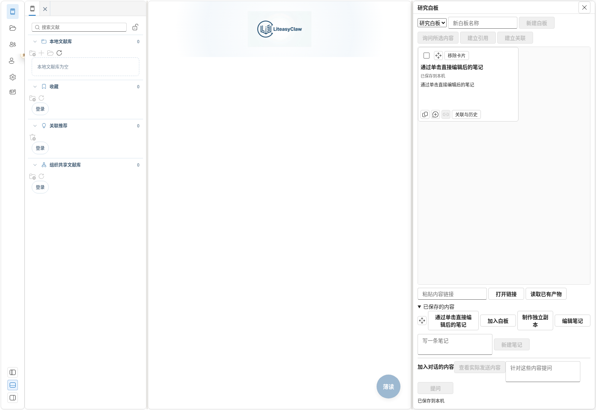
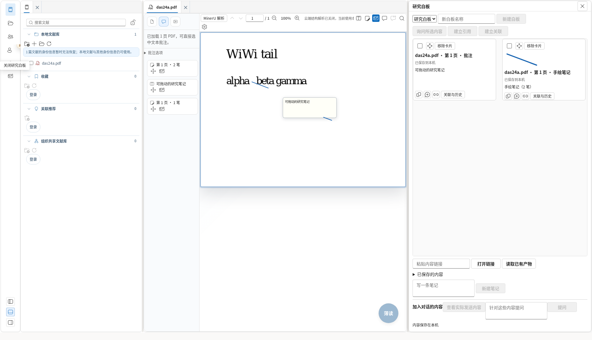
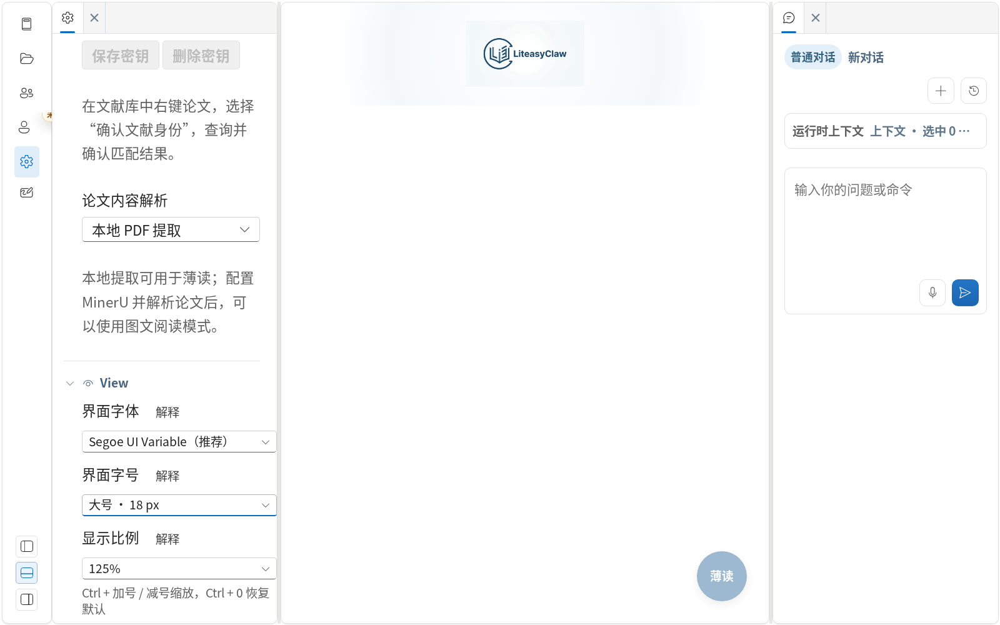

# 研究白板交互修复（2026-09-13）

分支：`feat/ai-native-lab`。

## 用户可见行为

1. 活动栏白板按钮可切换打开/关闭，PDF 工具栏按钮同步实际状态。详情面板不会挡住关闭按钮；拖放或保存期间关闭后，异步完成不会重新打开白板。
2. PDF 高亮、划线、侧栏批注、文本框和涂鸦均可拖入研究白板，已有笔记列表也提供拖动入口。备注与原文引句分别保存；图片、手绘图和 PDF 来源一并保留。重复拖入同一条未修改批注仅增加卡片，不重复创建内容或修订；批注修改后保存同一内容的新修订。
3. 同页连续笔划在 10 秒内、与上一笔边界相距不超过页面坐标的 2% 时归为一条手绘笔记。跨页、超时、远距离和已公开笔记不会自动合并。旧单笔数据仍可读取，擦除时仅移除命中的笔划，整组仅在最后一笔移除后删除。
4. 白板使用可调整宽度的右侧区域，关闭后恢复原右栏配置。PDF 不再为已隐藏的旧白板预留空列；整体缩放时主栏允许收缩，内容不再被白板覆盖。
5. PDF 文本框与白板笔记卡片单击即可编辑，四角和四边均可调整尺寸。PDF 手工调整后保留用户尺寸；白板正文和尺寸在重载后恢复。保存失败时保留编辑草稿；编辑摘录会生成带来源的笔记，原摘录与历史修订保持可读取。
6. PDF 高亮、划线的页内及侧栏批注编辑统一使用 Fluent 的文本框和保存/取消按钮。
7. `Ctrl + 加号/减号` 调整整体显示比例，`Ctrl + 0` 恢复 100%；兼容等号键、数字键盘及 macOS 的 Command 键。设置中的界面字号与显示比例独立保存；显示比例范围为 75–200%。原生调用 Webview zoom，浏览器使用 CSS zoom 并补偿视口高度。

## 数据与验证说明

- 卡片编辑与尺寸调整使用版本检查；内容、卡片引用、白板修订及所属关系原子提交。
- 图片按内容哈希去重，重复粘贴同一图片不会产生重复写入；制作独立副本也保留附件。
- 无原文的手绘和文本框使用 PDF 页码、区域与可用的文档哈希定位，空引句不伪装为 PDF 原文。
- 临时 `blob:` 地址且具有内容哈希的 PDF 使用稳定批注存储键，重载不依赖新的临时 URL。
- 浏览器回归使用实际 Chromium、IndexedDB 和仓库中的真实 PDF 测试文件；未调用模型服务，未向论坛发布批注。
- 本轮原生缩放验证覆盖控制器调用与 Tauri 权限配置检查；浏览器结果不替代 Windows/macOS 原生人工验收。

## 验证结果

- `npm run build`：通过，包括 TypeScript、共享 schema 生成及生产资源检查。
- 受影响的 12 个测试套件：122 项通过；随后新增的旧白板迁移失败关闭用例通过，PDF 新增套件最终为 15/15。
- Chromium：原对象工作台 3 条、新白板交互 1 条、PDF 批注 1 条、显示设置 2 条，共 7 条通过。PDF 场景明确等待实际文本层和 PNG 解码成功；200% 显示检查包含阅读区可用尺寸及面板边界。
- 全量 `npm test` 在修复过程中运行，记录为 2239 通过、2 失败、4 跳过。批注捕获的重复图片写入失败已修复并通过上述受影响套件；未修改的 `PaperResourceTab` 翻译确认用例在全量运行中超时，独立重跑该套件 10/10 通过。本记录不将这次全量运行描述为全绿。
- `git diff --check`：通过。

## 截图

