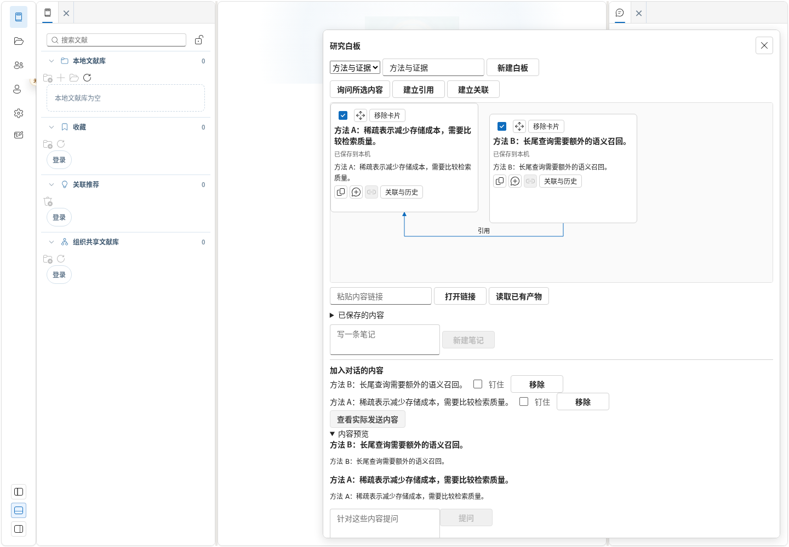
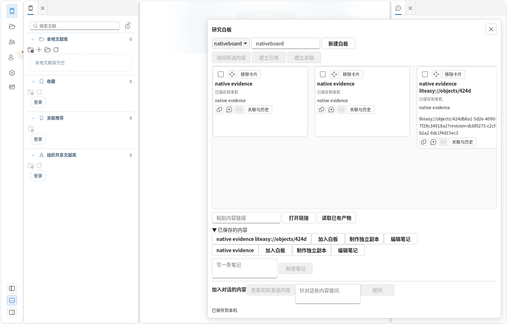
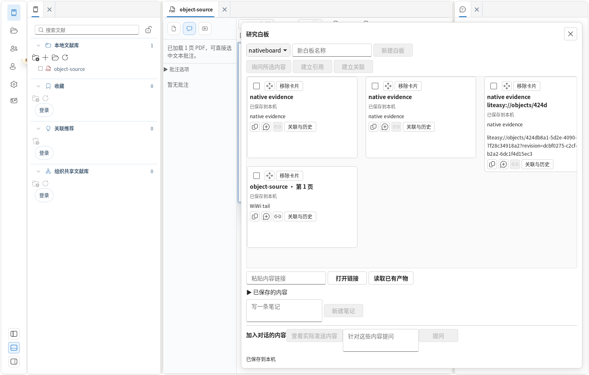

# Agent Native 对象工作台实现记录

日期：2026-09-13。分支：`feat/ai-native-lab`，起点 `13ce4743`。

按[规格第 10 节](../../specs/2026-09-13-agent-native-object-workbench-spec.md)实现 P0 本地对象闭环；没有实施 P1 下载工具、多步规划器、AI 布局审批、云同步或 bundle 往返。本文是代码与本机验证记录，不表示正式服务已上线验收。

## 实现

- `features/objects/`：六类严格对象、不可变 revision、PDF/文本/语义/表格锚点、稳定链接、来源适配、未知类型安全降级。创建身份与作者来自当前宿主会话；引用固定版本。
- `objectRepository`：对象、标题索引、关系、Placement、操作幂等记录原子提交；笔记 CAS 编辑、派生副本、生命周期、反向关系、白板迁移及运行记录。重复摆放共用正文，最后一次移除才解除成员关系。
- Tauri 使用 bundled SQLite、WAL/FULL、账号分区和真实主机会话检查；浏览器使用 IndexedDB。图片验证字节签名和 SHA-256，原生附件文件在对象提交前写入，失败不会报告保存成功。旧的未引用暂存文件可回收。
- `useObjectWorkbenchController` 统一编排 PDF/回答捕获、旧产物读取、迁移、来源跳转、拖放、上下文和新产物保存。白板跨论文；PDF 矩形从阅读器百分比转成 0–1 坐标。替换文件、重复引文和低精度旧锚点不会被当成精确命中。
- `ObjectWorkbench`、`ObjectSurface`：Fluent 控件与图标、键盘加入和移动、手动引用/关联、来源/历史/执行记录、Markdown 导出、独立副本和笔记编辑。折叠的内容库按需渲染，未变化的卡片复用读取与渲染结果。
- `Context Tray`：加入/移除/钉住、发送前预览、预算超限明确报错。临时选区在提交时物化；运行冻结引用、文本和 hash。设置解释仅读取帮助注册表白名单；诊断删除凭据与 URL 敏感部分，不隐式加入论文或整个工作区。
- 快捷问答使用同一 `AgentPublicApi` 的 session/run/取消/能力协商。对象上下文使用明确的只读问答路线，不开放对象文本中的工具指令。回答完成后，用户显式保存为带来源和 run/snapshot 的产物。
- Agent 状态与对话历史均按账号分区，切换账号撤销旧运行、清空旧视图并阻止迟到写入。旧无归属对话仅迁入本机 local 工作区，不自动归给登录账号。
- 旧白板迁移同时写对象、布局、视觉边、附件和迁移日志；保留旧快照键与校验值，不双写旧白板。失败时可只读打开原快照。旧产物保留原有打开路径及专业格式，适配正文和来源，不向旧 API 写入 envelope。
- `liteasy://objects/…` 和旧产物链接均经过当前账号解析；插件仅增加读取当前深链接权限。链接不授予访问权，也不承诺跨设备可用。

共享 schema 位于 `products/liteasy/packages/shared/`，通过 `npm run schema:objects` 生成，桌面构建包含生成步骤。

## 验证

命令中的相对路径以仓库根目录为起点。桌面使用 Node 22.23.2；dev-cloud 使用已有原生依赖对应的 Node 20.12.2。

| 验证 | 实际结果 |
| --- | --- |
| `cd products/liteasy/apps/desktop && npm test` | 2,210 通过、3 失败、4 跳过；331 个文件。3 个失败均为原始提交可复现的 PDF 批注用例，见下文 |
| 桌面受影响 8 套件 | 49 项通过，覆盖公共 Agent、取消、捕获到产物、AppShell、消息与快捷问答 |
| 账号历史补充回归 4 套件 | 24 项通过，覆盖对话账号切换与迟到写入、对象仓库和 AppShell |
| `cd products/liteasy/apps/desktop && npm run build` | TypeScript、Vite 和生产产物检查通过；保留既有大 chunk 提示 |
| `cd products/liteasy/apps/desktop/src-tauri && cargo test` | 79 项通过，包含对象事务冲突、不可变版本、数据库容量不足回滚、子进程在未提交事务中直接退出后的 WAL 恢复与完整性检查 |
| `cd products/liteasy/services/api && npm test` | 421 通过、3 跳过；没有修改旧产物 API 格式 |
| `cd development/dev-cloud && npm test` | 339 通过、1 个基线失败；原始提交单独运行也失败 |

桌面 3 个基线失败位于 `PdfReaderPublication.test.tsx`：`creates 高亮 privately by default`、`creates 划线 privately by default`、`gives same-excerpt publication checkboxes unique names and announces each status`。原始提交和本分支均找不到测试所期待的批注按钮。没有以修改无关批注行为掩盖失败。

dev-cloud 基线失败为 `server.test.mjs:4061` 的 `migrates provider and arXiv candidate keys to DOI without duplicating history`：原始提交同样得到 `undefined` 而不是预期候选记录。

一次前端全量运行中 `LibraryPaneFileManagement.test.tsx` 的分类编辑用例失败；本分支与原始提交分别单独复测均通过，最后一次全量也通过。

浏览器命令：

```bash
cd products/liteasy/apps/desktop
PLAYWRIGHT_BASE_URL=http://127.0.0.1:1435 npx playwright test objectWorkbench.browser.spec.ts
```

三条场景全部通过：白板恢复与上下文预览、真实 PDF 选区拖放、已保存回答的鼠标拖放。使用真实 Chromium、IndexedDB 和 `development/test-data/pdf-selection/glyph-boundaries.pdf`。离线研究笔记和已保存回答属于明确的测试数据；没有用模拟回答宣称真实模型调用已经验收。PDF 测试读取真实 PDF 字节并通过鼠标划选/拖放。

## 性能基线

[原始测量](browser-performance.json)。机器为 AMD Ryzen 9 7940HX，32 个逻辑 CPU、23 GiB 内存，Linux，Chromium 151，Vite 开发模式。每项预热一次，随后取 20 次样本；不含模型或网络时间。

| 场景 | p50 | p95 | 初始目标 |
| --- | ---: | ---: | ---: |
| 10,000 对象列表，100 条一页 | 34.7 ms | 45.1 ms | ≤300 ms |
| 10,000 对象标题检索，唯一命中 | 65.6 ms | 76.1 ms | ≤300 ms |
| 100 张普通卡片，引用拖放到新卡片绘制 | 82.3 ms | 108.8 ms | ≤150 ms |

拖放性能脚本使用浏览器 DOM drop 事件调用真实处理器、等待已提交卡片和后续绘制；它不是原生 WebView 性能结论。脚本位于 `products/liteasy/apps/desktop/scripts/profile-object-workbench.mjs`，运行在独立 Chromium 配置中，不上传数据。大图与复杂可视化的性能仍需另外测量。

## 截图与原生验证







原生实例使用独立标识 `com.liteasy.objectlab.validation` 与 `/tmp` 下的 XDG 数据目录，运行实际 Rust 宿主和 WebKitGTK；通过 X11 鼠标/键盘事件操作。已验证创建白板、键盘创建笔记、卡片 reference 拖放、Ctrl+V 剪贴板降级，以及退出并重新启动后恢复三张卡片和原引用。原生「查看来源」也已打开对应源文献。实际导入稳定 PDF 后，鼠标划选 `WiWi tail` 并拖入原生白板成功，SQLite 保存了真实文件 SHA-256、页码、quote、字符范围和 0–1 矩形。直接读取验证实例 SQLite 确认：两张引用卡片共用同一对象；纯文本粘贴创建 `origin: external` 的笔记，正文保留固定 revision 的来源链接。

## 仍需验收的边界

- 真实模型配置下，跨两篇论文与回答的完整生成闭环、取消，以及不同登录账号的端到端人工验收。
- 原生回答摘录的鼠标拖放复测；该场景已通过 Chromium。
- Windows/macOS 原生拖放、深链接注册和剪贴板行为；Linux 的结果不能替代这些平台。
- 电源故障、真实文件系统磁盘满与附件写入失败的整机测试。已有 SQLite 容量限制、异常存储适配器与进程中断测试，不能等同于所有设备故障。
- 既有薄读、图表等专业内容继续通过旧 renderer 打开；新通用视图提供正文与来源适配，不宣称已实现所有专业视图间的等价切换。

因此，本记录不将规格第 11 节全部 P0 人工退出条件标记为通过，也不宣称云同步或生产服务已验收。
