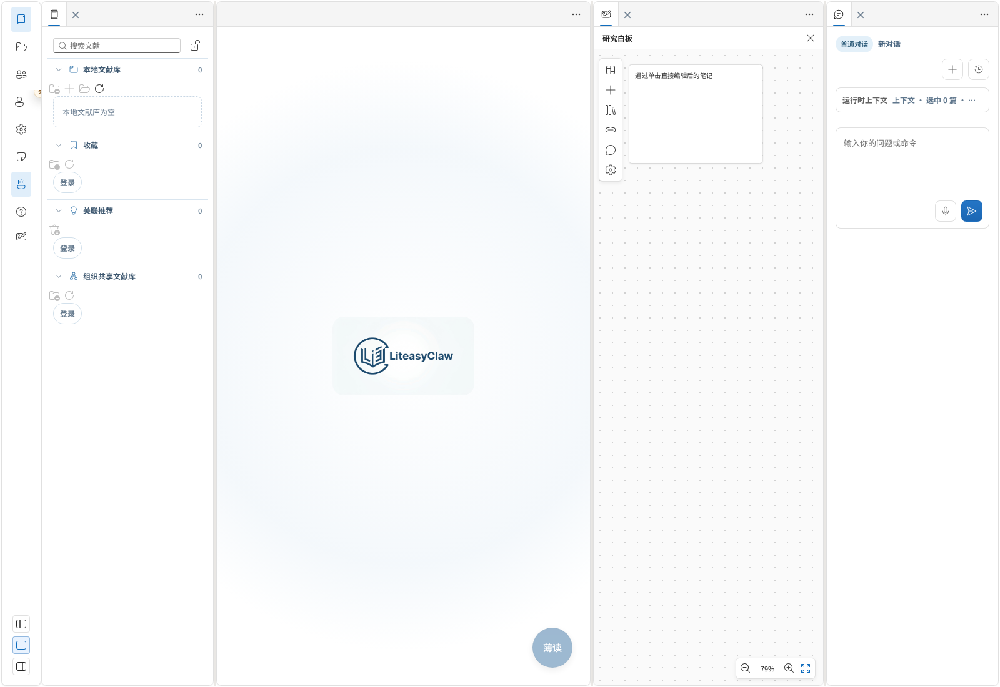
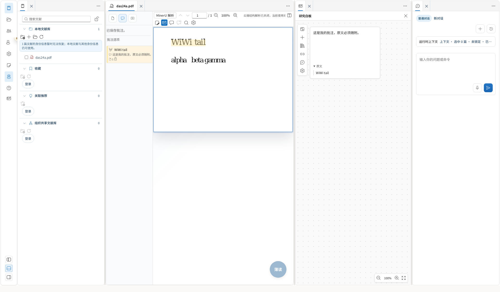
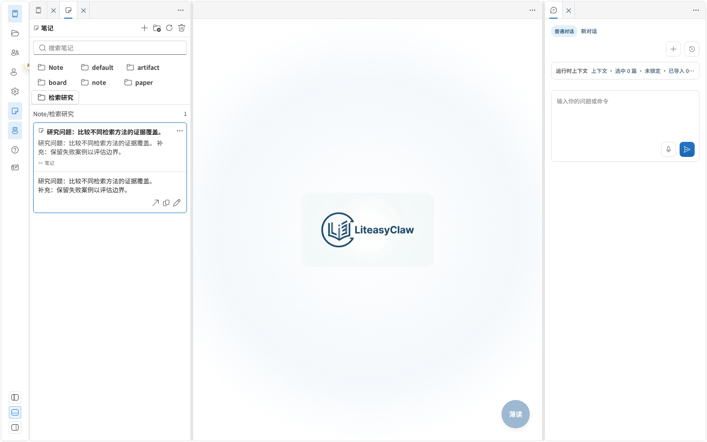
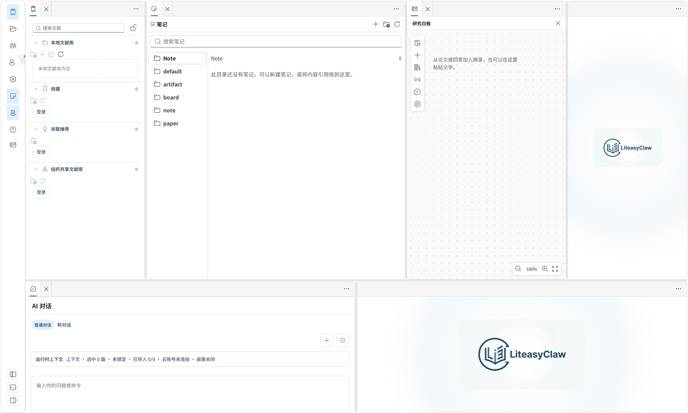
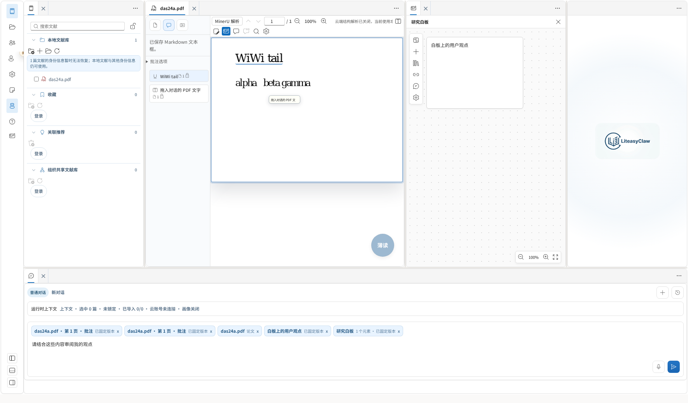

# Notes、拖入上下文与可拆分工作区

日期：2026-09-14。分支：`feat/ai-native-lab`。

## 用户可见变化

- 白板卡片可直接拖动；同板拖动更新原卡的位置，拖向其他面板保留对象引用。八个边角支持直接缩放，悬停或键盘聚焦时显示，最小尺寸为 120×80；缩放后的指针位移按画布与应用比例换算。
- PDF 批注条目、页面高亮/划线和闲置文本框可以直接拖到白板。卡片默认展示原文，点击原文折叠按钮可收起，编辑派生笔记后仍能读取固定来源。
- 左侧新增 Notes。默认目录 `default/paper` 汇总 PDF 用户文字，`default/board` 汇总白板用户笔记，`default/note` 管理其他用户笔记，`default/artifact` 汇总薄读批注及用户主动收藏的生成页。纯原文高亮和无用户文字的系统产物不会自动算成用户笔记。
- Notes 可以新建嵌套目录、复制引用、拖入引用和移除当前目录引用。目录不保存第二份正文；用户笔记视图跟随最新版本，生成页固定收藏时的版本，原生批注由原来的编辑界面修改。删除目录引用不删除源内容。薄读页新增“将当前页收藏到 Notes”图标，原产物及多模态内容保持原样。
- 批注、PDF 文本框、论文文件/标签、白板元素及整个白板标签都可拖入 Agent 对话。输入框显示可移除的上下文条目；拖入整板时固定成员与版本，之后增加卡片不会改变已加入的上下文。
- 白板成为独立标签页，可与 Agent 同时显示。底栏可重新打开、接收会话与工具；容器右上角菜单支持关闭及向左右新增独立栏，栏宽、排列、标签位置可以持久化。左侧活动栏工具可直接拖进目标栏。
- 移动或关闭 Agent 面板不会卸载运行中的会话；重新打开能继续查看输出。底栏采用紧凑排列，默认高度下输入与发送入口可见。关闭主栏只关闭主栏中的页面，其他栏的文档继续保留。

## 实现边界

Notes 通过独立目录仓库保存引用和文件夹，复用有账号范围的 ObjectStorage 事务、提交订阅及现有 PDF/产物读取接口。默认目录和用户目录共用名称唯一性、并发及引用检查。参见 [Notes 模块接口与版本语义](../../../../products/liteasy/apps/desktop/src/app/features/notes/README.md)。本轮实现个人组织视图；[统一资源文件系统提案](../../specs/2026-09-14-unified-resource-filesystem-spec.md) 的完整 provider/授权/跨服务操作协议仍为后续工作。

拖拽票据在实际放下时捕获内容，拖拽开始不再强制打开白板。`ObjectWorkbenchPort.receiveContextDrop` 验证账号范围、固定对象和白板成员；`FrontendAgentClient` 向同一公共 Agent 服务提交 `contextRefs`，由已有 ContextSnapshot 解析服务读取实际正文。批注同时携带用户评论与来源原文；组合对象和论文时，显式附加及用户已锁定的论文都保留。正文不可用或超出读取预算时明确返回错误，不把标题冒充全文。

本轮对象上下文接通提问和审阅。对象上下文与旧命令/产物生成入口的组合尚未开放，界面会保留输入并提示支持范围；这不代表完整 AI 变更集、自动修改或 VFS 计划已实现。

Dock v2 在原有四个基础区域上增加持久化栏顺序、动态区域与宽度，兼容读取 v1 布局。Agent 通过稳定 Portal 宿主显示在当前栏，切换位置只改变 DOM 挂载位置；账号切换仍销毁旧主体的实例。布局拖放与资源上下文拖放按 MIME 和实际目标区分。

桌面配置设为 `dragDropEnabled: false`。Tauri 官方说明 Windows 的前端 HTML5 拖放需要关闭宿主原生处理；此前仅在 Chromium 验证拖源无法发现这一宿主配置缺口。[Tauri 配置说明](https://v2.tauri.app/reference/config/)

## 验证

- `npm run build` 通过，包括 TypeScript、共享 schema 与生产资源检查。
- 冻结最终源码后运行 `npm test`：338 个套件通过、2 个套件跳过；2283 项测试通过、4 项跳过，没有失败。
- 最终受影响的 7 个 Notes/上下文/Agent 套件共 58 项通过；另有白板/PDF 37 项和 Dock/导航/AppShell 39 项专项验证通过。
- 15 条 Chromium 场景通过：白板 5 条、PDF 3 条、Dock/帮助 5 条、Notes 1 条、混合资源拖入对话 1 条。通过实际鼠标拖动、重启持久化和可见性断言验证交互；底栏发送入口在默认高度下可见。
- `git diff --check`、本地文档链接及截图路径检查通过。

本轮使用实际浏览器事件、IndexedDB 和仓库 PDF 测试文件检查界面；公共 Agent 集成测试使用明确的测试执行器检查上下文正文、版本、锁定论文以及运行生命周期，没有用预制回答作为生产业务结果。开发中的一次全量运行仍缓存旧来源投影实现，新增的来源保留用例检出覆盖问题；最终修复后已按冻结源码完整重跑，以上为最终结果。

当前 Linux 环境没有完成 Windows 安装包的原生鼠标拖放验收；已核对官方配置并加入宿主配置回归检查。

## 截图

