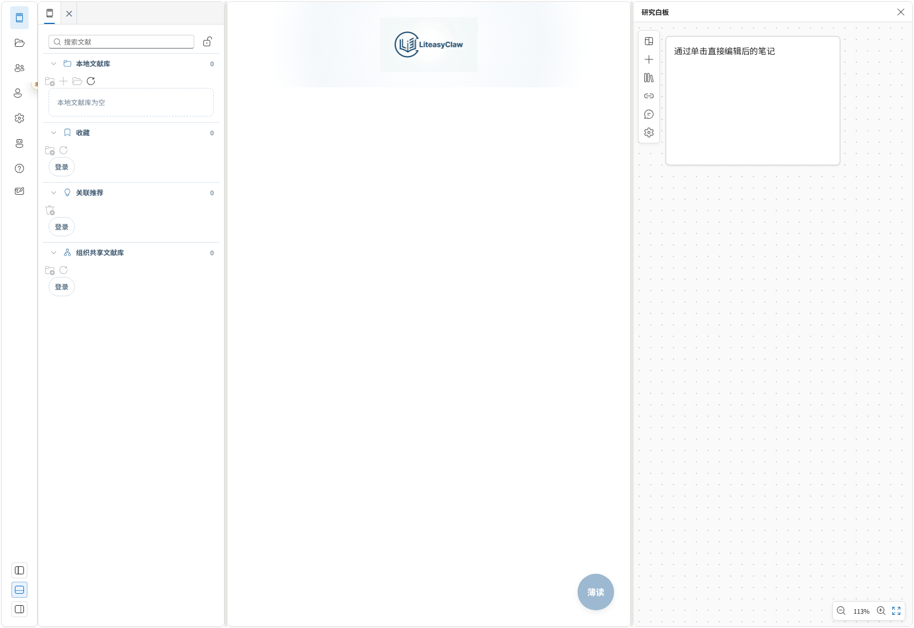
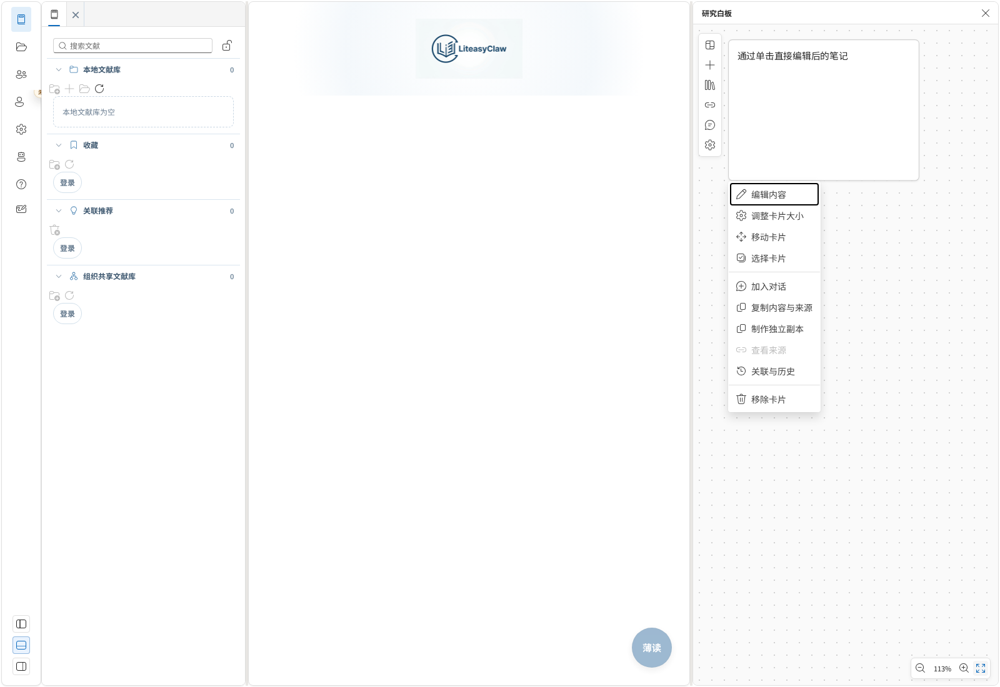
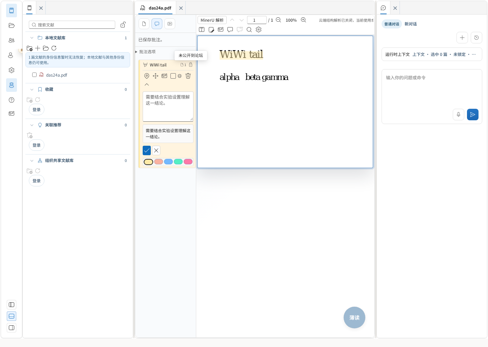
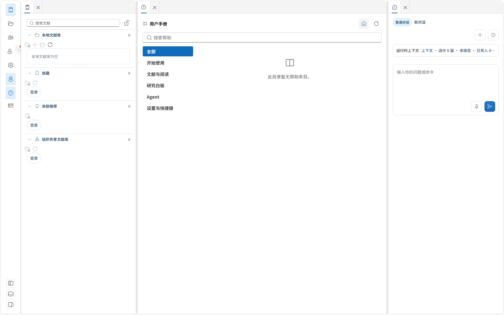

# 白板精简、帮助与导航改进

日期：2026-09-14。分支：`feat/ai-native-lab`。本轮保留此前未提交的交互修复。

## 实现范围

1. PDF 注释条目保留正文/备注摘要，用类型、页码、隐私和发布状态图标代替长标签。点击条目后展开操作，悬浮提示和读屏名称保留完整含义；失败信息仍可读取。
2. 白板卡片默认仅显示内容。左键编辑，右键或 `Shift+F10` 打开菜单；选择、移动、尺寸调整、复制、加入对话、来源、关联历史及移除都保留。纯手绘卡片不再重复显示自动生成的笔数标题。
3. 白板采用点阵画布和图标工具栏；新建、内容库、连接、对话、画布设置按点击展开，支持画布独立缩放及适配全部内容。继续使用 Fluent 主题，不强制深色。
4. 左侧新增独立 Agent 入口。关闭标签后可重新打开；被白板遮住、移动到其他区域或收起侧栏时，入口会激活并显示对应面板。
5. 左侧“帮助”及 F1 打开独立用户手册标签页，支持目录、搜索、条目、加载/空/失败状态与重试。本轮内置提供方仅有目录，无虚构手册正文；帮助界面隐藏不相关的薄读悬浮按钮。

## 帮助模块边界

`HelpPanel` 只接受视图模型，内容通过 `HelpContentProvider` 注入；目录聚合、条目引用与内容提供方分离。`useHelpController` 管理查询、取消及过期结果，`HelpPort` / `useHelp()` 为其他功能提供上下文帮助入口。AppShell 组合模块，导航 controller 负责显示面板。

实现接口及扩展方式见 [帮助模块说明](../../../../products/liteasy/apps/desktop/src/app/features/help/README.md)。后续添加本地或远端内容不需要重写帮助 UI。

## 文件系统提案

[统一资源文件系统 spec](../../specs/2026-09-14-unified-resource-filesystem-spec.md) 已独立写成 Draft。建议以应用层命名空间和 Provider 门面统一资源操作，保留稳定身份、版本及现有专业存储。此轮未实现 VFS、未引入 OpenViking 服务、未迁移用户文件。

## 验证

- 受影响的 12 个单测套件：136 项通过，包括帮助提供方、异步读取、F1、Agent 重开、Dock 布局、PDF 发布流程、白板右键/编辑/缩放。
- Chromium：白板 4 条、PDF 2 条、帮助及 Agent 2 条，共 8 条通过；使用真实浏览器、IndexedDB 与仓库 PDF 测试文件，不调用模型或发布测试批注。
- `npm run build` 通过，包括 TypeScript、共享 schema 和生产资源检查。
- `git diff --check` 通过。

全量 `npm test` 本次结果为 2253 项通过、4 项跳过、1 项失败。唯一失败是既有的 `LibraryPaneFileManagement.test.tsx` 文献分类编辑用例：Tabster 短暂将已打开的对话框标为 `aria-hidden`，导致测试无法按可访问角色找到输入框。该失败已在隔离检出的未修改 HEAD `07604e31` 上复现（同一检出首次通过、再次运行失败）；本轮未修改该测试或文献分类业务代码。

本轮浏览器验证不替代 Windows/macOS 原生交互验收。PDF 测试文献和帮助适配器测试条目均为明确的测试数据，生产内置帮助目录不提供这些示例正文。

## 截图

