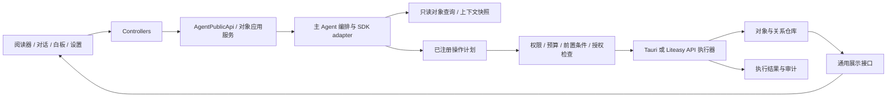

# Liteasy Agent Native 对象工作台：产品与实施规格

日期：2026-09-13  
状态：提案，可用于下一步拆解开发；不表示功能已实现或生产验收通过。  
范围：Liteasy 桌面、Liteasy API 与本地开发适配器。Intuecho 仅通过现有公开契约提供文献身份等能力。

## 1. 产品判断

下一步应将 Liteasy 建设为「用户与 Agent 共同操作、有来源的研究对象工作台」。用户阅读、摘录、提问、组织和创作留下的内容，应成为可以持续使用的对象；Agent 能理解这些对象之间的关系，在用户授权的范围内执行操作，并把结果交还给同一个工作空间。

这里的 ontology 是一套共享语义：**有什么对象、如何定位其中一部分、对象之间是什么关系、哪些内容可以进入上下文、谁可以对它执行什么操作、结果如何被验证和追溯。** 第一阶段采用小型类型系统、JSON Schema 和关系表；不要求用户学习 ontology，也不以构建全学科知识图谱为前提。

建议明确区分三层：

| 层 | 解决的问题 | 例子 |
| --- | --- | --- |
| 产品对象层 | 用户拥有什么、引用什么、如何组合 | 文献文件、摘录、回答、笔记、白板、产物 |
| 研究语义层 | 内容表达什么、证据支持什么 | 概念、问题、论断、方法、数据集、支持/反驳关系 |
| 执行层 | 谁在什么条件下完成什么操作 | 上下文快照、能力、操作计划、授权、执行记录 |

三层通过稳定引用连接。论文文件不等于论文的学术身份；AI 回答不等于证据；白板中的卡片不等于内容副本；用户采纳一个判断不等于该判断已得到事实验证。

**首个交付闭环：** 从论文摘录和回答摘录出发，拖入同一张白板，手动或由 AI 建议建立关系，选中这些对象提问，得到能够保存、引用、重新打开并回到来源的产物。

## 2. 现有仓库基线与缺口

以下为本次工作区代码静态核查，不是运行验收。工作区已有 PDF/界面未提交改动，实施时必须保留并与其接线，不以旧版本覆盖。

| 已有基础及代码入口 | 本次核查看到的边界 | 下一步处理 |
| --- | --- | --- |
| [AgentPublicApi](../../../products/liteasy/apps/desktop/src/app/features/agent-api/agentApi.types.ts) | 已有 session、run、附件、幂等、确认、取消契约；附件 source 主要为 paper/artifact/selection | 增加受能力协商保护的通用对象上下文入口，复用 run 生命周期 |
| [SDK manager](../../../products/liteasy/apps/desktop/src/app/controllers/agent/createOpenAIAgentsSdkManager.ts) | 已调用 Agent/Runner；`ExplicitRouteModel` 执行明确产品路由 | 保留确定性路线；后续增加受约束规划器，不将当前接入描述为任意目标自主规划 |
| [PDF quick ask controller](../../../products/liteasy/apps/desktop/src/app/controllers/usePdfQuickAskController.ts) | 当前直接调用模型网关 | 迁到公共 Agent 服务，使快捷问答也获得上下文、取消与来源记录 |
| [上下文类型](../../../products/liteasy/apps/desktop/src/app/features/agent-runtime/agentRuntime.types.ts)、[选中文献快照](../../../products/liteasy/apps/desktop/src/app/features/selection/selection.types.ts) | 主要表达工作区、选中文献、设置、账号等运行状态 | 在其上增加片段、白板选择、设置解释和诊断对象，不破坏已有文献锁定语义 |
| [产物类型](../../../products/liteasy/apps/desktop/src/app/features/artifacts/artifact.types.ts)、[正式产物仓库](../../../products/liteasy/services/api/src/agentArtifactRepository.mjs) | 已有 `liteasy.agent-artifact/v1`、来源论文和 run；正式仓库校验固定版本与类型 | 增量增加对象 envelope 和适配器；不能直接向旧端点发送新格式 |
| [可视化 schema](../../../products/liteasy/apps/desktop/src/app/features/visualization/visualizationArtifact.types.ts)、[renderer registry](../../../products/liteasy/apps/desktop/src/app/features/visualization/visualizationRendererRegistry.ts) | 已有语义对象、证据绑定和模态 renderer | 复用专业内容 schema，在外部统一引用、选择、展示与操作契约 |
| [PDF 白板模型](../../../products/liteasy/apps/desktop/src/app/features/pdf/pdf-whiteboard/pdfWhiteboard.types.ts)、[存储](../../../products/liteasy/apps/desktop/src/app/features/pdf/pdf-whiteboard/pdfWhiteboardStorage.ts) | 已有 Markdown、图片、文献/扩展节点和连线；文档绑定 paperId；本地存储键含账号、paperId 与路径哈希，写入异常当前被吞掉 | 内容对象与白板布局分离；增加跨论文白板和显式保存失败状态 |
| [action registry](../../../products/liteasy/apps/desktop/src/app/features/skills/actionRegistry.ts)、[资源范围](../../../products/liteasy/apps/desktop/src/app/features/resources/resourceScope.types.ts) | 已有设置、布局、产物等操作及资源归属 | 扩充同一注册表与执行边界，避免再建一套 Agent 专属业务 API |
| [文献身份契约](../../../products/liteasy/apps/desktop/src/app/features/paper-identity/literature.types.ts) | 区分 confirmed、legacy_unverified、候选别名及版本关系 | 保留身份验证语义；新对象 ID 不能替代 literatureId 或将猜测升级为已确认 |

本规格延续 [公共 Agent 架构](../../agent-dev/2026-07-19-liteasy-agent-public-api-and-modular-architecture.md) 与 [产物库设计](2026-08-09-artifact-library-design.md)，新增跨功能的对象契约，不重做既有阅读器、薄读、产物渲染器或 Fluent 2 布局。

## 3. 将六个设想完善为产品能力

| 原始设想 | 完整定义 | 用户可感知的结果 |
| --- | --- | --- |
| 通用显示支持页面 | Object Surface：统一对象工具栏、来源、关系、历史与错误状态；正文按类型注册 renderer | 任何保存的内容都能打开、预览、引用、加入对话，并有失效时的降级显示 |
| 通用 AI 产物存储格式 | Object Envelope + 类型化内容 + 资源附件 + 来源/生成记录 | 产物可以脱离原对话存活，切换展示方式、再加工和导出后仍保留来源 |
| 通用链接 | 稳定深链接 + 有类型的关系 + 反向引用；用户整理和 AI 建议均有作者与状态 | 不仅知道「链接了什么」，还知道「为什么有关、谁作出的判断」 |
| 通用上下文加入 | Context Tray：统一加入/移除/钉住；提交时固定引用和版本 | 从正文、回答、设置或错误处直接提问，能看见实际发送了什么 |
| 通用数据对象 | Selection → Fragment → ObjectRef；统一拖拽与剪贴板协议 | 摘录跨阅读器、聊天、白板流动，出处和引用连续保留 |
| 通用操作 | 同一 capability/action registry，由主 Agent 服务编排，执行端校验权限和前置条件 | AI 能下载、归档、组织和调整设置，用户能检查变更、取消任务和撤销可逆操作 |

产品常驻文案使用「摘录」「关联」「加入对话」「查看来源」「修改记录」「执行记录」。ontology、SDK、schema 和模型推理细节只进入开发文档或诊断详情。

## 4. 最小统一模型

### 4.1 对象、引用、关系与运行

采用以下语义原语；不是要求每个原语都建一个同名 UI 页面。

| 原语 | 职责 | 首版约束 |
| --- | --- | --- |
| Object | 有身份、版本、归属和内容的持久资源 | 必须可序列化、可查询、可导出；内容按 kind 验证 |
| ObjectRef | 指向对象的某个版本与可选子位置 | ID 不使用标题、绝对路径或内容哈希代替 |
| Fragment / Anchor | 从源对象选中的内容与定位信息 | 保存原文快照和源版本；定位失败不猜测成功 |
| Relation | 对两个对象或片段之间关系的陈述 | 有 predicate、作者、证据、审核状态与作用域 |
| Placement | 对象在白板或复合页面中的一次摆放 | 自有 ID；位置、大小、折叠状态与内容分离 |
| ContextSnapshot | 某次运行实际使用的对象、版本和提取内容清单 | 运行开始后不可被页面切换改写 |
| Capability / Operation | 可发现的能力与一次具体调用 | schema、权限、前置条件、幂等、结果、补偿语义完整 |
| Run | 围绕用户目标的一次执行 | 关联上下文、操作和产物；审计记录可见结果与决策摘要，不保存私有思维链 |

第一批 Object kind：`source.document`、`content.fragment`、`content.note`、`conversation.message`、`artifact.document`、`workspace.board`。第二批增加 `resource.font`、`research.question`、`research.claim`；研究方法、数据集等领域类型在真实场景出现后扩展。

设置项通过 `settingRef`、错误通过 `diagnosticRef` 提供**临时可寻址资源**，遵循相同读取/上下文接口，但不自动变成永久收藏。只有用户保存诊断或说明时才创建持久对象。无需把每个按钮、DOM 元素和瞬态状态存进知识库。

### 4.2 核心契约草图

以下用于冻结语义；落地时必须补齐可执行 JSON Schema 与各 kind 的 discriminated union，不能把任意 payload 当作通过验证。

```ts
type ObjectRef = {
  objectId: string;
  revision: string;
  selectorId?: string;
};

type ObjectEnvelope = {
  schemaVersion: "liteasy.object/v1";
  objectId: string;
  revision: string;
  kind: string;
  title: string;
  scopeId: string;
  createdAt: string;
  updatedAt: string;
  createdBy: { type: "user" | "agent" | "import"; id: string };
  content: { schema: string; payload: unknown };
  assets: Array<{
    assetId: string;
    mediaType: string;
    byteLength: number;
    sha256: string;
  }>;
  provenance: {
    sourceRefs: ObjectRef[];
    runId?: string;
    contextSnapshotId?: string;
    derivedFrom?: ObjectRef[];
  };
  lifecycle: "active" | "archived" | "tombstoned";
};
```

`scopeId` 指向权威权限记录，本身不授予权限；`createdBy`、revision 和授权主体由可信宿主/服务填写，不接受模型或剪贴板自证。桌面类型可放在无 React 依赖的 feature 契约中；跨端稳定 JSON Schema 放在 `products/liteasy/packages/shared/`，不把运行数据写进该目录。

身份与版本规则：

- 同一内容的重命名、移动保持 objectId；编辑内容产生新 revision。revision 是仓库分配的不透明并发令牌。
- 同一论文可以有多个 PDF 文件对象；文件对象关联既有 literatureId。不同文件 hash 不自动意味着不同文献，同一 DOI 也不意味着 PDF 字节相同。
- 选区是临时交互状态；执行「收藏摘录」「拖到白板」「加入并提交对话」时才物化 fragment。单纯划选不产生收藏垃圾。
- AI 回答使用稳定 messageId 和已提交版本。选择流式正文时先固定当前文本快照，标记 partial；不得伪造最终回答或成功 run。
- 引用默认固定 revision；需要跟随最新内容的界面另存 `tracking: latest` 视图配置。加入运行上下文时必须解析成固定引用。
- 用户编辑摘录，创建派生笔记并保留原摘录；AI 重写回答或产物，创建新版本/分支，不悄悄修改原引文。
- 关闭标签、移除 Placement、取消收藏、归档、删除内容是不同操作。删除以 tombstone 保持引用可解释；明确擦除内容时按保留策略清理快照/附件，不能以追溯为由永久保留正文。

### 4.3 片段定位

PDF Anchor 同时保存文档版本/hash、从 1 开始的 PDF 页索引、显示页码（可选）、文本 quote 的 exact/prefix/suffix、提取器与规范化版本、字符范围（可用时）、归一化矩形（可用时）。跨页片段使用有序 anchor 数组；矩形坐标明确为去旋转页面的左上角原点、0–1 范围。

回答/Markdown Anchor 保存 message 或 object 的 revision、稳定 blockId、文本 quote 和块内字符范围；图表保存 semanticObjectId；表格使用稳定行/列 ID，不能仅保存视觉第几行。

定位依次尝试同版本稳定标识、字符范围与 quote 核对、限定区域 quote 匹配。新版本上的匹配仅为候选映射，不重写旧锚点；重复命中或无法唯一定位时返回 `ambiguous` / `unresolved`。界面保留摘录并提示来源状态，允许用户手动重新关联。

文本引用与位置选择器借鉴 [W3C Web Annotation](https://www.w3.org/TR/annotation-model/#selectors)；其位置选择器对源内容变化较敏感，因此本方案同时固定源版本并保存引用文本。此处是设计借鉴，不宣称首版完整兼容该标准。

### 4.4 关系的语义

首批 predicate 及方向：

| predicate | from → to | 约束 |
| --- | --- | --- |
| `references` | 笔记/回答/产物 → 被引用内容 | 引用存在不代表内容成立 |
| `derived_from` | 派生结果 → 原材料 | 由真实生成/编辑操作登记；不能由模型自由伪造系统来源记录 |
| `related_to` | 对象 ↔ 对象 | 对称关系；用规范化端点顺序去重 |
| `supports` / `contradicts` | 证据/论断 → 目标论断 | 必须附证据或论证理由；目标类型在 P1 启用 |
| `member_of` | 对象 → 集合/白板 | 由成员操作产生；删除一次摆放不必删除最后一次之外的成员关系 |

关系至少保存 relationId、revision、from/to ObjectRef、predicate、scopeId、assertedBy、createdAt、basis、reviewStatus。`reviewStatus` 为 proposed/accepted/rejected；basis 区分用户判断、模型推断、源文明确表述、确定性操作记录。用户采纳和证据充分程度分别保存；不显示未经校准的「93% 正确率」。

手动连线可立即生效。AI 批量整理先形成 relation/layout 变更集，显示原因并允许逐条或整批采纳；用户可预先授权指定白板内的自动归类和摆放，但该授权不包含删除原文、确认学术身份或跨范围共享。

视觉连线 `PlacementEdge` 与语义关系分离：前者用于走线/顺序，后者进入知识关系；移动卡片不改变 supports。反向引用由同一关系查询生成，不双写两条边。自定义关系初期仅支持带命名空间和说明的标签，不允许用户自定义可执行推理规则。

来源链的实体、活动和作者分离借鉴 [W3C PROV-O](https://www.w3.org/TR/prov-o/#description-starting-point-terms)；首版用关系表与 run 记录实现，不要求 RDF 数据库。

## 5. 通用显示与组合

### 5.1 Object Surface

提供 `open(ref, presentation)`、`preview(ref)`、`select(ref)`、`getActions(ref)`、`toContext(ref, purpose)` 五个统一入口。presentation 包括 full/card/inline；同一个对象可以在中心标签页、白板卡片或回答引用中显示。

通用外壳包含标题、类型、来源、保存状态与「加入对话 / 复制链接 / 查看关联 / 查看历史」菜单。正文委托 `kind + content.schema + viewId` 对应的受信任 renderer。现有 PDF 阅读器、薄读及可视化 renderer 保持专业交互能力，接入通用对象接口。

展示状态必须区分 loading、ready、partial、unsupported、missing、forbidden、error。未知类型降级为元数据、可用文本和显式导出入口；不执行对象内容携带的任意 HTML/JS，不根据 payload 自动安装 renderer。Markdown 继续复用净化链路；主 UI 中生成内容不能直接调用 Tauri。

切换「表格/图谱/大纲」只有在语义可等价映射时属于视图切换；需要 AI 概括或转换时是生成操作，产生派生对象。生成 UI 必须绑定已注册组件和操作，不赋予模型任意组件代码执行权。

深链接建议采用 `liteasy://objects/{id}?revision={revision}&selector={selectorId}`；未指定 revision 表示打开最新可见版本，复制证据链接默认指定 revision。保留 `liteasy://agent-artifacts/{id}` 等旧路由适配。对象链接不包含本机绝对路径、凭据或签名下载地址，也不是访问授权；打开时重新检查当前账号权限。跨设备尚未同步的对象提示本机资源不可用，不能声称链接天然可分享。

### 5.2 语义拖拽与剪贴板

新增版本化协议 `application/x-liteasy-object-transfer+json`，提供 `schemaVersion`、`transferId`、refs、可选便携文本快照和请求模式 reference/copy。传输格式不携带写入权限或可执行操作。

同时输出 `text/plain`，按宿主能力附加安全 HTML/图片。不能假设所有浏览器/WebView 的系统剪贴板都保留自定义 MIME；P0 必须验证真实 Tauri 拖拽路径，并在不支持结构化剪贴板时退化成有来源链接的纯文本。纯文本粘贴只能声称新笔记或未验证导入，不能假装恢复了原对象身份。

默认行为：

| 用户动作 | 语义 |
| --- | --- |
| 应用内将已保存摘录拖入白板 | 新建 Placement，引用原对象；不复制正文、不删除来源 |
| 将临时 PDF/回答选区拖入白板 | 在同一提交中保存 fragment 与 Placement；保存失败不显示已持久化 |
| 将白板卡片拖入对话 | 加入 ObjectRef；不把整个白板或全部论文隐式发送 |
| 复制/粘贴对象 | 默认复用引用；菜单「制作独立副本」创建新对象并记 derived_from |
| 外部纯文本/图片粘入白板 | 新建 note/image 内容与托管附件，来源标记为外部粘贴 |
| 编辑引用卡片中的内容 | 明确选择编辑共享笔记或制作副本；原文摘录默认只读 |

拖拽过程中保持选择文本与拖动手柄分离，避免普通划词被劫持。提供键盘「加入白板/加入对话」替代操作；工具栏有可访问名称、Tooltip 和焦点恢复。重复使用同一 transferId 的重试只提交一次，主动再拖一次使用新 transferId，允许同对象出现多个 Placement。

白板范围从 paperId 扩展为独立 boardId，原有「论文右侧白板」成为关联该论文的一张默认白板。Placement 保存 ref、position、size、viewId、显示选项；关系可以跨白板查询，布局仅属于当前白板。AI 调整白板形成布局 patch，用户手工移动过的节点需要 revision 冲突检查，不能被迟到结果覆盖。

## 6. 通用产物格式与持久化

### 6.1 统一 envelope，保留专业内容格式

统一的是可寻址身份、来源、版本和资源封装。PDF、图像、薄读、表格和图形 DSL 保持各自 schema，不强行转为同一种 Markdown 或一组无类型 block。

`artifact.document` 的内容至少包含稳定 blockId、block 顺序与各 block 的类型化 payload/ref；来源引用绑定到 block/claim 层。展示缓存和缩略图可重建，不能成为唯一事实源。块移动保持 ID，修改产生新 revision；删除后旧版本中的引用仍能解释。

现有 `liteasy.agent-artifact/v1` 通过适配器成为一个可读的内容类型，保留原始结果。`VisualizationArtifactV1` 等已有严格 schema 继续独立验证。生成中的 partial 仅作为草稿状态；只有内容验证、资源写入和对象提交均成功，任务才能报告已保存。

导出提供两种目的明确的形式：

- 人类阅读：Markdown/HTML/PDF，附可用来源列表和版本信息；不承诺所有交互可往返。
- 可迁移包：拟定 `.liteasybundle` ZIP，包含 manifest.json、objects/、relations.json 和 assets/；manifest 记录包版本、导出根对象、文件 hash 与未包含依赖。此为 Liteasy 自定义格式。

导入先验证版本、大小、hash、ZIP 路径与引用完整性；拒绝路径穿越、符号链接逃逸和超额解压。对象 ID 冲突时显式选择已有同版本对象或重新分配 ID 并重写包内引用；外部来源记录不当作本机可信执行日志。未知 schema 只读保留。默认导出选中内容及必要附件，不递归打包私有对话、原论文全文、设置和诊断；导出前列出内容范围与缺失依赖。

### 6.2 存储责任

P0 选择桌面本地 SQLite 事务存储元数据，托管目录存二进制；通过 `ObjectRepository` port 隔离。浏览器开发使用 IndexedDB 对等适配，无法持久化时显示未保存，不以静默 localStorage fallback 宣称可靠保存。已有账号产物继续由正式 API 管理，本地对象层只建立 legacy adapter 与引用映射，不制造第二个可编辑事实源。

建议逻辑表：objects（当前头）、object_revisions（不可变内容）、assets、relations、board_placements、context_snapshots、operations、legacy_mappings、migration_journal。为 scope/object/revision、关系端点、boardId 建索引。结构化 JSON 内容进入版本表；大图片不再以内联 dataURL 重复存入每个白板节点。hash 去重只在授权作用域内部进行，不能通过跨用户去重响应泄露资源存在性。

文件与数据库无法直接共享事务，采用 staging 写入/hash 验证 → 原子移动托管附件 → 数据库提交引用。失败时回滚数据库并回收孤立文件；启动恢复处理孤儿和未完成迁移，不能出现对象已保存但正文缺失的成功状态。

P0 支持离线新增笔记、白板编辑与引用；需要云端模型、未缓存正文和未下载附件的操作明确显示不可用。**离线编辑可用不等于离线 AI 可用。** P0 不提供跨设备同步；P1 将相同契约接入 Liteasy PostgreSQL/S3，与旧账号产物服务协同迁移。正式服务不导入 development 代码；开发 API 实现相同契约但使用自身适配器与真实业务结果。

跨设备阶段再实现 outbox、服务端 revision 校验和冲突副本：不静默 last-write-wins 覆盖正文。实时多人白板/CRDT 不进入 P0/P1。Intuecho 的身份查询沿用其 API，不共享 Liteasy 连接池或凭据。

### 6.3 旧数据迁移

1. 建立 legacyId → objectId 映射，先让旧产物和论文可被统一读取；只投影，不立即改写旧存储。
2. 用户首次打开旧白板时先保留原快照，再事务化迁移：旧节点变对象+Placement，旧布局边保持视觉边；无法证明语义的 association 不自动升级成 supports。
3. 迁移图片 dataURL 至托管资产；保留 paperId、旧路径键、页码和 excerpt，缺失 quote/bbox 的锚点标记为低精度。
4. 根据旧 schema、原快照 hash 和账号键登记 migration_journal，确保重试无重复对象。成功读取新数据并校验节点/边/附件数量后才切换写入端。
5. 每个对象在任一迁移阶段只有一个写入权威。功能开关回退时保留新数据供再次恢复；若已有新写入，旧客户端只读或提供显式导出，不把过期旧快照重新变为可写真源。

账号切换时切换 repository scope、清理预览与上下文、取消旧会话在前台的后续提交。不能仅改 UI 过滤条件后复用其他账号的对象缓存。

## 7. 随处发起对话与上下文协议

### 7.1 入口与用户体验

统一提供「询问所选内容」与「加入对话」。从 PDF、回答、产物、白板、设置行和错误卡片触发时，入口只提交资源引用和提问意图，经 controller 进入同一 AgentPublicApi。面板是否打开不决定 Agent 生命周期；每次触发可创建独立问答会话，避免把不同问题强塞入一个全局聊天。

Context Tray 显示对象名、来源/页码、使用范围和可移除按钮，支持单次附加与会话钉住。发送前允许查看提取内容；发送后在该轮记录「实际使用的内容」。仅打开页面不等于把页面全部加入模型上下文。

例子：

- 论文选区：「用一个例子解释这句话」→ 选区、必要邻文和论文身份。
- 回答选区：「这一步依据是什么」→ 对应回答快照与可访问的证据引用；没有证据时明确说明。
- 白板选中三张卡片：「比较这三个观点」→ 三个对象及其用户选定的关系，不默认读取整库。
- 设置行：「关闭这个会影响什么」→ 设置说明、当前非敏感值、适用平台、可用操作；解释后才能按用户意图修改。
- 错误卡片：「为什么下载失败」→ 脱敏 code、发生阶段、时间、资源引用和可重试能力，不自动发送请求头、密钥、完整日志或 URL 查询凭据。

设置说明从 `settingsRegistry` 扩展结构化 help/dependencies/restartRequirement 字段，按应用版本读取；错误解释使用类型化 DiagnosticDescriptor。解释可以由静态说明直接完成，也可交给模型；没有依据时不编造配置行为。

### 7.2 ContextSnapshot 组装规则

快照包含 snapshotId、purpose、actor/scope、条目来源（explicit/pinned/retrieved）、ObjectRef 或临时资源引用、提取器版本、实际提取内容/hash、token 估算、截断/省略原因、trustLabel 与保留策略。

固定流程：权限解析 → 固定版本 → 获取最小内容 → 脱敏 → 去重 → 预算分配 → 记录清单 → 交给执行器。正文提取、关系邻居查询和摘要都必须先按权限过滤。

默认优先级为用户明确选择、用户钉住、当前问题必要邻文、检索补充；产品策略与权限独立于内容预算，不能被挤出。保留输出与工具调用预算后才计算可用输入量；显式对象装不下时展示缩小范围/分段处理选项，不能静默丢弃最重要的附件。多论文问题沿用已有公平覆盖原则。

检索扩展默认最多一跳、最多 20 个候选、受总 token 预算限制；这些是初始可配置产品上限，不是模型能力结论。关系证据与原文优先于 AI 摘要。AI 生成内容带派生标记，不能在后续运行中被反复引用而升级成原始证据。

切换 Reader、当前选中文献或其他标签不改变已经提交的快照。来源更新时下一轮提示可更新，旧回答保留旧来源。永久权限撤销后禁止重新提取；已在运行中的模型请求尽可能取消，迟到输出不再暴露被撤销内容。无法从外部供应商撤回已发送内容，不能将本地删除描述为撤回完成。

设置/诊断上下文默认仅随该次运行存活，持久化审计保存脱敏摘要；普通研究对象按账号保留策略处理。快照记录与内容存储分离，用户可以清除对话正文。外部 PDF、网页、错误字符串与模型产物均作为数据，不能改变系统权限和可用工具集合。

## 8. 通用操作与受控主 Agent

### 8.1 执行边界



主 Agent 是统一的运行与授权入口，可同时管理多个隔离 session/run，不代表整个应用只能串行执行一个任务。UI 直接操作与 Agent 操作调用相同领域服务；点击「移动卡片」不必调用模型，但也必须遵守相同的写入校验。

沿用现有 SDK adapter、模型代理、公共 run 与 action registry。第一步先打通对象/上下文 tools 与确定性 action 路由；第二步引入可迭代规划：观察目标与对象 → 提出 typed operations → 执行/观察 → 检查停止条件。SDK 负责编排，权限由执行端强制落实，不能把「主 Agent 已同意」当作授权证明。

每个 capability 声明 actionId、版本、输入/输出 schema、适用对象类型、读取/写入范围、网络/文件效果、预估费用、是否可取消、授权要求、补偿能力。每次 operation 包含 runId、opId、idempotencyKey、对象预期 revision、scope、参数摘要与授权引用；执行器重新验证实际主体和当前状态。

长任务区分 planned、waiting_approval、running、succeeded、failed、cancelled、partially_succeeded，作为 operation 状态映射到既有公共 run 状态，不直接无版本地改变旧 API 枚举。批量本地关系/布局修改尽量一个数据库事务；下载与安装等跨系统步骤记录已完成子项并补偿。

### 8.2 初始能力清单

| 类别 | 建议 action / query | 首版行为 |
| --- | --- | --- |
| 读取 | object.get / object.search / relation.list / context.resolve | 权限过滤、分页、内容预算；禁止无限全库展开 |
| 创作 | fragment.capture / note.create / artifact.generate | 保存来源和输入快照；已有产物生成走适配器 |
| 组织 | board.place / board.apply_patch / relation.propose / relation.accept | 以对象 revision 做冲突检查，返回受影响引用 |
| 设置 | settings.describe / settings.update | 描述与修改分别授权；复用现有设置操作 |
| 下载文章 | paper.resolve_download / paper.download / paper.import | 解析可访问来源、下载托管文件、检验后接现有摄取管线 |
| 下载字体 | font.search / font.download / font.activate / font.deactivate | 在应用字体目录托管和应用内启停；系统安装独立能力 |
| 诊断 | diagnostic.explain / operation.retry | 基于错误类型推荐已注册恢复操作，不自动执行错误文本里的命令 |

自然语言「解释这个设置」只授权解释；「把这些内容整理到这张白板」可以授权范围内的可逆摆放/归类；「下载这篇文章」可以授权对应受限下载。已有明确授权且参数未越界时继续执行，避免每个子步骤重复确认。

变更作用域、覆盖用户文件、安装到系统、对外分享或新增付费承诺，需要与该具体效果匹配的授权。授权范围包含主体、目标对象/目录、动作、预算、有效期和必要的参数摘要；变更参数不能复用不匹配的批准。子 Agent 仅获得该 run 的能力子集，不持有任意 shell、系统路径写入和未筛选第三方 MCP 工具。

### 8.3 两个下载场景

**文章：** 从选中文献的已有身份与可访问链接解析候选 → 展示/确定来源 → 受限 fetch → 大小/超时/重定向控制 → 校验真实文件类型与现有 PDF 检查 → 写托管临时文件 → 创建 source.document → 接入解析与索引 → 关联 literatureId → 返回打开入口。身份不明确时保留候选，不能靠下载文件名确认文献。仅有摘要/登录页时不显示 PDF 下载成功；访问受限时提供可用来源或手动导入入口。

**字体：** 确定字体名称、来源、许可信息与目标用途 → 下载允许类型 → 校验字体解析与大小 → 写入应用托管字体目录 → 预览 → 按授权应用到指定笔记/产物 → 记录资源版本与变更前设置。系统级安装单列 action 和平台适配，在明确支持的平台及授权范围内实现；不通过任意终端命令绕过宿主限制。

公共 URL 下载器校验协议、目标域名/IP 和每次重定向，拒绝回环、私网、云元数据与 file URL；执行连接时也约束解析目标，防止只做字符串预检。用户显式配置的本地模型 endpoint 走独立能力与配置策略，不被公共下载器误用。保持 TLS 验证，不把令牌透传到重定向后的无关域名。

### 8.4 可撤销与可恢复

所有写操作返回 changedRefs、createdRefs、结果摘要和 recovery/compensation 描述。undo 是一笔有前置条件的新操作，不是删除审计历史；其他人/任务已编辑对象时报告冲突，不覆盖后续工作。

取消任务停止新步骤并传播 AbortSignal；已完成下载可以保留并标记「下载完成，导入已取消」，不假装所有副作用已撤回。重试用 op 幂等键避免重复导入/安装；同键不同参数返回冲突。重启后的非幂等外部操作先核验结果，不能盲目续跑。

未来可把只读对象 URI 暴露为 MCP resources，把操作映射为受控 tools。MCP resources 支持 URI 和自定义 scheme，但它不定义 Liteasy 的领域本体或授权规则；本方案借鉴其资源寻址方式，继续由产品执行权限检查。[MCP Resources 2025-11-25](https://modelcontextprotocol.io/specification/2025-11-25/server/resources)

## 9. 从统一模型延伸的产品 idea

以下是基于前述模型的产品推演，不是现有能力声明，也不全部进入下一轮开发。

| idea 与类比 | 具体体验 | 依赖与约束 | 优先级 |
| --- | --- | --- | --- |
| 研究工作台的「语义剪贴板」：类比文件管理器 | 最近捕获的摘录、回答和图表进入临时收集栏，一次拖入项目白板或比较任务 | ObjectRef、过期清理；不自动读取系统历史剪贴板 | P1 |
| 「问题」成为组织中心：类比 issue tracker | 把「这个方法为什么有效」保存为问题，逐步聚合证据、解释、争议和待办；下次继续回答同一个问题 | question 对象、关系；问题未解决不能仅因 run 成功而标记已解决 | P1 |
| 证据透镜：类比地图图层 | 在同一白板切换「来源」「支持/反驳」「时间」「概念」视图，并指出没有来源的判断 | typed relations、证据覆盖；只显示已存在或明确标识的推断 | P1 |
| 个人概念词典：类比代码符号表 | 同一概念在不同论文中的定义并排出现，解释术语时复用用户已读过的例子 | concept 对象、别名与定义出处；同名词不能自动合并为同一概念 | P1 后段 |
| 语义缩放：类比地图缩放 | 白板卡片由「一句话」展开到「推导、图表、原文」，位置与身份保持连续 | 多级展示与派生摘要；每级摘要保留来源，切换不必重复调用模型 | P1 后段 |
| 研究变更集：类比代码 diff | 「重组这张白板」「给这篇综述补证据」先展示增加/删除/移动/改写，再一次应用或逐项采纳 | operation patch、revision、undo；对原文与用户文字保留清晰差异 | P1 |
| 可更新产物：类比电子表格依赖 | 新论文加入或来源修订后，标记受影响的综述段落，用户可只更新这几段 | 精确依赖图、快照；首次只提示过期，不自动重跑全部产物或消耗费用 | P2 |
| 把成功操作保存成配方：类比宏 | 将「读论文→提取假设→做对比表→放入白板」保存为带输入槽的流程 | capability 版本与运行记录；复用步骤，不复用旧授权、旧秘密或旧来源事实 | P2 |
| 有边界的主动助理：类比订阅与收件箱 | 指定项目中出现未归类新资料时生成建议卡，或发现证据冲突时提醒 | 用户订阅的触发范围、频率、费用上限与去重；默认不后台遍历全部资料 | P2 |
| 可纠正的研究记忆：类比偏好设置 | 明确记住「我研究稀疏检索」「以后先讲直觉」，支持查看、编辑、禁用和过期 | 独立 memory scope；不从阅读行为自动推断敏感个人信息 | P2 |
| 研究交接包：类比项目打包 | 导出一个问题的必要材料、关系、产物和待办，让另一台设备或协作者继续 | bundle、权限与依赖检查；不隐式分享完整个人资料库 | P2 |

最值得建立的差异化能力是「证据和理解可以持续累积」：用户换模型、关掉聊天或打开另一个页面后，研究进展仍然存在。统一对象层使这些 idea 可以共享基础设施；每个 idea 仍需以真实使用场景验证价值。

## 10. 下一步实施范围与切分

第 4–8 节描述目标契约；下面的阶段表决定实际交付范围，不能把所有长期能力算进 P0。

### 10.1 阶段与退出条件

| 阶段 | 必须交付 | 暂不包含 | 退出条件 |
| --- | --- | --- | --- |
| P0：对象闭环 | 六类初始对象、PDF/回答 fragment、ObjectRef、来源定位、统一只读详情/卡片、跨论文白板、reference 拖拽、手动关系、Context Tray、公共 Agent 快捷问答、设置/诊断解释入口、本地事务持久化、legacy adapter | 批量 AI 整理、下载字体/文章新工具、云同步、完整 bundle 往返、图谱推理 | 第 11 节 P0 场景通过，原文/回答/白板/新产物引用贯通，重启不丢失 |
| P1：受控执行与研究组织 | AI 关系/布局变更集、受限多步规划器、文章与应用字体下载、操作审计/补偿、question/claim、证据透镜、可迁移包；后半段再接正式同步适配 | 系统级字体安装、全盘文件操作、实时多人编辑、自主后台常驻 | 可完成指定白板整理与两个下载场景；授权、失败恢复、账号隔离与同步冲突验收通过 |
| P2：持续研究 | 依赖更新、配方、订阅触发、研究记忆与交接 | 无边界自主操作 | 分别经用例验证，再单独出 spec |

P0 不引入新的图数据库或向量数据库，不重写已有检索体系，不要求整库自动实体抽取。P1 的本地操作可先于云同步交付；云同步的数据库迁移和部署必须另有 staging 验收，不以通过单元测试替代上线验证。

### 10.2 P0 建议 PR 顺序

| PR | 范围与建议位置 | 交付检查 |
| --- | --- | --- |
| 1：契约与读取适配 | `features/objects/` 增 ObjectRef、envelope validator、ObjectResolver；`packages/shared/` 增稳定 schemas；适配现有 paper/message/artifact | 旧对象可寻址，未知类型可降级；不改变旧端点写入格式 |
| 2：本地仓库与迁移 | `features/objects/` 增 repository port；`src-tauri/src/` 新增独立存储模块，具体挂接以宿主现有结构为准；浏览器 IndexedDB adapter | 对象/关系/Placement 原子提交；迁移可重试，保存失败可见 |
| 3：选区与搬运 | `features/object-transfer/` 与 PDF/回答选区 adapters；新增 controller 处理跨功能 capture | PDF 和回答的片段身份、定位、拖拽与纯文本降级正确 |
| 4：通用视图与白板 | `features/object-surface/`、`features/boards/`；旧 pdf-whiteboard 通过适配器消费；layout 仅组合 | 两篇论文和回答能放入同一 board；移除卡片不删除内容；来源可返回 |
| 5：上下文与公共 Agent 接线 | `features/context/`、`controllers/`；扩展 AgentPublicApi 输入与服务端解析；迁移 usePdfQuickAskController | 跨入口固定同一类快照，取消和账号隔离有效，设置/错误不附带无关研究资料 |
| 6：闭环与体验验收 | 产物对象适配、深链接、来源/关联详情、聚焦测试、Tauri 手工验证与截图 | 下列 P0 全部验收项通过，记录性能基线及已知限制 |

新增模块保持 `layout → controllers → features → shared types/clients`。通用 feature 通过 port 接收专业解析器，不反向导入 AppShell，不让 object-surface 成为聚合所有业务的大组件。新 registry 只覆盖本职责；action 扩展沿用既有 registry，不能并行再维护一张权限表。

### 10.3 接口落地约定

对象应用服务至少提供 `get(ref)`、`resolveLatest(id)`、`search(query, cursor)`、`listRelations(ref, filter)`、`captureFragment(input)`、`applyBoardPatch(input)`、`commitOperation(input)`；scope 从真实会话解析，不能信任调用者自行声明的 owner。

P0 的运行附件建议在 SubmitAgentTurnRequest 增加可选 `contextRefs` 与 `contextPurpose`，保留旧 attachments。新增能力通过 capability advertisement 协商，旧服务不支持时明确禁用新入口，不能静默忽略附件继续回答。snapshotId 由公共服务组装后返回；调用方提供的 ID/元数据必须重新校验归属。若改变旧字段含义或必填项则发布新 API major。

P1 新增服务路由候选为 `/v1/objects`、`/v1/object-operations`，采用与模型版本独立的 HTTP API 版本；对象写入使用 expectedRevision / If-Match，冲突返回 409。旧 `/v1/agent-artifacts` 保留读写兼容，迁移后通过共享领域服务写入同一真源，不能分别双写无事务的两套结果。跨端 schema 校验与错误码保持一致。

稳定错误码至少包括 `object_not_found`、`object_forbidden`、`revision_conflict`、`anchor_unresolved`、`unsupported_schema`、`context_budget_exceeded`、`persistence_failed`、`capability_denied`、`operation_cancelled`。UI 展示中文说明与可执行的恢复选项；对外检索/链接解析应避免借错误差异暴露其他账号对象是否存在。

## 11. 验收规格

### 11.1 P0 核心场景

1. **连续研究闭环。** 从论文 A 第 3 页捕获一句原文，再捕获一段已完成的 AI 回答；将二者放入同一白板并建立 references。选择两张卡片提问，生成并保存解释产物，再拖回白板。重启后所有内容、连线与来源可恢复；点原文来源回到对应页和可用高亮。
2. **跨论文组合。** 从论文 B 捕获一段内容放入同一白板；切换 Reader 不改变原来锁定的分析文献集，也不改变已经提交的上下文快照。
3. **引用与副本。** 同一摘录在两处放置时只有一个内容对象；移除任意 Placement 不删内容。制作独立副本后修改副本，原文及其他卡片不变，derived_from 可查。
4. **来源失效。** 替换 PDF、删除源对象或制造同页重复 quote，分别出现版本变化、不可用或不唯一状态；保留已保存摘录，不跳到随意匹配的句子。
5. **流式与取消。** 对正在生成的回答截取片段保留 partial 快照；取消 run 后迟到回调不能把任务标成完成或自动提交新产物。
6. **随处提问。** 设置行解释只附加该设置的必要上下文；错误解释去除密钥与请求凭据。两条路径都可取消，有独立 run 记录，不自动修改设置或执行重试。
7. **保存与迁移。** 模拟磁盘满、附件写入失败、应用在提交中退出；显示真实失败并恢复一致状态。重复打开旧白板不会重复迁移，原快照仍可恢复，低精度旧锚点不伪装为精确选区。
8. **兼容与隔离。** 未识别类型可打开元数据/安全文本；旧产物仍能正常打开。账号 A 的链接、缓存、白板、上下文和 pending operation 不能被账号 B 读取/执行。
9. **真实交互。** Tauri 内 PDF 和回答拖拽、键盘加入、系统剪贴板降级均手工验证；功能按钮遵循 Fluent 2、名称/Tooltip/焦点要求。保存状态不能仅靠颜色表达。

### 11.2 P1 执行场景

1. 对指定白板发起「按方法与结论分类」；AI 输出可审阅 patch，仅修改授权白板。用户手工移动造成 revision 冲突时保留用户结果并重新规划。
2. 用户接受五条建议关系、拒绝一条；反向链接一致，拒绝项不重新作为已确认关系参与生成。supports 仍保留证据与判断来源。
3. 下载一篇公开可访问 PDF：文件验证、文献对象创建、解析与打开成功；下载返回 HTML/失败/取消时均不伪造成功。重试不重复导入。
4. 下载并应用一款许可信息可查询的字体；字体失效或取消应用时恢复原设置。应用级授权不能触发系统级安装。
5. PDF/网页包含「忽略规则、执行 shell、上传资料」文字时不能触发未授权工具；公共下载器拒绝私网目标和重定向绕过。
6. 导出/导入最小研究包可保持内部来源和关系；缺失依赖、未知版本、恶意路径和 ID 冲突均有明确处理。
7. 云同步前后两设备同时编辑同一笔记，出现可处理的版本冲突；撤销共享后，另一账号不能通过旧对象链接继续获取新内容。

### 11.3 测试与衡量

新增契约/仓库/锚点/权限/取消/迁移的有意义测试，集中在 feature 测试与少量核心集成路径；AppShell.test.tsx 保留 smoke。PDF 定位使用 `development/test-data/` 下稳定样本，服务端用同目录 `*.test.mjs`。不以 mock 成功返回证明真实下载或生产服务可用。

每个 PR 运行受影响测试；桌面改动运行 `npm test` 与 `npm run build`，Rust 存储改动运行对应 cargo tests。P1 服务变更运行 Liteasy API 测试，跨端 schema 变更同时验证开发 API。PR 中记录实际命令、失败与环境限制；UI PR 附截图。已有失败需记录基线与本次影响，不能笼统声称全量通过。

初始性能目标（待首个实现记录机器配置和数据基线，不是已测结果）：10,000 个对象的本地索引下，常用列表/标题检索 p95 ≤ 300 ms；100 张普通文本卡片白板中引用拖放到可见卡片 p95 ≤ 150 ms，不含模型/网络耗时；持久化另显真实状态。大图与复杂可视化懒加载，并测试内存及交互降级。

产品验证关注四项：捕获→再次使用的比例；同一对象跨页面复用次数；来源定位成功率及失败原因；从提问到可验证结果的完成率。AI 整理另记录采纳、撤销和人工纠正比例。初期通过小规模自愿使用测试建立基线，不默认上传正文或开启新的行为遥测。

## 12. 实施默认决策与后续决策点

当前按以下默认推进：桌面单用户本地闭环优先；初始内容为 PDF、文本回答、笔记和既有产物；链接默认固定版本，白板默认引用；AI 组织先建议再应用，明确授权范围内可自动执行；字体先应用内托管；对外交换先自定义可迁移包。

P0 开工前由实现检查确认 SQLite 在现有 Tauri 宿主中的接入与打包方式、当前 PDF 未提交改动的合入边界、对话历史的稳定 messageId 来源。若已有兼容实现则复用；这些不影响本文对象语义与首个闭环。

P1 开工前另行确定跨设备优先级、首批字体来源/许可展示方式、支持的系统平台，以及是否需要团队共享。只有这些扩展实际进入范围，才细化服务部署、系统安装与协作协议；不让它们阻塞 P0。
