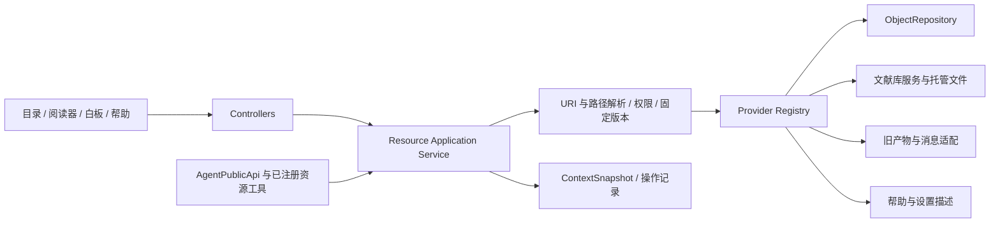

# Liteasy 统一资源文件系统：分层命名空间与链接管理规格

日期：2026-09-14
状态：**Draft proposal / 改造提案，未实现。** 本文只定义候选架构、实施边界和验收要求，不授权或表示已开展 VFS 实施，不代表上线验收。
范围：Liteasy 桌面及其应用服务；后续按阶段适配 Liteasy API。Intuecho 保持独立服务、数据库和凭据。
前置规格：[Agent Native 对象工作台](2026-09-13-agent-native-object-workbench-spec.md)。本提案补充其寻址、组织和操作层，保留对象、来源、版本、关系、上下文快照的既有语义。

## 1. 可行性与建议

可行。建议在现有领域仓库之上增加**应用层统一资源文件系统**：论文、批注、收藏网页、笔记、摘录、白板、产物、对话、设置及帮助内容均可发现、寻址、打开、引用和按能力操作。目录树是统一的组织与导航入口，专业内容继续由原来的仓库和渲染器处理。

“一切皆文件”在 Liteasy 中的准确含义是：**有用的研究资源均可寻址，并暴露明确的读取与操作契约。** PDF 是二进制文档，白板是带布局的结构化对象，设置是受控配置，帮助是版本化只读内容；不将它们全部改写成可任意覆盖的 Markdown 文件。

首选方案不实现 Linux 内核文件系统、FUSE 或完整 POSIX 兼容层，也不立即以 OpenViking 替代 ObjectRepository。先把现有对象引用和专业存储统一起来，收益直接对应当前问题：拖拽时引用而非复制、资源移动后链接不断、不同视图访问同一内容、Agent 能限定目录和资源范围开展操作。

### 1.1 官方设计借鉴及差异

| 参考 | 已核查的官方设计 | Liteasy 的取舍 |
| --- | --- | --- |
| OpenViking | 使用 `viking://` URI 与目录式访问组织上下文；当前 URI 文档还说明，文件检索记录 ID 与账号、URI 有关，迁移 URI 会重新生成相应索引键。 | 借鉴可导航命名空间与受限内容访问；Liteasy 的对象 ID 必须独立于路径，不能把路径生成的检索 ID 当作论文、摘录或产物身份。 |
| OpenViking 分层内容 | 将摘要、概览、原始详情分层加载，降低不必要的全文读取。 | 暴露 metadata / summary / content 三种读取目的；摘要是可重建派生内容，不能替代原文或提升证据可信度。 |
| Linux VFS | 统一接口分派到具体文件系统；区分名称查找、文件系统对象与一次打开的文件状态。 | 借鉴 provider 分派、目录条目与内容身份分离、读取句柄；不照搬 inode ABI、设备节点、页缓存和内核锁。 |
| Linux 路径查找 | 路径遍历须处理并发重命名、符号链接和缓存失效，远端缓存还需重新验证。 | 路径先解析为稳定资源引用；提交时再次验证权限与版本；快捷方式有循环检测，外部文件访问受托管根目录约束。 |

上述事实分别来自 [OpenViking URI 官方文档](https://github.com/volcengine/OpenViking/blob/main/docs/en/concepts/04-viking-uri.md)、[OpenViking 官方仓库的分层加载说明](https://github.com/volcengine/OpenViking#readme)、[Linux VFS 官方概览](https://www.kernel.org/doc/html/latest/filesystems/vfs.html)和 [Linux 路径查找文档](https://www.kernel.org/doc/html/latest/filesystems/path-lookup.html)。核查日期为本文日期；`main` 与 `latest` 会变化，本文不承诺兼容其未来版本。后文是针对 Liteasy 的设计提案，不是对这些项目的功能转述。

### 1.2 核心产品目标：围绕正在使用的内容与 AI 协作

统一寻址的首要收益是：**用户正在处理的任何受支持资源，以及显式选定的一组资源，都能直接成为提问、审阅和受控修改的对象。** 用户不应为了让 AI 理解一条批注而重新复制原文、解释出处，也不应为了应用一项建议而从聊天框手工搬回结果。资源的读取、讨论、变更和追溯应留在同一个工作空间。

产品目标是在这种沉浸式 AI 使用上超过 Zotero 等研究工具：衡量的是从当前内容到可验证结果的完整路径，而不是聊天按钮的数量。这里记录产品定位和用户提出的痛点，不将其视为对其他产品及其插件当前能力的核查结论。

必须形成以下闭环：**就地选择 → 提问或 review → 检查依据与建议 → 按授权应用修改 → 回到原处验证、继续追问或撤销。** “能读取文件”或“能把资料附到聊天里”都不足以单独通过本规格验收。

“任何资源”指已接入 provider 且具有明确能力的产品资源。所有这类资源应至少能解释自身类型、可用内容与操作边界；不支持读取或修改时就地说明原因，不虚构支持。新增资源类型通过统一契约接入该闭环，不为每一种类型再造一个互不兼容的 AI 面板。

## 2. 当前代码基础与实际缺口

以下是代码静态核查，不代表新架构已经存在。

| 现有入口 | 当前事实 | 改造要求 |
| --- | --- | --- |
| [object.types.ts](../../../products/liteasy/apps/desktop/src/app/features/objects/object.types.ts)、[objectRepository.ts](../../../products/liteasy/apps/desktop/src/app/features/objects/objectRepository.ts) | 已有 ObjectRef、六类对象、不可覆盖的历史 revision、关系、Placement、迁移映射与标题索引。 | 作为对象 provider 的真源；扩展应用服务，不新建一份对象正文库。 |
| [objectStorage.ts](../../../products/liteasy/apps/desktop/src/app/features/objects/objectStorage.ts)、[object_store.rs](../../../products/liteasy/apps/desktop/src-tauri/src/object_store.rs) | 原生 SQLite WAL/FULL、按 scope 分区的记录与 CAS 批提交；浏览器 IndexedDB；附件另有托管存储。 | 复用事务边界；目录元数据需要与对象写入原子提交时进入同一事务，不先改 UI 再异步补关系。 |
| [objectResolver.ts](../../../products/liteasy/apps/desktop/src/app/features/objects/objectResolver.ts) | 能打开对象链接，并提供未知 schema 的安全降级。 | 增加上层 ResourceResolver，由对象 provider 调用原 resolver，保留旧链接。 |
| [localLibrary.types.ts](../../../products/liteasy/apps/desktop/src/app/features/library/localLibrary.types.ts)、[libraryFileSystemClient.ts](../../../products/liteasy/apps/desktop/src/app/features/library/libraryFileSystemClient.ts)、[local_library.rs](../../../products/liteasy/apps/desktop/src-tauri/src/local_library.rs) | 文献库已有 libraryId、document ID、目录/相对路径、revision、回收站、导入及文件变更处理；部分前端操作仍以 sourcePath/targetPath 调用宿主。 | 文件 provider 以文献库 ID 和文档 ID 寻址；物理路径留在宿主适配器。复用现有导入、重命名、回收站和恢复流程。 |
| [userPaperArtifactClient.ts](../../../products/liteasy/apps/desktop/src/app/features/library/userPaperArtifactClient.ts) | 全文、批注、阅读状态等使用 paperId + artifactKind 保存，未全部成为通用对象。 | 先只读适配，保留各格式；需要可编辑对象时再做有日志的一次性迁移。 |
| [artifactLocalRepository.ts](../../../products/liteasy/apps/desktop/src/app/features/artifacts/artifactLocalRepository.ts)、[localArtifactResultClient.ts](../../../products/liteasy/apps/desktop/src/app/features/artifacts/localArtifactResultClient.ts)、[agent_artifacts.rs](../../../products/liteasy/apps/desktop/src-tauri/src/agent_artifacts.rs) | 产物目录缓存、旧 Agent 结果和新对象存储并存，旧本地入口没有统一采用对象 scope 的调用契约。 | 不能因为统一挂载就宣称完成账号隔离。先厘清设备/文献库/账号归属，未确认归属的旧缓存不自动归入当前账号或发给 Agent。 |
| [cloudLibraryStorageClient.ts](../../../products/liteasy/apps/desktop/src/app/features/library/cloudLibraryStorageClient.ts)、[agentArtifactRepository.mjs](../../../products/liteasy/services/api/src/agentArtifactRepository.mjs) | 云文献按 user/organization scope 操作；旧正式产物端点校验 `liteasy.agent-artifact/v1`，使用 PostgreSQL 事务。 | 通过 provider 复用服务，不向旧端点写入新资源 envelope；不能把本地事务推断为跨服务事务。 |
| [resourceScope.types.ts](../../../products/liteasy/apps/desktop/src/app/features/resources/resourceScope.types.ts)、[actionRegistry.ts](../../../products/liteasy/apps/desktop/src/app/features/skills/actionRegistry.ts)、[agentApi.types.ts](../../../products/liteasy/apps/desktop/src/app/features/agent-api/agentApi.types.ts) | 已有资源归属类型、操作注册表和公共 session/run/取消/确认协议。 | 扩展同一授权与能力体系，避免另建一套“文件权限”绕过原有领域检查。 |

主要缺口是统一资源协议、目录条目与快捷方式语义、跨 provider 的操作计划和失效处理，以及第 8.3–8.7 节的单项/批量上下文、就地审阅和变更采纳闭环。收藏网页、批注可编辑视图及设置组合的统一适配属于待建设内容，不能因为已有对象与设置仓库就认定这些场景已完成。它们并不要求替换所有已有存储。

2026-09-14 的[Notes 与上下文工作区实现](../implementation/2026-09-14-notes-context-workspace/README.md) 已先接通有界的个人目录视图：默认按来源汇总用户文字，用户文件夹只保存引用；批注、论文、文本框、白板元素和整板可以拖入同一 Agent 对话，多栏布局保留运行中的会话。这些入口复用现有仓库和公共 Agent API，不表示本提案的统一 ResourceRef、全部 provider、跨服务操作或 AI 变更集已实现，F0–F3 仍按各自退出条件验收。

## 3. 必须保持的语义

1. **身份不等于名称或路径。** objectId、documentId、artifactId 的既有意义保留；标题、目录位置、磁盘文件名和内容哈希不能代替它们。内容哈希用于完整性与去重提示，不自动合并身份。
2. **对象版本与目录版本分开。** 改变一个项目中的别名只更新目录条目；编辑共享笔记或修改对象标题产生新对象 revision。旧引用仍指向原版本。
3. **一个内容可以有多个入口。** 同一笔记可出现在项目目录、搜索结果和两张白板中；正文仍只有所属 provider 的一份权威记录及其历史版本。
4. **组织操作不推导研究结论。** 放进同一目录、建立快捷方式或移动卡片，不自动产生 supports/contradicts，也不授予跨账号访问权。
5. **链接不承诺可分享或永久可读。** 链接只提供定位信息；未同步、离线、权限撤销、版本已清理时返回明确状态。
6. **相同服务规则覆盖 UI 与 Agent。** 用户点击可以直接执行领域服务；Agent 仍经公共运行入口、能力检查和相同领域操作，不能获得任意系统路径访问。
7. **临时交互不自动物化。** 划词、焦点、未提交编辑、菜单和诊断不是永久文件；显式收藏、保存或提交上下文时才按既有规则固定内容。

## 4. 命名空间、身份与 URI

### 4.1 逻辑目录树

每个挂载实例绑定一个权威资源范围。顶层展示名称可本地化；协议中的 providerId、mountId 和资源 ID 稳定，不用中文标题充当协议键。

```text
/                              当前主体可见的挂载视图
  projects/                    用户整理的项目目录与快捷方式
  library/                     明确挂载的本机或云文献库
  web/                         已收藏网页及其固定内容版本
  annotations/                 按来源、时间、标签查询的批注投影
  notes/                       笔记对象的分类投影
  fragments/                   摘录对象的分类投影
  boards/                      白板对象及其成员视图
  artifacts/                   新对象与可访问旧产物的联合视图
  conversations/               可访问的会话及已固定消息
  help/                        应用版本匹配的只读帮助
  settings/                    可描述的非敏感配置视图
  runs/                        脱敏执行记录、结果与恢复入口
```

这是一棵导航视图，不是把这些目录全部写到磁盘。`notes/` 等分类目录由 provider 查询生成，不接受任意移动来改变 kind；用户自由整理发生在 `projects/`。论文的 `content.pdf`、`fulltext`、`annotations` 可作为专业资源的子视图，不因此获得原始 JSON 覆盖能力。全局批注投影和论文下的批注视图必须解析到同一权威批注；一个已收藏网页也不能因加入项目而重复保存正文。

目录选择器中明确显示「本机文献库」「我的云文献」「组织文献」等归属。`local_private` 不能自动解释为当前云账号私有：设备文献库与账号私有笔记是不同范围，挂载时分别检查现有归属与访问策略。共享目录也不自动接纳私有对象的可读副本。

### 4.2 两类地址

| 地址 | 用途 | 稳定性 |
| --- | --- | --- |
| `liteasy://objects/{objectId}?revision={revision}&selector={selectorId}` | 继续作为已有对象的规范证据链接。 | 对象移动或别名变化不改变链接。 |
| `liteasy://resources/{providerId}/{resourceId}?revision={revision}&selector={selectorId}` | 非对象资源的规范链接；resourceId 由 provider 分配或由稳定旧 ID 的映射登记。 | 与物理路径和目录位置无关；provider 不可用时保留可解释引用。 |
| `liteasy://fs/{mountId}/{segments...}` | 浏览、位置栏、限定目录检索；不是默认分享链接。 | 目录重命名后可以变化；复制操作必须明确标为「复制位置」。 |

mountId 是不透明挂载标识，不能包含绝对路径、邮箱、密钥或签名 URL。所有地址均由 resolver 根据当前主体重新验证；未指定 revision 的规范链接表示解析当前可见版本，提交给 Agent 前必须固定为实际版本。

新 resourceId 在 provider 内全局唯一且不透明。适配旧资源时，以 `(providerId, scopeId, libraryId?, legacyId)` 登记唯一映射，不能把不同账号下恰好相同的旧 artifactId 合并。该映射在明确的登记/迁移步骤持久化，普通 `stat/list/read` 不隐式认领旧数据、创建收藏或搬运文件。

旧 `liteasy://agent-artifacts/{id}` 和本地产物历史 locator 保持路由适配，不批量替换用户已保存的引用。一个已成为 Object 的资源始终以对象链接为 canonical URI；provider 别名返回该 canonical URI，不能为同一权威内容另造第二个主身份。

论文已有 source.document 映射时，由该 ObjectRef 承担引用身份，papers provider 提供受权的 PDF 字节表示；尚未映射的论文先使用已登记的 papers ResourceRef。以后建立对象映射时保留旧 URI 的确定性转向记录。固定对象版本并不意味着原始 PDF 历史字节必然仍在：读取须核对对应 hash，历史字节不存在时报告版本不可用，不能返回当前文件冒充旧版本。

解析器只接受已注册 scheme/host 与约定参数，限制长度、深度和解码次数；拒绝 NUL、控制字符、编码后的路径分隔符、`.` / `..` 越界和不支持的参数。用户创建的虚拟目录名采用 NFC、区分大小写、同父目录唯一；与 Windows/实际文件系统交互时由文件 provider 再校验大小写冲突、保留名和字符限制。已有文件名不得因导入自动规范化而发生覆盖。

## 5. 最小数据契约

以下为设计草图；实施前需生成严格 JSON Schema，并给新增公共协议版本化。

```ts
type ResourceRef = {
  providerId: string;
  resourceId: string;
  revision?: string;   // 缺省只表示请求最新；不允许直接作为运行快照
  selectorId?: string;
};

type FixedResourceRef = ResourceRef & { revision: string };

type NamespaceEntry = {
  entryId: string;
  entryRevision: string;
  scopeId: string;
  parentEntryId: string;
  name: string;
  nodeType: "directory" | "resource" | "shortcut";
  target?: ResourceRef;
  tracking?: "latest" | "pinned";
  origin: "manual" | "provider_projection";
};

type ResourceStat = {
  canonicalRef: ResourceRef;
  canonicalUri: string;
  title: string;
  kind: string;
  mediaType?: string;
  byteLength?: number;
  scopeId: string;
  lifecycle: "active" | "archived" | "tombstoned";
  availability: "available" | "offline" | "missing" | "unsupported";
  versioning: "immutable" | "snapshot_required" | "ephemeral";
  effectiveCapabilities: string[];
};
```

`ResourceRef` 是寻址门面，不取代 ObjectRef。对象映射为 `providerId=objects`、`resourceId=objectId`，revision 与 selector 原样保留；snapshot 仍可保存原 ObjectRef。目录条目 ID 与资源 ID 分离，历史目录位置不回写对象历史。

provider 的 revision 可以采用既有仓库的不透明 CAS 令牌；不得把全库 revision 当作某个 PDF 内容版本。仅能读取最新值的旧接口应声明 `snapshot_required`，由受权服务读取并固定内容后返回快照引用；不能为已覆盖的历史内容虚构一个仍可读取的 revision。

读取句柄包含已验证的主体/授权代次、固定资源引用、representation、上限和有效期，由服务端或宿主保存。它不是可复用的全局 bearer token；账号切换或权限撤销后再次读流必须重新验证。短期签名下载 URL 仅交给必要的传输适配器，不写入规范链接、对象来源或 Agent 日志。

## 6. Resolver、Provider 与应用服务



### 6.1 职责分工

- **ResourceResolver**：解析 URI 或受限目录路径，解析快捷方式，输出 canonicalRef、目录解析版本和展示状态。对外将无权访问与不存在统一为不可用；内部审计可保留真实错误原因。
- **Provider Registry**：注册受信任实现及其协议版本，声明资源种类、可读取表示、操作与事务域。registry 描述能力；有效授权仍由现有资源策略和执行端决定，不维护第二套 ACL。
- **Resource Application Service**：校验请求、固定版本、安排跨域操作、幂等、取消与事件。UI 不直接调用 provider 的私有写入函数。
- **专业 provider**：将操作转换为已有领域接口。objects 处理对象；papers 处理文献与 PDF；artifacts 适配旧产物；messages 处理会话消息；help/settings/runs 提供受约束的只读或类型化视图。
- **Namespace Repository**：保存用户目录、快捷方式和迁移映射；provider 的分类投影可重建，不重复存正文。实现位置建议为无 React 依赖的 `features/resource-filesystem/`；跨功能编排留在 controllers。

### 6.2 建议接口

| 接口 | 必要参数与返回边界 |
| --- | --- |
| `resource.resolve` / `resource.stat` | URI 或 ref；返回 canonicalRef、能力、可用性，默认不取正文。 |
| `resource.list` | 目录 ref、cursor、limit、可选目录版本；返回有界条目与下一页标记。 |
| `resource.read` | ref、representation、range/selector、maxBytes、signal；返回实际固定引用、内容 hash、截断说明。 |
| `resource.search` | 允许的 roots、query、过滤条件、cursor、limit；返回固定结果与匹配位置，不默认全盘检索。 |
| `resource.toContext` | 选中的 ref、purpose、预算；复用 ContextSnapshot 流程，不直接把任意全文塞入消息。 |
| `resource.planOperation` | 已注册 actionId、目标、参数、expectedRevision、idempotencyKey；返回效果、冲突与补偿说明。 |
| `resource.executeOperation` | 操作计划与既有授权引用；执行时重新检查主体、路径解析结果和当前版本。 |
| `resource.watch` | 可见目录或资源集合、事件游标；返回有序的变化摘要，断流后可重新列举。 |

`read` 表示选择可读视图，不承诺资源一定是字节文件：PDF 可请求受限字节流，笔记可请求 Markdown，白板可请求经过 schema 验证的布局或成员列表，设置只提供已注册且允许读取的说明、非敏感值及生效条件。`read` 和预览不触发模型生成；没有现成 summary 时返回 unavailable 或确定性元数据。需要生成摘要时走独立、可计费的已注册操作。

OpenViking 将知识、记忆与能力内容区分为不同上下文类型；Liteasy 同样保持帮助、研究资料和可执行能力的边界，不因它们都能在目录中出现就赋予相同执行权限。[OpenViking 上下文类型官方文档](https://github.com/volcengine/OpenViking/blob/main/docs/en/concepts/02-context-types.md)

### 6.3 快捷方式解析

快捷方式保存目标 ResourceRef，而不是系统符号链接文本。默认指向资源本体，不创建快捷方式链；兼容导入遇到链时，resolver 逐跳检查 scope、累计访问的 entryId，并限制最多 16 跳。循环、越界或目标失效返回 typed error，不尝试跳到系统路径。

目录遍历默认不递归跟随快捷方式；显式跟随仍受深度、数量和预算限制。目标暂时离线保留条目；目标已删除展示失效状态及移除快捷方式入口，不通过标题相似度自动换一个对象。移动或重命名目标时，ID 引用仍然有效；路径位置可以更新。

## 7. 操作语义与用户可见结果

| 操作 | 效果 | 必须拒绝或区别的情况 |
| --- | --- | --- |
| 打开 / 读取 | 从目标 provider 获取被授权的版本或视图。 | 元数据条目没有 PDF 正文时不能显示已打开原文；请求缺失历史版本不能自动降到最新。 |
| 创建目录 | 在可写的用户组织空间中新建目录条目。 | 不能在 `settings/`、分类投影、挂载根中任意创建资源。 |
| 重命名快捷方式 | 只改变当前 entry.name 和 entryRevision。 | 不修改对象 title、PDF 文件名或其他快捷方式名称。 |
| 重命名内容 | 对象修改 title 并产生新 revision；真实文献文件调用文件 provider 的重命名操作。 | UI/计划说明影响共享内容还是当前别名；目标身份保持不变。 |
| 移动组织条目 | 同一命名空间事务内改变 parentEntryId，检查目录循环、同名冲突与目录 revision。 | 不自动搬运 PDF 字节，不改变资源 scope，不转换资源 kind。 |
| 移动文献文件 | 交给既有文献库服务移动真实文件并更新索引。 | 必须验证托管根、资源 ID、目标目录与物理操作结果；禁止纯改路径字符串假装成功。 |
| 创建快捷方式 | 新建 entry，引用同一目标；可选择跟随最新或固定版本。 | 不隐式复制正文或附件，不借目标地址绕过权限。 |
| 复制内容 | 新 resourceId/objectId，保留合法来源与 `derived_from`；附件按授权复用或复制。 | 不等同复制链接；跨 scope 必须具有读取、导出、目标写入及必要共享授权。 |
| 移除快捷方式 / 从目录移除 | 删除或回收该 entry，目标资源不变。 | 最后一个快捷方式被移除也不自动删除内容。 |
| 从白板移除 | 调用现有 Placement 操作，并正确维护实际成员关系。 | 不能当作目录 unlink 或对象删除；同对象多次摆放有各自 placementId。 |
| 删除内容 | 调用 provider 的归档、tombstone 或回收站能力，列出受影响引用。 | 不用最后链接计数决定销毁；固定上下文和历史可能仍按保留策略占用附件。 |
| 永久清除 | 独立操作，按既有授权和保留策略擦除内容与可清理附件，保留最小失效元数据。 | 不能以引用追溯为由永久保留已要求清除的正文；也不能声称撤回外部模型已经收到的数据。 |
| 编辑内容 | 笔记走 editNote；专业产物走对应 schema 的编辑接口；返回新 revision。 | `write(uri, arbitraryBytes)` 不作为通用默认写入方式；原文摘录不可被覆盖，编辑为派生笔记。 |

普通“拖到项目”默认为创建快捷方式；“移动到”是明确的组织动作；“制作独立副本”是复制内容。文献库中的真实文件拖放沿用既有移动/复制语义，由目标能力和用户选择确定，预览必须显示实际效果。

组织快捷方式不是 POSIX 硬链接：不使用磁盘 link count 管理研究对象生命周期。它也不是研究关系：`references`、`related_to`、`supports` 等仍由关系仓库管理；目录成员查询、快捷方式反查、白板成员和语义关联分别展示，不制造互相重复的边。

跨 provider 移动默认返回 `cross_provider_operation_required`，由“复制内容到目标 → 验证可读取 → 用户授权范围内处理源内容”的显式操作完成。跨域只完成复制时显示 `partially_succeeded` 或“已复制，源内容未移动”，不能报成原子 rename。首期不开放跨账号 move。

## 8. 权限、Agent 与内容安全边界

### 8.1 Scope 与挂载

有效权限取当前主体、权威资源 ACL、挂载限制与此次运行授权的交集。mountId、URI、scopeId 和前端按钮都不是授权证明。持久挂载记录只存范围引用及 provider 配置标识，秘密留在既有安全凭据存储中。

范围至少复用 `local_private`、`user_cloud_private`、`organization_cloud_shared`、`platform_configuration`、`cloud_cache` 的既有区分。缓存不是拥有权；云资源离线可读范围必须遵守缓存与撤权策略。组织目录中的私有快捷方式不能泄露目标标题、摘要、子项数量和反向引用。

账号切换使旧读取句柄、订阅、检索 cursor 与待执行计划失效；清理内存预览并取消相关运行，迟到结果不得写入新账号或显示旧账号正文。原生可信主体延续 [desktop_identity.rs](../../../products/liteasy/apps/desktop/src-tauri/src/desktop_identity.rs) 的宿主验证入口，不能恢复成仅信任 localStorage 的 userId。未映射的旧设备缓存进入隔离恢复清单；归属确认和迁移是独立操作。

### 8.2 Agent 工具

Agent 只获得 `resource.stat/list/read/search/to_context` 及当前允许的 typed operation。工具参数使用资源引用和受限目录，不接受任意绝对路径、任意网络 URL、SQL、shell 或 provider 私有指令。provider 注册与挂载新系统根目录不属于普通研究工具。

每次 run 固定 allowedRoots、actionIds、最大读取量、遍历深度、候选数、写入目标和必要网络权限。正文、帮助文字、外部 PDF、模型输出及文件名均作为数据，不通过“执行这个脚本”或“安装此 provider”改变工具集合。帮助目录中显示的能力文档也不自动激活可执行技能。

模型不能绕过 AgentPublicApi 直接调用 Tauri `invoke`、ObjectStorage.commit 或第三方 SDK。原生 provider 在最终打开文件及提交变更时验证托管根、文件标识、路径解析和 symlink/reparse 边界；权限预检不能替代实际操作时的检查。允许的外部导入仍走已有文件选择、受限下载和摄取服务，导出才在明确选择的目的地写出普通文件。

原有明确授权继续有效：同一范围的可逆整理无需每一步重复确认；分享、永久清除、覆盖外部文件等效果依照既有风险策略匹配授权。本文不增加“所有文件动作都需弹窗”的默认流程。

### 8.3 单项与批量场景

以下场景均为交付要求，不是界面文案示例即可满足的展示需求。

| 用户当前对象与意图 | 默认读取范围 | 审阅与修改结果 |
| --- | --- | --- |
| 一条自己的批注：“这条理解对吗？帮我改得准确些。” | 批注正文、固定的原文选区、来源页码及有界相邻段落；区分原文与用户评论。 | 回答定位到批注及证据。修改用户评论产生新版本；原文引用保持不变，新增解释可保存为派生笔记。 |
| 一个收藏网页：“review 这里的观点，哪些值得保留？” | 已保存的网页版本、URL、收藏/抓取时间、提取状态及用户笔记；仅有书签时只读元数据。 | 建议关联到保存版本的具体段落；可修改收藏标题、标签、用户笔记或创建批判性笔记，不改写源网页作为原始证据。 |
| 一批批注：“检查这 20 条是否矛盾，统一标签，润色我的评论。” | 用户明确选择的 20 项及每项必要来源片段；跨论文时保留各自归属和来源。 | 同时提供跨条目结论和逐项建议，支持逐条/整批采纳；每条批注独立定位、显示版本与执行结果。 |
| 一项设置或一个设置文件：“解释它，review 是否适合我的阅读习惯，然后把字号调大。” | 已注册设置键的当前非敏感值、默认值、说明、依赖和生效条件；文件先经已知 schema 解析。 | 先解释或提出按键差异；在授权范围内调用设置领域操作应用，显示即时/重启/下次运行生效情况，支持恢复旧值。 |
| 一组混合资源：“结合这些批注、网页和笔记，review 我的论证。” | 显式集合中各资源的选定表示；依赖补读受运行范围与预算约束。 | 结论逐项引用；建议明确目标和操作种类，可生成新的综合笔记，也可对被授权的用户内容提出修改。 |

收藏网页默认分析保存时的内容；刷新在线正文、访问外部链接或扩大到整篇论文是独立读取效果，在已有网络授权和范围内执行，否则请求补充授权。页面更新要保留新旧版本和抓取状态，不能用今天的页面冒充收藏时的证据。登录失败、仅有标题、正文提取不全或视觉内容不可读时明确标记覆盖缺口。

设置文件不是任意可写系统文件的入口。受支持格式先作为独立配置资源解析和审阅；“修改配置草稿”“导入应用设置”“覆盖所选外部配置文件”是不同操作，计划中必须区分。未知键、未知格式及只读键可解释其支持边界，但不能靠模型生成任意键绕过注册表。凭据值不进入上下文、差异预览或运行日志；设置是否已配置可用布尔状态表达。

### 8.4 就地发起与返回

PDF 批注条目、收藏网页、笔记卡片、文件/资源列表和设置行提供一致的 AI 操作入口；多选后对当前集合使用同一入口。按 Fluent 图标基线，在选中、右键菜单或键盘操作时提供“提问”“审阅”“提出修改”，不常驻显示三排文字按钮。图标具有名称与提示，键盘可完成同一路径。

入口携带资源引用、选区、意图及返回位置，经 controller 进入同一 AgentPublicApi。用户可以直接输入“修改这些评论”等自然语言，不要求先理解模式或资源 URI；系统必须区分只读意图与已授权的写入效果。发起后保留阅读位置、当前筛选和选择；Agent 面板关闭后可从左侧入口恢复同一运行，不能丢掉待采纳建议或重复发起任务。

上下文栏以图标、名称和数量呈现所选资源，按需展开来源、内容范围与排除项。无需用户手工粘贴批注、逐条附加同一批次或再次说明正在谈哪个设置。焦点用于确定入口目标，不能把同屏所有资源自动附加；混合选择中不能读取的项需在提交前或读取时明确列出。

回复中的证据、review 问题及修改建议都能回到对应资源/具体位置，必要时并排查看。采纳后刷新原批注、网页笔记或设置行的同一权威内容；不将可执行结果仅留成一段让用户复制的聊天文本。“保存为新笔记”保留来源，但不隐式修改原资源。

### 8.5 上下文集合、批次与持续讨论

在 `resource.toContext` 之上定义版本化的 `ResourceSelection` 与运行快照扩展，复用既有 ContextSnapshot，不另建第二套正文真源。集合可以来自手动多选、明确时间区间/标签/来源的查询结果、目录成员或已保存集合。时间相近不自动等于用户选中的同一批；只有明确的导入/操作批次才使用 batchId。

最小契约要求：

- 选择描述包含 `selectionId`、选择来源、查询条件（如有）和请求范围；发送时固定具体成员及各成员 revision/selector。查询重新执行产生新一轮集合，不能静默扩张正在审阅的批次。
- 每项记录 canonical ref、选用表示、实际读取范围、来源依赖、hash 及包含/排除原因。记录选中数、已读取数、未读数与截断情况，分块处理保留完整成员清单及顺序。
- 初始快照固定后，获准的后续补读以追加的读取清单记录固定引用、原因、预算和覆盖范围；不篡改初始快照。回答能追溯本轮实际读取了什么，不能声称已审阅仅列举过标题的资源。
- 对话沿用显式附加或钉住的目标，不随切换论文改变。用户修改了目标后，追问显示版本变化，可选择旧版本讨论或显式刷新到最新；写入始终检查当前版本。
- 设置/诊断集合继续遵守临时与脱敏保留策略；目录收藏、普通聊天记录或“保存批次”不能间接持久化秘密。已保存的研究集合仅保存允许保留的引用与组织信息。

### 8.6 Review 与受控修改契约

`ask` 和 `review` 默认为只读。Review 输出结构化 `ReviewFinding`：问题标识、目标固定引用及 selector、观察与依据、建议、可选的关联变更；“信息不足”“跨条目冲突”和模型推断要明确区分。用户采纳建议不等于证明结论为真，关系与来源的可信度规则保持不变。

`ResourceChangeSet` 复用 `resource.planOperation` 和既有 operation/run 协议，至少包含：

- `changeSetId`、`runId`、目标与读取清单摘要；每项的 `changeId`、`actionId`、目标固定引用、`expectedRevision`、类型化参数、修改理由及关联 finding。
- 可由执行端校验的前后差异、受影响的关联入口、事务域、依赖项、可逆性和具体授权范围。敏感字段不出现在差异中。
- 每项的提议/采纳/拒绝状态与执行状态分别保存，防止把“采纳”当作“已执行成功”；实际成功返回新 revision 和可用的撤销入口，失败、跳过、冲突、取消、部分完成均可定位到目标。

没有写入授权时先形成可审查变更集，允许逐项采纳、拒绝、调整或整批采纳。用户已经明确授权“将这 20 条批注统一加上某标签”等范围内的可逆变更时，可以直接执行并提供变更记录和撤销，无需每项弹窗。只说“review 一下”不能推导出写入授权；“接受全部”仅覆盖当前已展示的确定版本变更集，不覆盖后续悄悄新增的目标或参数。

用户调整某项建议后重新验证其参数、依赖与授权匹配。依赖同组其他修改的条目不能单独执行出破坏性中间状态，应联动采纳或解释依赖。单一事务域内的原子组全部成功或回滚；跨 provider 批次显示逐项状态，提供继续/补偿入口，不宣称整批原子提交。

并发编辑触发 CAS 冲突时保留用户当前内容，展示旧依据与新状态，重新规划涉及的变更；不得静默强制覆盖。取消阻止尚未提交的步骤；已经提交的结果仍可追溯。撤销执行有前置条件的逆操作，不能覆盖撤销前用户的新编辑。设置修改还要验证类型、取值范围、键间依赖及生效条件，并复用设置服务发布实际生效状态。

### 8.7 接入边界与产品质量门槛

资源 provider 提供读取表示和类型化操作；统一上下文服务处理选择与快照；review/变更服务处理 findings 与 change sets；controller 连接入口、导航与运行状态。专业 renderer 可扩展定位与差异显示，但不能各自直连模型、保存另一份修改后的正文或绕开公共运行授权。帮助只解释已注册能力，不替代这些服务。

以第 8.3 节场景记录端到端体验：从已选内容到可输入问题的 AI 入口最多一次点击/键盘激活；无需手工复制正文、输入路径或重建批次；从一条建议回到来源最多一次激活。复杂变更可以按需展开检查，不以少一次必要决策换取隐式扩大范围。应用是否优于其他工具，应以真实任务的完成率、手工转移次数、来源定位正确率、批次覆盖完整性与修改可恢复性衡量，不以未经核验的竞品功能清单代替验收。

## 9. 持久化、事务、索引与迁移

### 9.1 单一真源与事务边界

- 对象、历史、关系、Placement 和 ContextSnapshot 继续由 ObjectRepository 管理。命名空间初期可在同一 ObjectStorage 中增加 `namespace/entry/`、`namespace/parent/`、`namespace/operation/` 版本化记录，利用现有原子 commit；需要专用表时再做显式数据库版本迁移。
- `entryId` 主键、同父目录规范名称唯一约束、父目录 revision 和目标反查索引必须由仓库事务校验。原生与 IndexedDB 行为一致，不退化为多笔 localStorage 双写。
- 同一事务域内的“创建笔记并加入目录/白板”提交对象、条目或 Placement、必要关系和幂等记录，全部成功才发布 committed 事件。不能因为两个 provider 都在本机就假定它们共享事务。
- 真实文件字节与数据库不是天然同一事务。复用文献库的 staging、索引变更与恢复日志；写入前记录计划，文件落盘并校验后提交索引，重启按日志完成或补偿。遇到外部同名文件或后续用户编辑，恢复须返回冲突，不能覆盖。
- 跨本地文件库、对象 SQLite、云 API 的操作使用持久操作日志与可重试子步骤；不实现分布式两阶段提交。状态至少区分 planned/running/succeeded/failed/cancelled/partially_succeeded，并映射已有公共运行协议。
- 新增目录条目不能延长敏感快照的保留期限。附件清理要考虑有效资源版本、显式保留快照和待完成操作；删除策略生效后才回收，不用目录链接计数替代引用追踪。

### 9.2 并发与取消

写入必须提供目标对象/条目的 expectedRevision；rename/move 同时检查源、目标父目录及解析路径的版本。内容 CAS 与目录 CAS 分别比较；晚到的 AI 整理不能覆盖用户移动或编辑。幂等键按主体与操作类型隔离，参数指纹不一致返回冲突，相同请求返回同一结果。

取消只取消尚未提交的工作；已完成的跨域步骤明确列出。undo 是有前置条件的新操作，保留恢复所需的旧父目录、名称、内容版本与操作者信息；遇到新编辑或同名条目时不静默回滚。watch 事件丢失可根据持久事件序列或重新列举恢复，不把内存事件当唯一事实源。

### 9.3 搜索与分层读取

先做按 scope 的名称、类型、来源和目录查询，复用现有标题索引；全文索引作为可重建投影，可在原生使用 SQLite FTS，在浏览器采用能力明确的适配器。首期不引入图数据库或向量数据库。

索引条目必须包含稳定 ref、内容 revision、提取器版本与索引状态。搜索先按权限和 roots 过滤，再排序和生成片段；打开命中项时重新验证版本与权限。未索引、索引过期、离线和权限不足不能都显示“没有结果”。分页游标绑定查询、排序、scope 和目录/索引代次；失效时返回可重启查询状态，避免重复或漏项被当成完整结果。

目录概览由显式成员及其版本生成。summary 缓存记录来源版本、生成器与 trustLabel，原文变更后标记过期；查询不会偷偷调用付费模型补摘要。摘要只辅助检索，引用证据仍固定原始对象或文本快照。未来若接 OpenViking，只作为可重建检索/概览 provider，并保存其索引记录到 Liteasy 稳定 ref 的映射；不能让它成为第二个对象真源。

### 9.4 渐进迁移

1. **盘点与只读映射。** 为 paper、object、annotation、web、legacy artifact、message、help 和受支持 settings 建立稳定映射，核对真源与 scope，生成数量、冲突和未映射条目报告。新收藏网页需明确保存与摄取入口，不能把外部 URL 当成已经保存的正文；设置视图不复制凭据。不搬动 PDF、不改写原始产物。
2. **影子解析。** 新 resolver 在测试和显式诊断中与旧打开路径比对，验证同一资源、版本、页码和权限；默认 UI 仍可走旧入口。
3. **切换读取。** 按入口接入 provider，保留旧链接与专业 renderer。新目录只是导航视图，不迁移正文。
4. **新增组织写入。** 用户目录、快捷方式和目录查询进入 Namespace Repository；对象写入继续经现有领域服务。事务测试通过后接入创建并放入目录等组合动作。
5. **迁移旧可编辑内容。** 逐类型处理旧产物/批注/消息，记录旧 ID、旧位置、源 hash、scope、目标 ref 与迁移状态；相同迁移可重试。未确定归属或源已变化的条目停止迁移并保留原件。
6. **退役旧写入口。** 只有对账、重启恢复、回滚路径和用户数据备份验证通过后才切换写入权威；禁止长期无事务双写。已迁移的新修改不能靠删除新数据库“回滚”，必须由逆向适配或恢复清单保留。

统一文件系统不自动包含云同步。正式路由、PostgreSQL 迁移、对象存储访问、缓存撤权和组织共享在后续独立阶段验收，保留 Liteasy 与 Intuecho 的服务隔离。

## 10. 帮助内容 Provider

本轮帮助 UI 已独立提供 [HelpContentProvider](../../../products/liteasy/apps/desktop/src/app/features/help/help.types.ts) 和 [内容目录聚合器](../../../products/liteasy/apps/desktop/src/app/features/help/helpCatalog.ts)，支持注入提供方及按 `{ providerId, articleId }` 打开。下述统一资源 URI、内容版本、Agent 读取和操作链接属于未来 VFS 适配；应通过适配器复用该接口，不要求帮助 UI 依赖 ResourceResolver，也不表示这些 VFS 能力本轮已实现。

`help` 是首期推荐的只读 provider，用于让用户和 Agent 在同一入口查阅产品操作说明。它读取随应用交付的受信任帮助清单，不开放扫描代码仓库、系统目录或加载任意脚本。

帮助资源至少包括 topicId、locale、适用应用版本、contentRevision、标题、正文、关联设置键与相关 actionId。稳定链接例如 `liteasy://resources/help/reader.annotations?revision={contentRevision}`；不带版本时选择当前应用版本的帮助，缺少本语言版本时明确显示回退语言。本文仅定义 provider 扩展点，不要求本次创建全部帮助内容。

帮助正文继续走净化后的 Markdown/受信任 renderer；相关操作通过已注册 action 触发并重新授权。`settingsRegistry` 的说明与设置实际实现共同校验，帮助不能自称开启尚未发布的功能。Agent 可引用帮助并保留版本；用户私有研究笔记不能覆盖官方帮助、重写能力声明或改变默认系统指令。

未来第三方 provider 必须有独立的信任、版本、取消、配额和权限协议，并经显式安装/启用流程；普通资源文件中出现 provider 配置不触发加载。插件支持不列入首期退出条件。

## 11. 分期路线与非目标

以下 F0–F3 是本提案的阶段，独立于前一对象工作台规格的 P0–P2，不能互相替代验收。

| 阶段 | 交付范围 | 退出条件 |
| --- | --- | --- |
| F0：只读统一入口与就地 AI | ResourceRef/URI/schema、resolver、受信任 provider registry、objects/papers/legacy artifacts/help 读取适配；补齐批注、收藏网页和注册设置的最小只读适配；单项/批量选择固定、就地提问与只读 review、旧链接兼容与最小权限查询。 | 同一真实内容经旧入口和新入口解析一致；第 8.3 节五类场景能提交真实可读内容、检查覆盖范围并从回答返回来源；未确认归属的旧数据不泄露；未知/离线/缺版本有明确状态。 |
| F1：目录与链接管理 | 用户项目目录、快捷方式、名称/目标分离、反查、typed rename/move/copy/remove、CAS、组合事务、事件与重启恢复；接入现有目录与拖拽界面。 | 目录整理不复制正文；对象改名/移动后证据链接仍有效；失败与并发不丢内容；关闭/移除入口语义清晰。 |
| F2：Agent 与专业写入 | 在同一 AgentPublicApi 完善写入 tools、限额补读、ReviewFinding/ResourceChangeSet、专业内容操作与跨 provider 操作日志；逐类型迁移旧写入口。 | 批注评论、网页用户笔记/元数据、注册设置与项目整理均完成逐项/批量采纳、原处更新、取消、冲突处理和可逆操作撤销；第 12.3 节全部通过；模型无法逃逸目录/账号或写任意文件；旧格式保持兼容。 |
| F3：云与高级检索 | 按正式服务权限适配远端 provider、同步冲突与撤权；按收益评估全文/语义检索和外部索引 provider。 | staging 及真实跨设备场景通过；同步或索引失效不损害身份、权限与来源链。 |

非目标：Linux 内核模块、FUSE 挂载、完整 POSIX 权限与 syscall 兼容、任意系统文件访问、把所有数据转换成 Markdown、自动全库研究记忆、未经选择的后台模型调用、自动跨组织共享、立即替换现有数据库、实时多人协同编辑、一次迁移全部历史格式。

F0 可按单条批注的真实只读闭环先验证，再扩展到其他场景；不能用一个通用文件浏览器或仅列举资源名称来宣告完成。F2 必须覆盖用户内容与设置的受控修改，不能只以白板移动成功代替专业写入验收。阶段目标是拟议交付范围，不表示已有实现或本次开始开发。

## 12. 验收规格

### 12.1 必须覆盖的行为

1. 同一笔记进入两个项目和两张白板，只有一份权威正文；分别重命名快捷方式、移除快捷方式、移除一次 Placement 后，其他入口和源内容仍可打开。
2. 笔记内容编辑产生新 revision；旧证据链接显示旧正文，跟随最新的快捷方式显示新正文。目录改名不改变对象 revision；对象改名保持 objectId。
3. 真正移动一份 PDF 后，documentId、ObjectRef 与原页码锚点不因路径变化失效；替换了 PDF 字节则提示版本变化，不能把旧选区贴到新文档上。
4. 元数据条目无 PDF、远端离线、历史版本被清理、未知 provider/schema 分别给出准确状态，不误报成功或静默退到另一版本。
5. 快捷方式循环、16 跳以上链、编码路径穿越、根目录变化及系统符号链接越界不能访问挂载范围之外的内容；真实原生文件操作验证最终路径而非只做前端检查。
6. 切换 A/B 账号及组织撤权后，旧句柄、cursor、watch、计划、检索摘要和迟到模型结果不可继续暴露旧内容。无权目录不泄露数量或目标存在性。
7. 同时 rename/move/edit、重试同一幂等键、目标同名、目录移入自身后代，都返回确定结果；不出现目录孤儿、重复副本、丢失内容或迟到覆盖。
8. 模拟数据库满、附件写入失败、事务中断与进程重启：同域操作全部提交或全部回滚；跨域操作显示已完成步骤并可恢复，不把部分结果报成成功。
9. 用目录整理任务验证 UI 与 Agent 走相同领域服务和权限检查。文件正文中的恶意指令不能挂载新目录、安装工具、修改设置或触发 shell。
10. 提交目录中三项内容提问后，移动目录、更换当前论文、更新来源，不改变本次 ContextSnapshot；摘要带派生来源，不能替代原始证据。
11. 旧 `agent-artifacts` 链接、现有 PDF/可视化/薄读格式仍可打开；迁移重复执行不重复创建对象；归属或 hash 冲突时保留原件并报告。
12. 帮助按版本与语言解析，无模型时仍能读取；帮助中的 action 链接不能绕过权限；不存在的设置和功能不出现在能力清单中。

### 12.2 性能与验证方式

性能目标属于待测验收门槛：在记录 CPU、内存、磁盘、运行版本和缓存状态的参考设备上，以 10,000 项资源/多层目录为数据集，本地热缓存 stat/list 首屏各 100 项 p95 ≤ 100 ms；名称搜索首屏 p95 ≤ 200 ms；读取 1 MiB 本地文本 p95 ≤ 200 ms。冷启动、索引重建、PDF 提取、远端访问单独报告，不混在热缓存指标中。

目录 UI 使用有界分页，变化事件只刷新受影响分支；订阅取消后没有持续遍历或后台读取。大文件使用受限流式读取与取消，不要求把整份 PDF 经 JSON/base64 一次传给 Agent。性能目标不表示当前代码已测得这些结果。

测试分为 provider 契约与权限测试、SQLite/IndexedDB 并发恢复测试、真实文件系统集成测试、公共 Agent 生命周期测试及 Chromium/Tauri 实际交互。文档提案阶段不改代码、不运行数据迁移；实施时必须保留当前用户修改，并运行受影响测试和桌面构建。

### 12.3 沉浸式 AI 端到端验收

以下使用可定位的真实格式测试资料、明确的用户选择和可核对的变更前后状态。协议错误和冲突可以用确定性工具结果注入测试；产品体验验收还需在受控测试账号下跑通真实模型调用，记录模型、版本、配置与结果，不能用硬编码回答宣称 AI 闭环完成。

1. **单条批注。** 在 PDF 中选择自己的评论并提问，无需复制文本即可附加评论与原文片段。回答和 finding 分别回到正确评论/原文位置；采纳润色只改变评论，原文、锚点及旧版本保留。另一篇已打开论文不被自动读取。
2. **收藏网页。** 对一份带保存时间的网页快照 review，引用能返回保存内容的段落。当前在线页面发生变化也不替换旧证据；只有书签或提取不全时显示实际可读范围。采纳标签/笔记修改后收藏视图立即显示新版本，保存的源正文不变。
3. **批量与部分采纳。** 跨两篇论文选择 20 条批注，发送后改动筛选条件或新增第 21 条不改变本轮成员。review 显示逐项覆盖和跨条目发现；采纳其中 6 项、拒绝 2 项，其余待处理，精确核对只有获准目标发生变化。需共同提交的依赖组不能被错误拆开。
4. **设置与配置文件。** 从字号设置行及一份已知 schema 配置文件分别发起解释/review。只读请求不改值；接受指定键的建议后，设置 UI 与实际生效值一致。未知键、只读键及敏感值不进入任意写入或外发路径；导入设置与覆盖外部文件不混为同一授权。存在后续编辑时撤销返回冲突，不覆盖用户值。
5. **混合来源与读取预算。** 选定批注、网页和笔记共同评审一段论证，逐项保留引用和来源性质。超过上下文预算、OCR/提取失败、离线及无权资源均列入未覆盖清单；分块与补读可追溯，不能把抽样结论描述为全量 review。扩大范围遵守授权，不自动遍历全库。
6. **控制与恢复。** “review”只产生建议；明确授权的批量可逆修改不重复确认。预览之后发生编辑、权限撤销、账号切换或变更集参数变化时，原授权/版本不能被误用。模拟部分提交、取消及重启，恢复后能分辨已执行、未执行和失败项；重试不重复写入，撤销不损害后续编辑。
7. **沉浸式路径与可访问性。** 鼠标与键盘分别完成选择、发起、审阅、采纳、定位及撤销；入口与返回来源满足第 8.7 节操作门槛。关闭 Agent 后重新打开仍是原会话和待处理变更，阅读位置与筛选保持；新增一个 provider 可通过同一入口、上下文和变更契约接入，无需新增模型调用链。
8. **输入与能力边界。** 批注、网页正文、配置注释或模型建议中出现的指令不能自行改变工具、挂载、网络范围或设置；UI 与 Agent 对同一操作执行相同验证。只读资源仍能提问并显示支持边界，不能将拒绝写入伪装成成功，也不能把生成的新笔记冒充已修改源内容。

## 13. 主要取舍与启动条件

| 取舍 | 收益 | 代价或限制 |
| --- | --- | --- |
| 应用层门面覆盖现有仓库 | 可逐入口接入，保留专业格式与来源链。 | provider 间的能力不完全相同，UI 必须处理 unsupported 和只读状态。 |
| 稳定身份与目录条目分离 | 重命名和多处组织不打断引用。 | 需要目录版本、目标反查和清晰的“改别名/改内容”交互。 |
| 同域事务、跨域恢复日志 | 不虚构文件系统与数据库的原子性。 | 跨 provider 任务可能部分完成，需要用户可理解的恢复状态。 |
| 元数据优先与按需读取 | 可控制上下文量和读取范围。 | 摘要会过期，必须携带版本和派生标记；全文提取仍有成本。 |
| 暂不替换为 OpenViking | 先解决产品内引用和权限问题，不引入第二套真源。 | 暂不获得其完整检索/记忆系统；将来需要单独验证接入收益与权限映射。 |

建议未来从 F0–F1 开始拆实施计划。启动前应冻结：默认复制的是稳定引用、项目拖入默认创建快捷方式、同名冲突不自动覆盖、scope 归属以现有权威记录为准，以及首期不开放跨账号移动。这些是本提案的推荐默认值，不表示本文已启动实施。
