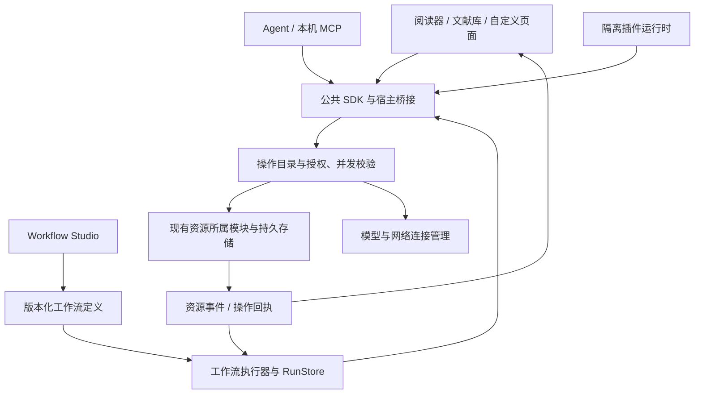

# Liteasy 可扩展工作台与 Workflow Studio 规格

状态：评审稿 v0.2；本文定义目标契约，不表示这些 API 已经实现。本版明确“基础能力继承、组件派生与组合、白板优先”的实施方向。

日期：2026-09-29。Liteasy 对照基线：`93dfad7aa5e6fdaeaaa538a7a5a79eb47b5b3090`。

Zotero 对照基线：`./tmp/zotero`，commit `bccaf46ff2063d9fc97621e9e1975189552f7477`，其 `version` 为 `11.0.SOURCE`；这是本地源码快照，不据此声明兼容某个 Zotero 正式版本。

## 1. 产品目标与主要决策

让用户描述自己的学习、研究与工作方法后，能够手工或通过 AI，将它制作成可安装、可检查、可保存、可重复使用的 Liteasy 扩展。扩展既能组织操作，也能提供适合用户认知习惯的页面和可视化。

建议建设 **Liteasy 扩展平台 + 工作流工作台（Workflow Studio）**。实施顺序为：基础视觉块与统一资源能力 → 白板中的派生类型、组合与手动布局 → 页面及设置扩展点 → 有持久执行记录的工作流与可视化开发工具。首版面向个人、本地使用，模型使用用户已有连接；读取、本地编辑、流程编排不要求 Liteasy 云端账号。

**个性化可视化的默认生产方式是使用 Liteasy 提供的基类契约，派生类型并组装实例。** 字体、图片、Markdown/公式、路径、拖放、上下文等由平台预先实现并随基类继承；AI 负责内容、语义类型、数据绑定和初始布局。日常需求不要求 AI 临时从零编写页面、渲染器及这些基础交互。先在白板及类似自由布局的容器中落实这一能力，用户能直接拖动和调整 AI 生成的组件，修正重叠或不合适的排布。

明确以下决策：

1. **UI、AI、插件、工作流、本机 MCP 使用同一组业务操作。** 每个入口只负责表达意图和身份，校验、版本检查、持久化由资源所属模块执行。
2. **界面通过稳定扩展点组合。** 页面、设置、菜单、信息栏、文献列、阅读器工具、资产类型、组件和工作流算子都有注册契约及生命周期。
3. **基类派生与组合优先。** 首批个性化视图由宿主基础块派生并在白板中组合；新增类型继承公共能力，不能退化成缺少公式、拖动或上下文的独立实现。超出基础块表达能力的特殊交互再通过隔离代码扩展，仍须接入同一公共契约。
4. **工作流是可版本化的执行定义，skill 是 Agent 可发现的方法包。** 一个 skill 可以引用一个确定版本的工作流；只有提示词的 skill 不自动获得确定性执行保证。
5. **可复现分为记录回放、固定条件重算、模型效果回归。** 不能以同一提示词、同一模型名称或 `temperature=0` 声称生成文本逐字相同。
6. **逐步重构，不切断现有功能。** 保留 Tauri、React、FluentProvider、Fluent 2、专业阅读器和数据格式，以适配器迁移；每一阶段均能独立打包为 Windows Installer。
7. **开发工作台是可选页面。** 普通用户在阅读、笔记、对话及白板中直接组装和调整内容；制作可复用类型或方法时再进入开发界面。白板组件编排先交付，完整流程编辑器随后扩展。

首版暂不包含：Zotero 插件二进制或 JavaScript 直接兼容、公共插件市场、组织级托管执行、多用户共同编辑流程、任意 npm/原生命令执行、关闭 App 后仍可靠运行的定时服务。这些不影响个人插件、页面、设置和手动触发工作流先形成闭环。

## 2. 以真实使用场景定义能力

| 场景 | 用户描述 | 可交付的扩展 | 必须验收的行为 |
| --- | --- | --- | --- |
| 个人论文比较台 | “我习惯把问题、方法、证据和局限排成四列，保留能点回原文的引用。” | 首期为白板上的派生卡片与四列组合模板，后续可承载于独立页面并绑定分析流程 | 添加论文后先显示标题和摘要；按需取证据；卡片支持公式和图片；用户能调整布局；保存为资产并可从历史恢复 |
| 阅读笔记整理 | “选一段文字，一键放到这篇论文的笔记，再生成两个自测问题。” | 选区菜单、笔记写入操作、skill | 沿用已授权笔记位置；写入真实资产；显示差异；外部笔记发生冲突时停止覆盖并保留草稿 |
| 自定复习方法 | “每天复习五张概念卡，先提问，再显示解释和来源。” | 复习页、卡片类型、间隔设置 | 复习进度可保存；设置能全局检索；禁用插件后仍可导出卡片内容；首版手动开始，后续再加入定时 |
| 非标准可视化 | “用可拖动的时间轴看论文演进，按学派分层。” | 自定义可视化组件、筛选器、详情页 | 主题与字号跟随 App；数据分页；图形选择可加入 AI 上下文；自定义组件故障不丢失数据 |
| 修正 AI 布局 | “这些公式卡和图片挤在一起了，我要自己挪开并把字调大。” | 继承通用能力的白板实例 | 拖动、缩放卡片、调整字号、分组与撤销即时可用；重新打开保留结果；AI 更新内容不覆盖用户布局 |
| AI 帮助开发 | “把刚才完成的比较步骤保存，下次替换论文即可复用。” | 带测试样例和版本锁的工作流包 | AI 先生成草稿、预览和测试结果；用户启用后可再次执行；不靠重新回忆整段聊天复现流程 |

上述场景的输入、输出、视图状态和执行记录分别保存。工作流图的坐标不等于执行语义；页面布局不等于资产内容；关闭页面不等于停止后台任务或删除产物。

## 3. 现状审计与 Zotero 对照

### 3.1 Liteasy 已有基础及缺口

| 现有入口 | 已有能力 | 本规格要求的增量 |
| --- | --- | --- |
| [extensionApi.types.ts](../../../products/liteasy/apps/desktop/src/app/features/extensions/extensionApi.types.ts)、[extensionApi.ts](../../../products/liteasy/apps/desktop/src/app/features/extensions/extensionApi.ts) | v1 清单、权限声明、命令、选区事件、侧面板和产物 renderer 描述；组件/数据源受枚举约束 | 引入有所有者、版本和释放句柄的注册表；页面、设置、资源与通用事件契约；把贡献真正接入可见工作台 |
| [useExtensionRuntimeController.ts](../../../products/liteasy/apps/desktop/src/app/controllers/useExtensionRuntimeController.ts) | 阅读器选区桥接；缺少宿主 transport 时明确返回不可用 | 建立真实本地扩展宿主；默认产品启动路径可加载、卸载和恢复插件 |
| [pluginBuilder.ts](../../../products/liteasy/apps/desktop/src/app/features/extensions/pluginBuilder.ts) | 包描述审计、构建/安装流程、文件摘要、入口声明、可注入 sandbox transport | 实际读取包字节并验证；真实沙箱构建与执行；依赖锁、更新、禁用、回滚。包内自述 `isolated: true` 和测试退出码不能代替宿主验证 |
| [generativeUi.types.ts](../../../products/liteasy/apps/desktop/src/app/features/generative-ui/generativeUi.types.ts)、[componentRegistry.ts](../../../products/liteasy/apps/desktop/src/app/features/generative-ui/componentRegistry.ts) | 已有 Panel、Stack、EvidenceCard、ComparisonTable、MindMap、SlideDeck 等描述 | 组件契约补齐完整 props schema、事件、数据绑定、主题、键盘和资源释放；开放命名空间，保留校验强度 |
| [workflowSkillRegistry.ts](../../../products/liteasy/apps/desktop/src/app/features/skills/workflowSkillRegistry.ts)、[workflowSkill.types.ts](../../../products/liteasy/apps/desktop/src/app/features/skills/workflowSkill.types.ts) | 带版本和 schema 的线性步骤；步骤输出绑定；有限内置算子；顺序执行 trace | 版本化执行计划、持久检查点、分支/受限并行、取消、重试、幂等和恢复；插件可贡献算子 |
| [workflowDesigner.ts](../../../products/liteasy/apps/desktop/src/app/features/skills/workflowDesigner.ts) | 从成功运行生成草稿；已有 replayCase 和输入/算子链/输出/权限检查 | 将结构检查与真实执行回放区分；增加样例数据、隔离试跑、图形编辑、差异评审和发布版本 |
| [dock.types.ts](../../../products/liteasy/apps/desktop/src/app/features/dock/dock.types.ts)、[SettingsPane.tsx](../../../products/liteasy/apps/desktop/src/app/layout/SettingsPane.tsx) | 内置页面及设置由固定 ID/面板映射组合 | 动态页面与设置注册表；保持已有布局、表单草稿和快捷键；插件页面接入 Ctrl+H / Ctrl+T |
| [agentAsset.types.ts](../../../products/liteasy/apps/desktop/src/app/features/resource-filesystem/agentAsset.types.ts)、[agentAssetService.ts](../../../products/liteasy/apps/desktop/src/app/features/resource-filesystem/agentAssetService.ts) | Liteasy Path、搜索、分段读取、能力声明、预期版本写入、上下文适配 | 成为资源 SDK 的适配基础；补充宿主授权、分页、订阅、持久操作回执和插件资源 schema |
| [objectRepository.ts](../../../products/liteasy/apps/desktop/src/app/features/objects/objectRepository.ts)、[localAssetMcp.ts](../../../products/liteasy/apps/desktop/src/app/features/local-mcp/localAssetMcp.ts) | 对象/引用/关系、笔记与白板写入；本机 MCP 资源工具 | 复用所属模块的存储和并发规则；向所有入口投影同一能力目录 |
| [executionJournal.ts](../../../products/liteasy/apps/desktop/src/app/features/generative-ui/executionJournal.ts) | 内存执行事件和 trace 查询 | 落地持久 RunStore；不能用内存数组承担断电恢复与审计保证 |

本次源码检索中，扩展侧面板、菜单和 renderer getter 的引用集中在注册表定义，未见它们完整接入生产布局；`pluginSandboxTransport` 仍是可选注入。因此目前可称“已有契约与编排基础”，不能称“第三方页面插件已完整可用”。实施时应再次核对，避免把后续新增实现重复开发。

### 3.2 从本地 Zotero 源码借鉴什么

| Zotero 的明确接口 | 对应源码 | Liteasy 设计 |
| --- | --- | --- |
| `install/startup/shutdown/uninstall`、主窗口加载/卸载 | [plugins.js](../../../tmp/zotero/chrome/content/zotero/xpcom/plugins.js) | 安装生命周期与每个页面实例生命周期分离；禁用按插件所有者回收订阅、菜单、页面和任务 |
| `ItemTreeManager.registerColumn/unregisterColumn`，列 ID 加插件命名空间 | [itemTreeManager.js](../../../tmp/zotero/chrome/content/zotero/xpcom/pluginAPI/itemTreeManager.js) | 可贡献元数据列、紧凑标签和筛选器；批量查询、异步缓存；禁止每个可见单元格单独请求网络 |
| `ItemPaneManager.registerSection/registerInfoRow`，含 init/destroy/itemChange/render 钩子 | [itemPaneManager.js](../../../tmp/zotero/chrome/content/zotero/xpcom/pluginAPI/itemPaneManager.js) | 下方元信息栏的分组与字段扩展；先渲染占位，后台加载；过时选中项的返回值不得覆盖新选中项 |
| `Reader.registerEventListener/unregisterEventListener`；选区浮层和批注菜单 | [reader.js](../../../tmp/zotero/chrome/content/zotero/xpcom/reader.js) | 选区、批注、阅读位置等事件；宿主提供菜单和动作描述，统一 PDF/Markdown 中可共享的工具 |
| `PreferencePanes.register/unregister`，按 pluginID 清理、延迟加载内容 | [preferencePanes.js](../../../tmp/zotero/chrome/content/zotero/xpcom/preferencePanes.js) | schema 驱动设置；复杂设置由宿主托管的扩展视图承载；禁用保留配置，卸载单独选择是否清理数据 |
| `MenuManager.registerMenu/unregisterMenu` | [menuManager.js](../../../tmp/zotero/chrome/content/zotero/xpcom/pluginAPI/menuManager.js) | 稳定插槽、排序组、上下文条件、命名空间命令，禁止按 DOM 位置注入按钮 |
| `Notifier.registerObserver/unregisterObserver` | [notifier.js](../../../tmp/zotero/chrome/content/zotero/xpcom/notifier.js) | 资源变化订阅、批量失效通知；新增事件序号、去重及跨进程背压 |

借鉴重点是“贡献点、所有权、生命周期”。Zotero 示例中直接接触文档和 DOM 的方式不作为 Liteasy 的公共兼容边界；Liteasy 的跨阅读器、AI 和自定义页面需要版本化消息与类型化操作。本文也不把本地快照未覆盖的 Zotero 能力推断为不存在。

### 3.3 Coze 与其他参考的取舍

Coze Studio 将节点编辑元数据和节点执行接口分开，并区分图中的控制流和数据绑定。Liteasy 采用“画布编辑 → 校验/编译 → 执行计划”的分层，节点的显示形状不会决定执行行为。[Coze 前端节点文档](https://github.com/coze-dev/coze-studio/wiki/10.-Add-new-workflow-node-types-%28frontend%29)、[后端节点文档](https://github.com/coze-dev/coze-studio/wiki/11.-Add-new-workflow-node-types-%28backend%29)。

VS Code 的视图贡献、设置声明和 Webview 消息通信适合参考；普通设置与列表优先使用宿主组件，特殊交互再使用自定义视图。[贡献点文档](https://code.visualstudio.com/api/references/contribution-points)、[Webview 文档](https://code.visualstudio.com/api/extension-guides/webview)。

可视化编辑器首轮技术验证优先复用仓库已有 `@xyflow/react`，评估变量绑定、嵌套子流程和无障碍实现成本；同时用同一组用例评估具备画布、表单和变量能力的 [FlowGram](https://github.com/bytedance/flowgram.ai)。**本规格不决定引入第二套画布依赖，也不要求嵌入完整 Coze 服务栈。** 编辑器选择不能改变 Liteasy 的工作流文件和运行契约。以上网页参考查阅于 2026-09-29，产品设计取舍为本规格建议。

## 4. 统一模型与系统边界

| 对象 | 职责 | 保存的核心内容 |
| --- | --- | --- |
| ExtensionPackage | 可验证、可版本化的分发单元 | 清单、资源文件、SDK 范围、内容摘要、依赖锁、贡献声明 |
| Contribution | 一个可发现的扩展入口 | 所有者、命名空间 ID、类别、schema、展示位置、激活条件 |
| Resource | 用户拥有的内容资产 | 稳定引用、revision、内容 schema、来源、关联与可用能力 |
| ViewDefinition / ViewInstance | 展示定义 / 一次打开的页面 | 视图类型、参数 schema / 实例 ID、资源引用、可恢复 UI 状态 |
| Operation | 一项有实际效果的业务操作 | 输入输出 schema、授权范围、幂等、并发、效果和回执 |
| WorkflowDefinition / Run | 方法 / 一次执行 | 版本图、参数、验收规则 / 固定输入、节点状态、操作回执、输出 |
| SkillPackage | 给 Agent 使用的方法说明 | 适用条件、输入输出、所需能力、说明、关联工作流与样例 |
| Grant | 用户授予某扩展的具体权限 | scope、资源/目录绑定、能力、有效期或撤销状态；由宿主管理 |

已有 Liteasy Path 和 ObjectRef 继续使用，避免再造插件专用的文件身份体系。路径是定位信息，不是权限凭证；显示名称可以改变，身份与引用保持稳定。



“操作目录与授权”是对现有 action registry、资源 service、Agent host 的归并契约。迁移期通过适配器路由原实现，不能建立一个与原存储平行写入的第二事实源。正式业务 API 保持自己的账号授权；桌面离线运行与服务端运行分别给出执行位置和权限，不能将本地 readiness 表述为云端部署完成。

## 5. 扩展包与生命周期

### 5.1 版本与命名

- 新清单使用 `liteasy.extension/v2`，v1 由只覆盖已有能力的适配器读取；不悄悄改变 v1 解析含义。
- 插件 ID 延续 `plugin.<namespace>` 风格；贡献的全局 ID 为 `<extensionId>/<localId>`。宿主拒绝覆盖 `liteasy.*` 内置所有者、重复 ID 和冲突 schema。
- 包版本、SDK API 版本、资源 schema 版本、工作流版本、组件版本分别管理。安装依赖可声明兼容范围，**发布与执行必须解析并锁定精确版本及包摘要**。
- 清单版本不支持或必需能力缺失时，显示原因并禁用该包；不能导致 App 启动失败。可选能力通过协商降级。

建议包结构（拟议，当前不作为可执行脚手架）：

```text
paper-lens/
  liteasy.extension.json
  extension.lock.json
  ui/dashboard.json
  blocks/reasoning-card.json
  templates/comparison-board.json
  settings/schema.json
  workflows/compare.json
  skills/compare/skill.json
  skills/compare/instructions.md
  schemas/comparison.schema.json
  dist/host.js                 # 代码扩展才需要，P1
  dist/views/timeline/         # 自定义隔离视图才需要，P1
  assets/
  fixtures/
  tests/
```

不执行安装脚本。包归档禁止越界路径、符号链接逃逸、仅大小写不同的文件及解压炸弹；宿主复算文件摘要。首版允许用户导入本地包并明确显示来源；摘要证明内容一致，不能冒充发布者身份认证。

### 5.2 清单示例

以下为 v2 **拟议语义示例**，字段须由后续可执行 schema 冻结；不能直接交给现有 v1 parser。所有 `scopeRef` 都指向宿主在启动工作流时确认的绑定，插件不能自己填写一个绝对路径扩大授权。

```json
{
  "apiVersion": "liteasy.extension/v2",
  "id": "plugin.paper-lens",
  "name": "我的论文比较台",
  "version": "1.0.0",
  "engines": { "extensionApi": ">=2.0.0 <3.0.0" },
  "activationEvents": ["onView:overview", "onCommand:compare"],
  "permissions": [
    { "capability": "resources.metadata.read", "scopeRef": "invocation.selection" },
    { "capability": "resources.content.read", "scopeRef": "invocation.selection" },
    { "capability": "resources.create", "scopeRef": "invocation.output", "kinds": ["content.note", "workspace.board"] },
    { "capability": "model.invoke", "scopeRef": "invocation.modelConnection" }
  ],
  "contributes": {
    "blockTypes": [{ "id": "reasoning-card", "path": "blocks/reasoning-card.json" }],
    "boardTemplates": [{ "id": "comparison-board", "path": "templates/comparison-board.json" }],
    "commands": [
      { "id": "compare", "title": "比较选中文献", "workflow": "compare" }
    ],
    "views": [
      { "id": "overview", "title": "论文比较台", "icon": "TableRegular", "placement": "main", "entry": { "kind": "declarative", "path": "ui/dashboard.json" }, "instancePolicy": "per-resource-set" }
    ],
    "settings": [
      { "id": "preferences", "title": "论文比较", "category": "extensions", "schema": "settings/schema.json" }
    ],
    "menus": [
      { "location": "library.item.context", "command": "compare", "when": { "op": "gte", "left": { "context": "selection.paperCount" }, "right": 2 } }
    ],
    "workflows": [{ "id": "compare", "path": "workflows/compare.json" }],
    "skills": [{ "id": "compare", "path": "skills/compare/skill.json" }]
  }
}
```

`when` 是受限、类型化的条件 AST，不能使用 `eval`、任意函数或任意属性路径。清单声明只让贡献进入目录；点击、读取正文、调用模型和写入仍经过宿主授权及预算校验。

此例中的 `reasoning-card` 从宿主富内容基类派生；`comparison-board` 组合它与已注册的资源/证据块；`ui/dashboard.json` 复用白板宿主打开这一组合。包作者不重新实现页面的字体、渲染、拖动和上下文行为。仅创建白板实例时可直接使用已有类型；复用或分享新类型时才将定义保存到版本化包中。

### 5.3 安装、激活、禁用、更新

生命周期：`discovered → validated → installed → enabled → activating → active → suspended / disabled / failed`。界面显示“已安装 / 已启用 / 需要处理 / 已停用”，开发详情显示精确状态。

- 安装保存经验证的不可变包；启用建立用户选择的 grants；按需激活，普通启动不执行所有插件。
- 每次注册返回 `Disposable`，所有句柄归属于 extensionId + scopeId + activationId。禁用主动释放，不依赖插件愿意自行清理。
- 页面关闭释放页面级订阅、图片 URL、worker 和 GPU 资源；扩展级任务若继续运行，任务栏显示状态和取消入口。
- 更新先在隔离数据副本完成迁移与样例测试，再原子切换启用版本。正在执行的 run 固定旧版本，不能半程换包。
- API 权限增加时只请求新增范围；旧授权未撤销且范围不变的日常操作不重复弹确认。
- 撤销授权、禁用插件或切换账号/scope 后，立即拒绝相关通道的新请求并停止可取消任务；固定旧版本的 run 也不能继续使用已撤销的权限。已经提交的修改保留回执，外部在途请求按实际状态报告。
- 卸载默认保留用户产物、运行结果和配置备份；“删除该插件全部数据”是单独动作，列出实际影响。
- 崩溃或多次启动失败时将该插件停用；下次可进入“仅启用内置功能”的恢复模式。其他插件和核心阅读继续可用。

## 6. 页面与设置的显示规则

### 6.1 统一页面宿主

引入 `ViewRegistry` 和 `ViewHost`，既承载内置页面，也承载扩展页面。类型系统保留内置 ID 联合，新增通过校验的命名空间 ID；不能把整个 Dock 的 ID 直接放宽成任意字符串。

拟议视图契约：

```ts
interface ViewDefinition {
  id: RegisteredViewId;
  owner: ExtensionOwner;
  title: string;
  icon: IconRef;
  placement: "main" | "left" | "right" | "bottom";
  allowedPlacements: Array<"main" | "left" | "right" | "bottom">;
  argsSchema: SchemaRef;
  stateSchema: SchemaRef;
  instancePolicy: "singleton" | "per-resource" | "per-resource-set" | "multiple";
  entry: DeclarativeViewEntry | IsolatedViewEntry;
}
interface ViewState {
  version: number;
  resourceRefs: ResourceRef[];
  values: JsonValue; // 筛选、滚动、选中项等有界状态
}
```

打开顺序：验证定义与参数 → 解析资源权限 → 按实例策略复用或创建 → 展示宿主骨架 → 加载内容 → 恢复可支持的状态。文献、笔记正文和图像不复制进 `ViewState`。

宿主统一提供标题/图标、关闭/移动分栏、工具栏、加载/错误/空状态、保存状态、来源和页面历史。页面菜单显示“来自某扩展”和配置入口，日常标题不堆放 SDK/模型等实现信息。

具体显示规则：

- 中间页采用当前舒展的 Tab 外观；侧栏页默认归入“扩展”容器，用户可固定到活动栏、调序或隐藏。插件安装后不自动挤占活动栏和焦点。
- 页面状态进入布局持久化，类型化 `extension-view` locator 接入 Ctrl+H、Ctrl+T、前进/后退。拟议链接形态：`liteasy://extensions/{extensionId}/views/{viewId}?instance={id}`；链接不携带权限和正文。
- 禁用或卸载后，历史条目保留名称和来源，打开时显示不可用页及启用/导出入口；不删掉用户记录，不自动重装插件。
- `onMount/onVisible/onHidden/onSaveState/onDispose` 为视图生命周期。参数或资源切换携带 generation，忽略旧 generation 的异步返回。
- 隐藏页面暂停订阅和绘制；重型隔离视图可保存状态后卸载。未保存编辑缓存在所属编辑器的草稿服务，并在关闭/切换版本前明确处理，不能靠“永不卸载全部页面”保护草稿。
- 键盘焦点、F11、沉浸阅读、缩放、高 DPI、跨栏拖动、快捷键冲突都由宿主参与；插件不能夺取 Ctrl+H、Ctrl+T 等保留键。

### 6.2 设置扩展

设置采用 `ConfigurationRegistry`：`namespace/key + valueSchema + default + scope + presentation + migration`。

| 字段/机制 | 要求 |
| --- | --- |
| 类型 | boolean、有限数字、string、enum、多选、路径选择、资源选择、颜色/字体 token；对象和数组使用有界 schema |
| 显示 | 现有设置页新增“扩展”分类；按插件分组；可选择归属“阅读 / AI”等现有分类但保留来源标记，不能插入核心安全设置组 |
| 检索 | 名称、描述、关键词、插件名参与统一检索；错误、已修改、需重启可筛选；每项有重置默认值和深链接 |
| 作用域 | global、profile、workspace；支持范围由项声明；有效值优先级为工作区 > 画像/用户配置 > 全局 > 默认值，界面显示覆盖来源 |
| 保存 | 宿主按 schema 验证并以 revision 提交；普通项即时保存，复杂多字段组显式应用；切换分类不丢草稿 |
| 复杂界面 | 需要测试连接、映射编辑等交互时，可注册受同样主题和资源约束的局部视图；每个可保存值仍有稳定配置 key |
| 凭据 | 使用宿主 SecretPicker/连接选择器，插件拿 connectionRef；不在配置 JSON、日志、运行快照和导出包中写入明文 API key |
| 禁用/升级 | 配置保留；未知新版本值按原样保存并只读提示；迁移失败不重置用户值 |

插件只能写自己的设置命名空间。修改 App 全局设置必须调用已有受控操作，例如用户明确授权的字体/布局调整。工作流启动时固定本轮生效配置；运行期间改设置用于下一次执行。

示例设置字段：

```json
{
  "type": "object",
  "additionalProperties": false,
  "properties": {
    "explanationLevel": { "type": "string", "enum": ["brief", "balanced", "deep"], "default": "balanced", "title": "解释详略" },
    "reviewIntervalDays": { "type": "integer", "minimum": 1, "maximum": 90, "default": 7, "title": "复习间隔（天）" }
  }
}
```

## 7. 基础视觉组件与自定义可视化

本节是所有个性化可视化的基础契约。扩展注册必须满足以下能力与验收要求；不能每增加一种卡片、产物或页面就重新补一次字体、公式、图片、拖放和上下文支持。

### 7.1 三层组件接口

| 层次 | 首批组件/能力 | 对插件的承诺 |
| --- | --- | --- |
| 基础交互与排版 | Stack、Grid、Split、Card、Toolbar、Tabs、Field、Dialog、EmptyState、Status、虚拟列表/表格 | Fluent 2 token、4–8px 圆角、浅边框、浅/深主题、键盘和屏幕阅读器；不暴露内部 DOM/CSS 类名作为 API |
| 学习与文献语义 | ResourcePicker、ResourceCard、PaperMetadata、AnchorLink、ContextDropZone、MarkdownView/Editor、EvidenceCard、CitationList、RunTimeline、ChangeReview | 同一资源可拖动、定位、加入上下文；引用显示可读名称；复用正文净化、公式、diagram、图片与字体设置 |
| 可视化与复合视图 | ComparisonTable、EvidenceMatrix、TreeOutline、Timeline、Graph、Canvas、SlideDeck、Chart | 显式输入 schema、选择输出、分页/按需加载、导出和降级文本；沿用既有专业可视化 schema 与验证器 |

组件名是本规格目标目录，其中部分现有、部分新增，不能据此宣称已经全部提供 SDK。优先抽取已有 [MarkdownContent](../../../products/liteasy/apps/desktop/src/app/features/markdown/MarkdownContent.tsx)、[ObjectSurface](../../../products/liteasy/apps/desktop/src/app/features/object-surface/ObjectSurface.tsx) 和 [VisualizationArtifactHost](../../../products/liteasy/apps/desktop/src/app/features/visualization/VisualizationArtifactHost.tsx)，保留专业行为。

组件目录每项提供：稳定 ID/版本、props JSON Schema、事件 schema、支持的 surface、所需能力、主题 token、性能预算、最小样例、键盘说明、fallback renderer、导出支持。AI 可先查摘要，需要时再加载某组件完整契约和样例。

### 7.2 声明式与代码扩展

- 声明式 UI 文档由宿主组件树渲染，绑定操作 ID 和数据查询 ID；表达式限定为字段引用、格式化、筛选和已登记纯函数。禁止注入脚本、事件处理字符串、任意 HTML 或 Tauri invoke。
- 插件可把已登记组件组合为可复用组件，使用自己的命名空间与 props schema；同一组合可用于页面、白板卡片、产物详情和 Agent 回答卡片。
- 全新绘图/交互代码作为隔离组件运行，输入为快照/分页句柄，输出为类型化事件和操作请求。自定义 React 等框架可打包在隔离视图内，不能依赖宿主内部 React 实例或读取主页面 DOM。
- 内置可信 UI kit 可共享 React 组件；跨隔离边界只共享 token、数据契约和消息协议。不能将“提供基础组件”误实现为允许外部 JS 在主 React 树执行。
- 选择事件统一返回资源/锚点引用，数值点或图形选区若需持久保存，先物化为有 schema 的派生资产。查看器不直接篡改原 PDF 或证据锚点。
- 导出至少提供可读文本/结构化数据；支持时提供 SVG/PNG/PDF。交互脚本不能成为唯一可读副本。渲染器缺失时仍可显示标题、来源、文本摘要和导出入口。

主题跟随系统与 App；图标优先使用 Fluent ID，自带 SVG 须净化且使用主题色。内容中的图片/公式属于用户内容，不作为图标系统替代。所有点击功能有键盘替代；状态同时提供文字或形状，不能只靠颜色。

### 7.3 基类契约与不可缺失的公共能力

提供 `VisualBlockBase`，作为用户可保存、引用和组装的内容块的公共基类契约。平台实现外壳、富内容插槽、资源绑定与交互，派生类型只增加领域数据、模板和特有操作。工程实现可使用 TypeScript 接口、组件组合和能力适配器，不要求 React 使用深层 class 继承；对开发者的效果必须等价于“派生即拥有公共能力”。

基础按钮、分隔线等装饰控件不逐个注册为资产；承载用户内容的块，以及整体组合，必须具备稳定身份。视觉实例与资源分离：同一笔记可在多个白板中显示，布局各自独立，引用同一内容源；创建独立副本时明确产生新资源。

| 公共能力 | 基类的必备行为 | 派生约束 |
| --- | --- | --- |
| 字体与可读性 | 跟随非 PDF 阅读字体；支持字体、字号、行距和换行；App 默认值 → 白板覆盖 → 单块覆盖，可恢复继承 | 文字和说明区必须响应；画布缩放与文字字号分别控制；放大文字后允许扩展尺寸或内部滚动，不裁掉内容 |
| 富内容渲染 | 统一 Markdown 管线支持标题、列表、表格、代码、链接、行内/块级公式、diagram 和图片 | 文本插槽使用同一 renderer；图片、图表等专门类型仍提供富内容标题/说明插槽，不自行降级为纯字符串 |
| 图片与附件 | 接受 Liteasy 资源引用和经宿主解析的相对附件；支持图片预览、尺寸适配、说明、加载和失败状态 | 本地、导入目录、同步后的图片使用统一解析器；大图按需解码，不把任意系统路径直接交给 WebView |
| 稳定身份与路径 | 每个内容块及组合都有稳定 ID、revision 和由宿主解析的 Liteasy Path，可搜索、复制链接、定位 | 可落为独立资源或白板内可寻址子资源；不能用屏幕坐标、数组序号或标题充当持久身份 |
| 拖放与布局 | 在自由布局容器中移动、调整尺寸、分组、排序；跨区域拖放使用统一资源载荷 | 标准拖动手柄、选中反馈、键盘移动和撤销由宿主提供；派生类型不自行实现不兼容的拖放协议 |
| 加入上下文 | 单块、多选块、组合或整板均可通过菜单及拖到聊天框加入；正文插入蓝色加粗名称 | 使用统一 ContextRef，先摘要、按需读取；保留来源、实际文本、公式源码和可用图片引用，不以一张整板截图代替语义内容 |
| 读写与保存 | Agent、MCP 和用户共用读取、版本检查、保存、错误及持久回执；变更能定位到对应内容或布局 | 可编辑字段通过原资产所属模块写入；只读来源仍能引用、移动和加入上下文；不假装拥有源文件写权限 |
| 主题、生命周期与降级 | 浅/深主题、键盘、焦点、虚拟化与资源释放；缺失 renderer 时显示可读摘要、资源链接和导出入口 | 自定义内容区域出错不能让外层卡片失去选择、拖动、定位和上下文操作 |

派生类型可以增加新能力，不能移除这些基础能力。能力声明只能补充支持范围和只读原因，不能通过标记“不支持”绕开内容块的注册门槛。特有绘图区域可以采用其他渲染方式，公共内容插槽及外层行为仍由基类承担。

### 7.4 派生类型、组合模板与 AI 的职责

首批内置基类族建议为：`RichTextBlock`（富文本/公式）、`MediaBlock`（图片与附件）、`ResourceBlock`（论文/笔记/产物引用）、`CollectionBlock`（集合与表格）、`GroupBlock`（嵌套组合）。它们共享 `VisualBlockBase`。例如“论断卡”“推理卡”“概念卡”派生自富内容块；“图证卡”组合图片、解释与来源；“论文比较板”组合若干分组、资源卡和论断卡。

拟议类型描述的关键字段如下，均需后续 schema 实现，当前不是可执行 SDK：

```ts
interface DerivedBlockDefinition {
  id: RegisteredBlockTypeId;
  version: string;
  base: { id: RegisteredBlockTypeId; version: string };
  dataSchema: SchemaRef;
  template: ComponentTree; // 以宿主组件和富内容插槽组合
  defaults: JsonValue;
  extraActions: RegisteredOperationId[];
}
interface VisualBlockInstance {
  id: string;
  type: { id: RegisteredBlockTypeId; version: string };
  resourceRef: ResourceRef; // 独立资源或宿主支持的可寻址子资源
  placementId: string; // 布局独立保存；同一资源可有多个 placement
}
```

完整有效契约由注册器合成“基类的必备契约 + 派生字段与模板”，不让作者重复声明公共功能。派生链必须无环、版本可解析；模板只引用已注册组件；宿主负责公共字段和交互，拒绝遮盖拖动入口、截断上下文动作或使用不兼容渲染器的定义。复合类型递归遵循同一规则，未知类型降级不丢内容。

AI 的标准制作路径为：查找基类和已有类型 → 选择或派生语义类型 → 填入结构化内容及来源 → 组合实例并给出初始位置 → 通过基础能力与布局校验 → 保存。新增语义类型默认只产生 schema、模板和默认值，不生成一套独立 React 页面。已有模板可以复用；真正缺少底层表达能力时才进入第 7.2 节的代码扩展开发，并完成同样的契约验收。

例如用户要求“比较两篇论文的假设、推理和证据”，AI 可组合 `ResourceBlock + AssumptionCard + ReasoningCard + EvidenceCard`；推理字段中的公式直接进入公共富内容插槽，图片通过资源引用进入 `MediaBlock`。用户将其中一张卡拖到对话框时，AI 收到其可读名称、类型、内容及来源，而不是无语义的布局 JSON。

### 7.5 白板优先与用户可修复布局

**P0 优先在现有白板上交付这些组件及其派生、组合能力。** 白板及类似的自由布局容器是首个个性化可视化载体；用户可以在同一平面组织文字、公式、图片、论文引用、对比卡片和分组。新页面及完整工作流编辑器逐步复用这一基础，基础块的交付不依赖完整 Studio 建成。

复用现有 [ObjectWorkbench](../../../products/liteasy/apps/desktop/src/app/features/boards/ObjectWorkbench.tsx)、[ObjectPlacementCard](../../../products/liteasy/apps/desktop/src/app/features/boards/ObjectPlacementCard.tsx) 和 [Canvas 文件适配器](../../../products/liteasy/apps/desktop/src/app/features/boards/boardFileFormat.ts)。保留既有 `.canvas` 互通方向；新增类型和组合信息放入有版本的 Liteasy 扩展元信息，并提供普通文本/文件/分组可表达的降级表示。不得宣称其他应用能执行 Liteasy 的自定义组件；重新导入时保留其仍存在的未知字段及用户在外部调整的内容和布局。

白板的现有媒体处理尚有仅保留引用的情况，本期要把基类要求落实为实际可见的图片及富内容，不能只给 schema 增加能力标记。导出和迁移必须处理相对附件及资源解析；用户选择包含附件时打包实际依赖，缺失时明确标记。

布局与交互必须满足：

1. **AI 给出初始排布，用户始终可以手动修正。** 提供拖动、缩放卡片、框选、分组、对齐、分布、适应内容、缩放视图及撤销/重做。重叠提示和自动整理是辅助操作；有意叠放合法，不强制每次重新排列。
2. **重叠时仍能操作。** 选择列表或层级列表可定位被遮住的块并置顶；宿主保留拖动手柄及键盘移动。内容渲染失败时显示可移动的错误卡，不能让损坏块覆盖整板交互。
3. **内容与布局分开更新。** 字体、位置、尺寸、分组和层级由 placement/layout 保存并有版本检查；AI 更新内容默认不改坐标。用户可以锁定布局；AI 显式提出重排时预览差异，仅对未锁定且版本未变化的布局应用，冲突则重新合并或保留用户结果。
4. **编辑手势不与移动冲突。** 正文允许选字、编辑、滚动和点击引用；拖动外壳手柄才移动卡片；拖到聊天框时使用相同内容身份加入上下文。自动排版不能在用户拖动期间反复抢位置。
5. **调整后的结果可持续保存。** 重启、切换页面、AI 重试、数据刷新均不能无故恢复初始布局。移动同一资源的某个展示实例，只影响该实例布局。
6. **放大字号和加载图片后仍可读。** 布局基于实际内容尺寸并允许手动扩展；长内容有完整阅读/展开入口。大白板继续虚拟化，只加载可见内容，避免一次解码全部图片和挂载全部 Markdown。

学习白板的连线用于表达用户关系；工作流编辑器的连线表示类型化数据或控制依赖，两者分别校验。不能把拖动卡片或画一条关系线直接解释成执行某个写入流程。

### 7.6 基础能力的统一验收

为基类及每个派生类型提供同一套可复用契约用例。注册、预览、发布时运行对应验证；只通过自定义数据 schema 而没有公共能力的类型不能作为完整内容块启用。

固定验收样例包含：长中文正文、Markdown 表格、行内/块级公式、diagram、带说明的本地图片、缺失附件和来源引用。必须验证调整字体、浅/深主题、窄卡片阅读、拖动与跨聊天区拖放、搜索及 Liteasy Path 跳转、单块/组合加入上下文的真实请求内容、保存后重新打开。只读资源验证其引用和布局能力，并验证写入返回正确的只读状态。

额外用例：两个块完全重叠时可选中并分开；AI 更新期间用户移动卡片时不覆盖用户布局；放大字号和图片加载后仍能读全；自定义 renderer 崩溃或被卸载时仍可拖动、定位和加入可用内容。以此确保新增类型自动拥有公共能力，并且以后修改基类不会悄悄破坏已有类型。

## 8. 公共 SDK：统一操作、资源与上下文

拟议 SDK 门面如下；命名在 P0 冻结，所有跨进程参数必须可序列化并经过 schema 校验。

| API 分组 | 能力 | 约束 |
| --- | --- | --- |
| `catalog` | discover / describe / negotiate | 返回当前可用的操作、组件、版本和 schema；默认只返回摘要 |
| `resources` | search / stat / read / create / proposeChange / commit / watch | 元数据先行、内容分页；创建和写入有 operationId 与持久回执；写入检查 revision |
| `context` | resolveSelection / attach / snapshot | 使用统一 ContextRef；插入正文中的可读名称；真正发送时固定版本，明确实际读取范围 |
| `views` | open / reveal / close / updateState | 使用已注册定义；遵守实例、焦点、Dock 和历史规则 |
| `commands` | list / invoke | 菜单、快捷键、工作流、AI 走同一操作；禁止通过点击坐标模拟业务执行 |
| `configuration` | get / inspect / update / watch | 限于本插件或明确授予的设置范围；复用配置迁移与来源显示 |
| `connections` / `models` | select / describe / invoke | 宿主代理已有连接，提供取消、流式状态和 token 计量；不读取 API key 明文 |
| `network` | request | 宿主代理授权目标，限制域名/重定向/响应大小；响应可作为运行输入记录 |
| `workflows` / `runs` | validate / start / inspect / pause / resume / cancel / replay | 指向精确版本；持久检查点；只报告实际发生的副作用 |
| `events` | subscribe / unsubscribe | 生命周期所有权、过滤、背压、事件序号；不能监听所有用户正文作为默认行为 |
| `storage` | get / put / list / delete | scope + extensionId 分区；插件配置和缓存用此接口，用户可见产物进入 Resource |
| `diagnostics` | log / measure / report | 结构化错误、资源计量、默认脱敏；可由用户导出诊断 |

### 8.1 资源类型扩展

新增类型须登记 `kind、contentSchema、summary、reader、writer（可选）、contextProjection、renderer、exporter、migration`，并声明各能力是否支持。所有资产默认具备元信息、路径定位和降级展示；不可写资源明确返回 `read_only`，不能伪造保存成功。

现有对象 schema 是严格联合类型。新插件类型通过独立、版本化的 `extension.resource/v1` envelope 或经正式迁移增加的扩展分支接入，至少保存 `ownerExtensionId、kind、schemaRef、payload、fallback、sourceRefs`。**不得把现有 core schema 改成任意 payload passthrough。** 插件专属内容校验器在数据进入存储前执行，并受运行时限约束；卸载后保留原始字节和只读 fallback，不运行缺失或未知版本的迁移代码。

现有 Markdown、JSON Canvas、PDF、电子书、图片、摘录和 AI 产物由原适配器提供能力；新资源复用 Liteasy Path、拖放协议、对象引用和论文关联。目录绑定按稳定授权 ID 管理，迁移数据目录或同步到其他设备后重新解析，不将 Windows 绝对路径固定在工作流定义中。

### 8.2 操作、写入与错误

```ts
interface OperationDefinition {
  id: RegisteredOperationId;
  version: string;
  inputSchema: SchemaRef;
  outputSchema: SchemaRef;
  effects: Array<"read" | "write" | "network" | "model" | "ui">;
  requiredCapabilities: CapabilityRequirement[];
  retry: "never" | "safe-read" | "idempotent";
  undo: "none" | "conditional";
}
interface OperationRequest {
  requestId: string;
  operationId: string; // 同一次预期副作用在重试/恢复时保持不变
  operation: { id: RegisteredOperationId; version: string };
  input: JsonValue;
  deadline: string;
}
interface OperationReceipt {
  operationId: string;
  status: "committed" | "no_change" | "failed" | "needs_reconciliation";
  changes: Array<{ ref: ResourceRef; beforeRevision?: string; afterRevision?: string }>;
  undoRef?: string;
  error?: { code: string; message: string; retryable: boolean; detailsRef?: string };
}
```

插件在 SDK 中不能自报 actor、scope 或 grant 来获取权限；宿主在已建立的通道会话上附加可信身份。operationId 相同而输入摘要不同必须拒绝；回执须持久化，不能只依赖 renderer 内存去重。

创建笔记后必须等资源所属模块确认保存，再发出 `committed` 回执和可点击 Liteasy 链接。编辑使用 `expectedRevision`，资源所属模块在最终提交边界原子检查；跨应用 Markdown 修改触发冲突，保留用户草稿。错误至少区分 `invalid_input、permission_denied、scope_changed、not_found、read_only、revision_conflict、budget_exceeded、cancelled、dependency_unavailable、unsupported_version`。

支持先产生 `ChangeSet`：列出将创建/修改的资产及差异，随后提交。对于用户已经授权范围内的可逆编辑可直接执行并给撤销入口；批量破坏性动作或扩展权限需要具体预览和确认。确认针对实际范围和差异，不能每个低风险节点都弹窗。

多资源操作不能假装跨文件系统、数据库和远端有同一个事务：

- 同一存储支持原子批量时，明示 `atomicScope`；否则按确定顺序提交并记录每条回执。
- 失败返回已提交、未提交和结果未知的项目，允许安全恢复；不能笼统显示“全部失败”后重复创建。
- 撤销是以当前 revision 为条件的补偿操作；有后续编辑时提示冲突，不能覆盖后续用户内容。
- 外部接口不支持幂等或状态查询时，超时进入 `needs_reconciliation`；不盲目重试不确定副作用。

### 8.3 Agent、MCP 与技能发现

`SkillPackage` 描述适用问题、输入输出、依赖的操作/工作流、所需资源、预算和样例。说明文件可以为 Markdown，但正式权限和流程由 manifest 决定；引用材料里的文字不能改变工具权限。

Agent 默认获取技能/操作摘要目录与当前选中资产元信息。匹配任务后才读取相关 schema、skill 正文、论文摘要或所需段落；普通聊天不激活全部插件，也不加载全库正文。模型能够搜索资产、选择读取、生成变化并调用真实写入操作。

本机 MCP 继续复用资源服务；后续增加 workflow/extension 开发工具时仍以同一目录投影。外部 AI 可以创建扩展草稿、验证、试跑、查询日志并导出包；安装/更新通过宿主动作完成，不能直接改主程序文件或写入宿主权限库。MCP 是接入入口，不替代插件生命周期与 UI 扩展协议。

## 9. 工作流执行契约与可复现性

### 9.1 定义与执行分离

新增 `liteasy.workflow/v2`；已有 `liteasy.workflow-skill/v1` 在适配层编译为线性执行计划，保持原操作顺序、输入绑定和版本语义。

工作流定义包含：输入/输出 schema、节点、类型化端口、控制边、数据绑定、条件、失败策略、预算、验收规则、依赖锁。画布布局单独保存。绑定仅支持 literal、input、前驱输出和声明过的设置快照；不允许任意 JS 表达式或读取运行之外的全局可变状态。

首批节点：输入、资产查询、按需读取、纯变换、条件分支、受限并行/map、模型结构化生成、输出校验、用户补充、创建/提交变化、打开结果、结束。P0 先支持线性流程与明确的人工等待；P1 再开放分支、并行和子流程。

- 普通图必须无环。迭代使用显式有限 map/loop，声明项目上限、并发数、退出条件及总预算；通用无限循环不进入首批。
- 发布前完成静态校验：端口类型兼容、引用存在、无非法环、版本可解析、权限闭包完整、所有路径有结束/错误处理、写节点有幂等语义。
- 编译结果固定拓扑顺序和绑定。并行节点不能借数组抵达顺序影响输出；聚合结果以输入项目 ID 对齐。
- 分支未选择的边记为 `skipped`；join 明确要求哪些活跃分支完成。不能永久等待未选分支，也不能把失败当空值继续写入。
- 单步调试和完整运行使用同一个执行器；Studio 不维护第二套执行逻辑。

### 9.2 RunStore、恢复与取消

run 状态：`queued → running → waiting_input / paused → succeeded / failed / cancelled / partial`。节点状态另外记录 `pending/running/succeeded/failed/skipped/cancelled`。

RunStore 保存 runId、父子运行关系、工作流版本/摘要、SDK/算子/模型信息、固定输入引用、配置快照、预算、节点尝试、操作回执、输出、公开进度摘要和错误。宿主使用持久数据库及受管理附件存储；大正文、图片、PDF 不塞进一条日志 JSON。

每个副作用节点在调用前写意图记录，提交后存操作回执。崩溃恢复时优先查已有回执和资源所属模块状态，再决定继续/重试/请求核对。检查点和版本锁保存在磁盘；关闭窗口不会把已保存的执行记录清空。

资源所属模块必须处理“内容已保存、运行回执尚未落盘”的崩溃窗口：具备事务存储时，将变更与幂等记录一起提交；文件写入等跨存储操作使用可恢复意图、稳定目标标识和状态核对。无法判定是否完成时进入待核对状态，不能仅因 RunStore 没有成功记录便再次写入。

取消向后续节点、网络、模型和宿主任务传播；已提交修改保持可见。不能撤回的在途请求在状态中单列。安全读可有限指数退避；写入只在同一 operationId 下重试；达到时限/预算后结束并保留诊断。

触发方式分期开放：手动命令、资源右键、Agent 请求先行；P2 增加启动时、资源变化和定时触发。事件至少一次投递，按 eventId + workflowVersion + resourceRevision 去重，过滤自身变更引发的循环；批量事件合并并限制频率。首版定时只在 App 运行时生效，休眠恢复对漏跑次数进行有上限的补跑或跳过，由用户设置，不能声称离线关机仍可执行。

### 9.3 三种复现模式

| 模式 | 执行行为 | 能保证什么 |
| --- | --- | --- |
| 记录回放 | 读取保存的输入、节点输出、事件和产物版本；不请求网络/模型，不重新写入 | 按原记录解释当时过程与结果。缺失快照则明确标记，不偷偷用最新数据补齐 |
| 固定条件重算 | 使用固定包/算子版本、输入快照、配置、随机种子及确定性环境重算纯节点 | 在明确支持的环境中对确定性节点比较输出 hash；有外部副作用时使用模拟回执或另建新 run |
| 模型/在线效果回归 | 新调用模型或数据源，保留新 run | 检查结构、引用、覆盖、业务规则和用户评分；记录差异，不能保证逐字相同或模型别名后端不变 |

`extension.lock.json` / run snapshot 至少固定：包文件摘要、算子/组件/schema 版本、工作流摘要、源资源 revision/实际读取片段 hash、模型提供方/模型 ID/可取得的版本信息与参数、提示模板摘要、所用用户偏好版本。网络结果记录来源、取得时间、hash 和实际使用的内容快照；原始密钥不入快照。

资料发生变化时，界面区分“按旧资料回放”和“使用最新资料新运行”；新运行可继承方法，不能篡改旧 run 的输入。保留策略允许用户删除正文快照和模型内容，保留不含正文的运行索引；此时标记“无法完整回放”，不能以可复现为由永久保存敏感内容。

### 9.4 贯穿示例：论文比较台


元信息缺失时进入补充/确认节点；原文不可用则明确标记覆盖不足。引文必须能解析到实际返回的证据。只有结构与引用检查通过、用户要求的保存完成，才报告完成。试跑默认写入开发工作区副本；选择“对实际文献执行”后，使用同一计划和目标目录授权。

验收输入包括两篇正常论文、同名文件、无摘要论文、未解析 PDF、已被外部编辑的 Markdown。预期输出包括关联原论文的笔记、可点击引用、保存回执和能够再次打开并手动整理的比较板；派生卡片自动具备第 7 节规定的基础能力。不能仅用一份总会成功的演示数据验收。

## 10. Workflow Studio：可视化开发与 AI 协作

### 10.1 一个开发工作区，多种表达方式

首期入口是现有白板的“添加组件 / 让 AI 组装”，用户直接获得继承基础能力的类型实例并能手动调整。可从选中的组合选择“保存为模板”；需要维护可复用类型、设置和执行流程时再进入 Studio。普通白板实例的内容和布局保存，不要求用户每次都安装插件或发布版本。

完整 Studio 的入口为“扩展”页面中的“新建”；也可从一次成功执行选择“保存为工作流”。中间区域打开 Studio，不占用阅读侧栏。创建后同时有自然语言说明、结构化定义和样例数据，三者关联到同一草稿版本。

```text
我的论文比较台    草稿 v7       [预览] [试运行] [差异] [启用版本]
──────────────────────────────────────────────────────────────
组件与节点        设计区：组合 / 类型 / 流程 / 设置       属性与数据绑定
输入、读取        ┌───────────────────────────┐         输入输出 schema
模型、校验        │ 节点或页面组件画布          │         参数、条件、预算
保存、展示        │ 可切换为顺序步骤列表        │         样例与错误提示
──────────────────────────────────────────────────────────────
运行记录：节点状态 · 输入输出 · 实际操作 · 用量 · 错误 · 回放
AI 制作助手：解释需求、生成改动、展示差异；按需展开
```

小屏可折叠左右属性区；流程提供顺序列表和键盘编辑，不强迫所有用户通过连线操作。列表和画布编辑同一份定义；无法等价表示的高级结构在简单模式显示只读块，不能转换时丢失逻辑。

“组合”编辑已有类型的实例和布局；“类型”编辑基类、语义字段、模板和默认值，界面列出继承的公共能力；后续独立页面复用这些组合。只有显式进入高级扩展开发才显示代码工作区。内容、类型、布局和执行流程分别版本化，用户整理卡片不必理解整个插件工程。

四个制作入口：

1. **描述需求**：用户说明目标、输入、输出形式、保存位置和限制。AI 从基类、已有派生类型和 SDK 目录挑选能力，产出类型/组合草稿与初始布局，继承平台已有交互。
2. **从模板开始**：论文比较、概念复习、笔记整理等小型完整模板，附带可替换的演示数据和验收规则；用户调整后的白板组合也能提炼成模板。
3. **从成功运行提炼**：保留实际步骤与来源，将文件、日期、模型、目标目录提取为参数；用户检查哪些应固定、哪些可替换。
4. **导入项目**：用户或外部 AI 编写文件包，通过同样的校验、试跑和启用流程进入 App。

### 10.2 AI 制作流程

`需求说明 → 能力发现 → 草稿/变更集 → 预览 → 样例执行 → 检查结果 → 启用精确版本`。

- AI 明确列出本轮改了哪些页面、设置、步骤和权限，预览覆盖浅/深主题及窄窗口。
- AI 生成类型与组合时，必须指出使用的基类和继承能力；预览实际渲染图片、Markdown 和公式，并验证拖放及上下文请求。基础功能由宿主实现，不能用模型生成的临时 HTML/CSS 占位冒充。
- 草稿失败时显示具体节点/字段/文件位置和建议；允许 AI 针对失败证据修正。不得为了让测试变绿删除用户验收条件或绕过权限。
- 若需求超出当前能力，展示缺失能力与可行替代；不生成名字看似存在、实际无法执行的操作 ID。
- AI 修改基于草稿 revision 的 patch；用户同时编辑时合并或报冲突。不能整份覆盖用户的新修改。
- 从对话保存工作流时提取方法与参数，不自动把整段私人对话或全部文献打包进去。
- 启用前用户看到将出现的入口、会读取什么、会改哪里、会使用哪个模型连接和预算。启用后同范围运行沿用授权，权限扩大才重新确认。

### 10.3 调试、预览与发布

提供固定样例/真实资料切换、断点、单步、从节点继续、节点输入输出、结构化日志、mock 模型/网络响应、写入差异和取消。断点保存节点状态；恢复时检查输入版本和授权仍有效。

发布生成不可变版本，包含工作流、UI、设置/schema、依赖锁和实际执行的测试报告。用户可比较版本、回滚启用版本、导出包；“启用到我的 Liteasy”是本地动作，不暗含公开上传。

自定义代码工作区与主仓库隔离。AI 编辑扩展源码，构建工具输出经验证 bundle；安装器不在用户机器上任意运行依赖安装脚本。内置最小脚手架、API 浏览器、组件样例库、诊断面板和一键导出问题复现包，才能让外部 AI 稳定迭代。

## 11. 运行隔离、资源预算和数据归属

### 11.1 执行边界

P0 只执行声明式 UI 和已登记的内置操作，足以完成首个闭环。P1 的任意扩展 JS 必须在宿主管理的独立执行环境中运行，通过有版本的 RPC 请求 SDK；不向其提供 Tauri、Node 文件系统、主页面 DOM、宿主数据库或全局凭据对象。

逻辑宿主拟采用可终止的独立进程与受限 JS 引擎：只注入 SDK 通道，配置内存/时间限制；具体引擎在技术验证后决定并锁定版本。**单独 Worker、同源 iframe 或 `isolated: true` 清单字段均不足以作为权限或进程隔离证明。**

自定义 UI 使用受限 CSP、独立来源/沙箱和明确消息通道；只能加载包内静态资源及宿主发出的资源句柄。消息校验通道身份、requestId、大小、版本、操作能力及取消状态，禁止接受任意窗口的同形消息。

Windows 上必须实测隔离 UI 的无穷循环、崩溃和高内存行为能否独立终止，是否影响主 WebView2。若所选容器无法提供可验收的故障隔离，P1 暂不发布任意 JS 视图，继续支持声明式组合和隔离计算；不能把 iframe/CSP 当作防整机 OOM 的保证。隔离视图的输入、焦点、DPI、拖拽和沉浸模式也属于同一技术验证门槛。

### 11.2 初始预算与背压

以下是首轮验收起点，须在约定 Windows 基准机测量后冻结，不代表已有实测结果：

| 项目 | 初始目标/上限 | 超限行为 |
| --- | --- | --- |
| metadata 查询 | 默认 50 项，单页最多 200 项 | 返回游标；不扫描并传回整个文献库 |
| RPC/事件 | 普通消息最大 256 KiB，大资源走引用/流 | 返回明确错误；合并重复资源变化通知 |
| 图形与列表 | 视窗虚拟化；大型图先摘要/分层；先以 1,000 节点作为需专门优化的门槛 | 分页/缩略/提示精简，不能无限创建 DOM |
| 逻辑插件内存 | 独立运行时以 128 MiB 为初始默认硬限制目标 | 由宿主终止并保留失败记录；限制机制须真实可测 |
| 交互动作 | 可取消；纯计算默认 10 秒；模型/网络单独声明 deadline | 超时结束，不阻塞主 UI；工作流总预算同时生效 |
| 后台与并行 | 每插件默认最多 2 个并行任务；隐藏页面暂停绘制与非必要订阅 | 排队、合并或拒绝；跨插件还有全局预算 |
| 页面响应 | 预热页面打开 p95 ≤ 300 ms；冷启动先于 1 秒显示骨架 | 记录真实耗时；页面正文和索引按需加载 |
| 生命周期泄漏 | 20 次开关页面后资源句柄数回到基线；测量稳定内存增量 | 不满足则阻止该运行时进入发布阶段 |

模型输入先取元信息，再按需读取；上下文上限和消耗通过现有用量显示与 RunTimeline 汇总。模型调用无法返回实际 token 时明确标记估算，不伪造精确计量。用户中止后 UI 立即更新，宿主继续记录无法即时中止的外部请求。

### 11.3 同步与迁移

配置、工作流、扩展包、用户产物、运行记录和原文快照是分别可选择的同步类别，接入现有 WebDAV 选项。外部目录资源遵循现有“默认不同步、可选择同步”的设置；不能因为插件使用过就改变用户选择。

同步来的插件包作为未启用内容接收，本机独立确认执行与范围绑定；目录授权和访问令牌不直接跨设备复用。凭据继续走既有可选加密同步机制，本规格不新增明文复制路径。

插件存储迁移需要 schemaVersion、备份、原子启用指针和失败恢复。向后不认识的数据保持原样，提供只读/导出；App 降级不覆盖新格式。所有文件 I/O 走既有宿主文件服务，覆盖 Windows 长路径、Unicode、原子写入和跨应用版本冲突，不由插件自行拼接系统路径。

## 12. 前端与宿主的渐进重构

沿用 `layout → controllers → features → shared types/clients`。以下是建议的落地边界，尚未创建的目录仅为计划：

| 位置 | 职责与迁移方式 |
| --- | --- |
| `features/extensions/` | 协议、manifest v2、注册表、贡献 schema、兼容适配；复用当前解析/审计代码 |
| `features/workspace/` + `features/dock/` | ViewDefinition/实例/状态、PageHost、动态 Dock ID；与当前页面历史共用定位模型 |
| `features/settings/` | 配置目录、通用字段渲染、动态分类/搜索/草稿；原设置面板逐个登记 |
| `features/generative-ui/` | 完整组件 schema、声明式 UI 编译与绑定；原 v1 文档通过适配器继续显示 |
| `features/boards/` + `features/object-surface/` | 首批 VisualBlockBase 外壳与富内容插槽、派生类型组合、布局编辑、统一拖放；复用现有 placement 与 Canvas 文件适配 |
| `features/resource-filesystem/` + `features/objects/` | 资源能力与并发提交；保留已有 adapter 和对象仓库 |
| `features/skills/` | 现有 skill、线性工作流与新版执行器的兼容入口 |
| 拟新增 `features/workflow-studio/` | 编辑界面、样例、差异和调试视图；不拥有独立执行器 |
| `controllers/` | 组合目录、宿主桥接、授权交互和跨模块操作；`AppShell` 仅组合宿主与注册入口 |
| 拟新增 `packages/extension-sdk/`、`packages/ui-kit/` | 面向扩展的类型、客户端、契约与组件样例；SDK 不依赖 AppShell |
| `packages/shared/` | 稳定跨边界 JSON Schema，继续由生成器产出并遵守 LF/check-clean |
| 拟新增 `src-tauri/src/extension_host/` | 包存储、宿主通道、授权绑定、隔离进程与配额；执行数据校验与可信身份附加 |

具体迁移规则：

1. 先从现有白板卡片抽取基础能力，将文字、图片和资源卡统一到公共外壳，再验证派生类型与组合。随后把一个现有简单页面和设置组改为通过注册表展示，维持同样行为，再接第三方贡献。原页面 ID、深链接和布局继续映射，不批量重写所有页面。
2. Dock 数据通过明确版本迁移保留当前顺序、尺寸和激活页。未知插件页保留为占位引用；旧版本写回不丢失无法理解的条目。
3. 现有 v1 extension/UI DSL/workflow 与固定 schema 保持独立验证器；新版本增加对应适配，不能删除校验以获得“无限扩展”。
4. 逐项迁移 action registry、AgentAssetService、MCP 映射到共享操作目录，迁移期每项仅有一个写入实现。给新旧入口做同一组契约用例。
5. 将 AppShell 的业务分支移到 controller 与注册适配器；跨 feature 不反向导入 layout。动态贡献事件只更新目录快照，避免每次选区变化重建整个 App 树。
6. 配置草稿、运行记录和资源缓存分别由所属服务管理；组件卸载不丢未保存内容。既有 `SettingsPane` 保持所有表单挂载的策略逐步换为草稿保留与按需渲染。

## 13. 分期交付与退出标准

| 阶段 | 交付内容 | 进入下一阶段的条件 |
| --- | --- | --- |
| P0a：基础块与白板组合 | VisualBlockBase、富内容/媒体/资源/组合基类、统一路径与上下文、派生类型目录、基础契约验证；复用白板手动布局 | 新派生卡无需重写渲染器即支持字体、图片、公式、拖放、路径与上下文；重叠可手动修正；保存重启和 AI 更新后保留用户布局 |
| P0b：首个完整扩展 | 本地包导入、派生类型与组合模板、页面/设置注册、资源 SDK 适配、线性工作流持久 run、基本预览/试跑/启用 | “论文比较板”包提供卡片类型、组合模板和设置，从选择资料到写入笔记完整可用；复用白板页面宿主；禁用无残留；重启可恢复且重试不重复写；Windows 安装包通过 |
| P1：个人开发工作台 | 扩展到更多页面与容器、可视化类型/组合/流程编辑、类型绑定、分支/受限并行、调试、版本锁、真实回放、隔离代码技术验证 | 手工、AI、可视化三条路径产出相同包；派生类型通过统一基础能力验收；失败恢复、冲突、权限与 OOM 故障验证通过；隔离方案未通过时该子能力不发布 |
| P2：方法沉淀与分享 | 从运行提炼方法、参数化模板、用户导出/导入、跨设备同步、资源事件与定时触发 | 新设备明确重新绑定目录/连接；未知版本可读降级；触发去重且不会循环自动执行 |
| 后续可选 | 插件市场、签名发布、团队审核、远端执行 | 单独设计信任、运维与组织权限，不阻塞前述本地能力 |

**P0 完成的判据是基础能力可靠继承，且个人扩展完整可用。** P0a 即允许用户在白板中让 AI 派生类型、组合内容并手动整理；P0b 至少可在普通安装版中导入一个包，获得基于白板宿主的新组合视图、新设置和一个会真实保存结果的工作流。首期白板的自由布局和拖放必须可用；后续再完善 Studio 的复杂流程画布，不能以此推迟基础内容块的交互能力。

P0 首批工程任务顺序：冻结基础能力与样例 → 抽取白板公共外壳/富内容与资源绑定 → 派生类型注册及统一验收 → 组合与可持续保存的手动布局 → AI 组装及内容/布局分别更新 → v2 包与页面/设置扩展 → 工作流真实写入、持久恢复及端到端包验收。AI 组装入口先明确支持类型、内容和布局；工作流制作入口在真实写入与运行持久化完成后开放。

## 14. 验收矩阵

| 类别 | 必须通过的场景 |
| --- | --- |
| 安装与生命周期 | 合法包安装/重启恢复/禁用/卸载/升级/回滚；重复 ID、损坏 hash、大小写重名、越界包拒绝且不改变现有启用版本 |
| 基类与派生 | 每个派生类型通过同一组字体、图片、Markdown/公式/diagram、统一路径、拖放和真实上下文请求用例；新增类型无需逐一补接基础能力 |
| 白板与手动修复 | 完全重叠的块可通过列表选中、置顶并拖开；正文选字和拖动互不冲突；字号变化后内容可读；用户布局跨重启、刷新和 AI 更新保留；缺失 renderer 时仍有可操作外壳 |
| 页面 | 新页能在中间栏及允许的其他栏打开、拖动、关闭；Ctrl+H/Ctrl+T 可找到；失效插件有占位；20 次开关无资源句柄残留 |
| 设置 | 插件设置可搜索、保存、重置、迁移；分类切换保留草稿；与核心同主题；密钥不可从配置读取/导出 |
| 资产 | PDF/Markdown/Canvas/电子书/图片/插件类型均能搜索、拖放、加入上下文；可写类型真正落盘；只读类型给明确能力与替代动作 |
| 并发与写入 | Obsidian 外部编辑冲突、账号/scope 切换、重复提交、断电后查询回执、部分成功、撤销遇到后续修改；均不静默覆盖 |
| 工作流 | 无效端口/引用/环拒绝；分支 skip/join 正确；取消与预算生效；进程重启后从持久记录恢复；已提交副作用不重复执行 |
| 可复现 | 记录回放不发模型/网络请求也不写入；依赖版本锁定；模型重新运行产生新 run；快照缺失明确提示 |
| AI 开发 | 需求优先转为基类派生和组合，可保存实例或发布为包；API 目录不能调用不存在的操作；扩展源码仅修改草稿，内容/布局只改用户指定资产；验收失败能定位修复且不删除原条件 |
| 隔离与性能 | 跨 scope 访问、伪造消息、未授权网络/文件调用拒绝；挂死/超内存插件可单独终止；核心 PDF 与笔记编辑继续响应 |
| 显示与可用性 | 浅/深主题、200% DPI、窄栏、系统字体、键盘/屏幕阅读器、F11、沉浸阅读；图标提示、错误和加载状态完整 |
| Windows 交付 | 原有 L1、完整相关测试、Rust、Release、NSIS、schema/锁文件 cleanliness 和上传；深目录及非 ASCII 文件名回归 |

验证遵循仓库分级规则：契约单测、实际适配器集成和 Windows 浏览器/WebView2 验证各自覆盖对应边界；已通过且未受后续修改影响的验证不重复运行。每个阶段交付安装包时在最终提交上使用现有完整 CI，不绕过门禁。

## 15. 待技术验证的问题与建议默认值

| 问题 | 建议默认值 | 需要的证据 |
| --- | --- | --- |
| 工作流画布选型 | 先用现有 React Flow 完成同一份契约原型，同时比较 FlowGram | 类型绑定、嵌套结构、键盘、包体/内存、主题适配与 Windows 实测；不因外观相似就引入整套后端 |
| 任意 JS/自定义 UI 隔离 | P0 声明式；P1 独立逻辑宿主，隔离 UI 通过真实故障测试才开放 | Windows WebView2 进程行为、可终止性、内存上限、焦点/拖拽与崩溃恢复 |
| 共享 API 存放位置 | 无 React 的 SDK/contracts 与应用实现分离，稳定 schema 复用 shared | 桌面、MCP、测试宿主可消费同一版本，不出现构建依赖环 |
| 发布的最小方法包 | 单个插件可只含 skill/workflow；也可包含页面、设置和类型扩展 | UI、CLI/外部 AI、Studio 能导入/导出同一包；未安装 renderer 仍可读输出 |
| 默认运行记录保留 | 保存方法、输入引用、实际用到的内容与操作回执；允许关闭正文快照或按策略清理 | 存储占用、隐私设置、同步选项和清理后的回放降级行为一致 |

前置关联规格：[统一资源文件系统](2026-09-14-unified-resource-filesystem-spec.md)、[Agent 原生对象工作台](2026-09-13-agent-native-object-workbench-spec.md)。这些文档是设计背景；遇到与当前严格类型、实际持久化或已交付行为不一致时，以本次代码审计为基线，通过显式迁移解决。
