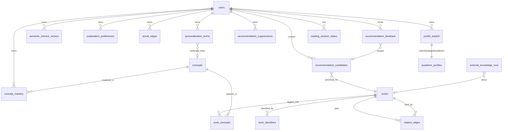

# 用户画像与文献推荐：开发计划与数据关系模型

> 制定时间：2026-08-03
> 范围：在 LiteasyClaw 现有架构上，构建「可信、可解释、可回收」的用户画像（五视图）与混合文献推荐闭环。
> 重点：**数据关系模型**——明确实体、关系、存储分层与现有 schema 的映射。

本计划遵循项目既定约束：Client-First / Local-First、可信优先于流畅幻觉、画像分视图而非单总向量、公共缓存键不含画像、记忆治理不含密钥/高风险指令、可删除贡献、不做近端用户级 LLM 微调。

---

## 1. 背景与目标

### 1.1 现状一句话

- 薄读 2.0 已完成并优化文本生成，可交付下一阶段；性能优化为收尾项。
- 画像「太薄」：仅 `stage`/`disciplines`/`age`/`gender` 等基础字段，年龄/性别/学段对解释个性化的价值有限，缺概念掌握度、解释偏好、多向量兴趣、社交亲和。
- 推荐为 Phase 2 雏形：真实 OpenAlex/Crossref/arXiv 检索 + BM25/RRF/可选 embedding/reranker 已通，但仍有 fixture 兜底；身份解析是临时拼装，未沉淀为 `Work` 实体；社区推荐仅协议边界。
- 记忆与会话内内存为主，缺 SQLite 持久化、过期、显式删除、跨设备同步与写入抽取管线。

### 1.2 目标

1. **画像五视图**落地：显式偏好、概念掌握度（Beta）、解释偏好、语义兴趣（多向量）、社交亲和；只聚合「最小证据且稳定」的模式才成为画像候选。
2. **混合推荐闭环**：公开（OpenAlex 图）+ 私有（本地私有库向量）+ 社区（Intuecho）三路融合，RRF 重排，可解释打分，可回收（隐藏/反馈/删除）。
3. **数据关系模型先行**：以 `Work` 为身份锚点，把身份解析、引用图、候选池、反馈、画像串成一张可演进的图，替换临时拼装。
4. **PersonalizationBrief 投影**：模型只拿到裁剪后的 brief（语言、目标深度、已知/不确定概念、解释风格、avoid），不拿原始画像/嵌入，降 token、防泄漏。

### 1.3 非目标

- 近端不做用户级 LLM 微调（数据量/成本/隐私/删除传播/版本维护均不划算，先证明 ranking/context 个性化天花板）。
- 不做单「总向量」画像。
- 不在本阶段做跨设备同步与组织级画像治理（留 P3）。
- 不伪造社区内容。

---

## 2. 现状评估：已有数据资产

### 2.1 开发云 SQLite（真实关系数据）

| 表 | 字段要点 | 用途 | 复用决策 |
|---|---|---|---|
| `users` | id, email, membership_tier, status | 账号 | 复用，画像/反馈以 `owner_key = user:<id>` 挂靠 |
| `auth_sessions` | token_hash, expires_at | 会话 | 复用 |
| `academic_profiles` | owner_key, stage, disciplines_json, profile_version | 学段+学科 | **扩展为 `profile_explicit` 视图**（保留 stage/disciplines，补 preferredLanguages/goals/preferredDepth/accessibility） |
| `personalization_states` | owner_key, version | 个性化快照版本 | 复用为 brief 投影版本号源 |
| `personalization_terms` | (owner_key, term, weight −4..6) | 加权词条 | **复用为廉价行为信号投影**（signal→term 累加） |
| `recommendation_suppressions` | (owner_key, recommendation_id) | 已隐藏 | 复用 |
| `external_knowledge_runs` | (artifact_id, request_key), status, payload_json | 可恢复外部检索 | 复用，薄读外部知识入口 |

### 2.2 开发云 JSON 文件（demo/缓存，需逐步迁移为关系）

| 文件 | 内容 | 迁移决策 |
|---|---|---|
| `recommendation-candidates.json` | 每 user 候选池（canonicalId/candidateId/qualityGate/identityResolution/rankingFusion/scoreComponents/status，≤1000，30 天 TTL） | **迁为 SQLite `recommendation_candidates`** |
| `recommendation-feedback.json` | 每 user saved/dismissed（≤500） | **迁为 SQLite `recommendation_feedback`** |
| `recommendation-cache.json` | scopeKey → 缓存结果（24h） | 保留为缓存层（公共键不含画像） |
| `organizations.json` | 种子组织 + 治理 fixture | 不在本计划范围 |

### 2.3 桌面端类型与持久化

- `AcademicProfile { age, disciplines, gender, preferredLanguages, researchDatasets, researchMethods, researchTopics, stage }`（`features/profile/profile.types.ts`）。
- `RecommendationItem { identityResolution, rankingFusion, scoreComponents, qualityGate, externalReranker }`（`features/recommendations/recommendation.types.ts`）。
- `PaperIdentity` 优先级链 `doi → arxivId → semanticScholarId → title+authors+year → local_paper_id`。
- 持久化三层：Tauri 命令 / IndexedDB / localStorage（`liteasy.academic-profile.v1` 等）。

### 2.4 主要缺口

1. 无 `Work`/`WorkIdentifier` 锚点，身份解析结果不可复用、不可去重。
2. 无概念目录与概念掌握度（Beta）模型。
3. 无多向量语义兴趣（仅单质心或无）。
4. 无解释偏好与社交边。
5. 行为信号→画像的写入抽取管线缺失（`personalization_terms` 已具备加权机制但无采集 pipeline）。
6. 候选池/反馈为 JSON 整文件重写，不可并发、不可分析。
7. PersonalizationBrief 投影未规范化。

---

## 3. 数据关系模型设计（重点）

### 3.1 设计原则

- **身份锚点**：以规范化的 `Work` + `WorkIdentifier` 作为论文身份，DOI 是标识不是主键（部分论文无 DOI，预印本/会议/期刊版本不同）。
- **分视图**：画像不是一行向量，而是五个独立视图，各带 `source`/`confidence`/`evidence_count`/`updated_at`。
- **可回收**：每条贡献（反馈、隐藏、批注公开）可独立删除；公开授权 ≠ 训练授权，分别可撤销。
- **公共缓存键不含画像**：避免缓存碎片化与隐私泄漏。
- **行为信号投影**：原始事件可丢，只保留稳定的 `personalization_terms` 加权与 `concept_mastery` Beta 更新。
- **存储分层**：关系/身份/反馈/图 → SQLite；嵌入向量 → 本地 LanceDB（或云 Qdrant），SQLite 存元数据索引；缓存 → JSON/KV。

### 3.2 ERD



### 3.3 实体与字段（目标 schema）

> 命名沿用 dev-cloud 既有习惯（`owner_key = user:<id>`）。标注 ✅=已存在（复用）、🆕=新增、🔄=从 JSON 迁移。

#### A. 身份层

**`works` 🆕** —— 规范化论文锚点
```
id TEXT PK,                       -- 内部稳定 id（与 PaperIdentity 解析结果绑定）
title TEXT, year INT, type TEXT,  -- journal_article/preprint/conference/...
canonical_provider TEXT,          -- openalex/crossref/arxiv/local
canonical_id TEXT,                 -- 该 provider 的规范化 id
metadata_json, created_at, updated_at
```

**`work_identifiers` 🆕** —— 一个 Work 多标识，带版本关系
```
work_id FK→works, identifier_kind TEXT,  -- doi/arxiv/semantic_scholar/openalex/crossref/local
identifier_value TEXT,
relation TEXT,                           -- is_version_of/has_version/is_preprint_of/same_as
source_provider TEXT, verified_at,
PRIMARY KEY(work_id, identifier_kind, identifier_value)
```
> 解析链优先级 `doi → arxiv → semantic_scholar → title+authors+year → local` 落为多行 `work_identifiers`；版本关系（预印本 vs 出版）显式存 `relation`，而非用 DOI 当主键硬并。

#### B. 引用图层

**`citation_edges` 🆕** —— 物化引用图（个性化去重与图谱定位用）
```
source_work_id FK→works, target_work_id FK→works,
relation_type TEXT,        -- cites/cited_by/related/is_version_of
source_provider TEXT,     -- openalex（唯一可信图来源）/crossref(仅topic_search不可入图)
verified BOOLEAN, weight, fetched_at,
PRIMARY KEY(source_work_id, target_work_id, relation_type)
```
> 仅 OpenAlex `referenced_works` 等可验证字段可产出 `cites/cited_by/related`；Crossref 永远是 `topic_search`，不入图。模型不可猜测关系。

#### C. 画像视图层

**`profile_explicit` 🔄（扩展自 `academic_profiles`）**
```
owner_key PK, stage, disciplines_json, profile_version,
preferred_languages_json, research_domains_json, goals_json,
preferred_depth TEXT, accessibility_json,
updated_at
```
> 保留既有 stage/disciplines；新增语言/域/目标/深度/可访问性。年龄/性别**不默认进排序**，仅作冷启动弱信号。

**`concept_mastery` 🆕** —— Beta 分布概念掌握度
```
owner_key, concept_id FK→concepts,
alpha REAL, beta REAL,                  -- Beta(α,β) 后验
evidence_count INT,                     -- 累计证据数
mean REAL, uncertainty REAL,            -- α/(α+β), 派生
corrected_by_user BOOLEAN,              -- 用户可手动纠正
last_seen_at, updated_at,
PRIMARY KEY(owner_key, concept_id)
```
> 用户可纠正；纠正后该概念冻结自动更新或降权。可解释：每条掌握度都有 `evidence_count` 支撑。

**`concepts` 🆕** —— 概念目录（多来源）
```
id PK, label, source,        -- discipline_catalog(学科目录)/openalex_topic/user_derived
source_id, parent_concept_id,  -- 学科目录树/主题层级
created_at
```
> 复用 `LiteasyClaw/shared/disciplineCatalog.json`（研究生教育学科专业目录 2022）作为 `source=discipline_catalog` 种子。

**`semantic_interest_vectors` 🆕** —— 多向量兴趣（非单质心）
```
owner_key, vector_id PK,
embedding_json BLOB,          -- 或 LanceDB 外键 ref
source,                       -- paper_opened/recommendation_saved/search/explicit
source_ref, ttl_expires_at, weight, updated_at
```
> 多主题向量，各带 source 与 TTL；过期自动淘汰；只有「最小证据且稳定」才晋升为画像候选。

**`explanation_preferences` 🆕**
```
owner_key PK,
abstraction, math_density, analogy_preference, historical_context,
implementation_detail, evidence_visibility, brevity,  -- 各偏好维度
source, confidence, evidence_count, updated_at
```

**`social_edges` 🆕**
```
owner_key, target_kind,         -- user/annotation/intuition
target_ref, edge_type,          -- follow/trust_intuition/co_read/helpful_reaction/block
weight, created_at, revoked_at,
PRIMARY KEY(owner_key, target_ref, edge_type)
```
> `block` 为硬过滤；其余为软亲和。社区推荐 P1 PageRank、P2 LightGCN 用。

**`reading_session_states` 🆕** —— 会话态与长期画像分离
```
owner_key, session_id, paper_id, focus, depth, started_at, ended_at
```
> 当前阅读态不污染长期向量。

#### D. 推荐层

**`recommendation_candidates` 🔄（从 JSON 迁移）**
```
owner_key, canonical_work_id FK→works, candidate_id,
discovery_count, quality_gate, identity_resolution_json,
ranking_fusion, score_components_json, status,  -- new/seen/saved/dismissed/stale
first_seen_at, expires_at,
PRIMARY KEY(owner_key, canonical_work_id)
```
> ≤1000/用户、30 天 TTL 保留；身份解析结果写回 `work_identifiers`，不再每条重复存。

**`recommendation_feedback` 🔄（从 JSON 迁移）**
```
id PK, owner_key, canonical_work_id FK→works,
action,           -- saved/dismissed/expanded/cited
source, title, context_json,
created_at, revoked_at
```
> 反馈既驱动 `personalization_terms`/`concept_mastery` 更新，也驱动候选池状态与缓存失效。

#### E. 投影层

**`personalization_briefs` 🆕（视图，非原始画像存储）**
```
owner_key, brief_version, language, target_depth,
known_concepts_json, uncertain_concepts_json,
explanation_style_json, avoid_json,
projected_from_state_version, created_at
```
> 由 `personalization_states.version` 触发重算；模型 prompt 只注入 brief，不注入原始画像/嵌入。

### 3.4 关系不变量与约束

- `work_identifiers(work_id, kind, value)` 唯一；一个 Work 可多标识；版本关系显式 `relation`。
- `citation_edges` 仅 `source_provider=openalex` 且 `verified=true` 可为 `cites/cited_by/related`。
- `recommendation_candidates` 最多 1000/用户、30 天 TTL；命中后 `work_identifiers` 复用，不再重复存解析。
- 公共推荐缓存键 = `sessionId::workspaceKey::selectionKey::sortMode::personalizationVersion`（**不含原始画像内容**，仅版本号）。
- `concept_mastery` 用户纠正后置 `corrected_by_user`，自动更新冻结或降权。
- 画像写入必须先过 prompt-injection/越权扫描（多用户场景需 namespace 过滤后再相关性排序）。
- `external_knowledge_runs` 始终以 `artifact_id` 为边界；`PaperIdentity` 只用于跨产物「同一篇」识别，不替代 `artifactId`。

---

## 4. 分阶段开发计划

> 每阶段都先落数据模型，再上 pipeline，最后接 UI；与薄读既有质量门风格一致：无证据即停。

### P0 —— 身份锚点 + 画像采集管线 + 真实推荐去 fixture（2–3 周）

**数据模型落地**
- 🆕 建迁移 `003_works_and_identity.sql`：`works`、`work_identifiers`、`citation_edges`。
- 🆕 建 `004_concept_catalog.sql`：`concepts`，从 `disciplineCatalog.json` 播种 `source=discipline_catalog`。
- 🔄 迁 `recommendation_candidates` / `recommendation_feedback` 为 SQLite（迁移 `005_recommendation_relational.sql`），保留 JSON 导出兜底。
- 复用 `academic_profiles` → 新增列扩为 `profile_explicit` 视图（迁移 `006_profile_explicit.sql`）。

**Pipeline**
- 新增 `identityResolutionService`：把 `PaperIdentity` 解析结果落 `works`/`work_identifiers`，去重复用；薄读与推荐共用。
- 新增 `personalizationSignalPipeline`：`paper_opened`/`recommendation_saved`/`recommendation_dismissed` → `personalization_terms` 加权（复用既有 −4..6 机制）+ `recommendation_feedback` 写入 + 候选池状态更新 + 缓存失效。
- 推荐链去 fixture：默认走 `buildLiveRecommendationPayload`，`demo` 模式仅显式开关下生效；身份解析走 `works` 复用。

**端点（dev-cloud）**
- `POST /v1/works/resolve`（幂等身份解析，返回 `work_id` + 标识集）。
- 复用 `POST /v1/personalization/signal`，扩展落库。
- `POST /v1/recommendations` 复用，内部走新身份服务。

**桌面端**
- `features/recommendations` 与 `features/thin-reading` 的外部知识客户端改为先查本地 `works` 缓存再回源。
- `features/profile` 表单补 preferredLanguages/goals/preferredDepth。

**验收**：fixture 推荐仅在 `recommendationMode=demo` 出现；身份解析二次请求命中 `works`；反馈后缓存失效且 `personalization_terms` 权重变化可查。

### P1 —— 概念掌握度 + PersonalizationBrief 投影 + 多向量兴趣（3–4 周）

**数据模型落地**
- 🆕 `007_concept_mastery.sql`：`concept_mastery`、`semantic_interest_vectors`、`explanation_preferences`、`reading_session_states`。
- 🆕 `008_personalization_brief.sql`：`personalization_briefs`（视图表，按 `personalization_states.version` 重算）。

**Pipeline**
- `conceptMasteryService`：从薄读「概念出现/用户下钻/用户纠正」事件更新 Beta(α,β)（证据+1 → α；用户跳过/纠正 → β）。
- `semanticInterestService`：`recommendation_saved`/`paper_opened` 的论文 `work_concepts` 嵌入取均值/加权产出一个兴趣向量（多向量，带 TTL），存 LanceDB（本地）或 JSON 兜底。
- `personalizationBriefProjector`：聚合五视图 → 裁剪 brief（语言、目标深度、已知/不确定概念、解释风格、avoid），写入 `personalization_briefs`。

**集成**
- `agent-core.prepareTurn` 注入当前用户的 `PersonalizationBrief`（非原始画像）。
- 薄读 prompt 用 brief 选「下钻深度/解释风格」；公共缓存键用 brief 版本号。

**验收**：brief 不含原始嵌入/敏感字段；概念掌握度可解释（evidence_count > 0 才稳定）；兴趣向量过期淘汰生效；用户纠正冻结自动更新。

### P2 —— 混合推荐闭环 + 社交图（4–5 周）

**数据模型落地**
- 🆕 `009_social_edges.sql`：`social_edges`。
- 完善 `citation_edges` 物化（从 OpenAlex `referenced_works` 批量补图）。
- `work_concepts` 表（`works` ↔ `concepts`，OpenAlex topic 映射）。

**Pipeline**
- **公开路**：OpenAlex 引用图（cited_by/cites/related）→ 候选。
- **私有路**：本地私有库向量相似（LanceDB，基于 `semantic_interest_vectors`）→ 候选。
- **社区路**：Intuecho `/v1/thin-reading/recommendations:query`（按 `PaperIdentity`），`intuecho_community` 源显式标注。
- **融合**：RRF（`recommendation-ranking-fusion/v1` 已有）+ 可选 embedding/reranker；社交 `block` 硬过滤。
- **社区排序 P0 规则**：`score = 0.30 semanticMatch + 0.20 prerequisiteMatch + 0.15 explanationStyleMatch + 0.15 socialTrust + 0.15 quality + 0.05 freshness − redundancyPenalty`。

**社交图演进**
- P1：显式 follow/trust 上的 Personalized PageRank。
- P2：稳定反馈上 LightGCN（时间切分离线 eval、冷启动/曝光偏差处理、贡献可删、多样性约束）。

**验收**：三路来源可区分标注；`block` 硬过滤生效；公开缓存键不含画像；社区未连接时空面板不伪造。

### P3 —— 治理、删除传播与跨设备同步（规划态，本计划不实施）

- 画像/反馈/社交边的删除传播（含 `recommendation_candidates` 级联、向量库删除）。
- 公开授权与训练授权分离、可撤销；`pending_public` 仅真实后端返回 id 后置 `synced`。
- 跨设备：云端只存元数据 + 可选加密向量；本地 SQLite/LanceDB 为主。
- 能力单一真源：`CapabilityAvailability` 区分 `executable/missing_handler/planned/disabled`，planned 不被误读为已实现。

---

## 5. 与现有架构的集成点

| 层 | 落点 | 改动 |
|---|---|---|
| dev-cloud `db/migrations/` | 新增 003–009 | 见 P0–P2 |
| dev-cloud `db/*Repository.mjs` | 新增 `workRepository`/`conceptMasteryRepository`/`socialEdgeRepository`/`recommendationCandidateRepository`(迁)/`recommendationFeedbackRepository`(迁) | SQLite 驱动 |
| dev-cloud `payloads/recommendationPayloads.mjs` | `buildLiveRecommendationPayload` 改走 `workRepository` 身份复用 | 去重、去 fixture |
| dev-cloud `payloads/externalKnowledgePayloads.mjs` | 解析结果写回 `works`/`work_identifiers`/`citation_edges` | 图沉淀 |
| dev-cloud 新增 `payloads/personalizationBriefPayloads.mjs` | brief 投影构建 | 投影 |
| 桌面 `features/profile/` | `AcademicProfile` 扩字段；接入 brief | 五视图采集入口 |
| 桌面 `features/recommendations/` | `recommendationRuntime` 走新身份服务与三路融合 | UI 标注来源 |
| 桌面 `features/thin-reading/` | 外部知识客户端先查 `works` 缓存；prompt 注入 brief | 复用身份 |
| 桌面 `controllers/agent/` | `agent-core.prepareTurn` 注入 `PersonalizationBrief` | 个性化上下文 |
| 持久化 | 新关系数据走 dev-cloud SQLite；本地画像可选桌面 SQLite/LanceDB spike | 分层 |

---

## 6. 隐私与治理约束（强制）

1. **无密钥泄漏**：OpenAlex key 仅 `X-OpenAlex-Api-Key` 私有头 → dev-cloud 转查询参，绝不进 artifact/cache/prompt/log/test。`.env.openalex.local` gitignored。
2. **记忆治理**：不存 API key/token/高风险指令/未授权私有文件内容；写入先过 prompt-injection/越权扫描；多用户 namespace 过滤后再相关性排序。
3. **可删除**：每条反馈/隐藏/社交边/批注公开可独立删除；删除传播到候选池与向量库；公开授权与训练授权分离、可撤销。
4. **公共缓存键不含画像**：仅含 `personalizationVersion`，防碎片化与泄漏。
5. **社区不伪造**：`pending_public` 未真实后端返回 id 前不置 `synced`；未连接时空面板。
6. **可信优先**：无可用证据/无可信外部源/质量门连续失败 → 停止并给原因，不输出本地拼接「成功」。
7. **不做用户级 LLM 微调**：先证明 ranking/context 个性化天花板。

---

## 7. 验收与测试

- **迁移测试**：每个 `.sql` 配 `*.test.mjs`（`node --test`），断言表/约束/默认值；`demo-reset` 不动 SQLite 账号与画像真实数据。
- **身份解析**：二次解析同论文命中同一 `work_id`；版本关系（预印本 vs 出版）正确落 `relation`。
- **画像采集**：信号 → `personalization_terms` 权重变化可查；反馈 → 缓存失效 + 候选池状态迁移。
- **brief 投影**：brief 不含原始嵌入/敏感字段；版本号随 `personalization_states.version` 递增。
- **概念掌握度**：Beta 更新数学正确；用户纠正冻结自动更新；`evidence_count` 可解释。
- **推荐闭环**：三路来源标注可区分；`block` 硬过滤；公开缓存键不含画像；fixture 仅 `demo` 模式。
- **薄读联动**：外部知识客户端命中 `works` 缓存；prompt 注入 brief 后深度/风格可观测变化。
- **活测脚本**：沿用 `test:thin-reading-*-live` 模式，新增 `test:recommendation-live-eval`、`test:identity-resolution-live-eval`，`requireLive: true`，mock 端点必须报错停止。
- **桌面端**：受影响 feature 配 focused Vitest；UI 改动附截图；提交前 `npm run build`。

---

## 8. 风险与开放问题

1. **向量库选型**：本地 LanceDB vs 云 Qdrant。本计划 P1 先 JSON 兜底，P2 spike LanceDB；需确认 Tauri 打包体积与跨平台 native 依赖影响。
2. **概念目录覆盖**：学科目录偏中国学位体系，OpenAlex topic 偏国际；二者映射需人工对齐，冷启动可能稀疏。
3. **社交数据稀疏**：早期无社交边，P2 LightGCN 难发挥；P0/P1 规则排序为主，社交演进待社区冷启动。
4. **删除传播成本**：向量库删除可能昂贵，需明确「软删除 + 异步压实」策略。
5. **反馈偏差**：saved/dismissed 受曝光偏差影响；P2 需时间切分离线 eval 与多样性约束。
6. **桌面本地 SQLite**：当前桌面持久化为 Tauri/IndexedDB/localStorage，引入本地 SQLite（与 dev-cloud 同构 better-sqlite3 或 Tauri sql 插件）需评估 Rust 侧集成。
7. **brief token 预算**：brief 注入 prompt 需控 token，避免挤占薄读证据预算。

---

## 9. 阶段交付物清单

- P0：迁移 003–006；`workRepository` + `identityResolutionService`；推荐去 fixture；`personalizationSignalPipeline`；`POST /v1/works/resolve`。
- P1：迁移 007–008；`conceptMasteryService` + `semanticInterestService` + `personalizationBriefProjector`；`agent-core` 注入 brief。
- P2：迁移 009；`work_concepts` + `citation_edges` 物化；三路融合 + 社交规则排序；PageRank/LightGCN 演进。
- P3（规划）：删除传播、公开/训练授权分离、跨设备同步。
