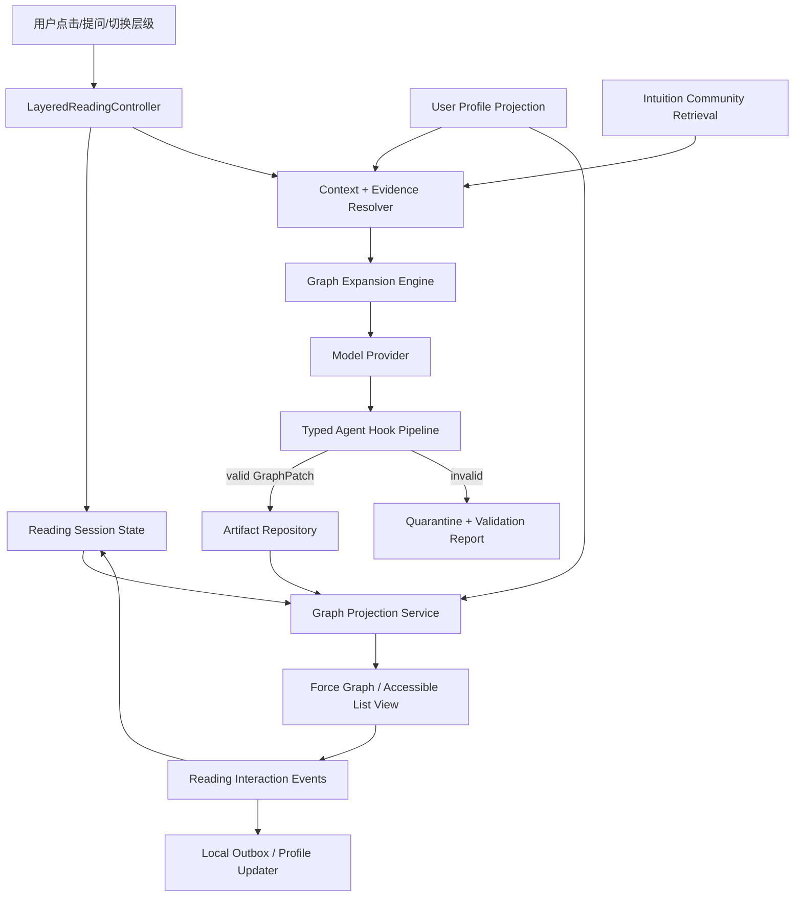

# Liteasy「直觉语言池」与渐进式论文解读工程方案

> 日期：2026-07-25
> 状态：工程思路与 MVP 设计
> 适用范围：LiteasyClaw 桌面端、Agent Runtime、dev-cloud，以及后续 Intuition Community
> 说明：许可证结论是工程选型建议，不替代正式法律审查；实际引入依赖时仍需锁定版本、检查传递依赖并生成 SBOM。

## 1. 结论先行

这个产品设想在工程上可行，并且能自然接入 LiteasyClaw 已有的论文分析、Artifact、Generative UI、Agent Runtime 和本地/云端数据边界。

建议把产品实现概括为四个相互独立、可以分阶段交付的系统：

1. **通用论文认知图**：从论文证据中生成一份非个性化、可复用的认知骨架。
2. **渐进式阅读投影**：根据用户当前关注对象、显式层级和交互轨迹，选择显示哪些节点，并按需生成下一层解释。
3. **直觉语言池**：用户围绕同一研究对象公开自己的“直觉表达”，形成可检索、可排序、可引用的社区内容。
4. **个性化与社会关系层**：把知识掌握、解释偏好、语义兴趣和社会关系分开建模，用于排序与生成上下文，而不是压缩成一个不可解释的“用户总向量”。

核心工程判断如下：

- “像 HNSW”适合作为**上层稀疏、下层稠密、由粗到细导航**的交互隐喻，但不应直接把 HNSW 当成内容存储模型。HNSW 本质上是近似最近邻搜索索引，其层级节点由概率和距离尺度决定，不表达论文的论证层级。[HNSW 原论文](https://arxiv.org/abs/1603.09320)
- 论文内容应存为**带层级约束的有向图**：展开关系形成近似树，概念复用、反例、历史继承和证据支持允许形成交叉边。
- 最薄层不能只有“直觉”。默认首屏应同时提供：
  - 核心结论；
  - 关键推导或成立机制；
  - 历史坐标；
  - 明确标注来源的“直觉语言薄”。
- 不一次生成所有深度。首次只生成稳定的 L0/L1 骨架；用户在节点上显式选择“展开”时生成局部 `GraphPatch`，而不是重写整张图。
- 呈现采用类似 Obsidian Graph View 的**力导向关系图**，而不是把内容画成一棵显式树。节点保持紧凑，hover/focus 高亮邻域，点击进入局部图或详情。
- UI 必须分开两个容易混淆的维度：
  - `semanticLevel`：L0–L4，控制内容从“薄”到“厚”的抽象深度；
  - `graphRadius`：1–N hop，控制以当前节点为中心显示多远的拓扑邻域。
- Agent 输出不能直接进入持久化或 React 渲染。必须经过：
  - 语法解析；
  - Schema 校验；
  - 图结构与证据语义校验；
  - 安全与资源预算校验；
  - 受限修复；
  - 原子提交。
- `idea/customized-graph-lan.txt` 的“节点声明 + 节点块 + `to(...)` 出边”骨架可以直接发展成 `CGL v1`。Agent 可输出该文本语言，但**规范事实源仍是 parser 产生的版本化 AST/JSON**，不能把未解析文本当数据库唯一事实源。
- 首版不需要用 LangChain/Mastra 替换现有 Agent Runtime。最合适的增量组合是：
  - 现有 AgentCore/Runtime；
  - Zod 或 JSON Schema 作为运行时类型边界；
  - React Flow + d3-force 实现 Obsidian 风格的小规模力导向图；
  - Chevrotain 解析 CGL 文本；
  - 当工作流确实需要跨进程恢复、分支和人工中断时，再对 LangGraph.js 做隔离式 spike。

## 2. 当前工程基线与缺口

### 2.1 已有能力

当前代码并不是从零开始，以下能力可以直接复用：

- `paper-analysis` 已有 `AnalysisRun`、`Evidence`、`Claim`、覆盖率和证据预算。
- `artifacts` 已有 `tree`、`mindmap`、`comparison_table` 等类型，以及 `outlineNodes`。
- `liteasy.agent-artifact/v1` 已能保存回答、引文、分析结果、结构化节点和 UI DSL。
- `generative-ui` 已有组件注册表、数据源注册表、UI DSL、确定性 validator、UX validator 和安全 fallback。
- `agent-runtime` 已有计划校验、Policy、执行日志、确认和事件。
- 桌面端已有 Artifact 本地目录快照；dev-cloud 的 SQLite migration 已定义 `artifacts`、`artifact_versions`、`generation_runs` 和 `generation_steps`。
- dev-cloud 已有 Node 20、better-sqlite3、账号与会话边界。

这意味着新能力应该沿着既有依赖方向扩展：

```text
layout
  -> controllers
    -> layered-reading / intuition-community / artifacts
      -> paper-analysis / retrieval / generative-ui / shared contracts
```

不能把跨模块的渐进生成、社区排序或画像装配继续堆进 `AppShell`、`ArtifactTabs` 或单个 feature hook。

### 2.2 关键缺口

当前实现与目标之间主要有七个缺口：

1. `Paper` 只有 `id/title/sourcePath`，没有 DOI、arXiv、PMID、版本关系或稳定的内部 `workId`。
2. `ArtifactOutlineNode` 只有 label、kind、parent 和 evidenceIds，不足以表达层级、悬停内容、展开状态、关系类型、直觉来源和版本。
3. 当前树形输出依赖 Markdown unordered list；它适合流式预览，不足以作为严格图协议。
4. UI DSL validator 校验了组件和 props，但没有论文图的领域语义校验。
5. Artifact 本地 JSON 快照、dev-cloud 文件产物和 SQLite 业务表尚未收敛为统一的版本化仓储。
6. 当前画像只有年龄、性别、学段；这既太薄，也不是解释个性化最有价值的信号。
7. 当前推荐是文献级 mock/缓存，没有用户—直觉条目—论文—概念之间的社会图。

### 2.3 关于现有自定义语法文件

`idea/customized-graph-lan.txt` 已给出一个足够清楚的最小语言骨架：

```cgl
Node A
Node B

A {
    level=0
    description:"xxxx"
    to(target=B, description="xxx")
}
```

它已经表达了三件关键事情：

1. `Node A` 声明节点；
2. `A { ... }` 为节点补充属性；
3. `to(...)` 以源节点为局部上下文声明出边。

这个方向比重新发明一套 `edge A -> B` 语法更贴近渐进生成：Agent 可以先声明一个只有名字的未展开节点，之后再补充它的节点块。本文把它正式化为 `CGL v1`（Customized Graph Language v1），保持原文件可作为合法的最小输入，只补足版本、类型、证据、悬停内容和确定性语义。

当前草案仍有一些必须由规范消除的歧义：

- ID、字符串、数组、注释和转义的词法尚未定义；
- `=` 与 `:` 的用途需要固定；
- 未定义节点、重复声明/属性和重复边的处理方式不明确；
- 节点/边类型、证据、来源、置信度和可展开状态尚缺失；
- 没有 document version、work、root 和 patch revision；
- `to(...)` 的默认关系、层级单调性和环路约束尚未定义。

建议保留 `idea/customized-graph-lan.txt` 作为设计种子，不由运行时直接读取。正式文法、schema 和 golden fixtures 应进入产品模块和测试目录。

### 2.4 现有 Agent Runtime 工程评估

现有 Agent 不应被视为需要推倒重写的原型。它已经是一套安全优先、能力受控的学术工作台 Agent Runtime；但它还不是一个可以动态加载任意 Skill、Plugin 和 MCP Server 的通用自治 Agent 平台。

截至 2026-07-25，基于代码与测试的工程判断如下：

| 维度 | 判断 | 说明 |
| --- | --- | --- |
| Runtime / Public API 架构 | 强 | 已有版本化 API、Session、Run、事件流、幂等、确认、取消，以及 frontend/CLI/MCP adapter |
| 安全与执行治理 | 强 | 已有计划校验、Action Schema、Policy、人工确认、Journal、失败恢复信息和有限逆动作回滚 |
| 当前功能闭环 | 中 | 命令、问答、多论文分析、Artifact 生成、UI DSL 和 JSON 持久化已有真实主链，但部分注册能力没有生产 handler |
| 内部能力可扩展性 | 中偏弱 | Action、Intent、Skill 和 UI 组件仍以封闭 TypeScript 联合、静态 registry 和中央 dispatcher 为主 |
| AgentCore / Memory / Plugin / MCP | 设计领先于实现 | 上下文装配已经存在，但长期 Memory、动态 Plugin、外部 MCP 消费和能力发现尚未形成生产闭环 |
| 生产可用性 | 待收口 | dev-cloud 稳定度较好；桌面端构建、全量测试、取消传播和契约一致性仍有明确缺口 |

#### 已经可以复用的 Agent 主链

当前主链不是“聊天框外包一层 Prompt”，而是：

```text
AgentPublicApi
  -> session/run/idempotency/event stream
  -> AgentCore context preparation
  -> rule/model semantic planner
  -> plan + action schema validation
  -> policy / clarification / confirmation
  -> registered action execution
  -> execution journal + Generative UI
  -> artifact / state persistence
```

具体可复用边界包括：

- `features/agent-api/agentApi.types.ts` 已定义 `liteasy.agent/v1`，消费者包括 frontend、CLI 和 MCP。
- `controllers/agent/agentApplicationService.ts` 通过 ports 隔离 command、knowledge、confirmation、context 和 state store，并实现 Session、Run、幂等键、事件序列、取消和重启恢复。
- `features/agent-runtime/modelSemanticPlanner.ts` 先保留确定性计划，高风险计划不交给模型改写；模型输出最多尝试两次，随后经过结构化解析和计划校验，失败退回 rule plan。
- `features/agent-runtime/policyEngine.ts` 与 `planExecutor.ts` 已把未知动作拒绝、上下文澄清、高风险确认、顺序执行、Journal 和逆动作回滚分开。
- `controllers/agent/createDesktopAgentService.ts` 把 command runtime 与 knowledge generation 放在不同 executor 中，因此认知图生成可以新增独立 application port，而不必塞进命令 Action dispatcher。
- Artifact 已具备“分析—审计—UI DSL—保存—恢复”的 happy path；dev-cloud 的 `agentArtifactRepository.mjs` 使用同目录临时文件和 rename 原子发布 JSON。

因此，CGL、Graph Hook 和 Layered Reading 应作为新领域能力接入现有 Agent API 与 controller，而不是替换整个 Runtime。

#### 当前扩展机制的真实边界

现有扩展性在 API 外层较好，在 Capability 内层仍然偏静态：

1. `RuntimeActionInvocation` 和 `SemanticActionPlan.intentId` 是封闭联合类型。
2. 新 Action 通常需要同步修改 action metadata、中央 `executeAction`、controller 参数、`AppShell` handler、planner/policy 和测试。
3. `features/extensions/extensionProtocol.ts` 当前会为已有能力构造和校验 handler/policy/journal/test 契约，但不会发现、加载或注册外部扩展包。
4. `features/skills/skillRegistry.ts` 只有少量静态 Skill wrapper，本质仍是转发到 `executeAction`。
5. `agentCoreConfig.ts` 中 Plugin 和 MCP Server 目前主要是状态目录与 Prompt 摘要；`agentMcpAdapter.ts` 的作用是把 Liteasy Agent 暴露为 MCP tools/resources，不是让 Agent 动态消费外部 MCP Server。

这意味着 P0 不应先建设一套通用插件市场，但需要把“能力声明”和“真实可执行性”收敛为单一事实源。至少应区分：

```ts
type CapabilityAvailability =
  | "executable"
  | "missing_handler"
  | "planned"
  | "disabled";
```

Planner、Public API、AgentCore Prompt 和 UI 只能向模型或用户暴露当前 `executable` 的能力；planned capability 不能只凭 registry metadata 被误认为已经实现。

#### 已证实的功能缺口

- `artifact.open_tab` 已在 `AppShell` 的 `runtimeActionContext` 中实现，但 `useAssistantAgentController` 的输入与 runtime 装配没有传入该 handler。`layout.set_ratio`、`pane.focus`、`recommendation.refresh`、`collection.add` 等能力也需要逐一核验生产接线。
- `workspace.delete_documents`、`workspace.overwrite_documents`、`workspace.batch_update_documents`、`cloud.upload_documents`、`cloud.sync_workspace` 虽有风险元数据和确认路径，但 `executeAction` 最终仍明确要求尚未提供的 approved high-risk handler。
- Agent Memory 当前是会话内数组和关键词/重要性排序；生产代码没有调用 `remember()`，Agent state snapshot 也没有持久化 Memory 与 budget observation。
- `artifact-generate` Skill ID 与 `artifact.generate` Action ID 已发生测试契约漂移，说明 Skill、Action 和 Capability 的 ID 映射需要显式建模，不能依赖字符串近似。
- Agent 的 `AbortController` 可以把 Run 标为 cancelled，但 `GenerateAnswerInput`、`ModelTransportRequest` 和底层 fetch 没有携带 `AbortSignal`。已经发出的模型请求可能继续运行和计费，流 reader 也不会主动 cancel。
- 多论文检索目前主要依赖关键词、标签、标题和摘要评分；最终综合回答会形成一个关联全部 evidence 的大 Claim。它可以支持 MVP，但不是逐命题 Claim–Evidence entailment。
- 本地 answer audit 主要检查回答长度、是否存在引用和 retrieval confidence；HTTP auditor 失败时会退回该弱审计，因此不能把当前 audit verdict 当成研究级事实核验。
- 当前 Generative UI 的 `MindMap`、`TreeOutline` 最终渲染为递归 `<details>/<ul>`，并非 Obsidian 风格的力导向关系图。CGL Graph 必须拥有独立 AST、投影、布局和交互模块。
- dev-cloud migration 已定义 `artifact_versions`、`generation_runs` 和 `generation_steps`，但当前 Agent Artifact 生产仓储仍是 JSON 文件；CGL revision、GraphPatch transaction 和 Hook step 还没有接入这些表。

#### 当前验证基线

本次审计实际运行了以下验证：

```text
LiteasyClaw/services/dev-cloud npm test
  -> 60 / 60 passed

LiteasyClaw/desktop Agent 核心定向测试
  -> 167 / 168 passed
  -> 唯一失败：测试期待 artifact.generate，实际 capability summary 为 artifact-generate

LiteasyClaw/desktop npm test
  -> 564 / 648 passed
  -> 16 个 test files 失败
  -> 部分失败来自 .env.local 覆盖测试模型/端口，以及已经变化的 UI 文案和结构断言

LiteasyClaw/desktop npm run build
  -> failed
  -> PdfReader.tsx 中 stageElement 被 TypeScript 判定为 possibly null
```

全量测试失败不能全部归因于 Agent Runtime；其中既有本地环境污染，也有 UI 契约过期。但在构建和测试重新变绿前，不能把当前状态称为可交付基线。

#### 对本方案的直接结论

1. 保留现有 AgentPublicApi、Application Service、Planner、Policy、Journal 和 Generative UI 安全边界。
2. 不把 CGL parser、Graph revision、布局或社区排序塞入 `actionRegistry`。
3. 新增独立的 `intuition-graph`、`layered-reading` 和 Hook Pipeline，由 controller 编排，Agent Runtime 只负责选择任务和传递受控上下文。
4. `UIDslDocument` 继续作为安全渲染投影；`IntuitionGraphDocument`/`GraphPatch` AST 才是版本化事实源。
5. 在开始真实模型的 CGL vertical slice 前，先完成第 16 章的 Agent 基线收口。

## 3. 产品模型：不是“显式树”，而是渐进式认知投影

### 3.1 五个阅读层级

层级不是“内容质量”或“用户水平”的排名，而是当前解释所需的解析度。

| 层级 | 用户要解决的问题 | 默认内容 | 典型规模 |
| --- | --- | --- | --- |
| L0 鱼/坐标 | 这篇论文到底给了我什么？ | 一句话核心结论、历史位置、1–3 条直觉表达 | 3–6 个节点 |
| L1 概念骨架 | 它靠哪些关键概念成立？ | 研究问题、关键假设、核心机制、主要结果 | 5–12 个节点 |
| L2 机制与推导 | 方法具体怎样运转？ | 数据流、关键推导、算法步骤、组件关系 | 当前分支 4–10 个节点 |
| L3 证据与边界 | 为什么应当相信它？ | 实验、基线、指标、消融、失败模式、局限 | 当前分支 4–12 个节点 |
| L4 原文锚点 | 我需要复核哪个细节？ | 公式、表格、页码、bbox、原文 quote、复现信息 | 按需加载 |

L0 的“最薄”不是只有一句玄妙比喻。它要把“鱼”和最少量的“筌”并排呈现：

```text
核心结论             关键成立机制
历史坐标             直觉语言薄
```

### 3.2 层级是视图属性，不是永久分类

同一概念对不同用户可能处在不同层：

- 对信息检索研究者，“MaxSim”可能属于 L0/L1；
- 对刚接触检索的学生，它可能需要在 L2 才出现；
- 对正在复现实验的人，同一个节点应直接投影出 L3/L4 证据。

因此数据库中的节点应保存建议的 `baseLevel` 和先修关系，而用户界面保存当前 `projectionLevel`。不要把所有人的阅读深度写死在公共图里。

### 3.3 点击次数只是信号，不是深度本身

只按点击次数推断深度会产生明显误判：

- 用户可能是在寻找入口，不是在要求更深；
- 反复返回可能表示困惑；
- 点击引用可能是在核验，不是在学习下一层；
- 用户可能显式选择“只看结论”或“看公式”。

推荐的优先级：

```text
用户显式层级/问题
  > 当前选中对象和动作类型
  > 当前路径深度
  > 展开次数、停留区间、返回和比较行为
  > 长期解释偏好
```

可先用可解释规则计算 `DepthIntent`：

```text
DepthIntent =
  explicitLevel
  ?? clamp(
       inferredNodeLevel(selectedNode)
       + expandPressure
       + evidenceSeeking
       - backtrackPenalty,
       0,
       4
     )
```

`inferredNodeLevel` 对完整节点取 `baseLevel`；对 stub 优先取 `suggestedLevel`，否则由最近的入向 `expands` 父节点加一并截断到 L4。该值只作为 prompt 和排序输入，不能据此修改用户长期画像。

## 4. 总体架构



架构上最重要的分离是：

```text
论文事实与证据
  != 公共认知图
  != 社区直觉表达
  != 用户私有画像
  != 当前会话投影
```

如果混成一个向量库或一个大 JSON，后续将无法解释“为什么显示这条内容”、无法删除用户数据，也无法在论文版本变化后正确失效缓存。

## 5. 认知图领域模型

### 5.1 图不是纯树

推荐使用“展开边受层级约束、其他边可交叉”的有向多重图：

- `expands`：从略到详，目标层级必须更深；
- `explains`：A 解释 B；
- `supports`：证据或结果支持 claim；
- `contradicts`：反例、冲突或实验不一致；
- `requires`：先修概念；
- `compares`：并列比较；
- `derived_from`：推导或历史继承；
- `intuits`：直觉表达指向它所解释的概念；
- `cites`：指向论文证据锚点。

只有 `expands` 边需要保持无环。其他关系允许构成图。

### 5.2 Canonical AST

建议新增独立协议，而不是继续扩大 `UIDslDocument`：

```ts
type IntuitionGraphDocument = {
  version: "liteasy-intuition-graph/v1";
  id: string;
  workId: string;
  rootNodeId: string;
  revision: number;
  nodes: IntuitionGraphNode[];
  edges: IntuitionGraphEdge[];
  provenance: GraphProvenance;
};

type IntuitionGraphNode =
  | IntuitionGraphStubNode
  | IntuitionGraphCompleteNode;

type IntuitionGraphStubNode = {
  id: string;
  status: "stub";
  label: string;
  suggestedLevel?: 0 | 1 | 2 | 3 | 4;
  expandable: true;
  tags: string[];
};

type IntuitionGraphCompleteNode = {
  id: string;
  status: "complete";
  kind:
    | "thesis"
    | "historical_coordinate"
    | "intuition"
    | "concept"
    | "mechanism"
    | "derivation"
    | "experiment"
    | "limitation"
    | "evidence"
    | "gap";
  baseLevel: 0 | 1 | 2 | 3 | 4;
  label: string;
  summary: string;
  hover?: {
    text: string;
    evidenceIds?: string[];
    prerequisiteNodeIds?: string[];
  };
  evidenceIds: string[];
  source:
    | { type: "paper"; analysisRunId: string }
    | { type: "community"; intuitionNoteId: string; authorId: string }
    | { type: "user"; localNoteId: string }
    | { type: "system"; ruleId: string };
  confidence?: number;
  expandable: boolean;
  tags: string[];
};

type IntuitionGraphEdge = {
  id: string;
  sourceNodeId: string;
  targetNodeId: string;
  kind:
    | "expands"
    | "explains"
    | "supports"
    | "contradicts"
    | "requires"
    | "compares"
    | "derived_from"
    | "intuits"
    | "cites";
  label?: string;
  hover?: string;
  evidenceIds: string[];
};
```

`IntuitionGraphDocument` 是领域事实；`UIDslDocument` 只是把经过选择的节点投影到 `center_artifact`。这样可以继续遵守现有“UI DSL 不是事实源”的架构原则。

### 5.3 局部扩展协议

每次显式展开不返回完整图，而返回带乐观并发控制的 patch：

```ts
type IntuitionGraphPatch = {
  version: "liteasy-intuition-graph-patch/v1";
  graphId: string;
  baseRevision: number;
  requestId: string;
  focusNodeId: string;
  targetLevel: 0 | 1 | 2 | 3 | 4;
  upsertNodes: IntuitionGraphNode[];
  upsertEdges: IntuitionGraphEdge[];
  removeNodeIds: string[];
  removeEdgeIds: string[];
  explanation: string;
};
```

MVP 中模型只允许新增或补充当前分支，默认不允许删除已有公共节点。删除、合并和重写属于用户编辑或离线图整理任务。

## 6. CGL v1：兼容现有草案的自定义图语言

### 6.1 定位与兼容原则

本文把 `idea/customized-graph-lan.txt` 中的语言暂称为 `CGL`（Customized Graph Language）。它承担三个用途：

1. 给模型一个紧凑、可限制、适合局部续写的输出语法；
2. 便于开发者和用户阅读、diff、导出及有限编辑；
3. 作为 Agent Hook 的第一个确定性边界。

兼容原则：

- 保留 `Node <id>` 声明；
- 保留 `<id> { ... }` 节点块；
- 保留节点块内的 `to(target=...)` 出边；
- `Node B` 没有节点块时是合法的 `stub`，表示“可见但尚未生成详情”；
- 原草案中的 `level=0`、`description:"..."` 和 `to(target=B, description="...")` 均为合法输入。

CGL 不承担任意代码执行、CSS/React 描述、数据库查询、外部 URL 加载、prompt 或 tool 声明。所有函数名都来自固定语法，不存在用户自定义函数。

“合法输入”分两级：原始草案应通过 syntax/draft profile；Agent 要持久化为正式论文产物时，还必须通过 artifact profile，补齐 work/root、节点类型、来源和证据等领域字段。parser 不应把草案文件的占位文本误当成已证实的论文事实。

### 6.2 推荐的规范化样例

```cgl
Graph ColbertIntuition
version="liteasy-customized-graph/v1"
work="doi:10.1145/example"
root=Thesis

Node Thesis
Node FishNet
Node MaxSim

Thesis {
  level=0
  kind=thesis
  label:"ColBERT 用延迟交互保留细粒度匹配，同时让文档表示可预先计算"
  description:"它避开 cross-encoder 每次联合编码的成本，又不把文档压成单一向量。"
  hover:"把昂贵理解提前做，把便宜比较留到查询到来时。"
  evidence=["evidence-21", "evidence-34"]
  source=paper(run="analysis-1")
  confidence=0.94
  expandable=true
  tags=["retrieval", "late-interaction"]
  to(
    id="edge-thesis-maxsim",
    target=MaxSim,
    kind=expands,
    description="靠什么实现",
    hover="从论文结论进入核心机制",
    evidence=["evidence-34"]
  )
}

FishNet {
  level=0
  kind=intuition
  label:"不是先把整篇文档捏成一个点，而是保留一把可以逐齿咬合的梳子"
  description:"query 的每个 token 都能在 document token 中寻找自己的最佳对应。"
  hover:"这是社区直觉表达，不替代论文结论。"
  evidence=["evidence-34"]
  source=community(note="intuition-note-8", author="user-17")
  expandable=true
  tags=["analogy", "token-matching"]
  to(
    id="edge-fishnet-maxsim",
    target=MaxSim,
    kind=intuits,
    description="比喻所指",
    evidence=["evidence-34"]
  )
}

MaxSim {
  level=1
  kind=mechanism
  label:"MaxSim"
  description:"每个 query token 选择最相似的 document token，再聚合匹配信号。"
  hover:"展开查看公式、变量和效率代价。"
  evidence=["evidence-34"]
  source=paper(run="analysis-1")
  confidence=0.91
  expandable=true
  tags=["mechanism"]
}
```

规范化书写约定：

- `=` 用于数字、布尔值、枚举、ID、数组和来源等机器字段；
- `:` 用于节点块里的 `label`、`description`、`hover` 等面向人的文本；
- `to(...)` 的参数统一使用 `=`，因此原草案的 `description="xxx"` 保持不变；
- parser 可接受合理空白和换行，serializer 始终输出一种规范格式；
- ID 限制为字母开头的字母、数字、`_`、`-` 组合；用户可见名称放在 `label`，不把自然语言塞入 ID。
- 字符串只使用 JSON 风格双引号和转义，字符串内容可为 UTF-8，原始换行必须写成 `\n`；
- 数组和参数之间必须有逗号；属性语句不使用分号；
- 支持 `//` 行注释，artifact 的 canonical serializer 不保留注释，避免注释成为隐藏 prompt/事实通道。

到 canonical AST 的固定映射：

| CGL | AST |
| --- | --- |
| `Graph <id>` / `root` / `work` | `id` / `rootNodeId` / `workId` |
| 节点 `level` / `description` | `baseLevel` / `summary` |
| 节点 `hover` / `evidence` | `hover.text` / `evidenceIds` |
| `to.id` / `to.target` / `to.kind` | edge `id` / `targetNodeId` / edge `kind` |
| `to.description` / `to.hover` | edge `label` / edge `hover` |
| `to.evidence` | edge `evidenceIds` |

### 6.3 最小文法

建议以以下 EBNF 为实现基线，实际 token 规则另写 lexer 单元测试：

```ebnf
document      = metadata*, nodeDecl+, nodeBlock* ;
metadata      = graphDecl | property ;
graphDecl     = "Graph", identifier ;
nodeDecl      = "Node", identifier ;
nodeBlock     = identifier, "{", statement*, "}" ;
statement     = property | edgeCall ;
property      = identifier, ("=", value | ":", string) ;
edgeCall      = "to", "(", argumentList?, ")" ;
argumentList  = argument, (",", argument)* ;
argument      = identifier, "=", value ;
value         = number | boolean | identifier | string | array | call ;
array         = "[", (value, (",", value)*)?, "]" ;
call          = identifier, "(", argumentList?, ")" ;
identifier    = letter, (letter | digit | "_" | "-")* ;
```

文法之外还要执行以下语义规则：

- 同一 document 中节点声明唯一；节点块必须引用已声明节点；
- `to.target` 必须指向已声明节点；
- 一个节点块内同名属性不得重复；
- `to(...)` 未写 `kind` 时，兼容模式默认 `kind=expands`；
- `to(...)` 未写 `id` 时，parser 用 source、target、kind 和规范化 description 生成确定性 ID；canonical serializer 总是输出 `id`；
- `expands` 边必须满足 target `level` 大于 source `level`，且整个 `expands` 子图无环；
- 只有声明而没有节点块的节点是 `stub`：可以展示和触发展开，但不能承载未经证据支持的事实；
- 已完成的事实节点必须有合法 `kind`、`level`、`description`、`source` 和 `evidence`；
- `intuition` 节点可以没有论文证据，但必须有社区/用户来源，并在 UI 中与论文事实分层；
- 未知属性、函数、枚举和多余尾随文本全部拒绝，不能静默忽略。

### 6.4 Agent 输出、解析与事实源

既然文本语法是产品体验的一部分，建议让 provider 输出一个很薄的结构化外壳，CGL 放在其中：

```ts
type CglModelEnvelope = {
  format: "liteasy-customized-graph/v1";
  graphText: string;
} & (
  | { mode: "document" }
  | {
      mode: "patch";
      graphId: string;
      baseRevision: number;
      requestId: string;
      focusNodeId: string;
      targetLevel: 0 | 1 | 2 | 3 | 4;
    }
);
```

处理链固定为：

```text
provider structured envelope
  -> 提取 graphText
  -> CGL Lexer/Parser
  -> CGL CST / raw AST
  -> 按 validation profile 做语义检查与 lowering
  -> Canonical AST
  -> Zod/JSON Schema
  -> 图语义与证据校验
  -> canonical CGL serializer
  -> content hash
  -> artifact_versions.content_json + content_text
```

这让自定义语法成为真正被 Hook 检查的协议，同时避免要求 provider 直接生成一份深层 JSON。AST 仍是数据库机器事实源；规范化 CGL 是可读、可 diff 的等价副本。两者必须 round-trip 到相同语义，并关联同一个 `contentHash`。

局部生成时，`mode="patch"` 的 CGL 只声明和补充本次 upsert 的节点与边；`baseRevision`、`focusNodeId` 和请求幂等键放在外壳中。patch 中：

- 已存在于 base revision 的 `Node` 是引用；省略的属性保持不变；
- 已存在节点的块可以只写新的 `to(...)`，不能借机覆盖其他分支；
- 新 `Node` 没有块时创建 stub；
- 新完整节点必须满足 artifact profile；
- 同一个 deterministic `to.id` 再次出现时按幂等 upsert 处理。

MVP 不给模型删除语法，删除/合并只能由受控编辑命令完成。

### 6.5 Parser 选型

[Chevrotain](https://github.com/Chevrotain/chevrotain) 是 Apache-2.0 的 JavaScript/TypeScript parser toolkit，适合把上述小型文法做成确定性的 lexer/parser，并返回行、列和期望 token。CGL parser 从 Phase 0 起就是必需项，不再只是未来编辑器的可选能力。

若未来需要语法高亮、跳转、补全和 Language Server，再评估 [Langium](https://langium.org/)。只为 Agent 产物校验，不必在 MVP 引入完整语言服务器。

## 7. Agent Hook：从模型输出到可信产物

### 7.1 Hook 不是任意脚本插件

这里的 Agent Hook 应实现为**受控、类型化、可超时、可审计的中间件管线**，不能让产物或社区内容携带 JavaScript hook。

LangChain.js 的 middleware 已提供 `beforeAgent`、`beforeModel`、`afterModel`、`afterAgent` 和 wrap-style hooks，说明该扩展模式是成熟可用的；但 Liteasy 的领域 Hook 应保持框架无关，以免协议被某个 Agent SDK 锁定。[LangChain custom middleware](https://docs.langchain.com/oss/javascript/langchain/middleware/custom)

### 7.2 推荐阶段

```text
afterModelResponse
  -> extractStructuredPayload
  -> parseSyntax
  -> validateSchema
  -> validateGraphSemantics
  -> auditEvidence
  -> validateSafetyAndBudget
  -> repairAtMostOnce
  -> canonicalize
  -> beforePersist
  -> persistTransaction
  -> afterPersist
  -> publishArtifactReady
```

建议的 Hook contract：

```ts
type ArtifactHookStage =
  | "after_model_response"
  | "after_parse"
  | "after_semantic_validation"
  | "before_persist"
  | "after_persist";

type HookContext = {
  runId: string;
  traceId: string;
  artifactId: string;
  workId: string;
  baseRevision?: number;
  signal: AbortSignal;
};

type HookResult<T> =
  | { ok: true; value: T; report?: Record<string, unknown> }
  | { ok: false; code: string; errors: ValidationIssue[]; retryable: boolean };

interface ArtifactHook<I, O> {
  name: string;
  stage: ArtifactHookStage;
  timeoutMs: number;
  run(input: I, context: HookContext): Promise<HookResult<O>>;
}
```

### 7.3 四层校验

#### A. 语法校验

- 文本是否能完整 tokenize/parse；
- envelope 的 `mode` 是否与唯一一份 CGL document/patch body 一致；
- 字符串、数组、块是否闭合；
- 是否存在尾随垃圾内容；
- 错误必须包含行、列、期望 token 和附近片段。

#### B. Schema 校验

- version、枚举、必填字段和数值范围；
- ID 长度与字符集；
- label/summary/hover 最大长度；
- 数组与总节点数预算；
- 禁止未知字段，避免模型偷偷引入 `style`、`script` 或 `onClick`。

[Zod](https://github.com/colinhacks/zod) 是 MIT、TypeScript-first 且可导出 JSON Schema，适合把 TS 类型、运行时校验和 provider structured output 收敛到同一份 schema。

#### C. 图语义校验

- node/edge ID 唯一；
- 所有边端点存在；
- root 存在且只能有一个；
- `expands` 子图无环；
- `expands` 的 target level 必须大于 source level；
- L0 节点数、单次新增节点数、总深度不超预算；
- `baseRevision` 必须等于当前 revision，否则返回 conflict 并重新 rebase；
- community intuition 节点必须引用存在且可见的 `intuitionNoteId`；
- paper claim、derivation、experiment、limitation 必须有合法 evidence；
- `evidenceIds` 必须属于相同 work revision 或被明确标记为跨论文比较。

#### D. 安全与质量校验

- 禁止可执行字符串、任意 HTML、CSS 和外部 iframe；
- URL 只允许经过 registry 解析的 DOI/内部 citation target；
- 社区文本与论文事实必须分开标注来源；
- 没有证据的推断必须是 `gap` 或明确标记为 intuition；
- 屏蔽、删除或不可见作者的社区条目不得进入投影；
- 任何单次 expansion 都有节点、token、延迟和模型调用预算。

### 7.4 修复策略

只允许一次受限修复：

1. 把机器可读的错误列表、原始输出和目标 schema 交给模型；
2. 要求只返回修复后的 envelope 与 CGL；
3. 再次完整校验；
4. 仍失败则进入 `needs_review`/`quarantined`，并回退到规则生成的空分支或证据列表。

不能：

- 通过字符串替换“猜”模型本意；
- 删除所有报错字段后继续渲染；
- 在校验失败时仍把 artifact 标为 completed；
- 无限重试。

### 7.5 流式输出边界

流式 partial object 在完成前无法通过完整 schema 校验。Vercel AI SDK 的 structured output 文档也明确区分了完整对象校验和不可完整校验的 partial output。[AI SDK Output](https://ai-sdk.dev/docs/reference/ai-sdk-core/output)

因此：

- 流式文本只显示在“生成进度/草稿”区域；
- 图画布只接受已验证的完整 patch；
- 如果需要渐进动画，可以把一个完整 patch 分批 reveal，但不能把未验证 token 直接变成节点。

## 8. 生成策略：公共骨架、个性化投影、按需扩展

### 8.1 首次生成

一次论文导入完成后，生成非个性化的公共骨架：

```text
证据解析与 Claim
  -> L0 核心结论/历史坐标候选
  -> L1 研究问题/机制/结果骨架
  -> evidence audit
  -> base graph revision 1
```

首版建议只生成：

- L0：最多 6 个节点；
- L1：最多 12 个节点；
- 每个核心节点最多 3 个未展开分支提示；
- 不预先生成 L2–L4 正文。

公共骨架的缓存键：

```text
workRevision
+ parserVersion
+ evidenceSetHash
+ graphSchemaVersion
+ promptVersion
+ modelCapabilityTier
```

不要把具体用户画像写进公共缓存键，否则会造成缓存碎片、隐私泄漏和跨用户内容污染。

### 8.2 点击扩展

用户聚焦节点并显式选择展开后，controller 构造一个小而明确的 `ExpansionContext`：

```ts
type ExpansionContext = {
  graphId: string;
  baseRevision: number;
  focusNode: IntuitionGraphNode;
  ancestry: Array<{ id: string; label: string; summary?: string }>;
  visibleSiblingIds: string[];
  targetLevel: 0 | 1 | 2 | 3 | 4;
  scope: "node" | "branch" | "compare" | "whole_work";
  userQuestion?: string;
  evidenceCandidates: AnalysisEvidence[];
  personalizationBrief: PersonalizationBrief;
  interactionSummary: ReadingInteractionSummary;
  budget: {
    maxNewNodes: number;
    maxNewEdges: number;
    maxEvidence: number;
  };
};
```

Prompt 必须明确：

- 只扩展指定 focus/scope；
- 不复述已经可见的 sibling；
- 不修改其他分支；
- 只使用提供的 evidence；
- 直觉表达与论文事实分源；
- 返回 `mode="patch"` 的 CGL envelope；
- 缺证据时返回 `gap`，不能用常识补全论文结论。

### 8.3 分支预测与提前缓存

可以做，但应从低风险策略开始：

#### P0

- 不预测，只缓存已请求分支；
- 用户 hover 时只预取证据，不调用生成模型；
- 同一公共节点的非个性化机制解释可跨用户共享。

#### P1

- 在浏览器/桌面空闲且预算允许时，预生成当前节点排名最高的一个子分支；
- 用户切换论文、离开页面或网络受限时立即取消；
- 预测缓存使用短 TTL，不写入正式 artifact revision，命中后再校验和提交。

#### P2

- 用历史事件训练 next-expansion ranking；
- 只预测“用户可能展开哪个已知分支”，不要直接预测并写入新的长期画像；
- 设置 exploration 配额，避免界面只展示与既有偏好相同的解释。

### 8.4 成本控制的关键

把“个性化”分成两种：

1. **个性化选择**：从公共节点和社区直觉中排序，便宜且可缓存；
2. **个性化重述**：根据用户语言重写解释，昂贵且只能私有缓存。

MVP 应优先做好个性化选择。只有当现有候选都不匹配，或用户显式要求“换一种说法”时，才生成个性化重述。

## 9. 持久化设计

### 9.1 本地与云端的职责

| 数据 | 权威位置 | 默认是否上传 |
| --- | --- | --- |
| 本地 PDF、全文、bbox | 桌面本地 | 否 |
| 私有阅读进度、点击明细 | 桌面本地 | 否；只同步用户开启的聚合信号 |
| 私有直觉草稿 | 桌面本地 | 否 |
| 公共论文骨架 | 本地缓存/云端可分发 | 可 |
| 公开直觉条目 | 云端 | 用户主动发布 |
| follow/trust/block 社会关系 | 云端账号域 | 是 |
| 用户画像原始事件 | 本地优先 | 不默认上传 |
| 画像的可解释偏好与同步版本 | 用户可选 | 可 |

社区能力天然需要服务端账号、访问控制、审核和删除传播，因此不能只依赖本地 artifact JSON。

### 9.2 文献身份

不要直接把 DOI 当数据库主键。推荐：

```ts
type Work = {
  id: string; // Liteasy UUID
  canonicalTitle: string;
  status: "active" | "retracted" | "superseded" | "unknown";
};

type WorkIdentifier = {
  workId: string;
  scheme: "doi" | "arxiv" | "pmid" | "isbn" | "local_sha256";
  value: string;
  normalizedValue: string;
  relation?: "identifies" | "is_version_of" | "has_version" | "is_preprint_of";
};
```

原因：

- 有些论文没有 DOI；
- preprint、会议版、期刊版可能有不同标识；
- 同一研究对象可能有版本和勘误关系；
- 本地导入的内容 revision 仍需单独标识。

Crossref 明确支持 `isVersionOf/hasVersion` 等关系，也允许关系对象使用 DOI、arXiv、PMID 等不同 identifier，因此“同一 DOI 关联社区内容”可以作为常见入口，但不能等同于完整的作品身份模型。[Crossref relationships](https://www.crossref.org/documentation/schema-library/markup-guide-metadata-segments/relationships/)

### 9.3 复用现有 SQLite 表

dev-cloud 的 `001_identity_and_content.sql` 已有：

- `artifacts`；
- `artifact_versions`；
- `generation_runs`；
- `generation_steps`。

建议继续复用：

- `artifacts.artifact_type = "intuition_graph"`；
- `artifact_versions.content_json` 保存 canonical AST；
- `artifact_versions.content_text` 保存规范化 CGL；
- `generation_runs` 保存一次 base/expansion 生成；
- `generation_steps` 保存 retrieve/model/parse/validate/repair/persist 等阶段。

新增 migration 可包含：

```text
works
work_identifiers
document_revisions
artifact_graph_nodes_index
artifact_graph_edges_index
artifact_expansion_requests
artifact_expansion_cache
hook_execution_reports
reading_event_outbox
intuition_notes
intuition_note_versions
intuition_reactions
social_edges
user_profile_snapshots
moderation_cases
```

完整 AST 仍保存在 `artifact_versions`，node/edge index 只服务查询、局部加载和社区关联，避免双事实源。

### 9.4 版本与事务

提交 patch 的事务：

```text
BEGIN IMMEDIATE
  verify artifacts.current_version == patch.baseRevision
  load current AST
  apply patch in memory
  run final semantic validation
  insert artifact_versions(version + 1)
  rebuild/update node and edge indexes
  update artifacts.current_version
  mark generation_run succeeded
  append hook reports
COMMIT
```

冲突时返回：

```ts
{
  code: "graph_revision_conflict",
  expectedRevision: 7,
  actualRevision: 8,
  retryable: true
}
```

不要使用 last-write-wins 覆盖另一条扩展。

### 9.5 当前持久化的迁移方向

短期保持现有接口兼容，但逐步收敛：

```text
artifact-catalog.v1.json / IndexedDB
  -> 仅作为最近使用目录和离线 view cache

project-docs/agent-results/*.json
  -> 仅作为开发导出和 golden fixture

SQLite artifacts/artifact_versions
  -> 正式 artifact 权威源
```

桌面端需要本地 SQLite 时，可通过 Tauri/Rust repository 暴露窄命令，不允许 feature 直接执行 SQL。

### 9.6 API 与事件边界

本地 Tauri command 只承担私有 artifact 和阅读状态：

```text
load_intuition_graph(graphId, revision?)
commit_intuition_graph_patch(graphId, baseRevision, patch, idempotencyKey)
list_intuition_graph_revisions(graphId, cursor)
load_reading_session(workId)
save_reading_session(snapshot)
```

社区 API 由 dev-cloud/后续生产服务承担：

```text
POST   /v1/works/resolve
GET    /v1/works/:workId/intuition-notes
POST   /v1/intuition-notes
PATCH  /v1/intuition-notes/:noteId
DELETE /v1/intuition-notes/:noteId
POST   /v1/intuition-notes/:noteId/reactions
PUT    /v1/social-edges/:targetUserId
DELETE /v1/social-edges/:targetUserId
```

按需扩展继续复用 Agent run/event 心智：

```text
expansion.requested
evidence.resolved
model.started
model.delta              // 只进入草稿进度
graph_patch.parsed
graph_patch.rejected
graph_patch.repaired
graph_patch.committed
artifact.revision_ready
```

所有创建/提交接口需要 `Idempotency-Key`，所有 patch 需要 `baseRevision`。列表接口使用稳定 cursor；不要把数据库自增 ID 暴露为客户端分页协议。

### 9.7 公共内容与论文原文边界

公共 graph 和直觉池默认保存：

- 系统/用户自己的概括；
- 短证据锚点；
- 页码、bbox、section 和内容 hash；
- 用户有权公开的直觉表达。

默认不把整篇论文、长段原文、受限图表或本地 PDF 上传为公共内容。是否允许公开具体 quote 取决于来源和产品取得的权利；技术上应把 `EvidenceAnchor` 与可公开的 `displaySnippet` 分开，必要时让另一位用户在自己的合法本地副本中完成定位。

## 10. Intuition Community

### 10.1 直觉条目模型

```ts
type IntuitionNote = {
  id: string;
  workId: string;
  authorId: string;
  targetNodeIds: string[];
  language: string;
  text: string;
  explanation?: string;
  analogyDomains: string[];
  prerequisiteConcepts: string[];
  evidenceIds: string[];
  visibility: "private" | "unlisted" | "public";
  aiUseConsent: "ranking_only" | "prompt_context" | "no_ai_use";
  status: "draft" | "published" | "under_review" | "hidden" | "deleted";
  createdAt: string;
  updatedAt: string;
  currentVersion: number;
};
```

`text` 是作者的原始直觉语言，必须保留版本和作者归属。AI 生成的重述不能覆盖原文，应成为单独 projection，并标注“AI 基于某条社区表达生成”。

### 10.2 展示方式

借鉴共读、高频划线和评论的关键不是复制一条信息流，而是让社会信息贴近阅读对象：

- 节点旁显示“多少人用不同方式理解这里”；
- hover/focus 展示一条最匹配的直觉表达；
- 点击打开侧栏池，按“适合我 / 受信任的人 / 高质量 / 新视角”切换；
- 显示作者、来源、关联概念、适用前提和反馈；
- 允许“这让我懂了”“不准确”“过度类比”“换一种”；
- 默认折叠社区内容，不能压过论文事实；
- 社区内容永远不冒充论文原文或作者结论。

### 10.3 发布治理

最小治理闭环：

```text
本地草稿
  -> 用户主动选择公开范围和 AI 使用授权
  -> 文本安全/重复/引用检查
  -> 发布
  -> 社区反馈
  -> 必要时人工审核
  -> 作者可编辑、撤回或删除
```

需要明确区分：

- 平台为展示和推荐获得的内容许可；
- 是否允许把文本放入其他用户的模型 prompt；
- 是否允许用于训练或微调；
- 删除后从在线索引、缓存和未来 prompt 中移除的传播策略。

训练/微调不应从“公开”自动推导，必须是单独、可撤回的授权。

### 10.4 质量信号

不要只用点赞数。建议组合：

- `helpful`：是否真的帮助理解；
- `accurate`：是否忠于证据；
- `novelty`：是否提供不同的编码方式；
- `prerequisite_match`：是否适合当前用户；
- `author_trust`：用户对作者的显式信任；
- `report_rate`：不准确、误导或不当内容；
- `diversity_penalty`：与已展示内容过度相似时降权。

所有聚合分数都要保留版本、样本量和置信区间意识，避免少量互动被解释成确定质量。

## 11. 用户画像向量设计

### 11.1 不要设计一个“总向量”

一个向量同时承担知识、风格、兴趣、社会关系和短期意图，会带来：

- 无法解释某条推荐；
- 无法单独删除某类信号；
- embedding 模型升级后整体失效；
- 短期点击污染长期身份；
- 画像敏感信息意外进入模型 prompt。

推荐设计为带来源和置信度的多视图画像。

### 11.2 五个画像视图

#### A. 显式资料 `ExplicitProfile`

```ts
type ExplicitProfile = {
  preferredLanguages: string[];
  researchDomains: string[];
  goals: Array<"survey" | "learn" | "reproduce" | "write" | "review">;
  preferredDepth?: 0 | 1 | 2 | 3 | 4;
  accessibility: {
    reducedMotion?: boolean;
    keyboardFirst?: boolean;
  };
};
```

当前的年龄、性别不应默认参与解释排序。学段只能作为冷启动弱信号，不能代替真实概念掌握。

#### B. 概念掌握 `KnowledgeState`

使用稀疏、可解释的 concept map：

```ts
type ConceptMastery = {
  conceptId: string;
  mean: number;        // 0..1
  uncertainty: number; // 0..1
  evidenceCount: number;
  updatedAt: string;
  provenance: Array<"self_report" | "quiz" | "reading_behavior" | "user_note">;
};
```

首版不需要复杂知识追踪模型。可以使用 Beta 分布式计数或简单指数更新，并在 UI 中允许用户纠正。

#### C. 解释偏好 `ExplanationPreference`

少量可解释维度比风格 embedding 更适合 prompt：

```ts
type ExplanationPreference = {
  abstraction: number;       // 具体例子 <-> 抽象原则
  mathDensity: number;       // 直观 <-> 公式密集
  analogyPreference: number;
  historicalContext: number;
  implementationDetail: number;
  evidenceVisibility: number;
  brevity: number;
};
```

这些值应主要来自显式反馈和多次稳定行为，不能因为一次点击就大幅改变。

#### D. 语义兴趣 `SemanticInterest`

保留多条主题向量或近期兴趣簇，不只保存一个 centroid：

```ts
type SemanticInterestVector = {
  id: string;
  embeddingModel: string;
  dimensions: number;
  vector: number[];
  source: "saved_papers" | "queries" | "authored_intuitions";
  scope: "long_term" | "recent";
  createdAt: string;
  expiresAt?: string;
};
```

用户写下的直觉语言可以作为高价值语义信号，但应先保存原文、来源和授权，再派生 embedding。派生向量可以重算，原文不能被向量替代。

#### E. 社会关系 `SocialAffinity`

```ts
type SocialEdge = {
  sourceUserId: string;
  targetUserId: string;
  kind: "follow" | "trust_intuition" | "co_read" | "helpful_reaction" | "block";
  weight: number;
  provenance: "explicit" | "aggregated";
  updatedAt: string;
};
```

`block` 和 `mute` 是强过滤条件，不应只作为负分。

### 11.3 当前会话不进入长期向量

当前论文的状态单独保存：

```ts
type ReadingSessionState = {
  sessionId: string;
  workId: string;
  graphId: string;
  graphMode: "paper" | "local";
  graphRadius: 1 | 2 | 3;
  visibleNodeIds: string[];
  focusNodeIds: string[];
  clickPath: string[];
  explicitLevel?: 0 | 1 | 2 | 3 | 4;
  maxVisitedLevel: number;
  questionScope: "node" | "branch" | "compare" | "whole_work";
  dwellBuckets: Record<string, "short" | "medium" | "long">;
  backtrackCount: number;
};
```

只有经过聚合、达到最小证据量的稳定模式，才可以成为画像候选；最好让用户在画像面板中确认。

### 11.4 给模型的不是原始画像，而是投影

```ts
type PersonalizationBrief = {
  language: string;
  targetDepth: 0 | 1 | 2 | 3 | 4;
  knownConceptIds: string[];
  uncertainConceptIds: string[];
  explanationStyle: {
    useAnalogy: boolean;
    mathDensity: "low" | "medium" | "high";
    implementationDetail: "low" | "medium" | "high";
  };
  avoid: string[];
};
```

这样既减少 token，也避免把年龄、关系边、原始点击历史或整个 embedding 暴露给模型。

## 12. 社会网络与排序

### 12.1 P0：规则排序

候选集合必须先经过：

```text
workId / targetNode
  -> visibility / block / moderation
  -> language / prerequisite
  -> evidence availability
  -> ranking
```

示意分数：

```text
score =
  0.30 * semanticMatch
  + 0.20 * prerequisiteMatch
  + 0.15 * explanationStyleMatch
  + 0.15 * socialTrust
  + 0.15 * quality
  + 0.05 * freshness
  - redundancyPenalty
```

权重只是首版起点，必须通过离线标注和线上行为校准，不能写死成产品真理。

### 12.2 P1：个性化图传播

用户规模增长后，可在显式 follow/trust 图上周期性计算 Personalized PageRank 或相似的受限传播分数：

- 只在允许参与推荐的关系上计算；
- block/mute 在候选阶段硬过滤；
- 限制最大传播深度；
- 对超大节点和互赞团体做降权；
- 结果保存为 top-k 邻居摘要，不把整张社交图塞进 prompt。

### 12.3 P2：图协同过滤

当交互量足够且规则模型到达上限，再评估 LightGCN 一类方法。LightGCN 的关键价值是以较简单的邻域聚合学习 user/item embedding，而不是为了“用了 GNN”引入复杂模型。[LightGCN 论文](https://arxiv.org/abs/2002.02126)

进入这一阶段前必须满足：

- 有稳定的用户—直觉条目正负反馈；
- 有时间切分的离线评测；
- 能处理冷启动与曝光偏差；
- 可以解释和删除某用户对训练数据的贡献；
- 有反同温层的多样性约束。

## 13. UI 与交互实现

### 13.1 视觉模型：像 Obsidian，但表达“从薄到厚”

推荐把中心区做成类似 Obsidian Graph View 的自由关系图，而不是显式树或横向流程图。Obsidian 的官方设计包括圆形节点、链接线、hover 高亮相邻关系、Global/Local Graph、过滤与分组、标签淡化、节点/边尺寸以及力参数；Local Graph 的 depth 表示从焦点向外扩展的邻接跳数。[Obsidian Graph view](https://obsidian.md/help/plugins/graph)

Liteasy 借用这种“星图探索”交互，但节点语义不同：

- 圆点大小反映当前投影中的重要性/连接度，不代表论断更正确；
- 颜色优先表达 `kind` 或来源，例如论文事实、历史坐标、直觉、证据、局限；
- 细线表达关系，默认隐藏方向箭头以保持首屏干净；进入“关系检查”模式再显示箭头与 edge kind；
- label 随缩放等级逐渐显隐，核心结论和当前焦点始终可见；
- 选中节点显示光环，非邻接部分降透明度；
- L0 节点形成稀疏入口，用户展开的 L1–L4 节点在局部逐渐变密。

这只是呈现方式。领域事实仍是有向多重图，`expands` 仍接受层级和无环校验，不能因为画面采用自由布局而丢失语义方向。

### 13.2 主界面与“双深度”控制

```text
┌───────────────────────────────────────────────────────────┐
│ 论文图 / 局部图   内容：自动 L0 L1 L2 L3 L4   邻域：1 2 3 │
│ 过滤：事实 直觉 证据 局限   分组：类型/来源   搜索   适配视图 │
├───────────────────────────────────────────────────────────┤
│                                                           │
│        ○ 历史坐标          ● 核心结论                     │
│                            ╱      ╲                       │
│                    ○ 直觉表达    ○ 关键机制                │
│                                      ╲                    │
│                                  · 未展开节点              │
│                                                           │
├───────────────────────────────────────┬───────────────────┤
│ breadcrumb / 证据状态 / 生成状态       │ 当前节点详情/社区池 │
└───────────────────────────────────────┴───────────────────┘
```

必须把两种“深度”分成两个独立控件：

| 控件 | 含义 | 改变什么 | 不改变什么 |
| --- | --- | --- | --- |
| 内容层级 `semanticLevel` | 解释从 L0 到 L4 的抽象深度 | 可见内容、生成目标、解释密度 | 节点离焦点的拓扑距离 |
| 邻域半径 `graphRadius` | Local Graph 从焦点向外显示 1–N hop | 已有节点的可见范围 | 内容本身的 L0–L4 级别 |

内容层级支持 `自动` 和 L0–L4 显式覆盖；切换只改变投影，不删除已生成内容。邻域半径首版限制为 1–3，避免把整张图重新铺满。

### 13.3 节点与边交互

- hover/focus 节点：高亮一跳邻域和关联边，其余图降透明度；浮层显示 `description`、来源、证据数、层级和可展开状态；
- hover/focus 边：显示关系类型、`description`、证据锚点和方向；
- 单击节点：设为当前焦点、打开右侧详情，并更新 Local Graph；不立即调用模型；
- 双击、按 Enter 后选择“展开”，或点击显式“深入一层”：请求当前节点的局部 patch；
- 再次选择已生成节点：只读取缓存，不重复调用模型；
- Shift/“加入比较”：把节点加入 compare scope；
- 点击证据：打开 L4 原文定位；
- 点击社区 badge：打开与当前概念绑定的直觉语言池；
- 右键菜单：展开、固定/取消固定、加入比较、查看证据、查看社区直觉、暂时隐藏。

点击次数、返回、停留和展开路径可以进入 `ReadingInteractionSummary`，帮助 Agent 判断解释范围；但是模型调用应由明确的“展开”动作触发，避免用户只是探索星图就产生费用和不可预期的新节点。

不能把关键信息只放在 hover 中。键盘 focus/Enter、触屏 tap 和右侧详情必须提供等价能力。

### 13.4 论文图、局部图与未来社区图

- **论文图（Paper Graph）**：当前论文已经生成并通过校验的全部可见节点；
- **局部图（Local Graph）**：当前焦点加 `graphRadius` 跳内的邻域，适合精读一条分支；
- **文库图（Library Graph，P2+）**：论文—概念—历史继承关系；
- **社区图（Community Graph，P2+）**：作品、概念、直觉条目和作者关系的受限投影。

P0 只做论文图和局部图。不要一开始把社交关系、全部论文和当前论证混进同一画布；它们的权限、密度和用户问题都不同。

过滤和分组作用于视图投影，而不是修改 AST：

- 按节点类型、来源、层级、是否有证据、是否已展开过滤；
- 按类型/来源着色分组；
- 搜索命中节点后临时聚焦；
- orphan/stub 可单独显示或隐藏；
- 过滤后仍保留隐藏计数，让用户知道图并未被删除。

### 13.5 力布局的稳定性

力导向图最容易失败的地方不是“能不能画”，而是每次 patch 后整图乱跳。建议：

1. 首次位置由 `graphId + nodeId` 的确定性 seed 生成；
2. 新节点在 focus/parent 附近出生；
3. 已经稳定或由用户拖动固定的节点保持 pinned；
4. patch 后只对受影响邻域进行约 300–800ms 的 warm simulation；
5. 模拟收敛后冻结，避免背景持续抖动和耗电；
6. `prefers-reduced-motion` 时直接使用最终位置；
7. 节点坐标、固定状态、viewport、过滤器和 `graphRadius` 属于用户私有 `GraphViewState`，不写入公共认知图 AST。

P0 不必暴露所有物理参数。提供“稳定 / 松散 / 聚焦”三个预设即可；开发者调试面板再保留 center、repel、link force 和 link distance。

### 13.6 渲染与布局选型

[React Flow / xyflow](https://github.com/xyflow/xyflow) 是 MIT 许可，提供 React 节点/边、事件、缩放和自定义节点，明确允许商业使用；[d3-force](https://github.com/d3/d3-force) 使用 ISC 许可，提供适合网络图的力模拟。P0 推荐用 **React Flow 负责交互与 DOM/SVG 渲染，d3-force 计算布局**，并保留列表作为无障碍 fallback。

选择依据：

- 单篇论文当前投影预计只有几十到约一百个节点，React Flow 的可定制 hover card、focus 和右侧详情比超大图渲染吞吐更重要；
- 节点组件从 registry 创建，不接受模型提供的 class/style；
- 边的 hover/focus 信息只来自已验证 AST；
- 只挂载当前投影所需节点，隐藏分支不占 DOM；
- 达到约千级以上可见节点、确实需要 WebGL 时，再评估基于 Graphology 的 [Sigma.js](https://github.com/jacomyal/sigma.js) 稳定版；不要为 P0 提前承担两套渲染器。

## 14. 框架与 SDK 调研

### 14.1 LangChain.js

能力：

- TypeScript/Node 20+；
- `responseFormat` structured output；
- middleware 可在 model/agent/tool 前后拦截；
- 内部 agent 基于 LangGraph；
- MIT 许可，允许商用和修改。[LangChain.js repository/license](https://github.com/langchain-ai/langchainjs)

适合：

- 快速验证 provider-neutral structured output；
- 需要大量现成 model/tool integration；
- 新项目尚无 runtime。

对 Liteasy 的问题：

- 会重复现有 AgentCore、action registry、policy、trace 和 runtime；
- `createAgent` 的循环语义比“证据受限的单次 graph expansion”更自由；
- 迁移会扩大测试面，而不是直接改善直觉内容质量。

判断：**可用，但不作为 P0 主运行时**。若要试验，应通过 `GraphGenerationModel` adapter 隔离，不让 LangChain 类型进入 feature 和 artifact contract。

### 14.2 LangGraph.js

能力：

- 低层状态图；
- checkpoint、thread state、store；
- interrupt/human-in-the-loop；
- 故障恢复与重放；
- MIT 许可。[LangGraph.js license](https://github.com/langchain-ai/langgraphjs/blob/main/LICENSE)

官方文档区分了 thread-scoped checkpointer 与跨 thread store，并说明持久化可用于恢复、中断、time travel 和长期信息。[LangGraph persistence](https://docs.langchain.com/oss/javascript/langgraph/persistence)

适合 Liteasy 的条件：

- 一次论文分析成为多阶段、耗时、可暂停恢复的工作流；
- 需要在 retrieve/audit/repair/human review 间显式路由；
- 现有 `generation_runs/steps` 无法满足恢复要求。

判断：**值得做小型 spike，但不是第一步**。先实现框架无关的状态和 Hook；之后可把同一状态机接到 LangGraph，比较代码量、恢复能力、包体和调试成本。

### 14.3 Vercel AI SDK

能力：

- provider-agnostic TypeScript API；
- text、tool、embedding 和 structured output；
- `Output.object()` 可使用 Zod/JSON Schema；
- 完整输出经过 schema 校验；
- Apache-2.0。[AI SDK repository/license](https://github.com/vercel/ai)

适合：

- 替代 dev-cloud 中手写的不同 provider 请求；
- 统一 structured output、tool schema 和 streaming；
- 在 React 中需要模型流式 UI。

当前阻碍：

- 当前仓库 dev-cloud 声明 Node 20+；
- AI SDK 当前 README 声明本地开发需要 Node 22+；
- 直接接入意味着先完成 Node 22 升级和 provider 行为回归。

判断：**中期很有价值，但先做 Node 22 compatibility spike**。P0 可以直接在现有 provider adapter 上增加 `responseSchema`，使用 Zod 做本地最终校验，避免为了一个输出对象迁移整条模型网关。

### 14.4 Mastra

能力：

- TypeScript agents、workflows、memory、RAG、eval 和 observability；
- workflow 支持并行、条件、循环、中断和恢复；
- core 大部分为 Apache-2.0，但 `ee/` 目录使用 Mastra Enterprise License。[Mastra repository and licensing](https://github.com/mastra-ai/mastra)

判断：**适合绿地项目，不适合当前 P0**。它与 Liteasy 现有 runtime、memory、artifact、workflow 和 eval 边界重叠最大；如果引入，需要逐包确认是否位于 Apache core，不能笼统地把整个仓库称为 Apache-2.0。

### 14.5 选型结论

| 能力 | P0 选择 | P1/P2 备选 |
| --- | --- | --- |
| Agent 编排 | 现有 AgentCore/Runtime + 有界状态机 | LangGraph.js 隔离 spike |
| Schema | Zod/JSON Schema | 保持 |
| CGL parser | Chevrotain lexer/parser + canonical serializer | 编辑器阶段再评估 Langium |
| 模型 provider | 现有 OpenAI/DeepSeek adapter | Node 22 后评估 Vercel AI SDK |
| 图 UI | React Flow + d3-force + list fallback | 千级可见节点后评估 Sigma.js/Graphology |
| 本地持久化 | SQLite + Tauri repository | 向量检索按基准增加 |
| 社区持久化 | dev-cloud SQLite 验证 API | 生产服务再迁 PostgreSQL |
| 社会推荐 | 规则 + 显式关系 + 多样性 | PPR；数据足够后 LightGCN |

## 15. 推荐模块落点

```text
LiteasyClaw/desktop/src/app/features/layered-reading/
  layeredReading.types.ts
  readingSession.store.ts
  depthIntent.ts
  graphViewState.ts
  graphFilters.ts
  graphProjection.ts
  forceLayout.ts
  ObsidianLikeGraphCanvas.tsx
  GraphHoverCard.tsx
  GraphViewSettingsPanel.tsx
  GraphAccessibleList.tsx

LiteasyClaw/desktop/src/app/features/intuition-graph/
  intuitionGraph.types.ts
  intuitionGraph.schema.ts
  cglLexer.ts
  cglParser.ts
  cglSerializer.ts
  intuitionGraphValidator.ts
  graphPatch.ts
  graphRepository.ts

LiteasyClaw/desktop/src/app/features/intuition-community/
  intuitionCommunity.types.ts
  intuitionCommunityClient.ts
  intuitionRanker.ts
  IntuitionPoolPanel.tsx
  IntuitionComposer.tsx

LiteasyClaw/desktop/src/app/features/personalization/
  personalization.types.ts
  profileProjection.ts
  masteryUpdater.ts
  interactionAggregator.ts

LiteasyClaw/desktop/src/app/controllers/
  useLayeredReadingController.ts
  useIntuitionCommunityController.ts

LiteasyClaw/services/dev-cloud/
  intuitionGraphRepository.mjs
  intuitionCommunityRepository.mjs
  profileRepository.mjs
  socialGraphRepository.mjs
  payloads/intuitionGraphPayloads.mjs
  payloads/intuitionCommunityPayloads.mjs
  db/migrations/002_intuition_graph_and_community.sql
```

`generative-ui` 新增的只是受控投影组件：

- `LayeredGraph` 或沿用一个注册后的 graph host；
- `IntuitionCard`；
- `SemanticLevelSwitcher`；
- `GraphRadiusSwitcher`；
- 对应 props schema 和 data source。

图的解析、revision、节点选择、布局和社区排序不进入 `generative-ui`。

## 16. 分阶段实施

### 实施前置：Agent 基线收口

这不是独立产品 Phase，但必须先于真实模型 CGL vertical slice 完成。目标是让后续失败能够被归因于 Graph/CGL 本身，而不是既有 Runtime、环境或 handler 接线漂移。

交付：

1. 修复 `PdfReader.tsx` 空值类型错误，使桌面端 `npm run build` 通过。
2. 为 Vitest 提供隔离的测试环境配置，不让开发者 `.env.local` 改变固定端口、默认模型或 mock/live 行为。
3. 更新已经变化的 UI 契约测试；确实失效的断言删除或重写，真实回归保留，不能用批量跳过换取全绿。
4. 建立 Capability 单一事实源：
   - 明确 Skill ID、Action ID 与 Public Capability ID 的映射；
   - capability metadata 与 handler availability 一起注册；
   - Public API、Planner 和 AgentCore Prompt 只暴露可执行能力；
   - 增加“所有 advertised action 必须存在生产 handler”的 contract test。
5. 补齐或明确禁用未接线 Action：
   - `artifact.open_tab`；
   - `layout.set_ratio`；
   - `pane.focus`；
   - `recommendation.refresh`；
   - `collection.add`；
   - 五个尚无 approved handler 的高风险 workspace/cloud actions。
6. 将 `AbortSignal` 从 Agent Run 贯穿到 `GenerateAnswerInput`、Model Gateway、Transport、fetch 和 stream reader；取消后不得继续接收 delta，transport 必须可观测为 aborted。
7. 明确 AgentCore 状态范围：
   - P0 至少持久化必要的 budget observation；
   - 用户画像/直觉 Memory 在正式启用写入前必须有 namespace、provenance、审查、删除和持久化；
   - 未实现 `memory-curate` 时保持 planned，不把静态种子 Memory 描述为已学习用户。

退出条件：

- `LiteasyClaw/desktop npm run build` 通过；
- desktop 全量测试通过，或每个仍失败测试都有文档化、限时、非产品缺陷的 quarantine；
- dev-cloud 测试保持全绿；
- Agent 核心定向测试全绿；
- advertised capability/handler coverage contract 为 100%；
- 取消集成测试证明底层 transport 收到 abort；
- `.env.local` 不再改变确定性测试结果。

### Phase 0：协议与垂直 spike

目标：证明“生成—校验—保存—渐进显示”主链成立。

交付：

- `IntuitionGraphDocument/Patch` 类型与 Zod schema；
- CGL lexer/parser、canonical serializer 和 round-trip tests；
- graph semantic validator；
- 至少 10 份合法/非法 CGL graph/patch golden cases；
- React Flow + d3-force 的 L0/L1 力导向画布；
- hover/focus 邻域高亮、节点详情和 paper/local mode；
- `semanticLevel` 与 `graphRadius` 两个独立控件；
- 一个节点显式展开后用 mock patch 增量生长；
- Hook report 写入 `generation_steps`。

退出条件：

- 词法错误、非法边、环、缺证据、revision conflict、未知字段和超预算 patch 全部被拒绝；
- UI 不接触未经校验的 AST；
- patch 加入节点时既有节点不发生全局乱跳；
- 切换 `graphRadius` 不会改变或触发 L0–L4 内容生成；
- 屏幕阅读器可通过列表 fallback 访问相同内容。

### Phase 1：单论文渐进式解读 MVP

目标：真实模型只按需扩展当前分支。

交付：

- `LayeredReadingController`；
- base graph 生成与 expansion prompt；
- L0–L4 显式切换和自动模式；
- 稳定的局部增量布局与用户私有 `GraphViewState`；
- evidence audit；
- SQLite artifact version repository；
- 点击引用跳转 PDF；
- 公共骨架缓存与私有投影缓存。

退出条件：

- 初始加载不生成完整 L2–L4；
- 一次扩展只改指定分支；
- 应用重启后可以恢复 graph revision、当前路径和已生成分支；
- 模型失败时保留旧 revision，并提供可恢复错误。

### Phase 2：直觉语言池 MVP

目标：用户可以围绕同一 work 发布、查看和反馈直觉表达。

交付：

- `Work/WorkIdentifier`；
- DOI/arXiv/local hash resolve；
- 直觉草稿、发布、版本、撤回；
- work/node 关联；
- 基础审核与 block/report；
- helpful/accurate/novelty feedback；
- 社区池排序；
- AI 使用授权字段。

退出条件：

- 社区条目不会被显示为论文事实；
- 删除/隐藏后不再进入检索、投影或 prompt；
- 无 DOI 的论文仍可使用内部 workId 和其他 identifier；
- 用户能查看为何推荐某条直觉。

### Phase 3：画像与社会个性化

目标：在不牺牲可解释性和治理的前提下提高匹配度。

交付：

- 多视图 profile snapshot；
- `PersonalizationBrief`；
- 显式 follow/trust/block；
- 规则 ranking + diversity；
- 本地事件聚合与可选同步；
- 画像查看、纠正、关闭、清除。

退出条件：

- 可对每条结果输出 ranking reason；
- 清除某类画像不会破坏其他画像；
- block 为硬过滤；
- 冷启动用户仍有高质量、非个性化默认结果。

### Phase 4：基准驱动增强

只有指标证明需要时再增加：

- LangGraph durable workflow；
- 分支预生成；
- embedding 与向量检索；
- Personalized PageRank；
- LightGCN；
- 个性化解释生成；
- Langium 编辑器；
- 专属微调或 adapter。

每用户独立微调 LLM 不适合作为近期方向：数据量、训练成本、隐私治理、删除传播和模型版本维护都明显重于 prompt/profile projection；先证明排序和上下文个性化的上限。

## 17. 测试与评测

### 17.1 确定性测试

- Agent advertised capability 与生产 handler 覆盖率测试；
- Skill ID、Action ID、Public Capability ID 映射测试；
- Agent state snapshot 与 AgentCore budget/memory 恢复测试；
- Run cancellation 到 ModelTransport/fetch/stream reader 的传播测试；
- 测试环境不受开发者 `.env.local` 影响的配置测试；
- CGL lexer/parser golden tests 和错误行列快照；
- AST schema tests；
- graph invariant property tests；
- patch apply/rebase/conflict tests；
- canonical serialization round-trip；
- evidence referential integrity；
- hook timeout/idempotency/order；
- artifact transaction rollback；
- block/delete visibility；
- ranking filter-before-score；
- profile projection redaction；
- `semanticLevel` 与 `graphRadius` 的正交投影测试；
- force layout seed、pin 和 patch 局部稳定性测试；
- hover/focus 邻域、过滤和 paper/local mode 交互测试；
- Dynamic Canvas/React Flow 安全 props。

### 17.2 模型质量评测

建立 30–50 篇论文的 golden corpus，覆盖：

- 中英文；
- 理论、系统、实验型论文；
- 单栏/双栏；
- 公式、表格、消融；
- 证据缺失；
- 多版本或 preprint/正式版。

核心指标：

| 指标 | 含义 |
| --- | --- |
| L0 retention | 用户稍后能否复述核心结论与机制 |
| Evidence support rate | 事实节点是否被证据支持 |
| Expansion locality | patch 是否只改变目标分支 |
| Non-redundancy | 新一层是否真正增加解析度 |
| Depth fit | 用户是否频繁立即切浅/切深 |
| Intuition helpfulness | 直觉条目是否帮助理解 |
| Misleading analogy rate | 类比是否引入错误映射 |
| Citation jump success | 能否定位到正确页面/bbox |
| Cache hit/cost | 每次有效展开的延迟与模型成本 |
| Diversity | 展示内容是否避免单一作者/表达范式 |
| Layout displacement | 局部 patch 后既有非相关节点的位移 |

不要只用 LLM judge。至少需要：

- 确定性引用检查；
- 专家/学生双人群人工标注；
- 隔日复述或概念迁移任务；
- 按论文和用户切分的离线验证。

### 17.3 MVP 建议门槛

- 100% 未通过 schema/语义校验的 patch 不可进入正式 revision；
- 有事实含义的非 `gap/intuition` 节点 evidence 覆盖率 100%；
- patch revision conflict 不能丢失已有分支；
- 90% 以上测试样本可从 L0 在 3 次以内到达指定 L3 证据；
- 社区条目删除后不再出现在新请求和新缓存；
- P95 已缓存层级切换低于 150ms；
- 一次局部 patch 后，焦点邻域外的已稳定节点 P95 位移低于约 8px；
- P95 未缓存扩展需要流式进度、可取消，并保留旧图可用。

## 18. 主要风险与应对

| 风险 | 后果 | 应对 |
| --- | --- | --- |
| “直觉”被包装成事实 | 误导学习 | 来源分层、证据边、显式标签、accuracy feedback |
| 把 HNSW 隐喻实现成数据结构 | 内容层级失真 | 领域 DAG + projection；HNSW 只用于未来向量索引 |
| 把内容层级当成 Local Graph 半径 | 用户控制含义混乱 | `semanticLevel` 与 `graphRadius` 分离，分别测试与持久化 |
| 力导向图抖动/毛线团 | 失去位置记忆，无法精读 | 确定性 seed、pin、局部 warm simulation、过滤和节点预算 |
| 一次生成整图 | 成本高、慢、难修复 | L0/L1 base + local patch |
| 点击数过拟合 | 深度判断错误 | 显式控制优先，多信号只作弱推断 |
| 单一用户向量 | 不可解释、不可删除 | 多视图 profile + provenance |
| 社交同温层 | 直觉越来越单一 | diversity/exploration、关系深度限制、公共默认池 |
| 社区抄袭/错误类比 | 内容与合规风险 | 版本、举报、审核、引用提示和删除传播 |
| 模型输出 DSL 注入 | UI/执行风险 | DSL 无动作能力；parser/schema/registry；禁止代码字段 |
| Hook 无限修复 | 延迟和成本失控 | 最多一次修复，之后 quarantine/fallback |
| DOI 被当成唯一世界 ID | 版本与无 DOI 文献断裂 | Liteasy workId + 多 identifier + relation |
| 引入全栈 Agent 框架 | 重复 runtime、迁移风险 | adapter spike，基准证明后再换 |
| 公共缓存混入画像 | 隐私泄漏 | 公共 base 与私有 projection/cache 分离 |

## 19. 建议立即确定的设计决策

在开始编码前，建议团队确认以下决策：

1. 接受 `IntuitionGraphDocument` 是领域协议、`UIDslDocument` 是渲染投影。
2. 接受“展开边近似树、整体是图”，不强制所有关系构成树。
3. 接受现有“`Node` 声明 + 节点块 + `to(...)`”作为 CGL v1 骨架；Agent 输出 CGL，parser + Hook 从首版开始强制执行，AST 是 canonical 事实源。
4. 图 patch 只允许局部 upsert，模型不能任意删除公共图节点。
5. L0 固定包含通用概念/逻辑和明确分源的直觉语言。
6. 公共 base graph、社区条目、私有画像和当前会话分别持久化。
7. DOI 作为 identifier，不作为数据库主键。
8. 社区公开授权不自动等于训练授权。
9. P0 保留现有 Agent Runtime，不进行框架迁移。
10. P0 使用 React Flow + d3-force 做 Obsidian 风格论文图；只有可见节点达到千级且基准证明需要时才评估 Sigma.js。
11. `semanticLevel` 与 Local Graph 的 `graphRadius` 是两个正交状态，不能合并成一个“深度”滑块。
12. LangGraph、Vercel AI SDK、社会 GNN 均以恢复性、Node 版本和推荐质量指标触发，不为框架而迁移。
13. 在 CGL 真实模型 vertical slice 前先完成 Agent 基线收口：构建与测试可重复、Capability 只暴露真实 handler、取消贯穿底层模型 transport。
14. Skill、Action 与 Public Capability 允许使用不同命名空间，但必须有显式映射和 contract test；禁止再依赖 `artifact-generate`/`artifact.generate` 这类字符串近似。

## 20. 最小可开发切片

如果只做一个最能验证产品灵魂的切片，建议是：

```text
导入一篇论文
  -> 基于现有 Evidence/Claim 生成 4 个 L0 + 8 个 L1 节点
  -> Agent 返回 CGL，Hook 解析、校验并保存 artifact version 1
  -> React Flow + d3-force 显示稀疏星图
  -> hover“关键机制”时高亮一跳邻域并显示详情
  -> 用户聚焦节点后显式选择“深入一层”
  -> 生成只含 3–6 个新节点的 GraphPatch
  -> 校验、原子提交 version 2
  -> 新节点在焦点附近稳定长出，其他分支不乱跳
  -> focus 显示解释、证据和一条 mock 社区直觉
  -> 点击证据跳回 PDF
```

这个切片已经能验证：

- “读薄”是否成立；
- L0 的鱼/筌组合是否有价值；
- 星图探索与显式局部展开是否自然；
- 内容层级和邻域半径是否容易理解；
- 局部生成能否控制延迟与成本；
- DSL/AST/Hook 是否可靠；
- 现有 Artifact/Generative UI 架构能否承载；
- 直觉语言是否确实带来区别于普通论文总结的体验。

在它被真实用户证明之前，不需要先做完整社会网络、图神经网络或每用户微调。

## 21. 资料与许可证核验

- [HNSW 原论文：分层近邻搜索结构](https://arxiv.org/abs/1603.09320)
- [Crossref：作品关系与多种 identifier](https://www.crossref.org/documentation/schema-library/markup-guide-metadata-segments/relationships/)
- [LangChain.js Agent：structured output 与 middleware](https://docs.langchain.com/oss/javascript/langchain/agents)
- [LangChain.js custom middleware hooks](https://docs.langchain.com/oss/javascript/langchain/middleware/custom)
- [LangChain.js MIT license](https://github.com/langchain-ai/langchainjs/blob/main/LICENSE)
- [LangGraph persistence](https://docs.langchain.com/oss/javascript/langgraph/persistence)
- [LangGraph.js MIT license](https://github.com/langchain-ai/langgraphjs/blob/main/LICENSE)
- [Vercel AI SDK structured output](https://ai-sdk.dev/docs/ai-sdk-core/overview)
- [Vercel AI SDK Apache-2.0 license](https://github.com/vercel/ai/blob/main/LICENSE)
- [Mastra core/enterprise 双许可证说明](https://github.com/mastra-ai/mastra)
- [Obsidian Graph View 官方交互说明](https://obsidian.md/help/plugins/graph)
- [React Flow/xyflow MIT 与商业使用说明](https://github.com/xyflow/xyflow)
- [d3-force 力导向布局与 ISC license](https://github.com/d3/d3-force)
- [Sigma.js WebGL 图渲染与 MIT license](https://github.com/jacomyal/sigma.js)
- [Zod MIT、TypeScript-first schema validation](https://github.com/colinhacks/zod)
- [Chevrotain Apache-2.0 parser toolkit](https://github.com/Chevrotain/chevrotain)
- [Langium TypeScript DSL/LSP framework](https://langium.org/)
- [LightGCN：图协同过滤的简化邻域聚合](https://arxiv.org/abs/2002.02126)
