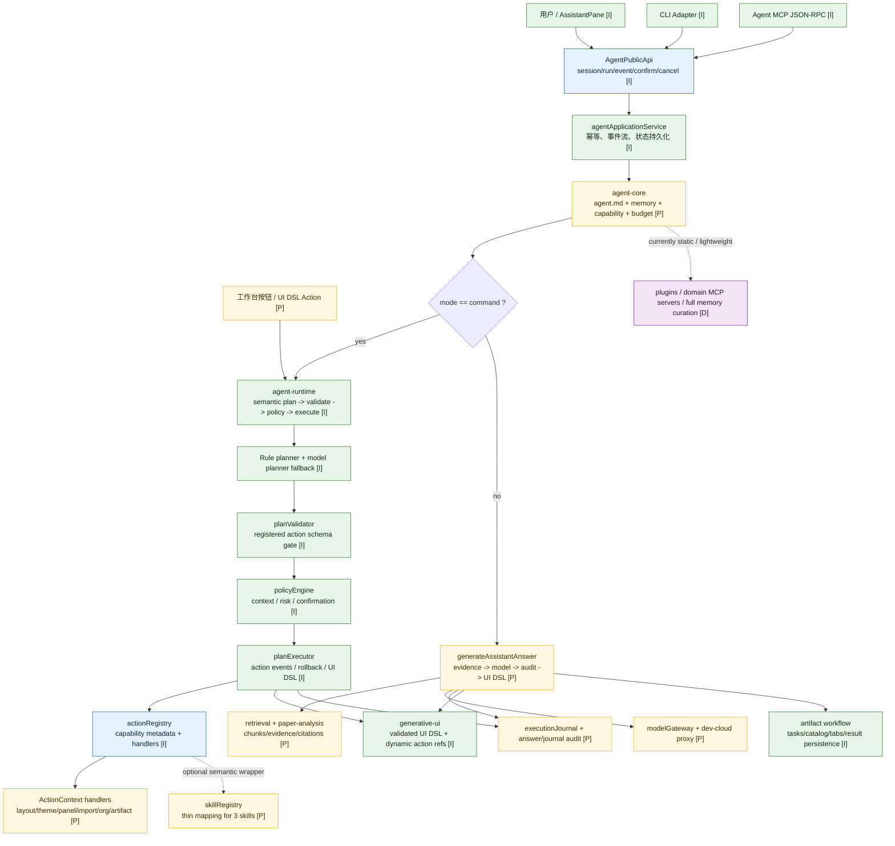
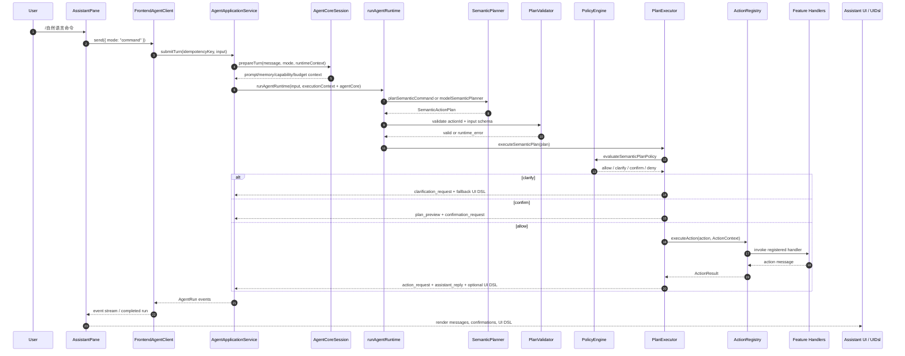
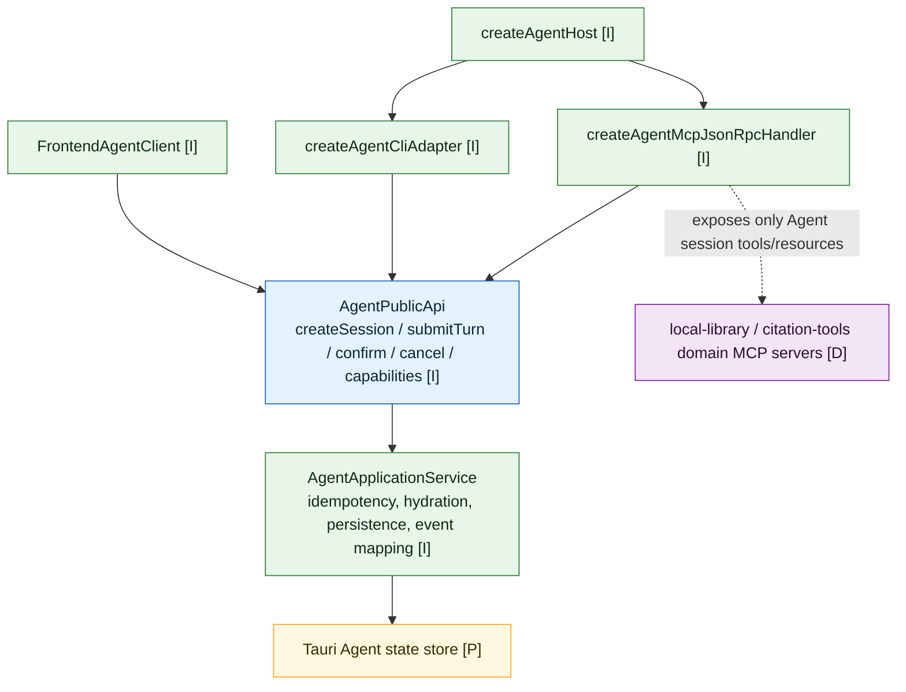
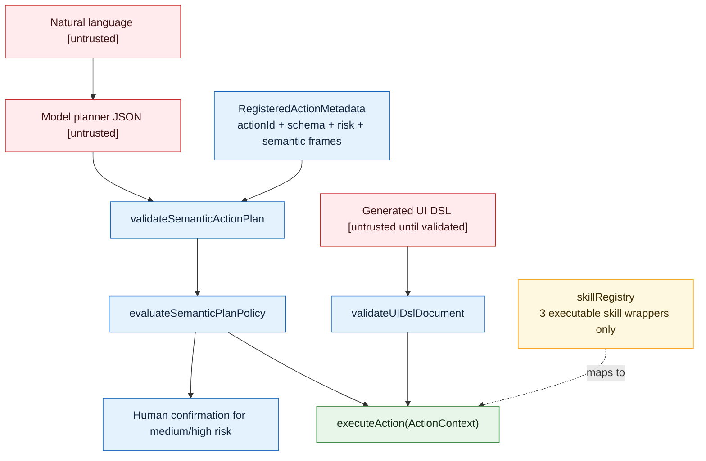

# LiteasyClaw Agent Architecture Audit

审计日期：2026-07-26

本文用于项目负责人审计当前 Agent 架构边界、实现成熟度和后续成员分工。它依据当前源码与工程文档整理，重点区分“已可执行的 Agent 链路”和“已建模但仍属治理/规划层的 Agent 能力”。

## 1. 审计结论

LiteasyClaw 当前不是简单聊天应用，而是一个桌面学术工作台内嵌 Agent 系统。现有架构已经形成四层：

1. `agent-api`：统一会话、run、事件、确认、取消、CLI/MCP 入口。
2. `agent-core`：每轮运行前装配 agent.md、memory、能力摘要、预算与运行时上下文。
3. `agent-runtime`：把命令模式自然语言规划为 `SemanticActionPlan`，做契约校验、策略决策、确认和 action 执行。
4. 领域能力层：`actions` / `skills` / `retrieval` / `models` / `artifacts` / `generative-ui` / workspace 等。

关键判断：

- Command Mode 已具备可审计执行链路：自然语言不能直接改状态，必须先变成注册 action，再通过 schema、policy、confirmation。
- QA / Explain 已具备证据检索、模型生成、审计和 UI DSL 输出链路，但检索仍偏本地 chunk 与 demo fallback，不是完整生产级 RAG。
- `agent-core` 的配置、memory、budget 已进入真实运行路径，但 agent.md、skills、plugins、MCP、memory 治理多数仍是静态配置或轻量实现。
- `skills` 现在更像“能力语义封装和文档目录”，真正执行边界仍是 `actionRegistry`。
- `agent-api` 已经成为前端、CLI、MCP 的统一外壳，但 `AssistantPane` 里仍保留部分本地 runtime / dynamic UI action 兼容路径，需要继续收敛。

## 2. 成熟度标记

```text
[I] Implemented：当前源码已接入主链路，可被 UI/API 调用
[P] Partial：主结构存在，但能力、治理、持久化或处理面不完整
[D] Design/Planned：仅文档、默认配置或未来接口，尚未形成真实执行能力
```

## 3. Agent 总览图



## 4. Command Mode 执行链路

Command Mode 是当前最像“Agent 操作系统”的链路。它的安全假设是：自然语言、模型输出和 UI DSL 都不可信，必须降级为受控 action。



实现锚点：

- `LiteasyClaw/desktop/src/app/features/agent-runtime/runtimeOrchestrator.ts`
- `LiteasyClaw/desktop/src/app/features/agent-runtime/modelSemanticPlanner.ts`
- `LiteasyClaw/desktop/src/app/features/agent-runtime/planValidator.ts`
- `LiteasyClaw/desktop/src/app/features/agent-runtime/policyEngine.ts`
- `LiteasyClaw/desktop/src/app/features/agent-runtime/planExecutor.ts`
- `LiteasyClaw/desktop/src/app/features/skills/actionRegistry.ts`

## 5. QA / Explain 知识链路

QA / Explain 不是 state-changing command，但仍经过 `agent-core.prepareTurn()`。它主要服务文献理解、比较和 artifact 生成前的分析。

```mermaid
flowchart LR
  classDef implemented fill:#e8f5e9,stroke:#2e7d32,color:#102a12
  classDef partial fill:#fff8e1,stroke:#f9a825,color:#3a2a00
  classDef boundary fill:#e3f2fd,stroke:#1565c0,color:#10233a

  Input["QA / Explain / artifact QA turn [I]"]:::implemented
  Core["agent-core prompt context [P]"]:::partial
  Evidence{"artifactType or multi-paper?"}
  Multi["prepareMultiPaperAnalysis<br/>adaptive evidence matrix [P]"]:::partial
  Local["getMockAnswer / imported chunks [P]"]:::partial
  Model["modelGateway<br/>policy checked provider/model [P]"]:::boundary
  Subtasks["parallel paper/section subtasks for artifact [P]"]:::partial
  Audit["local or HTTP audit<br/>score/verdict/rationale [P]"]:::partial
  UIDsl["generateEvidenceUIDslDocument [I]"]:::implemented
  Events["assistant.message + ui.render [I]"]:::implemented

  Input --> Core --> Evidence
  Evidence -- yes --> Multi --> Subtasks --> Model
  Evidence -- no --> Local --> Model
  Model --> Audit --> UIDsl --> Events
```



当前边界判断：

- 已有 imported chunk、citation、evidence ID、audit score 和 model execution trace。
- 多论文分析会构造 evidence matrix，并可并行生成子任务记录。
- 检索不是完整向量检索系统；`retrieval` 仍保留 demo fallback。
- 真实模型质量依赖 `dev-cloud` 和模型策略配置。

## 6. Public API / CLI / MCP 边界

`agent-api` 是对外最重要的稳定边界。它把前端、CLI 和 MCP 统一到同一套 session/run/event 模型。



审计要点：

- MCP 当前暴露的是 Liteasy Agent host 工具：创建 session、提交 turn、确认、查询 run、取消 run。
- `agent-core` 配置里列出的 `local-library`、`citation-tools` 是未来领域 MCP server，不等同于当前已实现的 Agent MCP host。
- Public API 事件会把 runtime events 转成 `run.started`、`context.prepared`、`plan.preview`、`confirmation.required`、`assistant.message`、`ui.render` 等稳定事件。

## 7. Action / Skill / Policy 信任边界



风险等级现状：

- 低风险：布局、面板、dock、主题、导入、推荐、收藏、组织资料区打开、artifact 生成等。
- 中风险：`settings.update` 针对 `profile.enabled` 会被动态提升为需要确认。
- 高风险：workspace 删除/覆盖/批量更新、cloud upload/sync 在 metadata 中标为高风险且需要确认。
- 高风险 action 当前没有真实执行 handler，`executeAction` 会拒绝并要求 approved high-risk handler；这是合理的保护默认值。

## 8. Artifact 生成链路

Artifact 是当前把 Agent 输出落到工作台主体验的关键路径。

```mermaid
flowchart LR
  classDef implemented fill:#e8f5e9,stroke:#2e7d32,color:#102a12
  classDef partial fill:#fff8e1,stroke:#f9a825,color:#3a2a00
  classDef boundary fill:#e3f2fd,stroke:#1565c0,color:#10233a

  Button["Modality button / command / assistant request [I]"]:::implemented
  Controller["useArtifactWorkflowController [I]"]:::implemented
  ImportGate["selected set + import readiness gate [I]"]:::implemented
  AgentRun["runAgentArtifactAnalysis<br/>FrontendAgentClient QA turn [I]"]:::boundary
  Analysis["generateAssistantAnswer<br/>multi-paper evidence + model + audit [P]"]:::partial
  Store["artifact.store<br/>task/catalog/open tabs [I]"]:::implemented
  Result["artifactResultClient + local repository [P]"]:::partial
  CenterUi["center artifact UI DSL / preview [I]"]:::implemented

  Button --> Controller --> ImportGate --> AgentRun --> Analysis --> Store --> Result --> CenterUi
```



当前特点：

- Artifact 生成通过 Agent Public API 发起 QA turn，而不是绕过 Agent 服务直接调模型。
- 生成过程会将 run 事件转为任务进度、流式 partial answer、SubAgent 工作记录和最终 artifact tab。
- 成功落库要求 Agent run 返回可持久化的 `AnalysisRun/Evidence/Claim` 元数据。

## 9. 模块成熟度矩阵

| 模块 | 成熟度 | 当前职责 | 审计备注 |
|---|---:|---|---|
| `agent-api` | I | Public API、事件、run、确认、取消、CLI/MCP adapter | 已是稳定外壳，适合继续作为跨端契约 |
| `agent-core` | P | prepareTurn、prompt context、memory search、budget guard | 进入主链路，但配置和治理仍偏静态 |
| `agent-runtime` | I | semantic plan、schema validation、policy、execution、rollback、UI DSL feedback | Command Mode 主链路清晰 |
| `actions/actionRegistry` | I | action schema、risk、semantic frames、handler dispatch | 真正的执行信任边界 |
| `skills/skillRegistry` | P | 三个 skill 到 action 的薄映射 | 与 agent-core skill catalog 有明显成熟度差异 |
| `assistant` | P | 对话 UI、Public API client 消费、确认、UI DSL 渲染 | 仍保留局部本地 runtime 兼容路径 |
| `retrieval` | P | imported chunks、demo KB、citation payload | 需要升级为生产检索/索引能力 |
| `paper-analysis` | P | 多论文 evidence matrix、claim、coverage | 结构良好，但依赖检索质量 |
| `models` | P | model policy、mock/dev-cloud/http proxy | 策略门存在，生产稳定性依赖 dev-cloud |
| `generative-ui` | I | UI DSL generation、validation、dynamic action refs | 安全边界明确，适合继续扩展组件卡 |
| `artifacts` | I/P | task、tab、catalog、本地/服务结果同步 | 用户价值闭环已形成，持久化和服务端仍需硬化 |
| `plugins` | D | plugin catalog | 目前没有真实 plugin runtime |
| domain MCP servers | D | local-library、citation-tools 等 | 当前仅为 agent-core config 中的规划项 |
| long-term memory | P/D | in-memory search and default memories | 有 store 但缺少用户审查、持久化、注入安全扫描 |

## 10. 主要架构风险

### R1. Skill Catalog 与可执行 Skill Registry 不一致

`agent-core` 默认配置列出多个 skill，并给出 active/planned/review 状态；`skillRegistry` 目前只可执行 `settings.adjust`、`artifact.generate`、`organization.open_shared_library` 三类。Command Mode 实际主要绕过 skill，直接规划到 action。

影响：团队容易误以为所有 active skill 都有独立执行器。

建议：明确 skill 的产品含义。若 skill 是“语义说明 + action frame”，就把命名改为 capability guide；若 skill 是可调用工具，就补齐统一 `executeSkill` contract。

### R2. `AssistantPane` 仍承担较多 Agent 客户端编排

当前前端已经接入 `FrontendAgentClient` 和 Public API 事件，但 `AssistantPane` 仍有本地 runtime event formatter、local confirmation fallback、dynamic UI action direct execution 等兼容逻辑。

影响：后续新增 Agent 事件、确认或 UI DSL action 时，容易出现 Public API 路径和本地路径行为不一致。

建议：把 UI DSL dynamic action、confirmation、journal audit 消费继续收敛到 `agent-api` 或 dedicated controller，让 `AssistantPane` 更接近纯渲染/交互面。

### R3. Agent Core 已在路径中，但治理面仍是静态样板

`agent-core.prepareTurn()` 已真正装配 prompt、memory、budget；但 agent.md、plugin、MCP server、memory catalog 多数来自 default config。

影响：架构上看起来已经有完整 Agent Core，但用户/管理员尚不能真正治理这些能力。

建议：优先做可持久化 agent.md、skill/capability 状态、memory 审查和禁用，而不是先扩更多模型调用能力。

### R4. 检索链路还不足以支撑“准确、高性能、可追溯”的最终目标

当前 evidence/citation 结构已经不错，但 `retrieval` 仍有 demo fallback，真实 ingestion、chunk index、ranking、引用定位需要继续加强。

影响：Agent 输出可信度上限受限，尤其是多论文比较和深层树形展开。

建议：把 retrieval/ingestion 做成明确 owner 的生产链路：解析、切块、索引、召回、重排、citation 验证各自可测。

### R5. 高风险 action 只有注册和保护，没有业务处理闭环

workspace 删除/覆盖、cloud upload/sync 等高风险动作已在 metadata 里建模并要求确认，但 `executeAction` 当前拒绝执行。

影响：这是安全默认值，但如果产品层展示了这些能力，用户会遇到“确认后仍无法执行”。

建议：继续保持默认拒绝，直到资源权限、撤销/回滚、审计日志和组织策略齐备后，再逐个接入 handler。

## 11. 下一步分工建议

按架构边界分配，而不是按页面分配。

| 工作流 | 推荐负责人 | 目标 |
|---|---|---|
| Agent Core Governance | Agent 架构负责人 | 持久化 agent.md、memory 审查、capability/skill 启停、预算可视化 |
| Runtime Contract Hardening | Runtime 负责人 | 收敛 planner、validator、policy、confirmation、rollback 的契约和测试 |
| Assistant/API Convergence | 前端架构负责人 | 把 `AssistantPane` 的本地 Agent 兼容逻辑迁移到 Public API/controller |
| Retrieval/Ingestion | 检索负责人 | 真实 PDF 解析、chunk index、召回/重排、citation verifier |
| Artifact Pipeline | 产物负责人 | AnalysisRun/Evidence/Claim 持久化、artifact result service、失败恢复 |
| MCP/Plugin Boundary | 扩展负责人 | 区分 Agent host MCP 与 domain MCP server，设计插件权限与沙箱 |
| Safety/Governance QA | QA/安全负责人 | 高风险 action 确认、拒绝、取消、审计日志、组织 namespace 隔离测试 |

## 12. 审计问题清单

下次架构评审建议直接检查这些问题：

1. 一个自然语言命令最终是否只能通过注册 action 改状态？
2. 每个 registered action 是否有 ownerFeature、schema、risk、confirmation、handler 和测试？
3. active skill 是否真的可执行，还是只是一段提示词/文档？
4. agent.md、memory、plugin、MCP 配置是否可被用户/组织治理，而不是写死在默认配置？
5. 模型 planner 失败时是否一定降级到 deterministic plan 或 clarification，而不是执行脏 JSON？
6. UI DSL 是否只能引用注册组件、注册数据源和注册 action？
7. QA / artifact 的事实结论是否能追溯到 evidence ID、paperId、page 和 snippet？
8. 高风险 action 是否具备确认、权限、审计、取消/回滚和失败恢复？
9. Public API、MCP、CLI、前端是否共享同一套 session/run/event 语义？
10. `AssistantPane` 是否还持有应该属于 controller 或 Agent service 的业务编排？

## 13. 推荐的近期验收口径

短期不要把目标定成“完整通用 Agent”。更合理的验收口径是：

```text
LiteasyClaw P1 Agent = 学术工作台受控 Agent

必须做到：
- 会话/run/event/confirmation/cancel 统一；
- command 只能执行注册 action；
- QA/artifact 必须带证据和审计；
- agent-core 上下文进入每轮调用；
- skill/capability 状态可审计；
- 高风险动作默认拒绝或确认后执行受控 handler。

暂不要求：
- 任意 shell；
- 任意本地文件读取；
- 任意第三方 plugin 执行；
- 完整外部 MCP 工具生态；
- 无人监管的高风险写操作。
```
