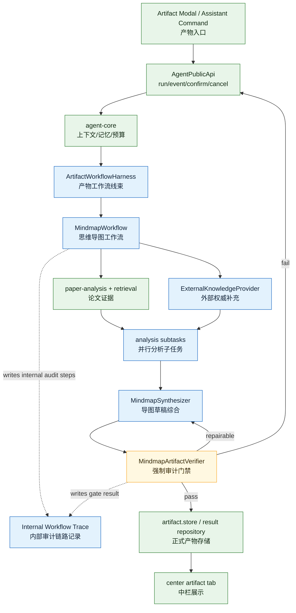

# LiteasyClaw Artifact Workflow Harness Design

日期：2026-07-26

## 1. 设计结论

LiteasyClaw 需要参考 Claude Code dynamic workflows 的思想，但不应照搬“模型动态生成任意工作流代码”的形态。当前最合适的迭代是：在现有 `AgentPublicApi -> agent-core -> QA/artifact` 链路中加入一个受控的 `ArtifactWorkflowHarness`，先只服务思维导图 artifact。

推荐定位：

```text
一个 Liteasy 主 Agent
+ 一个受控 Artifact Workflow Harness
+ 多个并行 analysis subtasks
+ 一个强制 verification gate
```

这不是完整多 Agent runtime，也不是任意代码执行器。它是一个确定性 runtime 线束：代码负责状态、事件、并发、预算、校验和落库；模型只在受控步骤内完成抽取、补充、综合和语义审查。

## 2. 用户决策

本设计基于项目负责人已确认的四个决策：

1. 第一条 harness 链路选择 `artifact`。
2. 第一类 artifact 选择 `思维导图`。
3. 并行模型调用只要收益大，产品上不设固定数量上限；工程上必须有 backpressure 和 provider 限流。
4. artifact 必须审计通过后才作为正式结果落库和展示。
5. workflow trace 只给内部审计使用，不作为普通用户界面的一部分。

另一个补充决策：思维导图允许加入所选论文之外的信息，例如联网权威资料、确定性概念释义和必要背景知识，用于补齐论文解读的逻辑链。但这些信息必须显式标明来源层级，不能伪装成所选论文结论。

## 3. 目标与非目标

目标：

- 让思维导图从“模型直接生成结果”升级为“计划、证据、外部补充、并行分析、综合、审计、修复、落库”的可审计链路。
- 允许外部权威知识补齐理解链路，同时保持论文内事实和外部补充的来源边界。
- 把思维导图 artifact 的生成过程纳入 `AgentPublicApi` run/event 语义。
- 为后续对比表、综述、PPT 大纲等 artifact 复用同一 harness 骨架。

非目标：

- 不新增完整多 Agent mailbox/delivery loop。
- 不允许模型生成任意 JavaScript、shell 或本地文件操作。
- 不把推荐、画像、普通 QA 全部一次性迁入 harness。
- 不把未审计通过的草稿当成正式 artifact 持久化。

## 4. 架构位置



`ArtifactWorkflowHarness` 应放在 artifact 领域链路中，作为 `generateAssistantAnswer` 里 artifact 分支的替代或下沉实现。`AgentApplicationService` 不应知道思维导图细节，只负责 run、event、cancel、idempotency 和状态持久化。

## 5. 工作流

```text
1. Scope
   固化用户问题、artifactType=mindmap、选中文献、workspace revision、settings、profile 开关和模型策略。

2. Plan
   生成 MindmapWorkflowPlan：主题、目标读者、分析维度、需要的外部补充类型、并发预算。

3. Paper Evidence
   从选中文献中召回 evidence matrix。每篇论文至少保留最低证据配额，避免单篇论文垄断导图。

4. External Knowledge
   按计划补充概念释义、背景知识、方法谱系或缺失逻辑连接。外部资料必须记录 sourceTitle、sourceUrl、authorityLevel 和用途。

5. Fan-out
   对论文或区段并行运行 analysis subtasks。子任务只能读取被分配的 evidence 和允许的 external references，输出结构化分析记录。

6. Synthesize
   生成 MindmapDraft。每个关键节点必须带 source refs，区分论文内事实、外部补充和模型推断。

7. Verify
   先运行确定性校验，再运行模型语义审查。审计通过才允许进入正式产物存储。

8. Repair
   审计失败但可修复时，最多进行有限轮局部修复。修复仍必须重新进入 Verify。

9. Persist and Render
   通过审计后保存 AnalysisRun、Evidence、Claim、ExternalReference、MindmapArtifact 和 VerificationReport，并打开中栏 artifact tab。
```

## 6. 来源分层

思维导图节点必须显式区分三类来源。

```ts
type MindmapNodeSource =
  | {
      kind: "selected_paper";
      paperId: string;
      evidenceId: string;
      snippet: string;
    }
  | {
      kind: "external_reference";
      sourceTitle: string;
      sourceUrl?: string;
      authorityLevel: "high" | "medium" | "low";
      reason: "concept_definition" | "background" | "method_lineage" | "missing_link";
    }
  | {
      kind: "model_inference";
      confidence: "high" | "medium" | "low";
      rationale: string;
    };
```

规则：

- `selected_paper` 用于论文自己的方法、实验、结论、局限和作者观点。
- `external_reference` 用于概念解释、背景铺垫、方法谱系和逻辑连接。
- `model_inference` 只能用于辅助组织结构或明确标注的推断，不能承载关键事实。
- 外部知识不能覆盖论文 evidence；若冲突，必须标记为冲突或差异。

## 7. Mindmap 数据结构

建议最小结构：

```ts
type MindmapArtifact = {
  artifactId: string;
  runId: string;
  title: string;
  root: MindmapNode;
  sources: MindmapSourceCatalog;
  verification: MindmapVerificationReport;
  createdAt: string;
};

type MindmapNode = {
  id: string;
  label: string;
  nodeType:
    | "topic"
    | "paper_claim"
    | "concept"
    | "method"
    | "evidence"
    | "comparison"
    | "conflict"
    | "inference"
    | "open_question";
  summary?: string;
  sourceRefs: string[];
  confidence: "high" | "medium" | "low";
  children: MindmapNode[];
};
```

`sourceRefs` 指向 `selected_paper` evidence、external reference 或 model inference 记录。UI 展示时要让用户能看出节点来源，例如“论文证据”“外部补充”“模型推断”。

## 8. 审计通过标准 v1.1

必须通过：

1. 思维导图结构合法，能被中栏 UI 正常渲染。
2. 根节点对应用户请求和 `artifactType=mindmap`。
3. 每篇选中文献至少出现在一个一级或二级分支中，除非 workflow 明确记录该论文证据不足。
4. 关键事实节点必须绑定 `selected_paper` evidence 或 `external_reference`。
5. `selected_paper` 来源必须可追溯到 `paperId`、`evidenceId` 和 snippet。
6. 外部补充节点必须标明 `sourceTitle`、`authorityLevel` 和使用原因。
7. 论文内事实、外部补充和模型推断不能混淆。
8. 不同论文或外部资料冲突时，必须标记为“分歧/争议/不同结论”。
9. 无证据推断必须标为 `model_inference`，且不能作为主结论。
10. 审计失败时不能作为正式 artifact 落库和展示。

阻断条件：

- 把外部知识说成所选论文结论。
- 把模型推断说成事实。
- 关键事实没有任何来源。
- evidenceId 不存在或无法回到原文片段。
- 外部资料权威性为 `low`，但被用于支撑主结论。
- 选中文献覆盖明显不足且没有显式说明。

允许降级为 warning：

- 少量结构性目录节点没有来源。
- 非关键背景节点只来自高置信模型常识，但已标为 `model_inference`。
- 某篇论文可用 evidence 很少，但导图中明确标为“证据不足”。

## 9. 并发与模型策略

产品上不设固定并发数量上限，但工程实现必须限流。

建议默认：

- `maxConcurrentModelCalls = 4`
- `maxRepairRounds = 1`
- `maxSubtasksPerPaper = 4`
- `maxExternalReferences = 6`
- `maxExternalLookupSeconds = 20`

模型选择：

- Plan：中等模型，输出严格 JSON。
- Paper evidence classification：便宜或快速模型，必要时可批处理。
- External knowledge summary：中等模型或检索服务摘要。
- Synthesis：强模型。
- Semantic verification：强模型或独立审计模型。
- 结构合法性、sourceRef 存在性、paper coverage、authorityLevel gate：确定性代码完成。

当 provider rate limit、成本、超时或内存压力触发时，workflow 应排队或降级，不应无限并发。

## 10. 事件与状态

沿用 `AgentPublicApi` 的 run/event 语义，新增 artifact workflow 事件可映射为公共事件：

```text
artifact.workflow.started
artifact.workflow.step.started
artifact.workflow.step.completed
analysis.subtask.delta
artifact.draft.created
artifact.verification.started
artifact.verification.failed
artifact.verification.passed
artifact.repair.started
artifact.persisted
```

事件必须包含 `runId`、`artifactId`、`stepId`、`progress`、`summary`，但不能泄漏完整 prompt、API key、未脱敏外部网页正文或内部函数引用。

## 10.1 Internal Workflow Trace

`workflowTrace` 是内部审计数据，不进入普通用户界面。当前代码已抽出通用 `ArtifactWorkflowHarness`，由它统一记录 step 起止时间、状态和 internal-only trace；`MindmapWorkflow` 只保留领域逻辑。Agent 服务会从 `artifactWorkflow.workflowTrace` 抽取 trace，写入独立 `workflowTraces` ledger，并通过内部 `listWorkflowTraces` 查询。它的用途是让负责人和工程审计能回答：

- 本次 artifact 固化了哪些输入范围。
- 是否执行外部知识补充。
- 何时构造草稿。
- verifier 是否通过、阻断或触发修复。

最小结构：

```ts
type MindmapWorkflowTrace = {
  version: "liteasy.mindmap-workflow-trace/v1";
  traceId: string;
  runId: string;
  artifactId: string;
  internalOnly: true;
  steps: Array<{
    stepId: string;
    kind: "scope" | "external_lookup" | "draft" | "verification" | "repair";
    status: "completed" | "blocked";
    summary: string;
    startedAt: string;
    completedAt: string;
    details?: Record<string, string | number | string[]>;
  }>;
};
```

内部 trace 规则：

- 可以记录 step 类型、计数、来源 ID、覆盖缺口和 verifier 结果。
- 不记录完整 prompt、API key、未脱敏网页正文、模型原始长输出或用户隐私画像全文。
- 普通 Assistant 消息、Artifact tab 和推荐 UI 不展示 `workflowTrace`。
- 面向用户的可见信息仍来自 artifact source layer、verification summary 和正式产物结构。
- `workflowTraces` ledger 随 Agent state snapshot 持久化，记录只允许归属到已有 `sessionId/runId`。
- ledger 查询是内部审计接口；产品 UI 不应把它作为普通用户功能入口。
- `workflowTraces` 可投影为稳定内部事件：`workflow.started`、`workflow.step.completed`、`workflow.step.blocked`、`workflow.completed`、`workflow.blocked`。这些事件用于审计面板、失败统计和 QA，不参与普通 Agent 对话事件流。
- 内部审计摘要由事件流汇总生成，包含 `status`、`blockedStep`、`repairAttempted`、`repairSucceeded`、`failedIssueCodes`、`stepCount`、`completedStepCount`。它用于负责人快速判断一次 artifact run 是通过、阻断在 verifier、还是 repair 后仍失败。

当前 repair gate 已具备最小安全修复能力：当 verifier 返回可修复失败时，workflow 最多执行一轮 `repair`，然后必须重新 verifier。第一类允许的修复是“关键子节点缺 sourceRefs，但父节点已有可验证 sourceRefs”时继承父来源；这属于结构性漏标修复，不新增事实、不新增来源、不改写结论。若错误属于证据缺失、低权威来源支撑主结论、sourceRef 不存在等不可安全修复问题，则保持 `blocked`，不把草稿伪装为已通过产物。

失败终态：

- `failed_unrecoverable`：结构无效、证据缺失严重、用户取消或 provider 连续失败。
- `failed_needs_context`：选中文献未导入、证据不足、外部补充不可用。
- `draft_blocked`：生成出草稿但审计未通过，不能正式落库。

## 11. 与现有模块的关系

| 现有模块 | 变化 |
|---|---|
| `AgentApplicationService` | 不增加领域细节，只继续管理 run/event/cancel/idempotency |
| `agent-core` | 提供 prompt、memory、capability、budget 上下文 |
| `generateAssistantAnswer` | artifact 分支逐步迁移到 `ArtifactWorkflowHarness` |
| `paper-analysis` | 继续负责 evidence matrix、coverage gap、claim/evidence 结构 |
| `retrieval` | 需要从 demo fallback 逐步升级为真实 ingestion/index/retrieval |
| `models` | 提供 model gateway、provider policy、成本/超时策略 |
| `artifacts` | 负责 task、tab、result repository 和落库状态 |
| `generative-ui` | 渲染通过审计的 MindmapArtifact，不承接未审计草稿 |

## 12. 团队分工建议

| 工作流 | 推荐负责人 | 交付 |
|---|---|---|
| Harness Runtime | Agent 架构负责人 | workflow plan/state/event/cancel/repair contract |
| Mindmap Schema | Artifact 负责人 | MindmapArtifact、MindmapNode、sourceRefs、UI renderer contract |
| Evidence Pipeline | 检索负责人 | paper evidence matrix、coverage、citation verifier |
| External Knowledge | 检索/云服务负责人 | 权威来源接入、摘要、authorityLevel、缓存 |
| Verification Gate | QA/安全负责人 | deterministic validator + semantic verifier + failure reports |
| Model Policy | 模型负责人 | 分步骤模型选择、并发、超时、成本策略 |
| Persistence | 桌面/服务负责人 | AnalysisRun、ExternalReference、VerificationReport、artifact result |

## 13. 验收标准

第一阶段验收只看思维导图。

必须验收：

1. 用户选择至少两篇已导入论文后，可以生成思维导图 artifact。
2. 生成过程中能看到 plan、analysis、synthesis、verification、persist 的事件进度。
3. 导图中论文内事实节点能追溯到 paper evidence。
4. 导图中外部补充节点有来源类型、权威等级和用途说明。
5. 审计失败的草稿不会作为正式 artifact 落库。
6. 审计失败但可修复时，系统最多修复一轮并重新审计。
7. 用户取消 run 后，不再继续落库或打开正式 artifact tab。
8. 并发子任务受配置限制，不会无界发起模型调用。

暂不验收：

- 完整互联网学术搜索质量。
- 自动识别所有权威来源。
- 任意 artifact 类型通用 harness。
- 真正独立 Auditor Agent。
- 多 Agent mailbox 和跨 Agent durable delivery loop。

## 14. 推荐实施顺序

1. 定义 `MindmapArtifact`、`MindmapNodeSource` 和 verification report schema。
2. 把现有 artifact mindmap 生成入口改为调用 `ArtifactWorkflowHarness`。
3. 先做确定性 verifier：结构、sourceRef、paper coverage、external authority gate。
4. 接入现有 `paper-analysis` evidence matrix。
5. 增加 external knowledge provider 的接口，第一版可以先用 mock/fixture，接口形状按真实联网服务设计。
6. 加 semantic verifier，输出结构化失败原因。
7. 加一次 repair loop。
8. 通过审计后再落库并打开中栏 tab。
9. 补 run/event/persistence/cancel 测试。

## 15. 关键原则

- 先做受控 workflow，不做任意动态代码执行。
- 先做思维导图一条链路，不全局迁移。
- 外部知识可以补充逻辑链，但必须标源和分层。
- 审计是落库门禁，不是 UI 上的装饰分数。
- 并发追求收益，但必须有 backpressure。
- 真正多 Agent 以后再做，第一候选是只读低权限 `Auditor Agent`。

## 16. 参考资料

- Claude Blog: `A harness for every task: Dynamic workflows in Claude Code`，用于参考复杂任务按需组织 workflow、并行子任务、验证和汇总的思路。
- `project-docs/engineering/agent-architecture-audit.md`，用于约束 LiteasyClaw 当前仍是一个主 Agent Host，而不是完整多 Agent runtime。
- `project-docs/agent-dev/2026-07-19-multi-paper-analysis-agent-feasibility-and-stack.md`，用于复用 evidence matrix、coverage gap、claim/evidence 和 artifact source 的既有设计。
