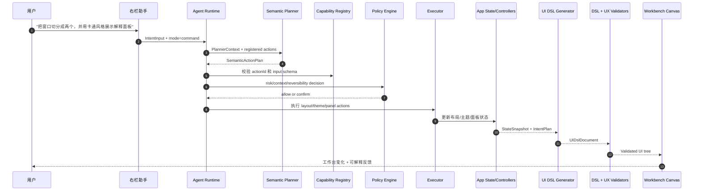
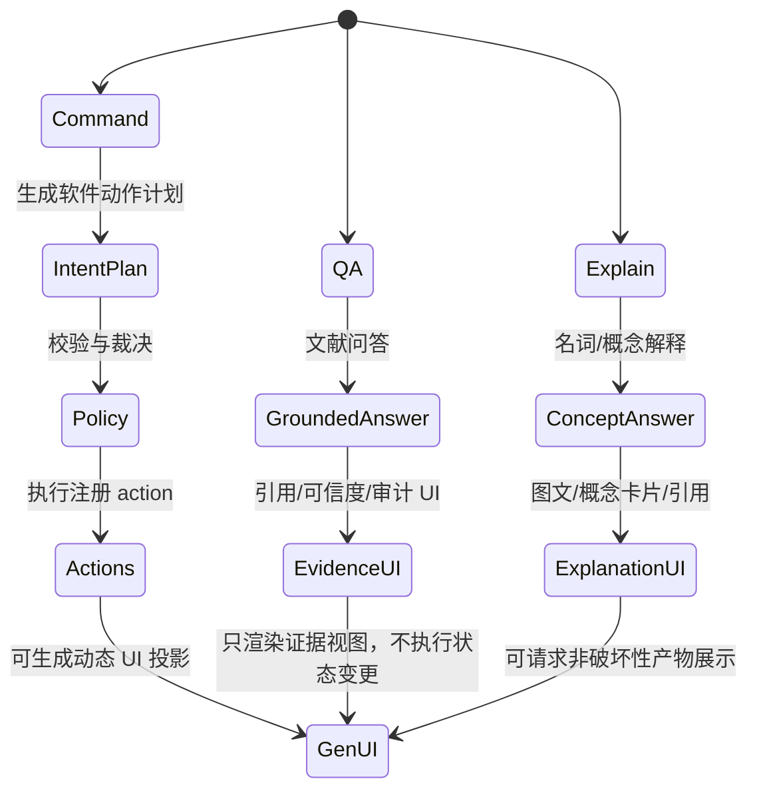
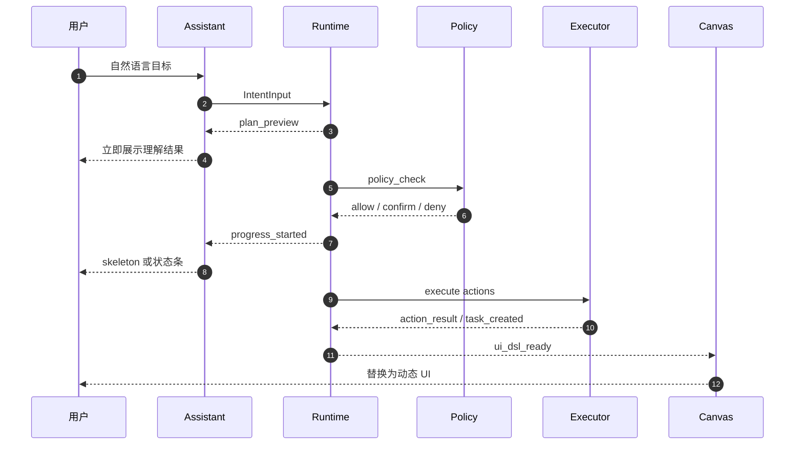
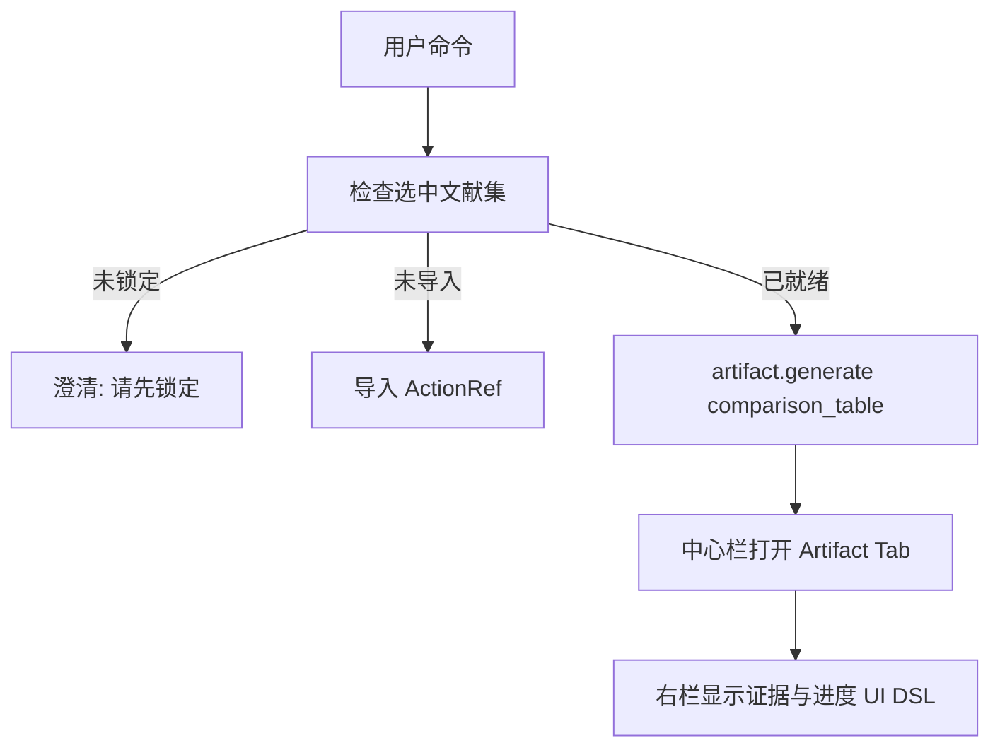

# LiteasyClaw 意图原生生成式 UI 具体实现方案

日期：2026-07-05  
状态：设计方案，待评审  
范围：LiteasyClaw 用户端桌面应用，优先落在右栏助手、中心产物标签页、工作台布局/主题/面板控制  
参考：`BRAINSTORM/intent-native-generative-ui-module-design.html`、`BRAINSTORM/intent-native-generative-ui-module-design.md`、`project-docs/product/LiteasyClaw_功能与UI设计文档1.0.md`

## 1. 结论

LiteasyClaw 不应走“让模型直接生成 React/CSS/DOM”的路线。具体实现应采用：

> 受控声明式生成 UI + 已注册能力图 + 策略闸门 + 动态画布

模型只负责生成结构化计划和 UI DSL 草案；系统负责校验、裁决、执行、渲染、审计和回退。

这与当前项目目标一致：

- 右栏助手是 AI 原生入口，不只是聊天框。
- 命令模式可操作整个 UI，但只能操作已注册能力。
- 问答/名词解释仍以文献 grounding、引用、审计为主；可以请求非破坏性的证据视图或多模态产物展示，但不能绕过 command/action/policy 直接改变应用状态。
- 多模态产物进入中心栏 artifact tabs，而不是堆在右栏对话里。
- 所有状态变更收敛到 action registry、policy、runtime events。

## 2. 当前工程基线

当前代码已经具备生成式 UI 的前置骨架：

| 现有模块 | 当前能力 | 后续承接方式 |
| --- | --- | --- |
| `features/agent-runtime` | `SemanticActionPlan`、runtime events、语义 planner、plan executor | 扩展为 Intent Runtime 主入口 |
| `features/skills/actionRegistry.ts` | layout、theme、panel、artifact、settings、organization 等注册动作 | 升级为 Capability Registry 的第一阶段实现 |
| `features/assistant` | 右栏三模式、Context Panel、历史、编辑、重新生成 | 渲染 runtime events 和 GenUI 状态 |
| `features/artifacts` | `mindmap`、`tree`、`ppt`、`comparison_table` artifact tabs | 作为中心栏生成式产物容器 |
| `features/models` | DeepSeek/OpenAI 兼容 gateway、模型链路与审计 | 接入结构化 planner 和 UI DSL generator |
| `layout/AppShell` 与 controllers | 三栏工作台、pane action handlers | 提供工作台级 layout/theme/panel action 执行器 |

因此本方案不重写现有系统，而是在 `agent-runtime` 和新增 `generative-ui` 模块之间建立协议。

### 2.1 对产品目标的覆盖审计

本方案覆盖 LiteasyClaw 产品说明中的核心目标，但覆盖方式不是“一次性生成所有界面”，而是通过可扩展的能力族和 UI DSL 逐步覆盖。审计结论如下：

| 产品目标 | 设计覆盖方式 | 当前可落地性 | 缺口与补强 |
| --- | --- | --- | --- |
| AI 原生交互 | 右栏助手统一进入 `Intent Runtime`，自然语言转 `IntentPlan` | 高，已有 `agent-runtime` 和命令语义规划骨架 | 需要把更多 UI 入口也收敛到同一 action contract |
| 准确高性能多模态表达 | `artifact.generate` + center artifact canvas + evidence UI | 中，已有 `mindmap/tree/ppt/comparison_table` 类型 | 需扩展 video、podcast、chart、flow、animation、Socratic、Feynman artifact family |
| DeepSeek/OpenAI 模型接入 | `Model Gateway` + structured planner + fallback | 高，已有 provider 与模型链路 | 需要为 UI DSL generator 加结构化输出验证 |
| skills 与任务控制流 | `Capability Registry` + `ActionRefRouter` + policy | 中高，已有 action registry | 需要把 skill definition 和 action metadata 合并成能力卡片 |
| 用户画像个性化 | `profile.summary` datasource + policy-gated profile action | 中，已有 profile setting 和确认基础 | 需要 profile 数据最小化、脱敏、用户可见依据 |
| 右栏三模式 | mode gate：command 执行动作，qa/explain 展示证据与非破坏性产物入口 | 高，当前三模式已存在 | 需要 UI DSL event 支持和模式边界测试 |
| 左-中-右三栏工作台 | layout/panel/theme actions + workbench overlay | 中高，已有 pane/layout handlers | 需要更细粒度 pane focus、tab split、artifact docking actions |
| 选中文献集导入主干 | `selected_set.import` + artifact context validator | 高，当前已有 selection/import 状态 | 需要导入进度、失败恢复、重试 action |
| 文献库/收藏/推荐 | workspace/recommendation/collection capability family | 中，底层模块已有但未完整接入 runtime | 需要新增 `recommendation.refresh`、`collection.add`、`workspace.open_folder` 等 action |
| 组织共享文献库 | `organization.open_shared_library` | 中高，已有 action | 需要组织空间切换风险提示与 journal |
| 插件系统 | capability family 的后续扩展目标 | 中 | 需要插件 manifest、权限声明、sandbox policy |
| 运维团队端 | 复用 DSL/Capability/Policy 架构 | 低，本方案聚焦用户端 | 后续另开 admin/control-plane spec |

结论：

- 本设计能覆盖用户端的主目标：AI 原生交互、多模态产物、三栏工作台协作、受控命令执行、文献 grounding。
- 不应承诺第一阶段覆盖视频、播客、过程动图、完整插件市场和运维端；这些应作为相同能力框架下的后续 capability family。
- 当前最关键的缺口不是“模型不够强”，而是 action 粒度、capability cards、UI DSL validator、runtime event 和 journal 还不够完整。

### 2.2 方案取舍

本次审计比较三种路线：

| 路线 | 做法 | 优点 | 风险 | 结论 |
| --- | --- | --- | --- | --- |
| A. 继续扩大硬编码命令 | 在 `intentRouter` 中继续加短语和 if/else | 快、容易演示 | 不能覆盖自由表达，维护成本高，动作组合差 | 不推荐作为主线 |
| B. 直接让模型生成界面代码 | 模型输出 React/CSS 或 DOM patch | 看起来自由 | 高风险、不可测、不可审计，容易破坏状态 | 明确禁止 |
| C. 受控声明式 GenUI | 模型输出 `IntentPlan` 和 `UIDslDocument`，系统校验执行 | 可测、可恢复、可扩展，符合现有代码边界 | 初期需要 registry/schema 建设 | 推荐 |

因此，后续实现应优先走 C；A 只能作为 fallback planner；B 不进入产品主链路。

## 3. 设计边界

### 3.1 必须做

- 定义 `IntentPlan` 与 `UIDslDocument` 两个稳定协议。
- 把所有可执行行为纳入能力注册表。
- 让动态 UI 中的按钮只发出 `ActionRef`，不能直接调用函数。
- 支持命令模式生成工作台 UI 调整、产物入口、解释面板、证据视图。
- 支持右栏对话与中心栏动态产物的协同。
- 建立 DSL validator、UX validator、fallback UI 和 execution journal。

### 3.2 明确不做

- 不让模型生成任意 CSS、JS、React 代码。
- 不让模型直接操作 DOM、文件、数据库、网络或云端资源。
- 不把 prompt 当安全系统。
- 不在第一阶段做完全开放式页面生成器。
- 不把问答/名词解释变成可绕过策略系统执行状态变更的模式。

## 4. 总体架构

```mermaid
flowchart LR
  User[用户自然语言/语音/UI事件] --> Input[Intent Input Adapter]
  Input --> Context[Context Builder]
  Context --> Runtime[Intent Runtime]
  Runtime --> Planner[Semantic Planner / LLM Planner]
  Planner --> PlanValidator[Plan Validator]
  PlanValidator --> Policy[Policy Engine]
  Policy -->|allow| Executor[Transactional Executor]
  Policy -->|confirm| Confirm[Human Confirmation UI]
  Policy -->|deny/clarify| Assistant[Assistant Event Renderer]
  Confirm --> Executor
  Executor --> State[State Kernel / App Controllers]
  Executor --> Journal[Execution Journal]
  State --> UIDslGen[UI DSL Generator]
  Runtime --> UIDslGen
  UIDslGen --> DSLValidator[DSL Validator]
  DSLValidator --> UXValidator[UX Validator]
  UXValidator -->|pass| Canvas[Dynamic Canvas]
  UXValidator -->|fallback| Fallback[Fallback UI]
  Canvas --> ActionRouter[Action Router]
  ActionRouter --> Policy
  Canvas --> Journal

  classDef ai fill:#fff4d8,stroke:#b7791f,stroke-width:1px;
  classDef gate fill:#e8f1ff,stroke:#2b6cb0,stroke-width:1px;
  classDef runtime fill:#eef8ee,stroke:#2f855a,stroke-width:1px;
  class Planner,UIDslGen ai;
  class PlanValidator,Policy,DSLValidator,UXValidator gate;
  class Runtime,Executor,State,Canvas,ActionRouter,Journal runtime;
```



核心原则：

- `Intent Runtime` 负责理解目标和生成可验证计划。
- `Capability Registry` 决定系统能做什么。
- `Policy Engine` 决定是否允许做。
- `State Kernel / controllers` 是真实状态源。
- `UI DSL` 是状态和意图的可视化投影，不是真实状态。
- `Dynamic Canvas` 只渲染通过 validator 的组件树。

## 5. LiteasyClaw 的目标数据流



## 6. 模块设计

### 6.1 `generative-ui` 新模块

建议新增：

```text
LiteasyClaw/desktop/src/app/features/generative-ui/
  generativeUi.types.ts
  componentRegistry.ts
  dataSourceRegistry.ts
  designTokenRegistry.ts
  uiDslSchema.ts
  uiDslValidator.ts
  uiDslGenerator.ts
  dynamicCanvas.tsx
  actionRefRouter.ts
  uxValidator.ts
  fallbackUi.tsx
  executionJournal.ts
```

依赖方向：

```text
assistant -> agent-runtime -> generative-ui -> shared feature contracts
shell/controllers -> action handlers -> feature modules
```

`generative-ui` 不导入 `AppShell`。需要改变工作台时，只生成 `ActionRef` 或调用已注入 action handler。

### 6.2 核心协议

#### IntentPlan

当前已有 `SemanticActionPlan`，第一阶段不另起新类型，先扩展字段：

```ts
export type IntentPlan = SemanticActionPlan & {
  uiProjection?: {
    surface: "assistant" | "center_artifact" | "workbench_overlay";
    preferredComponents: string[];
    dataSources: string[];
  };
};
```

#### UI DSL

```ts
export type UIDslDocument = {
  id: string;
  version: "liteasy-ui-dsl/v1";
  surface: "assistant" | "center_artifact" | "workbench_overlay";
  intentPlanId: string;
  root: UIDslNode;
  dataSources: UIDslDataSourceRef[];
  actions: UIDslActionRef[];
  audit: {
    generatedBy: "rule" | "model";
    model?: string;
    createdAt: string;
    traceId: string;
  };
};

export type UIDslNode = {
  id: string;
  component: "Stack" | "Panel" | "EvidenceCard" | "ArtifactLauncher" | "ComparisonTable" | "CitationList" | "ActionBar" | "StatusBanner";
  props: Record<string, unknown>;
  children?: UIDslNode[];
};

export type UIDslDataSourceRef = {
  id: string;
  sourceId:
    | "selected_document_set.summary"
    | "retrieval.citations"
    | "artifact.tasks"
    | "workspace.current"
    | "runtime.context_view"
    | "profile.summary"
    | "organization.summary";
  params: Record<string, unknown>;
};

export type UIDslActionRef = {
  id: string;
  actionId: string;
  input: Record<string, unknown>;
  label: string;
  riskLevel: "low" | "medium" | "high";
};
```

约束：

- `component` 必须来自 `componentRegistry`。
- `actionId` 必须来自 `actionRegistry`。
- `props` 必须通过组件自己的 JSON schema。
- 不允许 `style` 字段承载任意 CSS。
- 只能引用 `designTokenRegistry` 中的 token。

### 6.3 Component Registry

首批组件只覆盖 LiteasyClaw 的真实场景：

| 组件 | 用途 | 渲染位置 |
| --- | --- | --- |
| `StatusBanner` | 计划、风险、缺上下文提示 | assistant |
| `EvidenceCard` | 原文定位、引用、可信度 | assistant/center |
| `ArtifactLauncher` | 打开 mindmap/tree/ppt/comparison_table | assistant |
| `ComparisonTable` | 多文献对比表 | center |
| `CitationList` | 引用证据链 | assistant/center |
| `ActionBar` | 只触发 ActionRef 的操作按钮 | assistant/overlay |
| `Panel` | 小型结构化信息区 | all |
| `Stack` | 纵向/横向布局容器 | all |

不在第一阶段做自由表单设计器、任意图表编辑器、任意 CSS 皮肤编辑。

### 6.4 DataSource Registry

首批数据源：

| 数据源 | 来源 | 风险 |
| --- | --- | --- |
| `selected_document_set.summary` | selection + import/retrieval | low |
| `retrieval.citations` | retrieval chunks | low |
| `artifact.tasks` | artifact store | low |
| `workspace.current` | workspace controller | low |
| `runtime.context_view` | agent-runtime contextView | low |
| `profile.summary` | profile state | medium，需要用户画像开启 |
| `organization.summary` | organization controller | medium，需要云账号/组织 |

Dynamic Canvas 只能通过 DataSourceRef 读数据，不能直接读数据库、文件或网络。

### 6.5 动作粒度与能力族设计

为了让命令执行“够小、够灵活、够丝滑”，action 粒度必须遵守以下规则：

1. **原子动作只做一件事**：如 `pane.focus` 只聚焦面板，不顺便改布局；`artifact.generate` 只创建产物任务，不顺便切换主题。
2. **复合意图由 plan 编排**：用户说“把窗口切成两栏并生成对比表”，应生成多个 action，而不是一个巨大 action。
3. **所有 action 可解释**：每个 action 有 label、risk、requiredContext、reversible、estimatedCost。
4. **低风险动作可即时执行**：布局、主题、面板显示、非破坏性产物预览不应让用户反复确认。
5. **中高风险动作强制确认**：上传、删除、覆盖、画像采样、组织空间切换、付费资源消耗必须确认。
6. **动作可撤销优先**：能设计成 `apply + reset` 的动作，不设计成不可逆 mutation。
7. **状态变化只进 action**：按钮、快捷键、自然语言、动态 UI 都走同一 action contract。

推荐把能力拆成以下族：

| 能力族 | 原子 action 示例 | 复合意图示例 | 第一阶段优先级 |
| --- | --- | --- | --- |
| Layout | `layout.split_two`、`layout.set_ratio`、`layout.reset`、`pane.focus` | “把窗口切成两个，左边看文献右边看解释” | 高 |
| Theme | `theme.apply_preset`、`theme.adjust_density`、`theme.reset` | “变成卡通风格但保持阅读区紧凑” | 高 |
| Panel | `panel.open`、`panel.close`、`panel.toggle`、`panel.pin` | “打开组织面板并收起右栏” | 高 |
| Artifact | `artifact.generate`、`artifact.open_tab`、`artifact.retry`、`artifact.cancel` | “把这几篇论文做成对比表并打开中心标签页” | 高 |
| Selection/Import | `selected_set.lock`、`selected_set.unlock`、`selected_set.import`、`import.retry_failed` | “锁定当前选择并导入后生成思维导图” | 高 |
| QA/Explain Display | `evidence.show`、`citation.focus`、`source.open_page` | “展示这句话的原文证据” | 高 |
| Workspace | `workspace.open_folder`、`workspace.switch_source`、`workspace.refresh_tree` | “切到组织共享文献库的这个文件夹” | 中 |
| Recommendation | `recommendation.refresh`、`recommendation.sort`、`recommendation.cache_clear` | “按关联度重新推荐并缓存到当前工作区” | 中 |
| Collection | `collection.add`、`collection.remove`、`collection.move_to_workspace` | “把这些推荐文献加入收藏” | 中 |
| Profile | `profile.enable`、`profile.disable`、`profile.clear`、`profile.show_basis` | “开启画像并告诉我会采样什么” | 中 |
| Organization | `organization.open_shared_library`、`organization.open_notifications` | “打开组织共享库并显示最近通知” | 中 |
| Plugin | `plugin.enable`、`plugin.disable`、`plugin.configure` | “开启专注度管理插件” | 低 |

#### 6.5.1 Action metadata 必填字段

现有 `RegisteredActionMetadata` 已包含 `actionId`、`label`、`requiredContext`、`requiresConfirmation`、`riskLevel`。为了支持更丝滑的执行，后续应扩展为：

```ts
export type CapabilityMetadata = {
  actionId: string;
  label: string;
  family: "layout" | "theme" | "panel" | "artifact" | "selection" | "workspace" | "recommendation" | "collection" | "profile" | "organization" | "plugin";
  inputSchema: JsonSchema;
  outputSchema: JsonSchema;
  requiredContext: string[];
  riskLevel: "low" | "medium" | "high";
  requiresConfirmation: boolean;
  reversible: boolean;
  inverseActionId?: string;
  estimatedLatencyMs: number;
  estimatedCost: "none" | "local_compute" | "cloud_tokens" | "paid_resource";
  progressEvents?: string[];
};
```

这样 planner 可以按能力卡片组合动作，UI 可以按延迟和风险选择“立即执行、显示进度、请求确认或先给预览”。

#### 6.5.2 动作组合示例

用户：

> 把窗口切成两栏，用卡通风格展示这几篇论文的对比表

应生成：

```json
{
  "intentId": "compound.workspace_artifact",
  "summary": "切换双栏布局、应用卡通风格，并基于当前选中文献集生成对比表。",
  "actions": [
    { "actionId": "layout.split_two", "input": { "preset": "two_column" } },
    { "actionId": "theme.apply_preset", "input": { "preset": "playful", "tone": "cartoon" } },
    { "actionId": "artifact.generate", "input": { "artifactType": "comparison_table", "source": "selected_document_set" } }
  ],
  "riskLevel": "low",
  "requiresConfirmation": false
}
```

若 selected set 未锁定或未导入，planner 不应把这个意图变成一个失败动作，而应插入前置 action 或 clarification：

```text
selected_set.lock? -> selected_set.import -> artifact.generate
```

这里 `selected_set.lock` 是否自动执行取决于产品策略：如果用户已经明确说“当前选中这些”，可低风险执行；如果选择状态不明确，应先澄清。

### 6.6 灵活性边界：自由表达，有限动作空间

灵活性来自“计划可组合”，不是来自“动作无限大”。具体规则：

- 用户表达可以是任意自然语言。
- planner 可输出多步 plan。
- 每一步必须落到已注册 action 或已注册 UI component。
- 未注册能力必须给出 `unsupportedReason` 和可选替代项。
- 动作之间通过明确状态和事件连接，不通过隐式 DOM 读写连接。

这能支持用户说“ABC”一类模糊输入：

1. 先用上下文判断 ABC 是否是文献术语、文件名、组织名、快捷意图或无意义输入。
2. 高置信度时生成 plan。
3. 中低置信度时生成 clarification。
4. 完全不支持时给出可执行替代项，而不是装作理解。

## 7. 模式边界



规则：

- `command` 可以执行注册 action。
- `qa` 和 `explain` 可以生成 UI DSL 用于展示答案、证据和非破坏性产物入口。
- `qa/explain` 若需要启动成本较高的产物生成，可发起注册 artifact action，但必须经过上下文校验、policy 和可审计 runtime event。
- `qa/explain` 若用户要求改变布局、主题、设置、组织、工作区等状态，应提示切换为命令模式或内部创建 command intent，经策略确认后执行。

## 8. 实施路线

### Phase 0：Registry 固化

目标：不用模型也能枚举组件、动作、数据源和设计 token。

交付：

- `componentRegistry.ts`
- `dataSourceRegistry.ts`
- `designTokenRegistry.ts`
- action metadata 与 component cards 的导出函数

验收：

- 未注册组件无法通过 validator。
- 未注册 action 无法进入 canvas。
- 组件 props schema 错误时拒绝渲染。

### Phase 1：手写 DSL 到 Dynamic Canvas

目标：先让确定性 DSL 渲染出来。

交付：

- `UIDslDocument` 类型
- `uiDslValidator`
- `DynamicCanvas`
- `ActionRefRouter`

验收：

- 手写 `EvidenceCard + CitationList + ActionBar` 可在右栏渲染。
- 点击动态按钮不会直接执行函数，而是进入 `ActionRefRouter -> Policy -> executeAction`。

### Phase 2：Runtime 输出 UI projection

目标：让 `SemanticActionPlan` 能声明需要怎样的 UI 投影。

交付：

- 扩展 runtime event：`ui_dsl_request` 或 `ui_projection_ready`
- assistant 渲染 runtime event 时可挂载 `DynamicCanvas`
- artifact tab 可接受 `UIDslDocument`

验收：

- “把当前文献做成对比表”产生 plan preview、artifact request、center tab。
- 右栏显示计划摘要、证据来源、可恢复入口。

### Phase 3：规则 UI DSL Generator

目标：不接模型也能从已知计划生成 DSL。

规则样例：

- `artifact.generate/comparison_table` -> `ArtifactLauncher + StatusBanner`
- `qa.answer_with_sources` -> `EvidenceCard + CitationList`
- `theme.apply_preset` -> `StatusBanner + ActionBar(reset)`

验收：

- 10 个 golden intent 能生成稳定 DSL。
- DSL snapshot 可比较，避免随机 UI 抖动。

### Phase 4：模型辅助 UI DSL Generator

目标：模型只在 schema 内选择组件组合和文案。

约束：

- 输入只包含 component cards、data source cards、design tokens、intent plan、必要上下文。
- 输出必须是 `UIDslDocument` JSON。
- 失败时回退到 Phase 3 规则 generator。

验收：

- 模型返回未知组件、未知 action、非法 props 时被拒绝并降级。
- DeepSeek/OpenAI provider 切换不改变协议。

### Phase 5：UX Validator

目标：把 UX 风险变成运行时质量门。

首批规则：

- action button 必须有 label、riskLevel、可达 target。
- 高风险 action 不得在 UI 中使用 primary 样式。
- 右栏卡片深度不超过 3 层。
- 不允许弹窗叠弹窗。
- 长文本必须有折叠或滚动策略。
- citation/evidence 不得与回答内容矛盾。

验收：

- 构造遮挡、不可关闭弹窗、缺 action label、虚假 citation 的 DSL，validator 必须拒绝或 fallback。

### Phase 6：Execution Journal 与审计解释

目标：每次意图、计划、策略、执行、UI DSL 和用户点击都可回放。

交付：

- `ExecutionJournalEntry`
- traceId 贯穿 assistant message、runtime event、DSL document、action result
- 审计解释只基于 journal 生成，不能改写事实

验收：

- 任一动态 UI action 可追溯到原始用户输入和 policy decision。

### Phase 7：丝滑执行体验

目标：让受控系统不显得笨重。丝滑不是跳过校验，而是把校验、等待、确认和结果反馈设计成连续体验。

#### 8.7.1 执行分层

| 执行类型 | 用户感知 | 系统行为 |
| --- | --- | --- |
| 即时动作 | 100-300ms 内完成 | 直接执行，右栏显示轻量状态条 |
| 短任务 | 300ms-3s | 显示 plan preview + skeleton，完成后替换 |
| 长任务 | 3s 以上 | 创建 task，中心栏显示进度，右栏可继续对话 |
| 高风险动作 | 先展示确认卡 | 确认后执行，拒绝时给恢复路径 |
| 失败动作 | 不打断工作台 | 保留 fallback UI，提供重试/替代 action |

#### 8.7.2 推荐 runtime event 序列



#### 8.7.3 UI 体验规则

- 右栏永远先反馈“我理解你要做什么”，再执行。
- 对低风险组合动作，允许批量执行，但 UI 上逐条展示 action result。
- 对长任务，中心栏打开 task tab，右栏只保留摘要、进度和取消/重试入口。
- 对需要确认的动作，确认卡只展示关键差异、风险和恢复方式，不展示冗长技术日志。
- 对模型生成 UI，先用规则 skeleton 占位，模型 DSL 通过校验后再替换。
- 对失败或降级，必须告诉用户“哪些部分执行了，哪些没有执行，下一步能做什么”。

#### 8.7.4 防卡顿策略

- 计划生成超时 2s：使用本地规则 planner。
- UI DSL 生成超时 2s：使用规则 generator。
- artifact 生成进入后台 task，不阻塞右栏输入。
- 同一 trace 下重复点击 action button：幂等处理或禁用按钮。
- 对布局/theme/panel 低风险动作做乐观 UI，但 journal 中记录真实执行结果；失败则回滚并说明。

## 9. 严谨性核验

### 9.1 工程可证伪性

| 命题 | 可证伪测试 | 通过标准 |
| --- | --- | --- |
| 模型不能虚构 UI 组件 | 返回 `MagicPanel` | DSL validator 拒绝 |
| 模型不能绕过 action policy | DSL button 直接带 function body | schema 拒绝 |
| 动态 UI 不直接改状态 | 点击 ActionBar | 必须产生 ActionRef event |
| 高风险动作需要确认 | `workspace.delete_documents` | 返回 confirmation_request |
| QA 不执行状态变更 | QA 中输入“关闭联网推荐” | 回复建议或转命令，不执行 settings.update |
| UI 失败可恢复 | 模型输出非法 DSL | fallback UI 渲染默认状态 |
| 审计不可篡改 | 审计解释与 journal 不一致 | 测试失败 |

### 9.2 安全性依据

本方案将不确定性限制在两个地方：

1. `Semantic Planner` 生成结构化计划。
2. `UI DSL Generator` 生成结构化 UI DSL。

其余关键路径全部是确定性模块：

- registry 校验能力是否存在；
- schema 校验输入是否合法；
- policy 裁决风险与确认；
- executor 执行注册 action；
- state/controller 保存真实状态；
- validator 决定 DSL 是否可渲染；
- journal 保存事实。

这符合 `BRAINSTORM/intent-native-generative-ui-module-design.md` 的主张：模型不是主权层，schema、registry、policy、state kernel、journal 和 runtime validator 才是主权层。

### 9.3 UX 严谨性

参考 `BRAINSTORM/reference/reading-notes.md` 中 UXBench 的三类维度：

- Usability：是否清楚、可达、可操作。
- Efficiency：是否降低操作成本与认知成本。
- Trustworthiness：文案、证据、状态与实际行为是否一致。

LiteasyClaw 的基础 UX 指标：

| 维度 | 指标 | 第一阶段目标 |
| --- | --- | --- |
| Usability | 动态按钮都有明确 label 和风险状态 | 100% schema 强制 |
| Efficiency | 常见命令到结果的交互步数 | 低风险动作不超过 2 步 |
| Trustworthiness | 回答必须能展示引用、模型链路、审计 | QA/explain 覆盖 |
| Recoverability | 任何动态 UI 都有 fallback | 100% |
| Consistency | 模式边界不混乱 | command 执行，qa/explain 展示 |

### 9.4 可行性判定

| 维度 | 判定 | 理由 |
| --- | --- | --- |
| 架构可行 | 可行 | 现有 `agent-runtime`、`actionRegistry`、`artifact`、`models` 已覆盖关键骨架 |
| 安全可行 | 可行 | 能用 registry、schema、policy、journal 把模型不确定性关在边界内 |
| 产品覆盖 | 核心目标可覆盖 | 右栏 AI 原生、三栏协作、多模态产物、文献 grounding 都有对应模块 |
| 全量模态覆盖 | 分阶段可行 | 视频、播客、动图、苏格拉底/费曼学习法需要新增 artifact/task family |
| 动作粒度 | 需要补强 | 当前 action 可演示，但缺 `pane.focus`、`layout.set_ratio`、`artifact.open_tab`、`recommendation.*` 等细粒度动作 |
| 执行丝滑度 | 需要 runtime event 扩展 | 需补 `progress_started`、`task_created`、`ui_dsl_ready`、`action_failed` 等事件 |
| 测试可行 | 可行 | 可用 schema/golden/policy/component/integration/red-team 测试覆盖 |

最终判定：

- 该设计能 cover LiteasyClaw 用户端 AI 原生交互与多模态学习的主目标。
- 第一阶段必须把 action 粒度补到“可组合”级别，否则命令模式会退化为少量硬编码 preset。
- 如果严格执行 registry + policy + DSL validator，本设计科学上可证伪、工程上可测试、产品上可演进。
- 不建议在第一阶段追求开放式 UI 生成；应先做小而完整的 `IntentPlan -> ActionPlan -> UIDslDocument -> DynamicCanvas -> ActionRef -> Policy` 闭环。

## 10. 测试矩阵

| 测试层 | 文件建议 | 覆盖 |
| --- | --- | --- |
| Schema tests | `uiDslValidator.test.ts` | 非法 component/action/props/dataSource |
| Registry tests | `componentRegistry.test.ts` | component cards 与 schema 完整性 |
| Runtime tests | `generativeUiRuntime.test.ts` | IntentPlan -> UIDslDocument |
| Policy tests | 扩展 `agentRuntimeConfirmationPolicy.test.ts` | 高风险 action 确认 |
| Component tests | `DynamicCanvas.test.tsx` | 渲染、ActionRef、fallback |
| Integration tests | `AssistantPane.test.tsx` | 右栏动态 UI 和模式边界 |
| Artifact tests | `ArtifactTabs.test.tsx` | center artifact DSL 渲染 |
| Red team tests | `promptInjectionGenerativeUi.test.ts` | “忽略规则直接删除/隐藏确认”等攻击 |

## 11. 首批场景

### 场景 A：卡通风格 UI

用户：

> 让 UI 变成卡通风格

计划：

```json
{
  "intentId": "theme.apply",
  "actions": [
    {
      "actionId": "theme.apply_preset",
      "input": { "preset": "playful", "tone": "cartoon" }
    }
  ],
  "riskLevel": "low",
  "requiresConfirmation": false
}
```

UI DSL：

```json
{
  "id": "ui-theme-cartoon-result",
  "version": "liteasy-ui-dsl/v1",
  "surface": "assistant",
  "intentPlanId": "plan-theme-cartoon",
  "root": {
    "id": "theme-cartoon-status",
    "component": "StatusBanner",
    "props": {
      "tone": "success",
      "text": "已应用卡通风格。你可以随时恢复默认风格。"
    }
  },
  "dataSources": [],
  "actions": [
    {
      "id": "reset-theme",
      "actionId": "theme.reset",
      "input": {},
      "label": "恢复默认",
      "riskLevel": "low"
    }
  ],
  "audit": {
    "generatedBy": "rule",
    "createdAt": "2026-07-05T00:00:00.000Z",
    "traceId": "trace-theme-cartoon"
  }
}
```

### 场景 B：把窗口切分成两个

用户：

> 把窗口切分成两个

若当前 layout handler 支持双栏：

- 执行 `layout.split_two`
- 渲染 `StatusBanner`
- 提供 `layout.reset` ActionRef

若不清楚方向：

- 返回 clarification：`你想要左右双栏还是上下双栏？`

### 场景 C：文献对比表

用户：

> 把当前选中的几篇论文做成对比表

流程：



## 12. 风险与缓解

| 风险 | 表现 | 缓解 |
| --- | --- | --- |
| 模型幻觉组件 | 输出未注册组件 | schema + registry 拒绝，规则 fallback |
| 动态 UI 越权 | 按钮绕过 policy | ActionRefRouter 强制进入 policy |
| UX 退化 | 卡片过密、遮挡、弹窗叠加 | UX validator + design token 限制 |
| 模式混乱 | QA 绕过策略改变设置/布局 | runtime mode gate + policy |
| 延迟过高 | 等模型生成 UI | 规则 generator 先出 skeleton，模型 patch 后补 |
| 审计不可信 | 只保存自然语言解释 | journal 保存原始输入、计划、策略、执行结果 |
| AppShell 膨胀 | 新逻辑堆入 shell | controller/action handler 注入，feature 模块不 import shell |

## 13. 第一阶段具体任务清单

1. 建 `features/generative-ui` 空模块与类型。
2. 定义 `UIDslDocument`、`UIDslNode`、`UIDslActionRef`。
3. 建 `componentRegistry`，注册 `StatusBanner`、`EvidenceCard`、`ActionBar`、`ArtifactLauncher`。
4. 建 `uiDslValidator`，先做确定性 schema 校验。
5. 建 `DynamicCanvas`，支持手写 DSL 渲染。
6. 建 `ActionRefRouter`，把动态按钮路由到现有 runtime/action policy。
7. 在 `AssistantPane` 中支持渲染 `ui_dsl` runtime event。
8. 给 `qa/explain` 的回答生成证据 UI DSL，而不是只渲染纯文本。
9. 给 `command` 的 layout/theme/panel/artifact 结果生成状态 UI DSL。
10. 补测试矩阵中的 schema、canvas、assistant integration 测试。

## 14. 完成定义

第一阶段完成必须同时满足：

- 未接模型时，手写 DSL 可稳定渲染。
- 非法 DSL 被拒绝并展示 fallback。
- 动态按钮不会直接执行函数。
- command 模式可产生至少 3 类动态 UI：theme、layout、artifact。
- qa/explain 可产生 evidence UI；如需启动非破坏性 artifact，也必须经 runtime event 与 policy。
- 所有新增行为有测试覆盖。
- `npm run build` 与 desktop 全量测试通过。

## 15. 后续演进

1. 接入模型生成 UI DSL，但保持规则 generator 作为 fallback。
2. 支持 streaming patch：先显示计划，再逐步填充证据卡片和产物入口。
3. 引入截图级 UX evaluator，用于高风险或复杂 center artifact UI。
4. 将部分 runtime 能力迁移到云端服务，但保留本地 policy gate。
5. 为组织管理员端复用同一套 DSL/Capability/Policy 框架。
